# start

[TOC]

# 1 系统架构

使用异步消息传递的架构
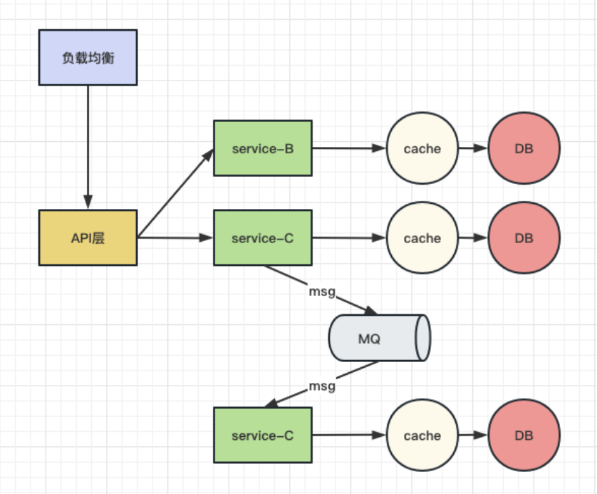

框架选择：选择SpringCloudAlibaba
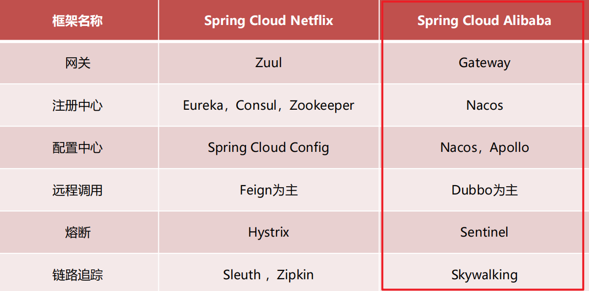

直播业务分析：
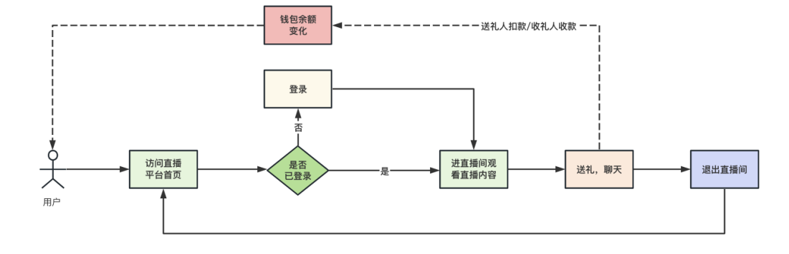

业务模块分析：
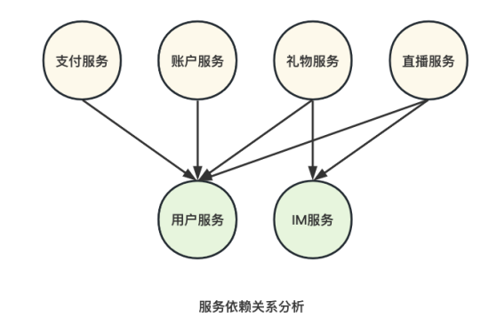

微服务架构图：
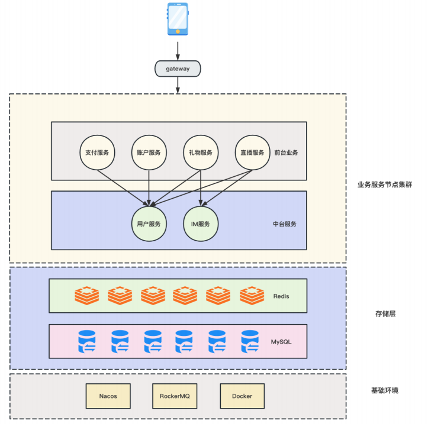

# 2 环境搭建

## 2.1 Docker安装和常用命令

**Linux安装Docker：**

```shell
sudo yum remove docker \
                  docker-client \
                  docker-client-latest \
                  docker-common \
                  docker-latest \
                  docker-latest-logrotate \
                  docker-logrotate \
                  docker-engine

sudo yum install -y yum-utils
sudo yum-config-manager --add-repo https://download.docker.com/linux/centos/docker-ce.repo

sudo yum install -y docker-ce docker-ce-cli containerd.io docker-buildx-plugin docker-compose-plugin

sudo systemctl start docker
```

若倒数第二条命令报错看课件《2-6Docker_Redis_MySQL_RocketMQ_Nacos基础环境安装文档》

**常用命令：**

- **docker ps      查看正在运行的容器**
- **docker ps -a   查看所有容器，包括停止的**
- **docker images       查看所有镜像**
- **docker image rm xxx      移除本地镜像**
- **docker rm xxx       移除 正在运行/停止 的容器**
- docker build     构建镜像
- docker run -d -p [对外端口]:[内部端口] [镜像名称]
- docker pull [镜像名称]
- docker create [镜像id] 
- docker start [镜像名称]
- docker stop [镜像名称]
- docker exec -it [容器id] /bin/sh
- docker inspect [容器名称]
- docker logs -f [容器名称]       查看容器的运行日志
- docker stats [容器名称] --no-stream          查看容器资源使用状态
- docker update -m 1000m --memory-swap -1 [容器名称]
- docker rmi 
- 更多操作见官网：https://docs.docker.com/engine/reference/commandline/docker/


**补充知识：Docker镜像仓库：**

Docker镜像仓库你可以理解为是一种临时存放Docker镜像文件的平台，我们在本地上打好了镜像后，将它push到这个平台，接着在远程服务器上可以通过 docker pull [images-name] 去拉取镜像。

要想实现上述的这种效果，这里需要你去购买一个私服的仓库，或者自己购置一台云服务器，然后部署类似于Docker hub这类仓库平台。

**使用举例：**

```shell
docker login --username=你的用户名 镜像仓库地址(域名或ip+端口)
```

```shell
# 将我们的镜像push上去
docker push registry.baidubce.com/1bc15ccf-f070-482e-8325-c3c46e427aaf/qiyu-live-user-provider-docker:1.0.1

# 拉去私服中的镜像
docker pull registry.baidubce.com/1bc15ccf-f070-482e-8325-c3c46e427aaf/qiyu-live-user-provider-docker:1.0.1
```

这里要注意，不是所有的镜像都可以随意push成功的，这里对镜像的名字有特别的要求，格式如下：

```shell
docker push 镜像仓库地址/仓库的命名空间/本地镜像的名字:版本号  
```

docker tag 命令用于给镜像打标签，即更改镜像的名称或版本号，语法如下：

```shell
docker tag SOURCE_IMAGE[:TAG] TARGET_IMAGE[:TAG]
```

## 2.2 其它环境安装

教程是使用docker安装MySQL和Redis，我是使用本机和服务器直接安装没使用docker，docker安装教程以及nacos安装教程看课件《2-6Docker_Redis_MySQL_RocketMQ_Nacos基础环境安装文档》

> 这里可以不用根据视频安装mysql5.7，先用自己的mysql数据库，现在只是测试，后面正式开始项目的时候还会教用docker安装mysql8.0实现一主一从

## 2.3 Docker底层技术原理

**`NameSpace：`**

NameSpace其实是一种实现不同进程间资源隔离的机制，不同NameSpace的程序，可以享有一份独立的系统资源

两个不同的namespaces下部署了两个进程，这两个进程的pid可能是相同的

**Docker的每个进程独享一份namespaces**

我们可以进入到Linux操作系统的/proc/$pid/ns 目录下去查看指定进程的NameSpaces信息，可以发现**Linux自己的不同进程的namespace信息是相同**的，而**docker下的进程间的namespace是不同的**


**`Cgroups`**

Cgroups全称Control Groups，是Linux内核提供的**物理资源隔离机制**，通过这种机制，可以实现对Linux进程或者进程组的**资源限制、隔离、统计**功能

**Cgroups的核心组成：**

1. cpu: 限制进程的 cpu 使用率
2. memory: 限制进程的memory使用量
3. ns: 控制cgroups中的进程使用不同的namespace

> 举例：限制进程cpu的使用率：
>
> 1. cpu.shares: cgroup对时间的分配。比如cgroup A设置的是1，cgroup B设置的是2，那么B中的任务获取cpu的时间，是A中任务的2倍
> 2. cgroup.procs: 当前系统正在运行的进程（若是新建的demo目录案例，需要手动添加进程号）
> 3. cpu.cfs_period_us: 完全公平调度器的调整时间配额的周期，默认值是100000
> 4. cpu.cfs_quota_us: 完全公平调度器的周期当中可以占用的时间，默认值是-1表示不做限制
>
> ```shell
> cd /sys/fs/cgroup/cpu
> ```
>
> 进入到该目录，就可以使用 cat ./xxx 命令查看Linux下上面参数的默认值
>
> **demo：**
> 先运行一个java程序，只有一个死循环while true，然后通过top命令可以看到该进程占用cpu 100%
> 然后在cpu目录下，新建demo：mkdir demo，会自动在新目录下生成配套文件
> 使用jps查看java程序进程号
> 将java程序的进程号添加到cgroup.procs：**echo xxx > ./cgroup.procs**
> cpu.cfs_period_us的默认值是100000，cpu.cfs_quota_us默认值是-1表示不做限制，我们将java程序的cpu使用率限制为10%，所以使用命令：**echo 1000 > ./cpu.cfs_quota_us**，因为10000/100000=0.1
> 再次使用top命令查看，发现java进程cpu只占用10%左右

## 2.4 远程调用：HTTP还是RPC

Http（Feign）受限于网络带宽等多方面因素影响，并且Http请求头携带很多冗余信息，而**RPC可以自定义协议体，只传输自己想要传输的数据**

RPC更多是一套完整的远程调用实现方案，HTTP则只是一种通信协议，不是一个维度的概念

根据多方因素，选择使用RPC性能更优

> RPC的协议体：
>
> - int magic 
> - byte[] body
> - int length
>
> 体积更小，传输速度更快

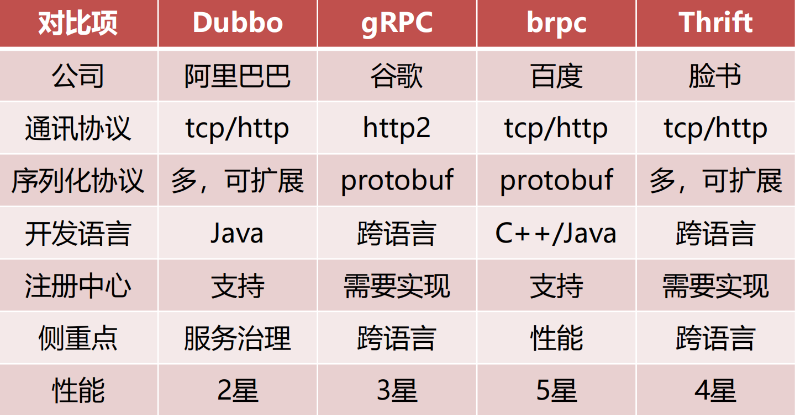

各类RPC框架的侧重点又不一样，这里我们选择使用Dubbo

## 2.5 Dubbo技术介绍

### 1 Dubbo入门使用案例

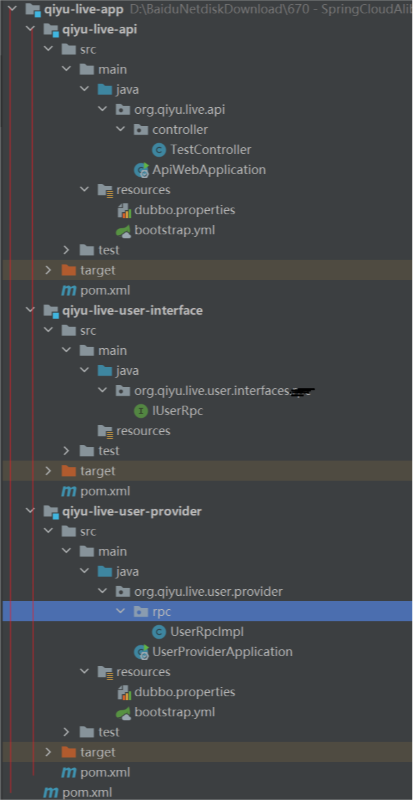

**新建父工程：qiyu-live-app**

pom：

```xml
<?xml version="1.0" encoding="UTF-8"?>
<project xmlns="http://maven.apache.org/POM/4.0.0"
         xmlns:xsi="http://www.w3.org/2001/XMLSchema-instance"
         xsi:schemaLocation="http://maven.apache.org/POM/4.0.0 http://maven.apache.org/xsd/maven-4.0.0.xsd">
    <modelVersion>4.0.0</modelVersion>

    <parent>
        <groupId>org.springframework.boot</groupId>
        <artifactId>spring-boot-starter-parent</artifactId>
        <version>3.0.4</version>
        <relativePath/> <!-- lookup parent from repository -->
    </parent>
    <groupId>org.hah</groupId>
    <artifactId>qiyu-live-app</artifactId>
    <packaging>pom</packaging>
    <version>1.0-SNAPSHOT</version>
    <modules>
        <module>qiyu-live-user-interface</module>
        <module>qiyu-live-user-provider</module>
        <module>qiyu-live-api</module>
        <module>qiyu-live-common-interface</module>
    </modules>

    <properties>
        <qiyu-mysql.version>8.0.29</qiyu-mysql.version>
        <springboot.version>3.0.4</springboot.version>
        <curator.version>2.12.0</curator.version>
        <mybatis-plus.version>3.5.3</mybatis-plus.version>
        <druid.version>1.1.20</druid.version>
        <sharding.jdbc.version>5.3.2</sharding.jdbc.version>
        <hessian.version>4.0.38</hessian.version>
        <jetty.version>9.4.28.v20200408</jetty.version>
        <dubbo.version>3.2.0-beta.3</dubbo.version>
        <spring-cloud-alibaba.version>2022.0.0.0-RC1</spring-cloud-alibaba.version>
        <spring-cloud-starter-gateway.version>4.0.6</spring-cloud-starter-gateway.version>
        <spring-cloud-starter-loadbalancer.version>4.0.3</spring-cloud-starter-loadbalancer.version>
        <spring-cloud-starter-bootstrap.version>3.0.2</spring-cloud-starter-bootstrap.version>
        <alibaba-fastjson.version>2.0.10</alibaba-fastjson.version>
        <netty-all.version>4.1.18.Final</netty-all.version>
        <maven.compiler.source>17</maven.compiler.source>
        <maven.compiler.target>17</maven.compiler.target>
        <maven.compiler.compilerVersion>17</maven.compiler.compilerVersion>
        <project.build.sourceEncoding>UTF-8</project.build.sourceEncoding>
        <arthus.zip.address>D:\浏览器下载\</arthus.zip.address>
    </properties>

    <dependencyManagement>
        <dependencies>
            <dependency>
                <groupId>com.alibaba.cloud</groupId>
                <artifactId>spring-cloud-alibaba-dependencies</artifactId>
                <version>${spring-cloud-alibaba.version}</version>
                <type>pom</type>
                <scope>import</scope>
            </dependency>
        </dependencies>
    </dependencyManagement>

</project>
```

**新建模块qiyu-live-user-interface：**

新建 接口 org.qiyu.live.user.interfaces.IUserRpc

```java
public interface IUserRpc {
    String test();
}
```

**新建模块qiyu-live-user-provider：**

pom：

```xml
<properties>
    <maven.compiler.source>17</maven.compiler.source>
    <maven.compiler.target>17</maven.compiler.target>
    <maven.compiler.compilerVersion>17</maven.compiler.compilerVersion>
</properties>

<dependencies>
    <dependency>
        <groupId>org.apache.dubbo</groupId>
        <artifactId>dubbo-spring-boot-starter</artifactId>
        <version>3.2.0-beta.3</version>
    </dependency>
    <dependency>
        <groupId>com.alibaba.cloud</groupId>
        <artifactId>spring-cloud-starter-alibaba-nacos-discovery</artifactId>
    </dependency>
    <dependency>
        <groupId>org.springframework.boot</groupId>
        <artifactId>spring-boot-starter-web</artifactId>
        <exclusions>
            <exclusion>
                <artifactId>log4j-to-slf4j</artifactId>
                <groupId>org.apache.logging.log4j</groupId>
            </exclusion>
        </exclusions>
    </dependency>
    <dependency>
        <groupId>org.hah</groupId>
        <artifactId>qiyu-live-user-interface</artifactId>
        <version>1.0-SNAPSHOT</version>
    </dependency>
</dependencies>

<build>
    <plugins>
        <plugin>
            <groupId>org.springframework.boot</groupId>
            <artifactId>spring-boot-maven-plugin</artifactId>
            <configuration>
                <classifier>exec</classifier>
            </configuration>
        </plugin>
    </plugins>
</build>
```

启动类：新建org.qiyu.live.user.provider.UserProviderApplication：

```java
/**
 * 用户中台服务提供者
 */
@SpringBootApplication
@EnableDubbo
@EnableDiscoveryClient
public class UserProviderApplication {
    public static void main(String[] args) {
        SpringApplication springApplication = new SpringApplication(UserProviderApplication.class);
        springApplication.setWebApplicationType(WebApplicationType.NONE);//Dubbo不使用tomcat，使用netty
        springApplication.run(args);
    }
}
```

新建org.qiyu.live.user.provider.rpc.UserRpcImpl：

```java
@RestController
@RequestMapping("/test")
public class TestController {
    
    @DubboReference
    private IUserRpc userRpc;
    
    @GetMapping("/dubbo")
    public String dubbo() {
        return userRpc.test();
    }
}
```

新建bootstrap.yml：

```yaml
spring:
  application:
    name: qiyu-live-user-provider
  cloud:
    nacos:
      username: qiyu
      password: qiyu
      discovery:
        server-addr: localhost:8848
        namespace: 1bc15ccf-f070-482e-8325-c3c46e427aaf
```

新建dubbo.properties：

```properties
dubbo.application.name=qiyu-live-user-provider
dubbo.registry.address=nacos://127.0.0.1:8848?namespace=1bc15ccf-f070-482e-8325-c3c46e427aaf&&username=qiyu&&password=qiyu
dubbo.server=true
dubbo.protocol.name=dubbo
dubbo.protocol.port=9091
```

**新建模块qiyu-live-api：**

pom：

```xml
<properties>
    <maven.compiler.source>17</maven.compiler.source>
    <maven.compiler.target>17</maven.compiler.target>
</properties>

<dependencies>
    <dependency>
        <groupId>org.apache.dubbo</groupId>
        <artifactId>dubbo-spring-boot-starter</artifactId>
        <version>3.2.0-beta.3</version>
    </dependency>
    <dependency>
        <groupId>com.alibaba.cloud</groupId>
        <artifactId>spring-cloud-starter-alibaba-nacos-discovery</artifactId>
    </dependency>
    <dependency>
        <groupId>org.springframework.boot</groupId>
        <artifactId>spring-boot-starter-web</artifactId>
        <exclusions>
            <exclusion>
                <artifactId>log4j-to-slf4j</artifactId>
                <groupId>org.apache.logging.log4j</groupId>
            </exclusion>
        </exclusions>
    </dependency>
    <dependency>
        <groupId>org.hah</groupId>
        <artifactId>qiyu-live-user-interface</artifactId>
        <version>1.0-SNAPSHOT</version>
    </dependency>
</dependencies>
```

启动类：org.qiyu.live.api.ApiWebApplication：

```java
@SpringBootApplication
@EnableDiscoveryClient
public class ApiWebApplication {
    public static void main(String[] args) {
        SpringApplication springApplication = new SpringApplication(ApiWebApplication.class);
        springApplication.setWebApplicationType(WebApplicationType.SERVLET);
        springApplication.run(args);
    }
}
```

新建org.qiyu.live.api.controller.TestController：

```java
@RestController
@RequestMapping("/test")
public class TestController {
    
    @DubboReference
    private IUserRpc userRpc;
    
    @GetMapping("/dubbo")
    public String dubbo() {
        return userRpc.test();
    }
}
```

新建bootstrap.yml：

```yaml
spring:
  application:
    name: qiyu-live-api
  cloud:
    nacos:
      username: qiyu
      password: qiyu
      discovery:
        server-addr: localhost:8848
        namespace: 1bc15ccf-f070-482e-8325-c3c46e427aaf
```

新建dubbo.properties：

```properties
dubbo.application.name=qiyu-live-api-application
dubbo.registry.address=nacos://127.0.0.1:8848?namespace=1bc15ccf-f070-482e-8325-c3c46e427aaf&&username=qiyu&&password=qiyu
```

### 2 Dubbo使用规则

PRC-Provider和api两个模块都引入SpringBoot-Web、Dubbo、nacos-discovery依赖，然后引入自定义的interface依赖：

```xml
<dependency>
    <groupId>org.apache.dubbo</groupId>
    <artifactId>dubbo-spring-boot-starter</artifactId>
    <version>3.2.0-beta.3</version>
</dependency>
<dependency>
    <groupId>com.alibaba.cloud</groupId>
    <artifactId>spring-cloud-starter-alibaba-nacos-discovery</artifactId>
</dependency>
<dependency>
    <groupId>org.springframework.boot</groupId>
    <artifactId>spring-boot-starter-web</artifactId>
    <exclusions>
        <exclusion>
            <artifactId>log4j-to-slf4j</artifactId>
            <groupId>org.apache.logging.log4j</groupId>
        </exclusion>
    </exclusions>
</dependency>
<!-- 自己的interface依赖 -->
<dependency>
    <groupId>org.hah</groupId>
    <artifactId>qiyu-live-user-interface</artifactId>
    <version>1.0-SNAPSHOT</version>
</dependency>
```

1. RPC-Provider
   - 启动可以不需要Web服务器，**@EnableDubbo** + @EnableDiscoveryClient
   - 使用**@DubboService**暴露RPC服务
     - 可以通过 group 和 version 指定组别和版本
2. api调用模块
   - 启动使用Servlet服务类型就行，@EnableDiscoveryClient
   - 使用**@DubboReference**引入 被@DubboService 暴露的RPC服务
     - 可以通过 group 和 version 指定使用特定组别和版本的RPC服务
     - 还可以使用 url = "localhost:9090" 指定特定dubbo服务提供者机器
     - 使用 loadbalance 指定负载均衡方式，默认是轮询
     - 使用 async = true 开启异步RPC

### 3 Dubbo底层原理

Dubbo的服务暴露原理：（跳过）

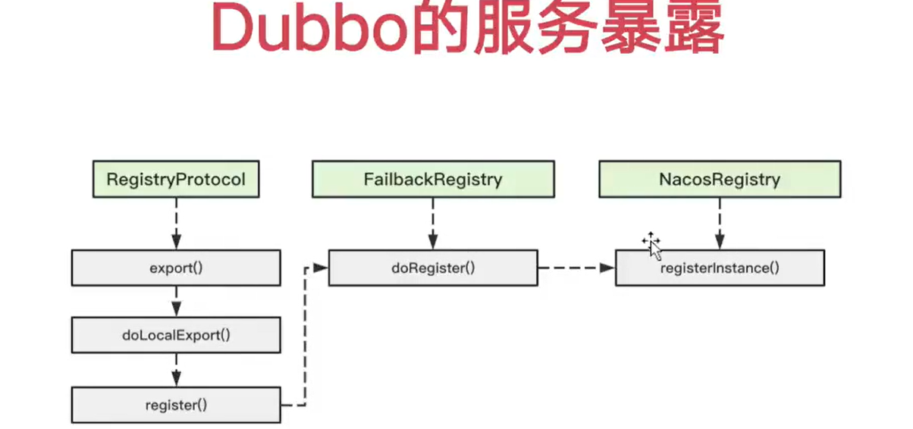

对export()函数的源代码进行深入研究，一直到 NettyServer的启动


Dubbo的底层调用链路：（跳过）

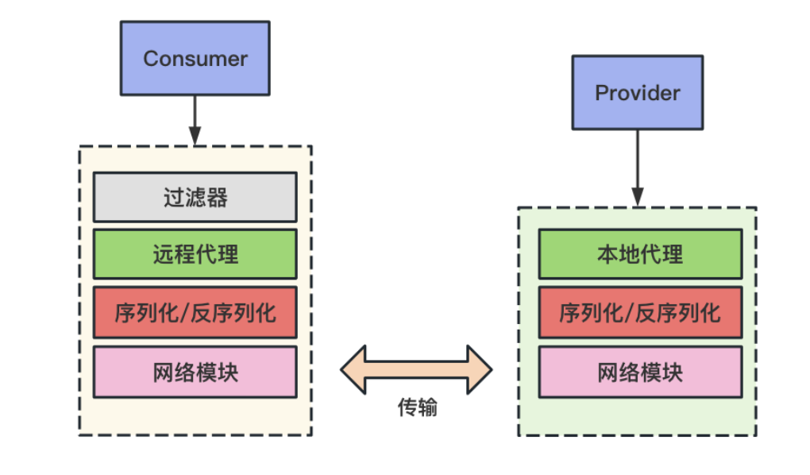

通过ReferenceConfig的get函数返回一个代理对象，然后在代理对象中发送请求，最后抵达Dubbolnvoker中，将请求放入一条队列中，再由一个异步线程去消费这条队列的数据进行发送消息

# 3 用户中台实现

## 3.0 用户中台设计

### 1 用户中台架构

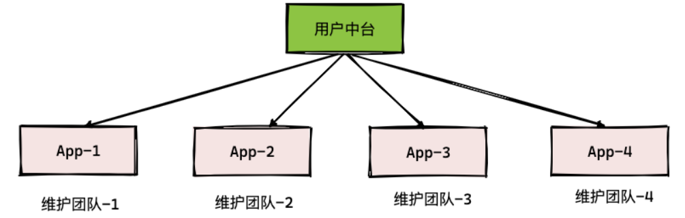

用户中台的目的：

1. 用户数据的统一管理
2. 方便不同业务线的接入
3. 性能，可扩展性，可维护性更高

**多个接入方，共同使用一个用户中台体系**


用户中台架构设计：
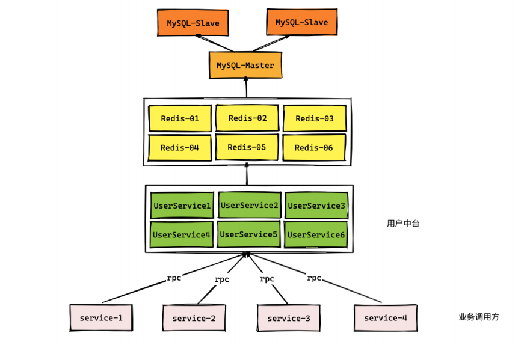

采用MySQL主从读写分离 + Redis集群分片的方式

但是得考虑：

1. MySQL主从延迟问题
2. Redis分片键重定向，部分指令失效

### 2 用户中台场景分析

1. 用户中台是否可以引入本地缓存？
   - 结合业务场景分析，**如果热数据很多的话，不建议使用本地缓存**，因为本地缓存空间有限，热数据频繁变更会导致本地缓存不断触发缓存淘汰
2. 用户数据的存储是用哪种序列化方式？
   - 根据性能测试报告，**推荐使用Fst或Kryo**
3. 分库分表之后如何处理？
   - 可以使用专门的分库分表查询中间件，例如本课程中使用的**ShardingJDBC**
4. 缓存双写一致性问题？
   - 先更新数据库再删缓存，还是先删缓存再更新数据库
   - 选择先更新数据库再删缓存后，如何确保基地情况下的双写一致性？
     - 延迟双删
     - 基于订阅binlog去做缓存删除操作

## 3.1 用户数据存储架构分析

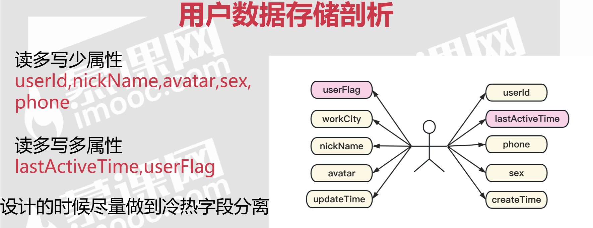

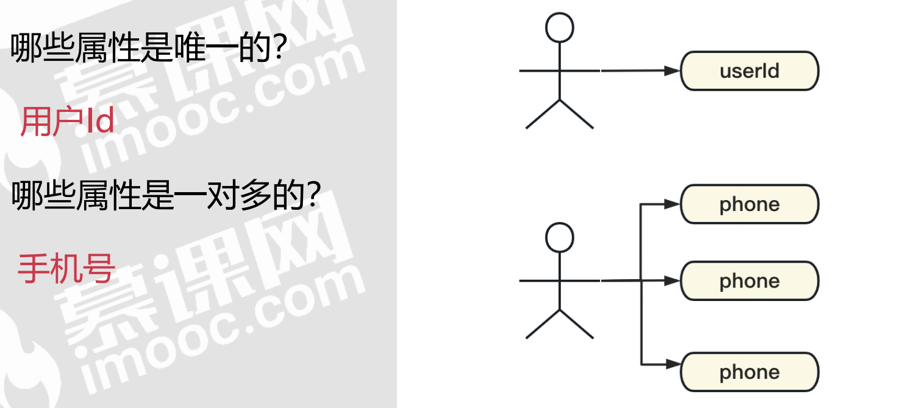

**用户数据量预估：**用户日活在100w左右的产品，通常注册用户在1亿以上，建议在设计上留有冗余空间

**用户手机号数量预估：**假设每个用户都有绑定3个手机号，那么数量预估在3亿+


**分库分表设计：**

- **单数据库多表模式：**所有的分表都放在一个数据库中
  - 可以联表查询
  - 可以有事务操作
  - 数据库连接有限
- **多数据库多表模式：**所有的分表都分散在不同的数据库中
  - 数据库连接充足
  - 不能做联表查询
  - 跨数据库的事务操作完成不了，需要引入分布式事务

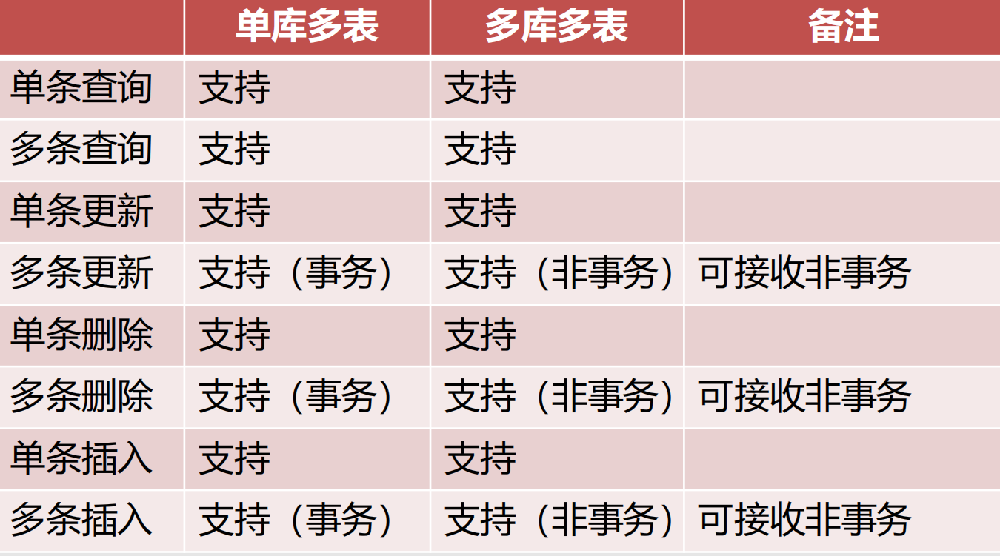

## 3.2 MySQL分表的搭建（测试）

这里只是搭建测试用的mysql数据库分表，后面一主一从时会重新创建mysql实例并且重新搭建分表

```sql
CREATE DATABASE qiyu_live_user CHARACTER  set utf8mb3 COLLATE=utf8_bin;

DELIMITER $$  
  
CREATE  
    PROCEDURE qiyu_live_user.create_t_user_100()  
    BEGIN  
  
         DECLARE i INT;  
         DECLARE table_name VARCHAR(30);   
         DECLARE table_pre VARCHAR(30);   
         DECLARE sql_text VARCHAR(3000); 
         DECLARE table_body VARCHAR(2000);    
         SET i=0;  
         SET table_name='';  
                
         SET sql_text='';  
         SET table_body = '(
  user_id bigint NOT NULL DEFAULT -1 COMMENT \'用户id\',
  nick_name varchar(35)  DEFAULT NULL COMMENT \'昵称\',
  avatar varchar(255)  DEFAULT NULL COMMENT \'头像\',
  true_name varchar(20)  DEFAULT NULL COMMENT \'真实姓名\',
  sex tinyint(1) DEFAULT NULL COMMENT \'性别 0男，1女\',
  born_date datetime DEFAULT NULL COMMENT \'出生时间\',
  work_city int(9) DEFAULT NULL COMMENT \'工作地\',
  born_city int(9) DEFAULT NULL COMMENT \'出生地\',
  create_time datetime DEFAULT CURRENT_TIMESTAMP,
  update_time datetime DEFAULT CURRENT_TIMESTAMP ON UPDATE CURRENT_TIMESTAMP,
  PRIMARY KEY (user_id)
) ENGINE=InnoDB AUTO_INCREMENT=1 DEFAULT CHARSET=utf8mb3 COLLATE=utf8_bin;';

            WHILE i<100 DO   
                IF i<10 THEN
                    SET table_name = CONCAT('t_user_0',i);
                ELSE
                    SET table_name = CONCAT('t_user_',i);
                END IF;
                        
                SET sql_text=CONCAT('CREATE TABLE ',table_name, table_body);    
            SELECT sql_text;   
            SET @sql_text=sql_text;  
            PREPARE stmt FROM @sql_text;  
            EXECUTE stmt;  
            DEALLOCATE PREPARE stmt;    
            SET i=i+1;  
        END WHILE;  

              
    END$$  
            
DELIMITER ;

call create_t_user_100();
```

**日常开发中可以使用该sql语句进行数据表的存储分析：**

```sql
select
table_schema as '数据库',
table_name as '表名',
table_rows as '记录数',
truncate(data_length/1024/1024, 2) as '数据容量(MB)',
truncate(index_length/1024/1024, 2) as '索引容量(MB)'
from information_schema.tables
where table_schema='qiyu_live_user'
order by data_length desc, index_length desc;
```

## 3.3 Sharding-JDBC

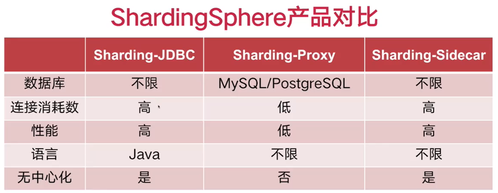

分库分表中间件中：Sharding-Proxy已过时，现在使用最多的是Sharding-JDBC，Sharding-Sidecar是新产品，更适合云原生环境下

### 1 Sharding-JDBC的执行过程

**Sharding-JDBC的执行过程：**

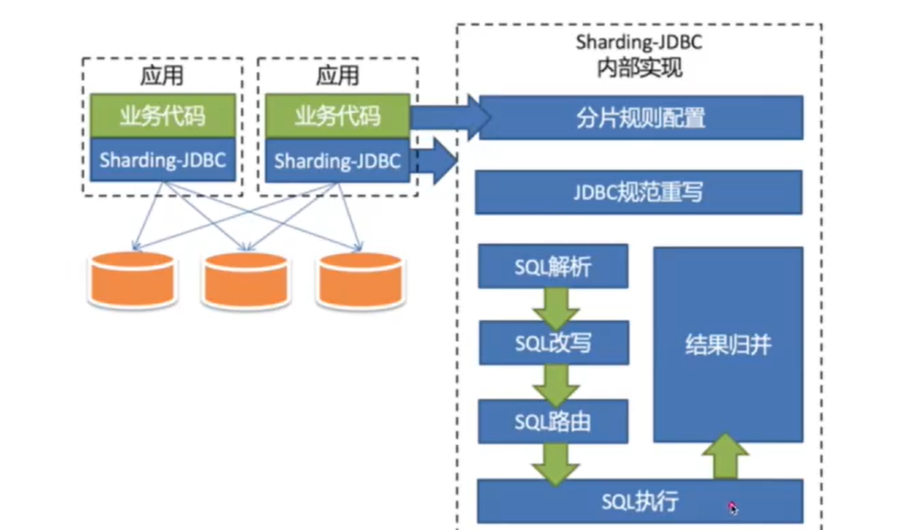

### 2 路由规则 和 结果归并 解析

**SQL路由举例：**
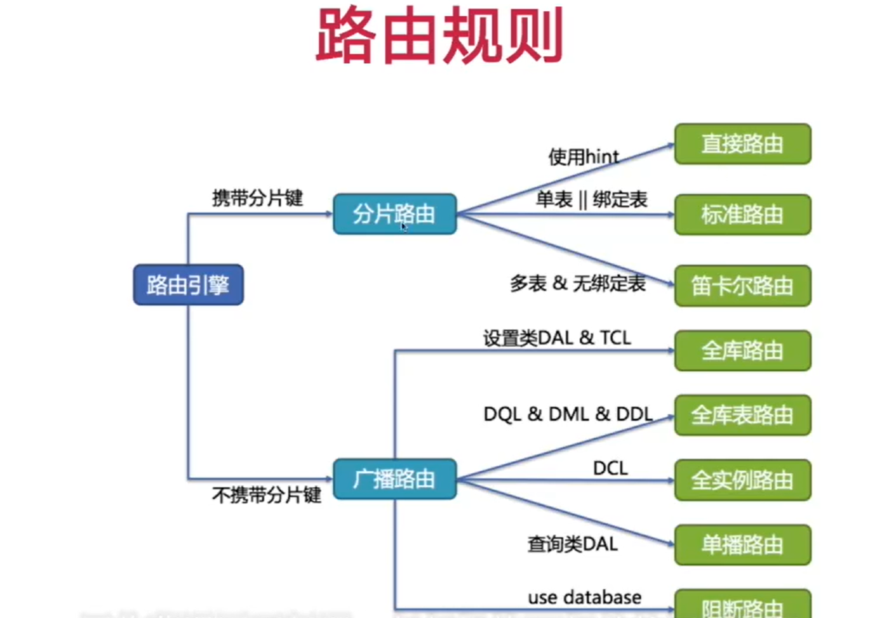

直接路由：使用hint指定数据源
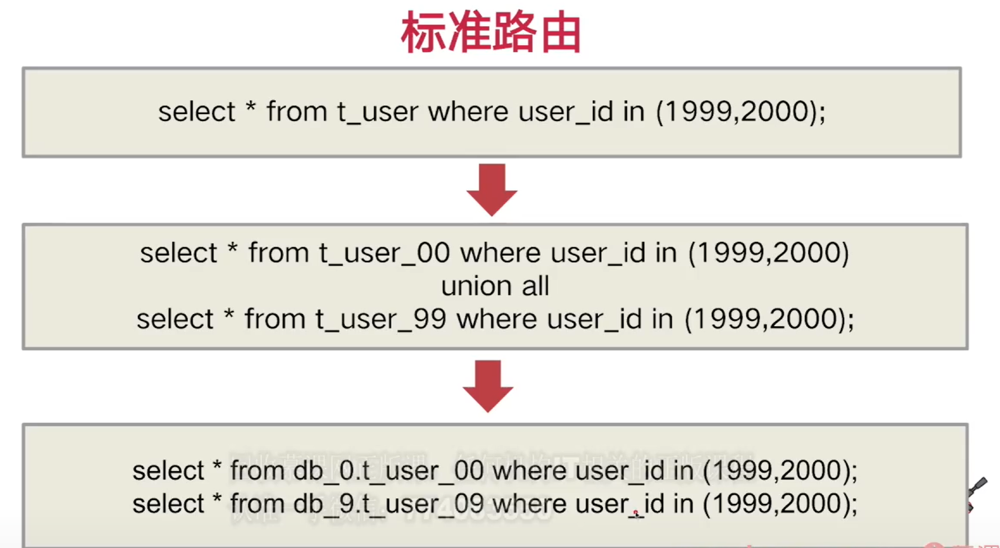
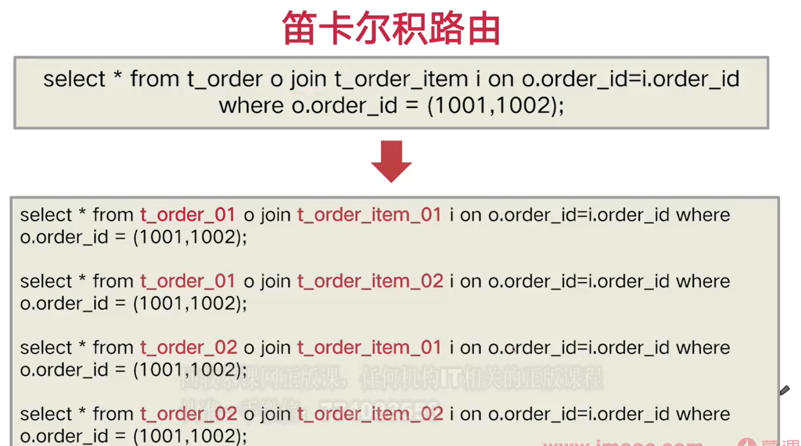

> 根据笛卡尔积路由，当in中的参数越多时，拆分为的sql语句就越多
> **所以在分库分表场景下，尽量避免使用连接查询**

**全库路由：**

一般用于set类型语句，每次执行的时候，会给所有数据库发送sql，例如：set autocommit = 1;

**全实例路由：**

一般用于DCL语句，每次执行的时候，会给所有数据库发送sql，
例如：create user 'myuser'@'localhost' identified by '123456';
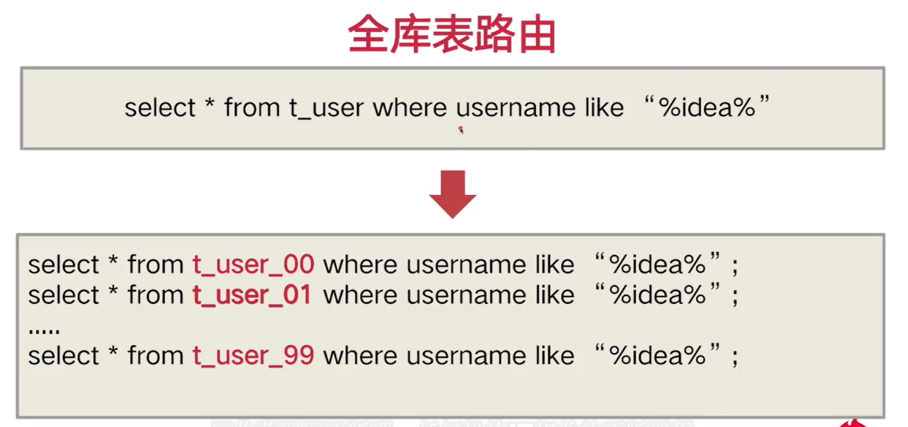
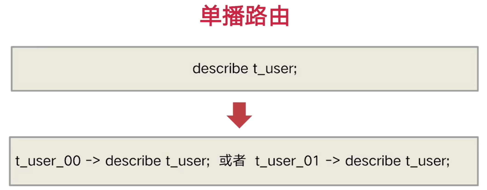

> 因为每张表的查询结果都一样，所以随机发往一张表就可以了

**阻断路由：**

阻断路由用于屏蔽SQL对数据库的操作，例如：use db_0;


**结果归并解析：**
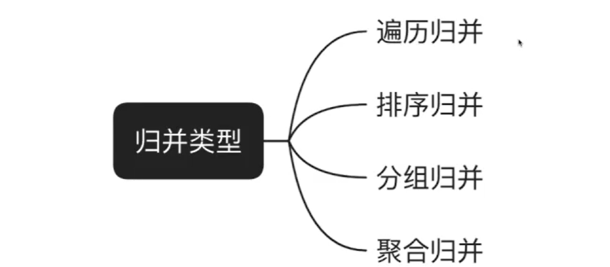

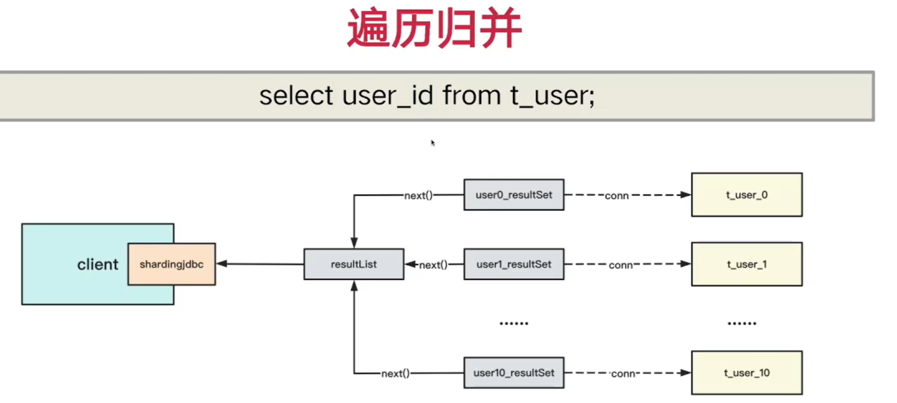

将每个分表的resultSet进行遍历，然后全部存入到resultList返回给client

**排序归并：**若我们要执行order by语句，在遍历归并的基础上，先将各个resultSet中的值放入PriorityQueue中，再读入到resultList返回给client

**分组归并：**分组归并会一次性从所有ResultSet中提取全部数据到内存中，并且在内存中进行分组，对内存消耗大

**聚合归并：**聚合归并也会一次性从ResultSet中提取全部数据，一般会根据聚合函数来进行聚合计算，例如使用sum()函数时


使用ShardingJdbc之后，尽量使用简单查询类型的SQL，**少用分组查询，聚合函数**。对于分页查询要谨慎使用，避免产生全表扫描的情况


## 3.4 实现单用户增改查基本功能

**准备工作：在《3.4-1》的入门案例的基础上进行：**

**新建子模块qiyu-live-common-interface**

pom：

```xml
<dependency>
    <groupId>org.projectlombok</groupId>
    <artifactId>lombok</artifactId>
</dependency>
<dependency>
    <groupId>cn.hutool</groupId>
    <artifactId>hutool-all</artifactId>
    <version>5.7.17</version>
</dependency>
<dependency>
    <groupId>org.springframework</groupId>
    <artifactId>spring-beans</artifactId>
</dependency>
```

新建org.qiyu.live.common.interfaces.utils.ConvertBeanUtils

```java
package org.qiyu.live.common.interfaces.utils;

import org.springframework.beans.BeanInstantiationException;
import org.springframework.beans.BeanUtils;

import java.util.ArrayList;
import java.util.List;

public class ConvertBeanUtils {

    /**
     * 将一个对象转成目标对象
     *
     * @param source
     * @param targetClass
     * @param <T>
     * @return
     */
    public static <T> T convert(Object source, Class<T> targetClass) {
        if (source == null) {
            return null;
        }
        T t = newInstance(targetClass);
        BeanUtils.copyProperties(source, t);
        return t;
    }

    /**
     * 将List对象转换成目标对象，注意实现是ArrayList
     *
     * @param targetClass
     * @param <K>
     * @param <T>
     * @return
     */
    public static <K, T> List<T> convertList(List<K> sourceList, Class<T> targetClass) {
        if (sourceList == null) {
            return null;
        }
        List targetList = new ArrayList((int)(sourceList.size()/0.75) + 1);
        for (K source : sourceList) {
            targetList.add(convert(source, targetClass));
        }
        return targetList;
    }

    private static <T> T newInstance(Class<T> targetClass) {
        try {
            return targetClass.newInstance();
        } catch (Exception e) {
            throw new BeanInstantiationException(targetClass, "instantiation error", e);
        }
    }
}
```

**修改子模块qiyu-live-user-interface：**

pom添加：

```xml
<dependency>
    <groupId>org.hah</groupId>
    <artifactId>qiyu-live-common-interface</artifactId>
    <version>1.0-SNAPSHOT</version>
</dependency>
```

新建org.qiyu.live.user.dto.UserDTO：

```java
@Data
public class UserDTO implements Serializable {
    
    @Serial
    private static final long serialVersionUID = 4079363033445460398L;
    private Long userId;
    private String nickName;
    private String trueName;
    private String avatar;
    private Integer sex;
    private Integer workCity;
    private Integer bornCity;
    private Date bornDate;
    private Date createTime;
    private Date updateTime;
}
```

修改org.qiyu.live.user.interfaces.IUserRpc：

```java
public interface IUserRpc {
    /**
     * 根据用户id进行查询
     *
     * @param userId
     * @return
     */
    UserDTO getUserById(Long userId);

    /**
     * 更新用户信息
     * @param userDTO
     * @return
     */
    boolean updateUserInfo(UserDTO userDTO);

    /**
     * 插入用户
     * @param userDTO
     * @return
     */
    boolean insertOne(UserDTO userDTO);
}
```

**修改子模块qiyu-live-user-provider：**

pom添加以下依赖：

```xml
<dependency>
    <groupId>mysql</groupId>
    <artifactId>mysql-connector-java</artifactId>
    <version>${qiyu-mysql.version}</version>
</dependency>

<dependency>
    <groupId>org.apache.shardingsphere</groupId>
    <artifactId>shardingsphere-jdbc-core</artifactId>
    <version>${sharding.jdbc.version}</version>
</dependency>

<dependency>
    <groupId>com.baomidou</groupId>
    <artifactId>mybatis-plus-boot-starter</artifactId>
    <version>${mybatis-plus.version}</version>
</dependency>

<dependency>
    <groupId>org.hah</groupId>
    <artifactId>qiyu-live-common-interface</artifactId>
    <version>1.0-SNAPSHOT</version>
</dependency>

<dependency>
    <groupId>org.hah</groupId>
    <artifactId>qiyu-live-user-interface</artifactId>
    <version>1.0-SNAPSHOT</version>
</dependency>
```

新建application.yml：

```yaml
spring:
  datasource:
    driver-class-name: org.apache.shardingsphere.driver.ShardingSphereDriver
    url: jdbc:shardingsphere:classpath:qiyu-db-sharding.yaml
    pool-name: qiyu-user-pool
    minimum-idle: 150
    maximum-pool-size: 300
    #connection-init-sql: select 1
    connection-timeout: 4000
    max-lifetime: 60000
```

新建qiyu-db-sharding.yaml：

```yaml
dataSources:
  user:  ##新表，重建的分表
    dataSourceClassName: com.zaxxer.hikari.HikariDataSource
    driver-class-name: com.mysql.cj.jdbc.Driver
    jdbcUrl: jdbc:mysql://localhost:3306/qiyu_live_user?useUnicode=true&characterEncoding=utf8
    username: root
    password: 123456

rules:
  - !SINGLE
    defaultDataSource: user ## 不分表分库的默认数据源
  - !SHARDING
    tables:
      t_user:
        actualDataNodes: user.t_user_${(0..99).collect(){it.toString().padLeft(2,'0')}}
        tableStrategy:
          standard:
            shardingColumn: user_id
            shardingAlgorithmName: t_user-inline

    shardingAlgorithms:
      t_user-inline:
        type: INLINE
        props:
          algorithm-expression: t_user_${(user_id % 100).toString().padLeft(2,'0')}

props:
  sql-show: true  #打印sql
```

新建org.qiyu.live.user.provider.dao.po.UserPO：

```java
@TableName("t_user")
@Data
public class UserPO {

    @TableId(type = IdType.INPUT)
    private Long userId;
    private String nickName;
    private String trueName;
    private String avatar;
    private Integer sex;
    private Integer workCity;
    private Integer bornCity;
    private Date bornDate;
    private Date createTime;
    private Date updateTime;
}
```

新建org.qiyu.live.user.provider.dao.mapper.IUserMapper：

```java
@Mapper
public interface IUserMapper extends BaseMapper<UserPO> {
}
```

新建org.qiyu.live.user.provider.service.IUserService：

```java
public interface IUserService extends IService<UserPO> {

    /**
     * 根据用户id进行查询
     * @param userId
     * @return
     */
    UserDTO getUserById(Long userId);

    /**
     * 更新用户信息
     * @param userDTO
     * @return
     */
    boolean updateUserInfo(UserDTO userDTO);

    /**
     * 插入用户
     * @param userDTO
     * @return
     */
    boolean insertOne(UserDTO userDTO);
    
}
```

新建org.qiyu.live.user.provider.service.impl.UserServiceImpl：

```java
@Service
public class UserServiceImpl extends ServiceImpl<IUserMapper, UserPO> implements IUserService {

    @Override
    public UserDTO getUserById(Long userId) {
        if(userId == null) {
            return null;
        }
        return BeanUtil.copyProperties(baseMapper.selectById(userId), UserDTO.class);
    }

    @Override
    public boolean updateUserInfo(UserDTO userDTO) {
        if(userDTO == null || userDTO.getUserId() == null) {
            return false;
        }
        baseMapper.updateById(BeanUtil.copyProperties(userDTO, UserPO.class));
        return true;
    }

    @Override
    public boolean insertOne(UserDTO userDTO) {
        if(userDTO == null || userDTO.getUserId() == null) {
            return false;
        }
        baseMapper.insert(BeanUtil.copyProperties(userDTO, UserPO.class));
        return true;
    }
}
```

修改org.qiyu.live.user.provider.rpc.UserRpcImpl：

```java
@DubboService
public class UserRpcImpl implements IUserRpc {
    
    @Resource
    private IUserService userService;
    
    @Override
    public UserDTO getUserById(Long userId) {
        return userService.getUserById(userId);
    }

    @Override
    public boolean updateUserInfo(UserDTO userDTO) {
        return userService.updateUserInfo(userDTO);
    }

    @Override
    public boolean insertOne(UserDTO userDTO) {
        return userService.insertOne(userDTO);
    }
}
```

**修改子模块qiyu-live-api：**

修改org.qiyu.live.api.controller.UserController：

```java
@RestController
@RequestMapping("/user")
public class UserController {
    
    @DubboReference
    private IUserRpc userRpc;
    
    @GetMapping("/getUserInfo")
    public UserDTO getUserInfo(Long userId) {
        return userRpc.getUserById(userId);
    }
    
    @GetMapping("/updateUserInfo")
    public boolean updateUserInfo(UserDTO userDTO) {
        return userRpc.updateUserInfo(userDTO);
    }
    
    @GetMapping("/insertUserInfo")
    public boolean insertUserInfo(UserDTO userDTO) {
        return userRpc.insertOne(userDTO);
    }
}
```

自此，增改查用户信息的基本测试功能已完成

## 3.5 MySQL一主一从的搭建和Sharding-JDBC的相应配置

### 1 基于Docker搭建MySQL主从

Docker已于《2 环境搭建》中安装完毕

```
# 创建主从数据库文件夹
mkdir -p ~/Docker/mysql/master1/conf
mkdir -p ~/Docker/mysql/master1/data
mkdir -p ~/Docker/mysql/slave1/conf
mkdir -p ~/Docker/mysql/slave1/data
# 初始化主数据库配置文件
cd ~/Docker/mysql/master1/conf
vi my.cnf
```

```
# 粘贴以下内容
[mysqld]
datadir = ~/Docker/mysql/master1/data
character-set-server = utf8
lower-case-table-names = 1
# 主从复制-主机配置# 主服务器唯一 ID
server-id = 1
# 启用二进制日志
log-bin=mysql-bin
# 设置 logbin 格式
binlog_format = STATEMENT
```

```
# 初始化从数据库配置文件
cd ~/Docker/mysql/slave1/conf
vi my.cnf
```

```
# 粘贴以下内容
[mysqld]
datadir = ~/Docker/mysql/slave1/data
character-set-server = utf8
lower-case-table-names = 1
# 主从复制-从机配置# 从服务器唯一 ID
server-id = 2
# 启用中继日志
relay-log = mysql-relay
# 文件夹授权
chmod -R 777 ~/Docker/mysql
```

**Docker 部署 Mysql8.0**

```
# 拉取镜像
docker pull mysql:8.0
# 查看镜像
docker images
docker network create mysql-cluster
# 构建主数据库容器
docker run --name=mysql-master-1 \
--privileged=true \
--network mysql-cluster \
-p 8808:3306 \
-v ~/Docker/mysql/master1/data/:/var/lib/mysql \
-v ~/Docker/mysql/master1/conf/my.cnf:/etc/mysql/my.cnf \
-v ~/Docker/mysql/master1/mysql-files/:/var/lib/mysql-files/ \
-e MYSQL_ROOT_PASSWORD=root \
-d mysql:8.0 --lower_case_table_names=1
docker ps
# 验证是否可以登录# 交互式进入容器
docker exec -it mysql-master-1 /bin/bash
# 登录（使用构建时指定的密码：r）
mysql -uroot -p
# 退出
quit
exit
# 构建从数据库容器
docker run --name=mysql-slave-1 \
--privileged=true \
--network mysql-cluster \
-p 8809:3306 \
-v ~/Docker/mysql/slave1/data/:/var/lib/mysql \
-v ~/Docker/mysql/slave1/conf/my.cnf:/etc/mysql/my.cnf \
-v ~/Docker/mysql/slave1/mysql-files/:/var/lib/mysql-files/ \
-e MYSQL_ROOT_PASSWORD=root \
-d mysql:8.0 --lower_case_table_names=1
```

**主数据库的sql执行配置**

```sql
- 主数据库创建用户 slave 并授权
# 创建用户,设置主从同步的账户名
create user 'qiyu-slave'@'%' identified with mysql_native_password by 'qiyu-pwd';
# 授权
grant replication slave on *.* to 'qiyu-slave'@'%';
# 刷新权限
flush privileges;
# 查询 server_id 值
show variables like 'server_id';
# 也可临时（重启后失效）指定 server_id 的值（主从数据库的 server_id 不能
相同）
set global server_id = 1;
# 查询 Master 状态，并记录 File 和 Position 的值，这两个值用于和下边的从数
据库中的 change 那条 sql 中
的 master_log_file，master_log_pos 参数对齐使用
show master status;
show binlog events;
# 重置下 master 的 binlog 位点
reset master;
```

**从数据库的sql执行配置**

```sql
# 进入从数据库
# 注意：执行完此步骤后退出主数据库，防止再次操作导致 File 和 Position 的值发生变化
# 验证 slave 用户是否可用
# 查询 server_id 值
show variables like 'server_id';
# 也可临时（重启后失效）指定 server_id 的值（主从数据库的 server_id 不能
相同）
set global server_id = 2;
# 若之前设置过同步，请先重置
stop slave;
reset slave;
# 设置主数据库 注意同一台机器容器内部port=3306，不是8808
change master to master_host='mysql-master-1',master_port=3306,master_user='qiyu-slave',
master_password='qiyu-pwd',master_log_file='binlog.000001',master_log_pos=157;
# 开始同步
start slave;
# 若出现错误，则停止同步，重置后再次启动
stop slave;
reset slave;
start slave;
# 查询 Slave 状态
show slave status;
```

最后需要查看是否配置成功# 查看参数 Slave_IO_Running 和 Slave_SQL_Running 是否都为yes，则证明配置成功。若为 no，则需要查看对应的 Last_IO_Error 或 Last_SQL_Error 的异常值。

**在master数据库重新创建100个user分表**

```sql
CREATE DATABASE qiyu_live_user CHARACTER  set utf8mb3 COLLATE=utf8_bin;

DELIMITER $$  
  
CREATE  
    PROCEDURE qiyu_live_user.create_t_user_100()  
    BEGIN  
  
         DECLARE i INT;  
         DECLARE table_name VARCHAR(30);   
         DECLARE table_pre VARCHAR(30);   
         DECLARE sql_text VARCHAR(3000); 
         DECLARE table_body VARCHAR(2000);    
         SET i=0;  
         SET table_name='';  
                
         SET sql_text='';  
         SET table_body = '(
  user_id bigint NOT NULL DEFAULT -1 COMMENT \'用户id\',
  nick_name varchar(35)  DEFAULT NULL COMMENT \'昵称\',
  avatar varchar(255)  DEFAULT NULL COMMENT \'头像\',
  true_name varchar(20)  DEFAULT NULL COMMENT \'真实姓名\',
  sex tinyint(1) DEFAULT NULL COMMENT \'性别 0男，1女\',
  born_date datetime DEFAULT NULL COMMENT \'出生时间\',
  work_city int(9) DEFAULT NULL COMMENT \'工作地\',
  born_city int(9) DEFAULT NULL COMMENT \'出生地\',
  create_time datetime DEFAULT CURRENT_TIMESTAMP,
  update_time datetime DEFAULT CURRENT_TIMESTAMP ON UPDATE CURRENT_TIMESTAMP,
  PRIMARY KEY (user_id)
) ENGINE=InnoDB AUTO_INCREMENT=1 DEFAULT CHARSET=utf8mb3 COLLATE=utf8_bin;';

            WHILE i<100 DO   
                IF i<10 THEN
                    SET table_name = CONCAT('t_user_0',i);
                ELSE
                    SET table_name = CONCAT('t_user_',i);
                END IF;
                        
                SET sql_text=CONCAT('CREATE TABLE ',table_name, table_body);    
            SELECT sql_text;   
            SET @sql_text=sql_text;  
            PREPARE stmt FROM @sql_text;  
            EXECUTE stmt;  
            DEALLOCATE PREPARE stmt;    
            SET i=i+1;  
        END WHILE;  

              
    END$$  
            
DELIMITER ;

call qiyu_live_user.create_t_user_100() ;
```

### 2 Sharding-JDBC配置一主一从和分库分表

**新建子模块qiyu-live-framework，再在其下新建子子模块qiyu-live-framework-datasource-starter：**

子子模块的pom：

```xml
<description>提前初始化MySQL连接池</description>

<dependencies>
    <dependency>
        <groupId>org.springframework.boot</groupId>
        <artifactId>spring-boot</artifactId>
        <scope>provided</scope>
    </dependency>
    <dependency>
        <groupId>org.slf4j</groupId>
        <artifactId>slf4j-api</artifactId>
        <scope>provided</scope>
    </dependency>
</dependencies>
```

新建org.qiyu.live.framework.datasource.starter.ShardingJdbcDatasourceAutoInitConnectionConfig：

> 该配置是用于配置HikariDataSource发送连接请求，因为Hikari在此方面有bug，所以需要配置

```java
import org.slf4j.Logger;
import org.slf4j.LoggerFactory;
import org.springframework.boot.ApplicationRunner;
import org.springframework.context.annotation.Bean;
import org.springframework.context.annotation.Configuration;

import javax.sql.DataSource;
import java.sql.Connection;

@Configuration
public class ShardingJdbcDatasourceAutoInitConnectionConfig {

    private static final Logger LOGGER = LoggerFactory.getLogger(ShardingJdbcDatasourceAutoInitConnectionConfig.class);

    @Bean
    public ApplicationRunner runner(DataSource dataSource) {
        return args -> {
            LOGGER.info("dataSource: {}", dataSource);
            Connection connection = dataSource.getConnection();
        };
    }
}
```

resources下新建目录 META-INF/spring，新建文件org.springframework.boot.autoconfigure.AutoConfiguration.imports

> 这里是springboot3的spring.factorys的创建方法

```
org.qiyu.live.framework.datasource.starter.ShardingJdbcDatasourceAutoInitConnectionConfig
```

**修改子模块qiyu-live-api：**

将dubbo.properties转到application.yml：

注释掉dubbo.properties的内容

新建application.yml：

```yaml
dubbo:
  application:
    name: qiyu-live-api
    qos-enable: false
  registry:
    address: nacos://127.0.0.1:8848?namespace=1bc15ccf-f070-482e-8325-c3c46e427aaf&&username=qiyu&&password=qiyu
```

**修改子模块qiyu-live-user-provider：**

pom：引入刚封装的自定义starter：

```xml
<dependency>
    <groupId>org.hah</groupId>
    <artifactId>qiyu-live-framework-datasource-starter</artifactId>
    <version>1.0-SNAPSHOT</version>
</dependency>
```

修改application.yml：

```yaml
spring:
  datasource:
    driver-class-name: org.apache.shardingsphere.driver.ShardingSphereDriver
    url: jdbc:shardingsphere:classpath:qiyu-db-sharding.yaml
    hikari:
      pool-name: qiyu-user-pool
      minimum-idle: 150
      maximum-pool-size: 300
#      connection-init-sql: select 1
      connection-timeout: 4000
      max-lifetime: 60000
      
# Dubbo配置
dubbo:
  application:
    name: ${spring.application.name}  # 若报错换成qiyu-live-user-provider
  registry:
    address: nacos://127.0.0.1:8848?namespace=1bc15ccf-f070-482e-8325-c3c46e427aaf&&username=qiyu&&password=qiyu
  protocol:
    name: dubbo
    port: 9091
```

注释掉dubbo.properties的内容

修改qiyu-db-sharding.yaml：

```yaml
dataSources:
  user_master: ##新表，重建的分表
    dataSourceClassName: com.zaxxer.hikari.HikariDataSource
    driver-class-name: com.mysql.cj.jdbc.Driver
    jdbcUrl: jdbc:mysql://localhost:8808/qiyu_live_user?useUnicode=true&characterEncoding=utf8
    username: root
    password: root
  user_slave0: ##新表，重建的分表
    dataSourceClassName: com.zaxxer.hikari.HikariDataSource
    driver-class-name: com.mysql.cj.jdbc.Driver
    jdbcUrl: jdbc:mysql://localhost:8809/qiyu_live_user?useUnicode=true&characterEncoding=utf8
    username: root
    password: root

rules:
  - !READWRITE_SPLITTING
    # 配置读写分离
    dataSources:
      user_ds:
        staticStrategy:
          writeDataSourceName: user_master
          readDataSourceNames:
            - user_slave0
  - !SINGLE
    defaultDataSource: user_ds  ## 不分表分分库的默认数据源（这里写的是读写分离那里的user_ds）
  - !SHARDING
    tables:
      t_user:
        actualDataNodes: user_ds.t_user_${(0..99).collect(){it.toString().padLeft(2,'0')}}
        tableStrategy:
          standard:
            shardingColumn: user_id
            shardingAlgorithmName: t_user-inline

    shardingAlgorithms:
      t_user-inline:
        type: INLINE
        props:
          algorithm-expression: t_user_${(user_id % 100).toString().padLeft(2,'0')}

props:
  sql-show: true  #打印sql
```

然后启动qiyu-live-user-provider和qiyu-live-api，看看能否正常访问之前写的api

## 3.6 引入Redis（用户信息功能）

**在子模块qiyu-live-framework下新建子子模块qiyu-live-framework-redis-starter：**

pom：

```xml
<dependencies>
    <dependency>
        <groupId>org.springframework.boot</groupId>
        <artifactId>spring-boot-starter-data-redis</artifactId>
    </dependency>
    <dependency>
        <groupId>org.springframework.boot</groupId>
        <artifactId>spring-boot-starter-web</artifactId>
        <exclusions>
            <exclusion>
                <artifactId>log4j-to-slf4j</artifactId>
                <groupId>org.apache.logging.log4j</groupId>
            </exclusion>
        </exclusions>
    </dependency>
    <dependency>
        <groupId>jakarta.annotation</groupId>
        <artifactId>jakarta.annotation-api</artifactId>
    </dependency>
    <dependency>
        <groupId>junit</groupId>
        <artifactId>junit</artifactId>
        <scope>test</scope>
    </dependency>
</dependencies>
```

新建org.qiyu.live.framework.redis.starter.config.RedisConfig：

> 这里RedisConfig的配置，可以不那么麻烦，直接引入jackson依赖，就不用再写后面的那两个类，详见我的redis笔记入门篇
> 当然也可以直接使用StringRedisTemplate

```java
import org.springframework.boot.autoconfigure.condition.ConditionalOnClass;
import org.springframework.context.annotation.Bean;
import org.springframework.context.annotation.Configuration;
import org.springframework.data.redis.connection.RedisConnectionFactory;
import org.springframework.data.redis.core.RedisTemplate;
import org.springframework.data.redis.serializer.StringRedisSerializer;

@Configuration
@ConditionalOnClass(RedisTemplate.class)
public class RedisConfig {

    @Bean
    public RedisTemplate<String, Object> redisTemplate(RedisConnectionFactory redisConnectionFactory) {
        RedisTemplate<String, Object> redisTemplate = new RedisTemplate<>();
        redisTemplate.setConnectionFactory(redisConnectionFactory);
        IGenericJackson2JsonRedisSerializer valueSerializer = new IGenericJackson2JsonRedisSerializer();
        StringRedisSerializer stringRedisSerializer = new StringRedisSerializer();
        redisTemplate.setKeySerializer(stringRedisSerializer);
        redisTemplate.setValueSerializer(valueSerializer);
        redisTemplate.setHashKeySerializer(stringRedisSerializer);
        redisTemplate.setHashValueSerializer(valueSerializer);
        redisTemplate.afterPropertiesSet();
        return redisTemplate;
    }
}
```

新建org.qiyu.live.framework.redis.starter.config.MapperFactory：

```java
import com.fasterxml.jackson.annotation.JsonTypeInfo.As;
import com.fasterxml.jackson.core.JsonGenerator;
import com.fasterxml.jackson.databind.DeserializationFeature;
import com.fasterxml.jackson.databind.ObjectMapper;
import com.fasterxml.jackson.databind.ObjectMapper.DefaultTyping;
import com.fasterxml.jackson.databind.SerializerProvider;
import com.fasterxml.jackson.databind.module.SimpleModule;
import com.fasterxml.jackson.databind.ser.std.StdSerializer;
import org.springframework.cache.support.NullValue;
import org.springframework.util.StringUtils;

import java.io.IOException;

public class MapperFactory {
    
    public static ObjectMapper newInstance() {
        return initMapper(new ObjectMapper(), (String) null);
    }
    
    private static ObjectMapper initMapper(ObjectMapper mapper, String classPropertyTypeName) {
        mapper.registerModule(new SimpleModule().addSerializer(new MapperNullValueSerializer(classPropertyTypeName)));

        if (StringUtils.hasText(classPropertyTypeName)) {
            mapper.enableDefaultTypingAsProperty(DefaultTyping.NON_FINAL, classPropertyTypeName);
        } else {
            mapper.enableDefaultTyping(DefaultTyping.NON_FINAL, As.PROPERTY);
        }
        
        mapper.disable(DeserializationFeature.FAIL_ON_UNKNOWN_PROPERTIES);
        
        return mapper;
    }
    
    
    /**
     * {@link StdSerializer} adding class information required by default typing. This allows de-/serialization of
     * {@link NullValue}.
     *
     * @author Christoph Strobl
     * @since 1.8
     */
    private static class MapperNullValueSerializer extends StdSerializer<NullValue> {
        private static final long serialVersionUID = 1999052150548658808L;
        private final String classIdentifier;
        /**
         * @param classIdentifier can be {@literal null} and will be defaulted to {@code @class}.
         */
        MapperNullValueSerializer(String classIdentifier) {

            super(NullValue.class);
            this.classIdentifier = StringUtils.hasText(classIdentifier) ? classIdentifier : "@class";
        }

        /*
         * (non-Javadoc)
         * @see com.fasterxml.jackson.databind.ser.std.StdSerializer#serialize(java.lang.Object, com.fasterxml.jackson.core.JsonGenerator, com.fasterxml.jackson.databind.SerializerProvider)
         */
        @Override
        public void serialize(NullValue value, JsonGenerator jgen, SerializerProvider provider)
                throws IOException {

            jgen.writeStartObject();
            jgen.writeStringField(classIdentifier, NullValue.class.getName());
            jgen.writeEndObject();
        }
    }
}
```

新建org.qiyu.live.framework.redis.starter.config.IGenericJackson2JsonRedisSerializer：

```java
import org.springframework.data.redis.serializer.GenericJackson2JsonRedisSerializer;
import org.springframework.data.redis.serializer.SerializationException;

public class IGenericJackson2JsonRedisSerializer extends GenericJackson2JsonRedisSerializer {

    public IGenericJackson2JsonRedisSerializer() {
        super(MapperFactory.newInstance());
    }

    @Override
    public byte[] serialize(Object source) throws SerializationException {

        if (source != null && ((source instanceof String) || (source instanceof Character))) {
            return source.toString().getBytes();
        }
        return super.serialize(source);
    }
}
```


**新建Redis key的生成工具类：**

新建org.qiyu.live.framework.redis.starter.key.RedisKeyBuilder：

```java
import org.springframework.beans.factory.annotation.Value;

public class RedisKeyBuilder {

    @Value("${spring.application.name}")
    private String applicationName;
    private static final String SPLIT_ITEM = ":";

    public String getSplitItem() {
        return SPLIT_ITEM;
    }

    public String getPrefix() {
        return applicationName + SPLIT_ITEM;
    }
}
```

新建org.qiyu.live.framework.redis.starter.key.RedisKeyLoadMatch：

```java
package org.qiyu.live.framework.redis.starter.key;

import org.slf4j.Logger;
import org.slf4j.LoggerFactory;
import org.springframework.context.annotation.Condition;
import org.springframework.context.annotation.ConditionContext;
import org.springframework.core.type.AnnotatedTypeMetadata;

import java.lang.reflect.Field;
import java.util.Arrays;
import java.util.List;

/**
 * 让各类keyBuilder能够根据类名与引入的模块的spring.application.name做匹配，进行条件装配
 */
public class RedisKeyLoadMatch implements Condition {

    private final static Logger LOGGER = LoggerFactory.getLogger(RedisKeyLoadMatch.class);

    private static final String PREFIX = "qiyu";

    @Override
    public boolean matches(ConditionContext context, AnnotatedTypeMetadata metadata) {
        String appName = context.getEnvironment().getProperty("spring.application.name");
        if (appName == null) {
            LOGGER.error("没有匹配到应用名称，所以无法加载任何RedisKeyBuilder对象");
            return false;
        }
        try {
            Field classNameField = metadata.getClass().getDeclaredField("className");
            classNameField.setAccessible(true);
            String keyBuilderName = (String) classNameField.get(metadata);
            List<String> splitList = Arrays.asList(keyBuilderName.split("\\."));
            //忽略大小写，统一用qiyu开头命名
            String classSimplyName = PREFIX + splitList.get(splitList.size() - 1).toLowerCase();
            boolean matchStatus = classSimplyName.contains(appName.replaceAll("-", ""));
            LOGGER.info("keyBuilderClass is {},matchStatus is {}", keyBuilderName, matchStatus);
        } catch (NoSuchFieldException e) {
            throw new RuntimeException(e);
        } catch (IllegalAccessException e) {
            throw new RuntimeException(e);
        }
        return true;
    }
}
```

新建org/qiyu/live/framework/redis/starter/key/UserProviderCacheKeyBuilder.java：

```java
package org.qiyu.live.framework.redis.starter.key;

import org.springframework.beans.factory.annotation.Configurable;
import org.springframework.context.annotation.Conditional;

@Configurable
@Conditional(RedisKeyLoadMatch.class)
public class UserProviderCacheKeyBuilder extends RedisKeyBuilder{

    private static String USER_INFO_KEY = "userInfo";

    public String buildUserInfoKey(Long userId) {
        return super.getPrefix() + USER_INFO_KEY + super.getSplitItem() + userId;
    }
}
```


resources下新建目录 META-INF/spring，新建文件org.springframework.boot.autoconfigure.AutoConfiguration.imports

> 这里是springboot3的spring.factorys的创建方法

```
org.qiyu.live.framework.redis.starter.config.RedisConfig
org.qiyu.live.framework.redis.starter.key.UserProviderCacheKeyBuilder
```

**再在子模块qiyu-live-user-provider的pom中引入：**

```xml
<dependency>
    <groupId>org.hah</groupId>
    <artifactId>qiyu-live-framework-redis-starter</artifactId>
    <version>1.0-SNAPSHOT</version>
</dependency>
```

修改application.yml：

```yaml
spring:
  application:
    name: qiyu-live-user-provider
  datasource:
    driver-class-name: org.apache.shardingsphere.driver.ShardingSphereDriver
    url: jdbc:shardingsphere:classpath:qiyu-db-sharding.yaml
    hikari:
      pool-name: qiyu-user-pool
      minimum-idle: 150
      maximum-pool-size: 300
#      connection-init-sql: select 1
      connection-timeout: 4000
      max-lifetime: 60000
  data:
    redis:
      host: localhost
      port: 6379
      password: 123456
      lettuce:
        pool:
          min-idle: 10   #最小空闲连接
          max-active: 50  #最大连接
          max-idle: 20   #最大空闲连接
          
# Dubbo配置
dubbo:
  application:
    name: ${spring.application.name}
  registry:
#    address: nacos://127.0.0.1:8848?namespace=1bc15ccf-f070-482e-8325-c3c46e427aaf&&username=qiyu&&password=qiyu
    address: nacos://localhost:8848?namespace=1bc15ccf-f070-482e-8325-c3c46e427aaf&&username=qiyu&&password=qiyu
  protocol:
    name: dubbo
    port: 9091
```

### 1 Redis缓存单用户提速

修改user-provider子模块的UserServiceImpl类：

```java
@Resource
private RedisTemplate<String, UserDTO> redisTemplate;

@Resource
private UserProviderCacheKeyBuilder userProviderCacheKeyBuilder;

@Override
public UserDTO getUserById(Long userId) {
    if(userId == null) {
        return null;
    }
    String key = userProviderCacheKeyBuilder.buildUserInfoKey(userId);
    UserDTO userDTO = redisTemplate.opsForValue().get(key);
    if(userDTO != null) {
        return userDTO;
    }
    userDTO = BeanUtil.copyProperties(baseMapper.selectById(userId), UserDTO.class);
    if(userDTO != null) {
        redisTemplate.opsForValue().set(key, userDTO, 30L, TimeUnit.MINUTES);
    }
    return userDTO;
}
```

### 2 Redis批量缓存提速并设置随机过期时间

Redis批量处理数据的方式：（具体详解去看我的Redis笔记-最佳实践篇）

1. mset/mget原生批处理命令
2. 管道

这里**使用mset/mget查询和存储，使用管道批量设置过期时间**

然后我们**设置随机过期时间，以防止缓存雪崩**


修改user-provider子模块的UserServiceImpl类：

> 记得往user-interface子模块的IUserRpc接口添加此抽象方法
> 记得往user-provider子模块IUserService接口添加此抽象方法（两处代码一致）
>
> ```java
> /**
>  * 批量查询用户信息
>  * @param userIdList
>  * @return
>  */
> Map<Long, UserDTO> batchQueryUserInfo(List<Long> userIdList);
> ```

```java
@Override
public Map<Long, UserDTO> batchQueryUserInfo(List<Long> userIdList) {
    if(CollectionUtils.isEmpty(userIdList)) {
        return Collections.emptyMap();
    }
    //user的id都大于10000
    userIdList = userIdList.stream().filter(id -> id > 10000).collect(Collectors.toList());
    if(CollectionUtils.isEmpty(userIdList)) {
        return Collections.emptyMap();
    }
    
    //先查询Redis缓存
    List<String> multiKeyList = userIdList.stream()
            .map(userId -> userProviderCacheKeyBuilder.buildUserInfoKey(userId)).collect(Collectors.toList());
    List<UserDTO> userDTOList = redisTemplate.opsForValue().multiGet(multiKeyList).stream().filter(x -> x != null).collect(Collectors.toList());
    //若Redis查询出来的数据数量和要查询的数量相等，直接返回
    if(!CollectionUtils.isEmpty(userDTOList) && userDTOList.size() == userIdList.size()) {
        return userDTOList.stream().collect(Collectors.toMap(UserDTO::getUserId, userDTO -> userDTO));
    }
    //不相等，去MySQL查询无缓存的数据
    List<Long> userIdInCacheList = userDTOList.stream().map(UserDTO::getUserId).collect(Collectors.toList());
    List<Long> userIdNotInCacheList = userIdList.stream().filter(userId -> !userIdInCacheList.contains(userId)).collect(Collectors.toList());
    //为了防止sharding-jdbc笛卡尔积路由，对id进行分组
    Map<Long, List<Long>> userIdMap = userIdNotInCacheList.stream().collect(Collectors.groupingBy(userId -> userId % 100));
    List<UserDTO> dbQueryList = new CopyOnWriteArrayList<>();
    userIdMap.values().parallelStream().forEach(queryUserIdList -> {
        dbQueryList.addAll(BeanUtil.copyToList(baseMapper.selectBatchIds(queryUserIdList), UserDTO.class));
    });
    //查询MySQL不为空，缓存进Redis
    if(!CollectionUtils.isEmpty(dbQueryList)) {
        Map<String, UserDTO> multiSaveMap = dbQueryList.stream().collect(Collectors.toMap(userDTO -> userProviderCacheKeyBuilder.buildUserInfoKey(userDTO.getUserId()), x -> x));
        redisTemplate.opsForValue().multiSet(multiSaveMap);
        //mset不能设置过期时间，使用管道设置，减少网路IO
        redisTemplate.executePipelined(new SessionCallback<Object>() {
            @Override
            public <K, V> Object execute(RedisOperations<K, V> operations) throws DataAccessException {
                for (String key : multiSaveMap.keySet()) {
                    operations.expire((K) key, createRandomExpireTime(), TimeUnit.SECONDS);
                }
                return null;
            }
        });
        userDTOList.addAll(dbQueryList);
    }
    return userDTOList.stream().collect(Collectors.toMap(UserDTO::getUserId, userDTO -> userDTO));
}

//生成随机过期时间，单位：秒        
private long createRandomExpireTime() {
    return ThreadLocalRandom.current().nextLong(1000) + 60 * 30;//30min + 1000s
}
```

修改api子模块的UserController：

```java
@GetMapping("/batchQueryUserInfo")
public Map<Long, UserDTO> batchQueryUserInfo(String userIdStr) {
    return userRpc.batchQueryUserInfo(Arrays.asList(userIdStr.split(","))
            .stream().map(Long::valueOf).collect(Collectors.toList()));
}
```

### 3 Kafka加DelayQueue实现延迟双删

> 计划换成Canal订阅MySQL binlog进行延迟双删，或者使用RocketMQ的延迟消息进行延迟双删，但是由于我的MQ目前只学习了Kafka，所以目前只能用Kafka+DelayQueue的方式进行一个异步加延迟的实现
>
> docker运行canal：
>
> ```shell
> docker run -p 11111:11111 --name canal \
> > -e canal.destinations=qiyu \
> -e canal.instance.master.address=mysql:8808  \
> -e canal.instance.dbUsername=canal  \
> -e canal.instance.dbPassword=canal  \
> -e canal.instance.connectionCharset=UTF-8 \
> -e canal.instance.tsdb.enable=true \
> -e canal.instance.gtidon=false  \
> -e canal.instance.filter.regex=qiyu_live_user\\..* \
> --network canal-network \
> -d canal/canal-server:v1.1.5
> ```

```
// kafka安装参考：https://blog.csdn.net/donkor_/article/details/140362446

docker network create zk-kafka


docker run	\
--log-driver json-file \
--log-opt max-size=100m \
--log-opt max-file=2  \
--network=zk-kafka \
--name zookeeper -p 2181:2181 \
-v /etc/localtime:/etc/localtime \
-d wurstmeister/zookeeper


docker run --privileged=true \
--log-driver json-file \
--log-opt max-size=100m \
--log-opt max-file=2 \
--network=zk-kafka \
--name kafka -p 9092:9092 \
-e KAFKA_BROKER_ID=0 \
-e KAFKA_ZOOKEEPER_CONNECT=zookeeper:2181/kafka \
-e KAFKA_ADVERTISED_LISTENERS=PLAINTEXT://localhost:9092 \
-e KAFKA_LISTENERS=PLAINTEXT://0.0.0.0:9092 \
-e ALLOW_PLAINTEXT_LISTENER=yes \
-e KAFKA_HEAP_OPTS='-Xms512M -Xmx4G' \
-v ~/Docker/kafka/data:/wurstmeister/kafka/data \
-v ~/Docker/kafka/config:/wurstmeister/kafka/config \
-v /etc/localtime:/etc/localtime \
-d wurstmeister/kafka
```


**子模块user-provider：**

pom：

```xml
<dependency>
    <groupId>org.springframework.kafka</groupId>
    <artifactId>spring-kafka</artifactId>
</dependency>
```

application.yml添加kafka配置：

```yaml
    # Kafka生产者配置	前缀：spring.kafka
    kafka:
      bootstrap-servers: localhost:9092
      producer:
        key-serializer: org.apache.kafka.common.serialization.StringSerializer
        value-serializer: org.apache.kafka.common.serialization.StringSerializer
        retries: 3
      consumer:
        key-deserializer: org.apache.kafka.common.serialization.StringDeserializer
        value-deserializer: org.apache.kafka.common.serialization.StringDeserializer
        group-id: user-delay-delete-cache
```

新建kafka.KafkaObject：

```java
@Data
@AllArgsConstructor
public class KafkaObject {
    
    private String code;
    private String userId;
}
```

新建kafka.KafkaCodeConstants：

```java
package org.qiyu.live.user.provider.kafka;

public class KafkaCodeConstants {
    public static final String USER_INFO_CODE = "0001";
    public static final String USER_TAG_INFO_CODE = "0002";
}
```

新建kafka.DelayedTask：

```java
/**
 * 延迟任务
 */
public class DelayedTask implements Delayed {
    /**
     * 任务到期时间
     */
    private long executeTime;
    /**
     * 任务
     */
    private Runnable task;

    public DelayedTask(long delay, Runnable task) {
        this.executeTime = System.currentTimeMillis() + delay;
        this.task = task;
    }

    /**
     * 查看当前任务还有多久到期
     * @param unit
     * @return
     */
    @Override
    public long getDelay(TimeUnit unit) {
        return unit.convert(executeTime - System.currentTimeMillis(), TimeUnit.MILLISECONDS);
    }

    /**
     * 延迟队列需要到期时间升序入队，所以我们需要实现compareTo进行到期时间比较
     * @param o
     * @return
     */
    @Override
    public int compareTo(Delayed o) {
        return Long.compare(this.executeTime, ((DelayedTask) o).executeTime);
    }

    public void execute() {
        task.run();
    }
}
```

新建kafka.UserDelayDeleteConsumer：

```java
/**
 * 用户缓存延迟双删
 */
// TODO 计划更改为canal实现延迟双删或双写

@Component
@Slf4j
public class UserDelayDeleteConsumer {

    @Resource
    private RedisTemplate<String, String> redisTemplate;

    @Resource
    private UserProviderCacheKeyBuilder userProviderCacheKeyBuilder;

    private static final DelayQueue<DelayedTask> DELAY_QUEUE = new DelayQueue<>();

    private static final ExecutorService DELAY_QUEUE_THREAD_POOL = new ThreadPoolExecutor(
            3, 10,
            10L, TimeUnit.SECONDS,
            new ArrayBlockingQueue<>(100)
    );

    @PostConstruct()
    private void init() {
        DELAY_QUEUE_THREAD_POOL.submit(() -> {
            while (true) {
                try {
                    DelayedTask task = DELAY_QUEUE.take();
                    task.execute();
                    log.info("DelayQueue延迟双删了一个用户缓存");
                } catch (InterruptedException e) {
                    e.printStackTrace();
                }
            }
        }, "Thread-user-delay-delete-cache");
    }

    @KafkaListener(topics = "user-delete-cache")
    public void consumerTopic(String kafkaObjectJSON) {
        KafkaObject kafkaObject = JSONUtil.toBean(kafkaObjectJSON, KafkaObject.class);
        String code = kafkaObject.getCode();
        long userId = Long.parseLong(kafkaObject.getUserId());
        log.info("Kafka接收到的json：{}", kafkaObjectJSON);
        if(code.equals(KafkaCodeConstants.USER_INFO_CODE)) {
            DELAY_QUEUE.offer(new DelayedTask(1000,
                    () -> redisTemplate.delete(userProviderCacheKeyBuilder.buildUserInfoKey(userId))));
            log.info("Kafka接收延迟双删消息成功，类别：UserInfo，用户ID：{}", userId);
        }
    }

}
```

修改UserServiceImpl的updateUserInfo方法：

```java
@Override
public boolean updateUserInfo(UserDTO userDTO) {
    if(userDTO == null || userDTO.getUserId() == null) {
        return false;
    }
    baseMapper.updateById(BeanUtil.copyProperties(userDTO, UserPO.class));
    //更改操作，删除缓存
    redisTemplate.delete(userProviderCacheKeyBuilder.buildUserInfoKey(userDTO.getUserId()));
    //TODO 计划更改为canal实现延迟双删或双写
    KafkaObject kafkaObject = new KafkaObject(KafkaCodeConstants.USER_INFO_CODE, userDTO.getUserId().toString());
    kafkaTemplate.send("user-delete-cache", JSONUtil.toJsonStr(kafkaObject));
    log.info("Kafka发送延迟双删消息成功，用户ID：{}", userDTO.getUserId());
    return true;
}
```

### 4 使用Redis自定义分布式ID生成器

**修改子子模块qiyu-live-framework-redis-starter：**

新建id.RedisSeqIdHelper：

```java
package org.qiyu.live.framework.redis.starter.id;

import jakarta.annotation.Resource;
import org.springframework.beans.factory.annotation.Value;
import org.springframework.data.redis.core.StringRedisTemplate;
import org.springframework.stereotype.Component;

import java.time.LocalDateTime;
import java.time.ZoneOffset;
import java.time.format.DateTimeFormatter;

/**
 * 使用Redis自定义自增ID生成器
 */
@Component
public class RedisSeqIdHelper {

    @Resource
    private StringRedisTemplate stringRedisTemplate;

    /**
     * 开始时间戳
     */
    public static final long BEGIN_TIMESTAMP = 1640995299L;// 2021年1月1日时间戳

    /**
     * 序列号的位数
     */
    public static final int COUNT_BITS = 32;

    @Value("${spring.application.name}")
    private String applicationName;

    /**
     * 1位符号位 + 31位时间戳 + 32位序列号
     * @param keyPrefix
     * @return
     */
    public long nextId(String keyPrefix) {
        // 1 生成时间戳
        LocalDateTime now = LocalDateTime.now();
        long nowSecond = now.toEpochSecond(ZoneOffset.UTC);
        long timestamp = nowSecond - BEGIN_TIMESTAMP;

        // 2 生成序列号
        // 2.1 获取当前日期，精确到天，每天一个key，方便统计
        String date = now.format(DateTimeFormatter.ofPattern("yyyy:MM:dd"));
        // 2.2 自增长
        long count = stringRedisTemplate.opsForValue().increment(applicationName + ":icr:" + keyPrefix + ":" + date);

        // 拼接并返回
        return timestamp << COUNT_BITS | count;
    }
}
```

修改META-INF/spring/org.springframework.boot.autoconfigure.AutoConfiguration.imports：

```
org.qiyu.live.framework.redis.starter.config.RedisConfig
org.qiyu.live.framework.redis.starter.key.UserProviderCacheKeyBuilder
org.qiyu.live.framework.redis.starter.id.RedisSeqIdHelper
```

## 3.7 用户标签功能

### 1 用户标签设计以及分表的创建

**用户标签存储方式：**

1. 使用MongoDB的json数据格式存储
2. 使用MySQL，每种标签一个字段，但是新增标签时需要改动表结构，不推荐
3. 使用MySQL，使用二进制位的每个位来表示不同标签，并且可以多设置几个字段作为预留标签

我们采取方法3：

MySQL表结构：

```sql
CREATE TABLE `t_user_tag` (
  `user_id` bigint NOT NULL DEFAULT -1 COMMENT '用户id',
  `tag_info_01` bigint NOT NULL DEFAULT '0' COMMENT '标签记录字段',
  `tag_info_02` bigint NOT NULL DEFAULT '0' COMMENT '标签记录字段',
  `tag_info_03` bigint NOT NULL DEFAULT '0' COMMENT '标签记录字段',
  `create_time` datetime DEFAULT CURRENT_TIMESTAMP COMMENT '创建时间',
  `update_time` datetime DEFAULT CURRENT_TIMESTAMP ON UPDATE CURRENT_TIMESTAMP COMMENT '更新时间',
  PRIMARY KEY (`user_id`)
) ENGINE=InnoDB  DEFAULT CHARSET=utf8mb3 COLLATE=utf8mb3_bin COMMENT='用户标签记录';
```

> tag_info_01、tag_info_02、tag_info_03每个字段都是bigint类型，每个字段都有8×8=64位，所以每个字段可以表示64个不同的标签，3个字段就能表示64×3个标签

**建立100张用户标签分表的存储过程代码：**

```sql
DELIMITER ;;
CREATE DEFINER=`root`@`%` PROCEDURE `create_t_user_tag_100`()
BEGIN  
  
         DECLARE i INT;  
         DECLARE table_name VARCHAR(100);   
         DECLARE sql_text VARCHAR(3000); 
         DECLARE table_body VARCHAR(2000);    
         SET i=0;  
         SET sql_text='';  
         SET table_body='(
   user_id bigint NOT NULL DEFAULT -1 COMMENT \'用户id\',
   tag_info_01 bigint NOT NULL DEFAULT 0 COMMENT \'标签记录字段\',
   tag_info_02 bigint NOT NULL DEFAULT 0 COMMENT \'标签记录字段\',
   tag_info_03 bigint NOT NULL DEFAULT 0 COMMENT \'标签记录字段\',
   create_time datetime DEFAULT CURRENT_TIMESTAMP COMMENT \'创建时间\',
   update_time datetime DEFAULT CURRENT_TIMESTAMP ON UPDATE CURRENT_TIMESTAMP COMMENT \'更新时间\',
  PRIMARY KEY (user_id)
) ENGINE=InnoDB DEFAULT CHARSET=utf8mb3 COLLATE=utf8mb3_bin COMMENT=\'用户标签记录\';';  
               

            WHILE i<100 DO   
                IF i<10 THEN
                    SET table_name = CONCAT('t_user_tag_0',i);
                ELSE
                    SET table_name = CONCAT('t_user_tag_',i);
                END IF;
                        
                SET sql_text=CONCAT('CREATE TABLE ',table_name, table_body);    
            SELECT sql_text;   
            SET @sql_text=sql_text;  
            PREPARE stmt FROM @sql_text;  
            EXECUTE stmt;  
            DEALLOCATE PREPARE stmt;    
            SET i=i+1;  
        END WHILE;  
              
    END;;
DELIMITER ;

call create_t_user_tag_100();
```

### 2 用户标签功能代码实现

1. 设置标签	或运算 |
2. 取消标签    非运算后再与运算 &~
3. 是否包含某个标签    (cacheTag & queryTag) == queryTag

**子模块qiyu-live-user-interface**

新建constants.UserTagFieldNameConstants：

```java
package org.qiyu.live.user.constants;

public class UserTagFieldNameConstants {
    
    public static final String TAT_INFO_01 = "tag_info_01";
    public static final String TAT_INFO_02 = "tag_info_02";
    public static final String TAT_INFO_03 = "tag_info_03";
}
```

新建constants.UserTagsEnum：

```java
package org.qiyu.live.user.constants;

public enum UserTagsEnum {

    IS_RICH((long) Math.pow(2, 0), "是否是有钱用户", "tag_info_01"),
    IS_VIP((long) Math.pow(2, 1), "是否是VIP用户", "tag_info_01"),
    IS_OLD_USER((long) Math.pow(2, 2), "是否是老用户", "tag_info_01");

    long tag;
    String desc;
    String fieldName;

    UserTagsEnum(long tag, String desc, String fieldName) {
        this.tag = tag;
        this.desc = desc;
        this.fieldName = fieldName;
    }

    public long getTag() {
        return tag;
    }

    public String getDesc() {
        return desc;
    }

    public String getFieldName() {
        return fieldName;
    }
}
```

新建interfaces.IUserTagRpc：

```java
package org.qiyu.live.user.interfaces;

import org.qiyu.live.user.constants.UserTagsEnum;

public interface IUserTagRpc {

   /**
    * 设置标签
    *
    * @param userId
    * @param userTagsEnum
    * @return
    */
   boolean setTag(Long userId, UserTagsEnum userTagsEnum);

   /**
    * 取消标签
    *
    * @param userId
    * @param userTagsEnum
    * @return
    */
   boolean cancelTag(Long userId,UserTagsEnum userTagsEnum);

   /**
    * 是否包含某个标签
    *
    * @param userId
    * @param userTagsEnum
    * @return
    */
   boolean containTag(Long userId,UserTagsEnum userTagsEnum);
}
```

新建utils.TagInfoUtils：

```java
package org.qiyu.live.user.utils;

/**
 * UserTag用户标签工具类
 */
public class TagInfoUtils {

    /**
     * 判断在tagInfo的二进制位中是否存在要匹配的标matchTag
     * @param tagInfo 数据库中存储的tag值
     * @param matchTag 要匹配是否存在该标签
     * @return
     */
    public static boolean isContain(Long tagInfo, Long matchTag) {
        return tagInfo != null && matchTag != null && matchTag != 0 && (tagInfo & matchTag) == matchTag;
    }
}
```

**子模块qiyu-live-user-provider：**

新建UserTagPo：

```
@TableName("t_user_tag")
@Data
public class UserTagPo {
    
    @TableId(type = IdType.INPUT)
    private Long userId;
    @TableField(value = "tag_info_01")
    private Long tagInfo01;
    @TableField(value = "tag_info_02")
    private Long tagInfo02;
    @TableField(value = "tag_info_03")
    private Long tagInfo03;
    
    private Date createTime;
    private Date updateTime;
}
```

新建IUserTagMapper

```java
@Mapper
public interface IUserTagMapper extends BaseMapper<UserTagPo> {
    @Update("update t_user_tag set ${fieldName} = ${fieldName} | #{tag} where user_id = #{userId}")
    int setTag(Long userId, String fieldName, long tag);

    @Update("update t_user_tag set ${fieldName} = ${fieldName} &~ #{tag} where user_id = #{userId}")
    int cancelTag(Long userId, String fieldName, long tag);
}
```

新建UserTagRpcImpl：

```java
@DubboService
public class UserTagRpcImpl implements IUserTagRpc {
    
    @Resource
    private IUserTagService userTagService;
    
    @Override
    public boolean setTag(Long userId, UserTagsEnum userTagsEnum) {
        return userTagService.setTag(userId, userTagsEnum);
    }

    @Override
    public boolean cancelTag(Long userId, UserTagsEnum userTagsEnum) {
        return userTagService.cancelTag(userId, userTagsEnum);
    }

    @Override
    public boolean containTag(Long userId, UserTagsEnum userTagsEnum) {
        return userTagService.containTag(userId, userTagsEnum);
    }
}
```

新建

```java
public interface IUserTagService extends IService<UserTagPo> {

    /**
     * 设置标签
     *
     * @param userId
     * @param userTagsEnum
     * @return
     */
    boolean setTag(Long userId, UserTagsEnum userTagsEnum);

    /**
     * 取消标签
     *
     * @param userId
     * @param userTagsEnum
     * @return
     */
    boolean cancelTag(Long userId,UserTagsEnum userTagsEnum);

    /**
     * 是否包含某个标签
     *
     * @param userId
     * @param userTagsEnum
     * @return
     */
    boolean containTag(Long userId,UserTagsEnum userTagsEnum);
}
```

新建UserTagServiceImpl：

```java
@Service
public class UserTagServiceImpl extends ServiceImpl<IUserTagMapper, UserTagPo> implements IUserTagService {
    @Override
    public boolean setTag(Long userId, UserTagsEnum userTagsEnum) {
        return baseMapper.setTag(userId, userTagsEnum.getFieldName(), userTagsEnum.getTag()) > 0;
    }

    @Override
    public boolean cancelTag(Long userId, UserTagsEnum userTagsEnum) {
        return baseMapper.cancelTag(userId, userTagsEnum.getFieldName(), userTagsEnum.getTag()) > 0;
    }

    @Override
    public boolean containTag(Long userId, UserTagsEnum userTagsEnum) {
        UserTagPo userTagPo = baseMapper.selectById(userId);
        if (userTagPo == null) {
            return false;
        }
        String fieldName = userTagsEnum.getFieldName();
        if (fieldName.equals(UserTagFieldNameConstants.TAT_INFO_01)) {
            return TagInfoUtils.isContain(userTagPo.getTagInfo01(), userTagsEnum.getTag());
        } else if (fieldName.equals(UserTagFieldNameConstants.TAT_INFO_02)) {
            return TagInfoUtils.isContain(userTagPo.getTagInfo02(), userTagsEnum.getTag());
        } else if (fieldName.equals(UserTagFieldNameConstants.TAT_INFO_03)) {
            return TagInfoUtils.isContain(userTagPo.getTagInfo03(), userTagsEnum.getTag());
        }
        return false;
    }
}
```

修改qiyu-db-sharding.yaml配置user_tag的sharding-jdbc规则：

> 仿照user表配置user_tag表的规则

```yaml
  - !SHARDING
    tables:
      t_user:
        actualDataNodes: user_ds.t_user_${(0..99).collect(){it.toString().padLeft(2,'0')}}
        tableStrategy:
          standard:
            shardingColumn: user_id
            shardingAlgorithmName: t_user-inline
      t_user_tag:
        actualDataNodes: user_ds.t_user_tag_${(0..99).collect(){it.toString().padLeft(2,'0')}}
        tableStrategy:
          standard:
            shardingColumn: user_id
            shardingAlgorithmName: t_user_tag-inline

    shardingAlgorithms:
      t_user-inline:
        type: INLINE
        props:
          algorithm-expression: t_user_${(user_id % 100).toString().padLeft(2,'0')}
      t_user_tag-inline:
        type: INLINE
        props:
          algorithm-expression: t_user_tag_${(user_id % 100).toString().padLeft(2,'0')}
```

测试：

```java
@SpringBootApplication
@EnableDubbo
@EnableDiscoveryClient
public class UserProviderApplication implements CommandLineRunner {
    public static void main(String[] args) {
        SpringApplication springApplication = new SpringApplication(UserProviderApplication.class);
        springApplication.setWebApplicationType(WebApplicationType.NONE);//Dubbo不使用tomcat，使用netty
        springApplication.run(args);
    }
    
    @Resource
    private IUserTagService userTagService;

    @Override
    public void run(String... args) throws Exception {
        long userId = 11113L;//需要数据库中有此条记录
        userTagService.setTag(userId, UserTagsEnum.IS_VIP);
        System.out.println("###################" + userTagService.containTag(userId, UserTagsEnum.IS_VIP));

        userTagService.cancelTag(userId, UserTagsEnum.IS_VIP);
        System.out.println("###################" + userTagService.containTag(userId, UserTagsEnum.IS_VIP));
    }
}
```

### 3 分布式并发场景下优化设置用户标签

**修改子模块qiyu-live-user-provider：**

修改IUserTagMapper：

> 在两个sql语句后加了个and，判断是否是第一次

```java
@Mapper
public interface IUserTagMapper extends BaseMapper<UserTagPo> {
    @Update("update t_user_tag set ${fieldName} = ${fieldName} | #{tag} where user_id = #{userId} and ${fieldName} & #{tag} = 0")
    int setTag(Long userId, String fieldName, long tag);//and后面是保证是不存在tag标签才设置，保证第一次设置返回的才是true

    @Update("update t_user_tag set ${fieldName} = ${fieldName} &~ #{tag} where user_id = #{userId} and ${fieldName} & #{tag} = #{tag}")
    int cancelTag(Long userId, String fieldName, long tag);//and后面是保证是存在tag标签才撤销，保证第一次撤销返回的才是true
}
```

修改UserTagServiceImpl：

```java
@Resource
private RedisTemplate<String, String> redisTemplate;

@Resource
private UserProviderCacheKeyBuilder userProviderCacheKeyBuilder;

@Override
public boolean setTag(Long userId, UserTagsEnum userTagsEnum) {
    boolean updateStatus = baseMapper.setTag(userId, userTagsEnum.getFieldName(), userTagsEnum.getTag()) > 0;
    if (updateStatus) {//为true说明是有记录且是第一次设置（我们的sql语句是当前没有设置该tag才进行设置，即第一次设置）
        return true;
    }
    //没成功：说明是没此行记录，或者重复设置
    UserTagPo userTagPo = baseMapper.selectById(userId);
    if(userTagPo != null) {//重复设置，直接返回false
        return false;
    }
    //无记录，插入
    //使用Redis的setnx命令构建分布式锁（目前有很多缺陷）
    String lockKey = userProviderCacheKeyBuilder.buildTagLockKey(userId);
    try {
        Boolean isLock = redisTemplate.opsForValue().setIfAbsent(lockKey, "-1", Duration.ofSeconds(3L));
        if(BooleanUtil.isFalse(isLock)) {//说明有其他线程正在进行插入
            return false;
        }
        userTagPo = new UserTagPo();
        userTagPo.setUserId(userId);
        baseMapper.insert(userTagPo);
    } finally {
        redisTemplate.delete(lockKey);
    }
    System.out.println("设置标签册成功！");
    //插入后再修改返回
    return baseMapper.setTag(userId, userTagsEnum.getFieldName(), userTagsEnum.getTag()) > 0;
}
```

> 上面的代码中的Redis分布式锁还有很大的漏洞，
> 推荐使用我的自定义类SimpleRedisLock，解决了误删问题和使用lua脚本解决了防误删中原子性问题
> 更推荐使用Redission
>
> ```java
> @Resource
> private StringRedisTemplate stringRedisTemplate;
> 
> SimpleRedisLock lock = new SimpleRedisLock(lockKey, stringRedisTemplate);
> boolean isLock = lock.tryLock(3L);
> lock.unlock();
> ```

**子子模块qiyu-live-framework-redis-starter：**

修改UserProviderCacheKeyBuilder：

```java
@Configurable
@Conditional(RedisKeyLoadMatch.class)
public class UserProviderCacheKeyBuilder extends RedisKeyBuilder{

    private static String USER_INFO_KEY = "userInfo";
    private static String USER_TAG_LOCK_KEY = "userTagLock";

    public String buildUserInfoKey(Long userId) {
        return super.getPrefix() + USER_INFO_KEY + super.getSplitItem() + userId;
    }
    
    public String buildTagLockKey(Long userId) {
        return super.getPrefix() + USER_TAG_LOCK_KEY + super.getSplitItem() + userId;
    }
}
```

上面的Redis分布式锁，若要使用我的SimpleRedisLock，则进行以下操作：

在子子模块redis-starter中，新建lock.SimpleRedisLock：

> 按照类中注释，引入ILock和hutool还有unlock.lua（resources目录下）

```java
package org.qiyu.live.framework.redis.starter.lock;

import cn.hutool.core.lang.UUID;
import cn.hutool.core.util.BooleanUtil;
import org.springframework.core.io.ClassPathResource;
import org.springframework.data.redis.core.StringRedisTemplate;
import org.springframework.data.redis.core.script.DefaultRedisScript;

import java.util.Collections;
import java.util.concurrent.TimeUnit;

/**
 * Redis分布式锁setnx实现，适用于大多数情况，解决了误删锁问题和原子性问题
 * 但还存在以下问题：
 *      重入问题
 *      不可重试
 *      超时释放
 *      主从一致性
 * 如需解决这些极低概率问题，请使用Redission
 * 
 *  <!--hutool-->
 *  <dependency>
 *      <groupId>cn.hutool</groupId>
 *      <artifactId>hutool-all</artifactId>
 *      <version>5.7.17</version>
 *  </dependency>
 *  
 *  public interface ILock {
 *      /**
 *      * 尝试获取锁
 *      * @param timeoutSec 锁持有的超时时间（秒），过期后自动释放
 *      * @return true代表获取锁成功；false代表获取锁失败
 *      * /
 *      boolean tryLock(Long timeoutSec);
 *      /**
 *      * 释放锁
 *      * /
 *      void unlock();
 *  }
 *  
 *  unlock.lua:（新建在resources目录下）
 *  -- 这里的 KEYS[1] 就是锁的key，这里的ARGV[1] 就是当前线程标示
 *  -- 获取锁中的标示，判断是否与当前线程标示一致
 *  if (redis.call('GET', KEYS[1]) == ARGV[1]) then
 *    -- 一致，则删除锁
 *    return redis.call('DEL', KEYS[1])
 *  end
 *  -- 不一致，则直接返回
 */
public class SimpleRedisLock implements ILock{
    public static final String KEY_PREFIX = "lock:";
    /**
     * 使用public static final的UUID作为JVM的区分，同一个JVM获取到的SimpleRedisLock实例ID_PREFIX相同
     * 用于作为锁的value的前缀，避免不同JVM下threadId相同的情况下锁被别的线程误删
     */
    public static final String ID_PREFIX = UUID.randomUUID().toString(true) + "-";
    private String name;
    private StringRedisTemplate stringRedisTemplate;

    public SimpleRedisLock(String name, StringRedisTemplate stringRedisTemplate) {
        this.name = name;
        this.stringRedisTemplate = stringRedisTemplate;
    }

    //初始化lua脚本，避免重复初始化
    public static final DefaultRedisScript<Long> UNLOCK_SCRIPT;
    static {
        UNLOCK_SCRIPT = new DefaultRedisScript<>();
        UNLOCK_SCRIPT.setLocation(new ClassPathResource("unlock.lua"));
        UNLOCK_SCRIPT.setResultType(Long.class);
    }

    @Override
    public boolean tryLock(Long timeoutSec) {
        // 获取锁
        /**
         * UUID用于区分JVM，threadId用于区分同一个JVM内的不同线程
         * UUID保证不同JVM内相同userId和相同ThreadId的线程拿到锁
         * threadId保证同一个JVM内相同userId的线程拿到锁
         */
        String threadID = ID_PREFIX + Thread.currentThread().getId();
        Boolean success = stringRedisTemplate.opsForValue().setIfAbsent(KEY_PREFIX + name, threadID, timeoutSec, TimeUnit.SECONDS);
        return BooleanUtil.isTrue(success);
    }

    /**
     * 使用lua脚本保证比锁删锁的原子性
     */
    @Override
    public void unlock() {
        //调用lua脚本
        stringRedisTemplate.execute(
                UNLOCK_SCRIPT,
                Collections.singletonList(KEY_PREFIX + name),
                ID_PREFIX + Thread.currentThread().getId()
        );
    }

    /**
     * 下面方法还存在比锁和释放锁之间的原子性问题
     * 所以采用lua脚本实现原子性操作，因为调用lua脚本只需要一行代码
     */
    /*@Override
    public void unlock() {
        //获取线程标识
        String threadId = ID_PREFIX + Thread.currentThread().getId();
        //获取锁中的标识（value）
        String id = stringRedisTemplate.opsForValue().get(KEY_PREFIX + name);
        //判断标识是否一致
        if (threadId.equals(id)) {
            //释放锁
            stringRedisTemplate.delete(KEY_PREFIX + name);
        }
    }*/
}
```

测试代码：UserProviderApplication：

```java
@Resource
private IUserTagService userTagService;

@Override
public void run(String... args) throws Exception {
    long userId = 11113L;
    CountDownLatch countDownLatch = new CountDownLatch(1);
    for (int i = 0; i < 100; i++) {
        new Thread(() -> {
            try {
                countDownLatch.await();//保证所有线程同时进行
                System.out.println(userTagService.setTag(userId, UserTagsEnum.IS_VIP));
            } catch (InterruptedException e) {
                throw new RuntimeException(e);
            }
        }).start();
    }
    countDownLatch.countDown();
    Thread.sleep(100000);
}
```

### 4 用Redis缓存用户标签并用Kafka设置延迟双删

**子模块user-provider：**

修改UserTagServiceImpl：

> 引入userTagDTORedisTemplate，构建私有方法queryTagInfoFromRedisCache，在containTag中使用queryTagInfoFromRedisCache接收UserTagDTO，然后在setTag和cancelTag这两个修改操作完成后进行一次删除，然后使用kafka发送消息进行延迟双删

```java
package org.qiyu.live.user.dto;

import lombok.Data;

import java.io.Serial;
import java.io.Serializable;

@Data
public class UserTagDTO implements Serializable {

    @Serial
    private static final long serialVersionUID = 1662020070373016278L;
    private Long userId;
    private Long tagInfo01;
    private Long tagInfo02;
    private Long tagInfo03;
}

```

```java
package org.qiyu.live.framework.redis.starter.key;

import org.qiyu.live.framework.redis.starter.key.RedisKeyBuilder;
import org.qiyu.live.framework.redis.starter.key.RedisKeyLoadMatch;
import org.springframework.beans.factory.annotation.Configurable;
import org.springframework.context.annotation.Conditional;

@Configurable
@Conditional(RedisKeyLoadMatch.class)
public class UserProviderCacheKeyBuilder extends RedisKeyBuilder {

    private static String USER_INFO_KEY = "userInfo";
    private static String USER_TAG_LOCK_KEY = "userTagLock";
    private static String USER_TAG_KEY = "userTag";
    private static String USER_PHONE_LIST_KEY = "userPhoneList";
    private static String USER_PHONE_OBJ_KEY = "userPhoneObj";
    private static String USER_LOGIN_TOKEN_KEY = "userLoginToken";

    public String buildUserInfoKey(Long userId) {
        return super.getPrefix() + USER_INFO_KEY + super.getSplitItem() + userId;
    }

    public String buildTagLockKey(Long userId) {
        return super.getPrefix() + USER_TAG_LOCK_KEY + super.getSplitItem() + userId;
    }

    public String buildTagInfoKey(Long userId) {
        return super.getPrefix() + USER_TAG_KEY + super.getSplitItem() + userId;
    }
    public String buildUserPhoneListKey(Long userId) {
        return super.getPrefix() + USER_PHONE_LIST_KEY + super.getSplitItem() + userId;
    }

    public String buildUserPhoneObjKey(String phone) {
        return super.getPrefix() + USER_PHONE_OBJ_KEY + super.getSplitItem() + phone;
    }

    public String buildUserLoginTokenKey(String tokenKey) {
        return super.getPrefix() + USER_LOGIN_TOKEN_KEY + super.getSplitItem() + tokenKey;
    }

}

```

```java
@Service
public class UserTagServiceImpl extends ServiceImpl<IUserTagMapper, UserTagPo> implements IUserTagService {

    @Resource
    private RedisTemplate<String, String> redisTemplate;
    // private StringRedisTemplate stringRedisTemplate;
    
    @Resource(name = "redisTemplate")
    private RedisTemplate<String, UserTagDTO> userTagDTORedisTemplate;
    @Resource
    private UserProviderCacheKeyBuilder userProviderCacheKeyBuilder;
    
    @Resource
    private KafkaTemplate<String, String> kafkaTemplate;
    
    @Override
    public boolean setTag(Long userId, UserTagsEnum userTagsEnum) {
        boolean updateStatus = baseMapper.setTag(userId, userTagsEnum.getFieldName(), userTagsEnum.getTag()) > 0;
        if (updateStatus) {//为true说明是有记录且是第一次设置（我们的sql语句是当前没有设置该tag才进行设置，即第一次设置）
            //更改操作，删除缓存
            userTagDTORedisTemplate.delete(userProviderCacheKeyBuilder.buildTagInfoKey(userId));
            //TODO 计划更改为canal实现延迟双删或双写
            KafkaObject kafkaObject = new KafkaObject(KafkaCodeConstants.USER_TAG_INFO_CODE, userId.toString());
            kafkaTemplate.send("user-delete-cache", JSONUtil.toJsonStr(kafkaObject));
            return true;
        }
        //没成功：说明是没此行记录，或者重复设置
        UserTagPo userTagPo = baseMapper.selectById(userId);
        if(userTagPo != null) {//重复设置，直接返回false
            return false;
        }
        //无记录，插入
        //使用Redis的setnx命令构建分布式锁（目前有很多缺陷）
        String lockKey = userProviderCacheKeyBuilder.buildTagLockKey(userId);
        // SimpleRedisLock lock = new SimpleRedisLock(lockKey, stringRedisTemplate);
        try {
            // boolean isLock = lock.tryLock(3L);
            Boolean isLock = redisTemplate.opsForValue().setIfAbsent(lockKey, "-1", Duration.ofSeconds(3L));
            if(BooleanUtil.isFalse(isLock)) {//说明有其他线程正在进行插入
                return false;
            }
            userTagPo = new UserTagPo();
            userTagPo.setUserId(userId);
            baseMapper.insert(userTagPo);
        } finally {
            // lock.unlock();
            redisTemplate.delete(lockKey);
        }
        System.out.println("设置标签册成功！");
        //插入后再修改返回
        return baseMapper.setTag(userId, userTagsEnum.getFieldName(), userTagsEnum.getTag()) > 0;
    }

    @Override
    public boolean cancelTag(Long userId, UserTagsEnum userTagsEnum) {
        boolean cancelStatus = baseMapper.cancelTag(userId, userTagsEnum.getFieldName(), userTagsEnum.getTag()) > 0;
        if(!cancelStatus) {
            return false;
        }
        //更改操作，删除缓存
        userTagDTORedisTemplate.delete(userProviderCacheKeyBuilder.buildTagInfoKey(userId));
        //TODO 计划更改为canal实现延迟双删或双写
        KafkaObject kafkaObject = new KafkaObject(KafkaCodeConstants.USER_TAG_INFO_CODE, userId.toString());
        kafkaTemplate.send("user-delete-cache", JSONUtil.toJsonStr(kafkaObject));
        return true;
    }

    @Override
    public boolean containTag(Long userId, UserTagsEnum userTagsEnum) {
        UserTagDTO userTagDTO = this.queryTagInfoFromRedisCache(userId);
        if (userTagDTO == null) {
            return false;
        }
        String fieldName = userTagsEnum.getFieldName();
        if (fieldName.equals(UserTagFieldNameConstants.TAT_INFO_01)) {
            return TagInfoUtils.isContain(userTagDTO.getTagInfo01(), userTagsEnum.getTag());
        } else if (fieldName.equals(UserTagFieldNameConstants.TAT_INFO_02)) {
            return TagInfoUtils.isContain(userTagDTO.getTagInfo02(), userTagsEnum.getTag());
        } else if (fieldName.equals(UserTagFieldNameConstants.TAT_INFO_03)) {
            return TagInfoUtils.isContain(userTagDTO.getTagInfo03(), userTagsEnum.getTag());
        }
        return false;
    }

    /**
     * 从Redis中查询缓存的用户标签
     * @param userId
     * @return
     */
    private UserTagDTO queryTagInfoFromRedisCache(Long userId) {
        String key = userProviderCacheKeyBuilder.buildTagInfoKey(userId);
        UserTagDTO userTagDTO = userTagDTORedisTemplate.opsForValue().get(key);
        if(userTagDTO != null) {
            return userTagDTO;
        }
        UserTagPo userTagPo = baseMapper.selectById(userId);
        if(userTagPo == null) {
            return null;
        }
        userTagDTO = BeanUtil.copyProperties(userTagPo, UserTagDTO.class);
        userTagDTORedisTemplate.opsForValue().set(key, userTagDTO);
        return userTagDTO;
    }
}
```

**下面是kafka延迟双删部分**

修改KafkaCodeConstants：

```java
package org.qiyu.live.user.provider.kafka;

public class KafkaCodeConstants {
    public static final String USER_INFO_CODE = "0001";
    public static final String USER_TAG_INFO_CODE = "0002";
}
```

修改UserDelayDeleteConsumerd额consumerTopic方法

```java
@KafkaListener(topics = "user-delete-cache")
public void consumerTopic(String kafkaObjectJSON) {
    KafkaObject kafkaObject = JSONUtil.toBean(kafkaObjectJSON, KafkaObject.class);
    String code = kafkaObject.getCode();
    long userId = Long.parseLong(kafkaObject.getUserId());
    log.info("Kafka接收到的json：{}", kafkaObjectJSON);
    if(code.equals(KafkaCodeConstants.USER_INFO_CODE)) {
        DELAY_QUEUE.offer(new DelayedTask(1000,
                () -> redisTemplate.delete(userProviderCacheKeyBuilder.buildUserInfoKey(userId))));
        log.info("Kafka接收延迟双删消息成功，类别：UserInfo，用户ID：{}", userId);
    }else if (code.equals(KafkaCodeConstants.USER_TAG_INFO_CODE)) {
        DELAY_QUEUE.offer(new DelayedTask(1000,
                () -> redisTemplate.delete(userProviderCacheKeyBuilder.buildTagInfoKey(userId))));
        log.info("Kafka接收延迟双删消息成功，类别：UserTagInfo，用户ID：{}", userId);
    }
}
```

**测试代码：**UserProviderApplication：

```
@Resource
private IUserService userService;

@Resource
private IUserTagService userTagService;

@Override
public void run(String... args) throws Exception {
    long userId = 11113L;
    UserDTO userDTO = userService.getUserById(userId);
    userDTO.setNickName("test-nick-name");
    userService.updateUserInfo(userDTO);

    System.out.println("#########" + userTagService.containTag(userId, UserTagsEnum.IS_VIP));
    System.out.println("#########" + userTagService.setTag(userId, UserTagsEnum.IS_VIP));
    System.out.println("#########" + userTagService.containTag(userId, UserTagsEnum.IS_VIP));
    System.out.println("#########" + userTagService.cancelTag(userId, UserTagsEnum.IS_VIP));
    System.out.println("#########" + userTagService.containTag(userId, UserTagsEnum.IS_VIP));
}
```

## 3.8 Docker部署user-provider

### 1 IDEA打包模块为Docker镜像并运行

**在子模块qiyu-live-user-provider下：**

pom文件：将原来的build标签改为下面：

> 其中由两个plugin，一个是将SpringBoot jar包打包成Docker镜像的插件，一个是SpringBoot打包jar包的插件
>
> 注意！！！：其中的dockerHost标签换成自己的Docker服务器的地址和端口
> Docker服务器需要已经开启远程连接端口，在Docker服务器中，
> **vim /usr/lib/systemd/system/docker.service**
>
> **将ExecStart的最后添加上 -H tcp://0.0.0.0:2375**，保存退出
>
> **systemctl daemon-reload**
> **systemctl restart docker**

```xml
<!--用于设置版本，下面docker打包要用-->
<version>1.0.2</version>

<build>
    <finalName>${artifactId}-docker</finalName>
    <plugins>
        <!--打包成docker镜像-->
        <plugin>
            <groupId>com.spotify</groupId>
            <artifactId>docker-maven-plugin</artifactId>
            <version>1.2.0</version>
            <executions>
                <!-- 当mvn执行install操作的时候，执行docker的build -->
                <execution>
                    <id>build</id>
                    <phase>install</phase>
                    <goals>
                        <goal>build</goal>
                    </goals>
                </execution>
            </executions>
            <configuration>
                <!--自己的Docker服务器地址和端口-->
                <dockerHost>http://192.168.111.100:2375</dockerHost>
                <imageTags>
                    <imageTag>${project.version}</imageTag>
                </imageTags>
                <imageName>${project.build.finalName}</imageName>
                <!--指定Dockerfile文件的位置-->
                <dockerDirectory>${project.basedir}/docker</dockerDirectory>
                <resources>
                    <!-- 指定jar包路径，这里对应Dockerfile中复制 jar 包到 docker 容器指定目录配置，也可以写到 Dockerfile 中 -->
                    <resource>
                        <targetPath>/</targetPath>
                        <!-- 将下边目录的内容，拷贝到docker镜像中 -->
                        <directory>${project.build.directory}</directory>
                        <include>${project.build.finalName}.jar</include>
                    </resource>
                </resources>
            </configuration>
        </plugin>
        <!--将SpringBoot应用打包成jar包-->
        <plugin>
            <groupId>org.springframework.boot</groupId>
            <artifactId>spring-boot-maven-plugin</artifactId>
        </plugin>
    </plugins>
</build>
```

在子模块根目录下新建docker.Dockerfile文件，如下图：
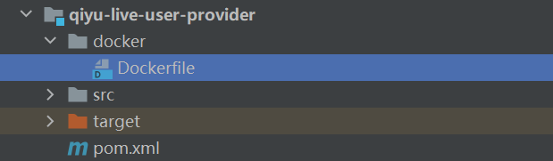

Dockerfile内容：

```properties
FROM openjdk:17-jdk-alpine
VOLUME /tmp
ADD qiyu-live-user-provider-docker.jar app.jar
ENTRYPOINT ["java","-Djava.security.egd=file:/dev/./urandom","-jar","/app.jar"]
```

在IDEA的maven组件中，对根模块进行clean，然后进行install


最后若是没有成功创建user-provider的镜像，就单独对user-provider再clean-instalsl试试

这样，Docker镜像就被创建到我们上面pom文件中配置的Docker服务器中了


**在Docker服务器中运行镜像：**

注意粘贴时把换行符去掉
然后将你在项目中配置的各种服务器地址，用--add-host参数替换成自己的

```shell
docker run -p 9090:9090 --name qiyu-live-user-provider-01 
--add-host 'localhost:192.168.111.2' 
--add-host 'localhost:192.168.111.1' 
qiyu-live-user-provider-docker:1.0.2
```

### 2 Docker服务日志的规范化

对之前的DockerFile做了些修改，增加了在启动之初可以注入JVM参数的功能：docker run时使用-e参数进行注入

```properties
FROM openjdk:17-jdk-alpine
VOLUME /tmp
ADD qiyu-live-user-provider-docker.jar app.jar
ENV JAVA_OPTS="\
-server \
-Xmx1g \
-Xms1g \
-Xmn256m"
ENTRYPOINT java  ${JAVA_OPTS} -Djava.security.egd=file:/dev/./urandom --add-opens=java.base/java.lang=ALL-UNNAMED --add-opens=java.base/java.io=ALL-UNNAMED --add-opens=java.base/java.util=ALL-UNNAMED --add-opens=java.base/java.util.concurrent=ALL-UNNAMED --add-opens=java.rmi/sun.rmi.transport=ALL-UNNAMED --add-opens=java.base/java.lang.reflect=ALL-UNNAMED --add-opens=java.base/java.util=ALL-UNNAMED --add-opens=java.base/java.math=ALL-UNNAMED -jar app.jar
```

在模块user-provider的resources目录下，新建logback-spring.xml：

> 请根据内容创建类IpLogConversionRule，并修改xml文件中该类的引用地址

```xml
<?xml version="1.0" encoding="UTF-8"?>

<!--
    Docker部署logback.xml文件，
    用于将项目输出的日志持久化到磁盘，并分类，分为info日志和error日志，并可以设置保留期
    类IpLogConversionRule需要自己写：
    import ch.qos.logback.core.PropertyDefinerBase;

    import java.net.InetAddress;
    import java.net.UnknownHostException;
    import java.util.concurrent.ThreadLocalRandom;
    
    /**
     * 保证每个docker容器的日志挂载目录唯一性
     */
    public class IpLogConversionRule extends PropertyDefinerBase {
    
        @Override
        public String getPropertyValue() {
            return this.getLogIndex();
        }
    
        private String getLogIndex() {
            try {
                return InetAddress.getLocalHost().getHostAddress();
            } catch (UnknownHostException e) {
                e.printStackTrace();
            }
            return String.valueOf(ThreadLocalRandom.current().nextInt(100000));
        }
    }
-->
<configuration>

    <springProperty name="APP_NAME" scope="context" source="spring.application.name" defaultValue="undefined"/>
    <!--用于生成一个标识，防止多个Docker容器映射到同一台宿主机上出现目录名重复问题，此类需要自己写-->
    <define name="index" class="org.qiyu.live.common.interfaces.utils.IpLogConversionRule"/>
    <property name="LOG_HOME"  value="/tmp/logs/${APP_NAME}/${index}"/>
    <property name="LOG_PATTERN"  value="[%d{yyyy-MM-dd HH:mm:ss.SSS} -%5p] %-40.40logger{39} :%msg%n"/>

    <!--控制台标准继续输出内容-->
    <appender name="CONSOLE" class="ch.qos.logback.core.ConsoleAppender">
        <!--日志输出的格式-->
        <layout class="ch.qos.logback.classic.PatternLayout">
            <pattern>${LOG_PATTERN}</pattern>
        </layout>
    </appender>

    <!--info级别的日志，记录到对应的文件内-->
    <appender name="INFO_FILE" class="ch.qos.logback.core.rolling.RollingFileAppender">
        <!--日志文件地址和文件名-->
        <file>${LOG_HOME}/${APP_NAME}.log</file>、
        <!--滚动策略，日志生成的时候会按照时间来进行分类，例如2023-05-11日的日志，后缀就会有2023-05-11，每天的日志归档后的名字都不一样-->
        <rollingPolicy class="ch.qos.logback.core.rolling.TimeBasedRollingPolicy">
            <fileNamePattern>${LOG_HOME}/${APP_NAME}.log.%d{yyyy-MM-dd}</fileNamePattern>
            <!--日志只保留1个月-->
            <maxHistory>1</maxHistory>
        </rollingPolicy>
        <!--日志输出的格式-->
        <layout class="ch.qos.logback.classic.PatternLayout">
            <pattern>${LOG_PATTERN}</pattern>
        </layout>
    </appender>

    <!--error级别的日志，记录到对应的文件内-->
    <appender name="ERROR_FILE" class="ch.qos.logback.core.rolling.RollingFileAppender">
        <!--日志文件地址和文件名-->
        <file>${LOG_HOME}/${APP_NAME}_error.log</file>
        <!--滚动策略，日志生成的时候会按照时间来进行分类，例如2023-05-11日的日志，后缀就会有2023-05-11，每天的日志归档后的名字都不一样-->
        <rollingPolicy class="ch.qos.logback.core.rolling.TimeBasedRollingPolicy">
            <fileNamePattern>${LOG_HOME}/${APP_NAME}_error.log.%d{yyyy-MM-dd}</fileNamePattern>
            <!--日志只保留1个月-->
            <maxHistory>1</maxHistory>
        </rollingPolicy>
        <!--日志输出的格式-->
        <layout class="ch.qos.logback.classic.PatternLayout">
            <pattern>${LOG_PATTERN}</pattern>
        </layout>
        <!--过滤：只记录ERROR级别的日志-->
        <filter class="ch.qos.logback.classic.filter.LevelFilter">
            <level>error</level>
            <onMismatch>DENY</onMismatch>
        </filter>
    </appender>

    <!-- 根输出级别为INFO，控制台中将出现包含info及以上级别的日志-->
    <!-- 日志输出级别 -->
    <root level="INFO">
        <!-- ref值与上面的appender标签的name相对应 -->
        <appender-ref ref="CONSOLE" />
        <appender-ref ref="INFO_FILE" />
        <appender-ref ref="ERROR_FILE" />
    </root>
</configuration>
```

重新使用IDEA打包模块为Docker镜像，可更改版本为1.0.3

**在Docker服务器中运行镜像：**

```shell
docker run 
-p 9090:9090 
--name qiyu-live-user-provider 
-d -v /tmp/logs/qiyu-live-user-provider:/tmp/logs/qiyu-live-user-provider 
--add-host 'localhost:192.168.111.2' 
--add-host 'localhost:192.168.111.1'
-e TZ=Asia/Shanghai 
qiyu-live-user-provider-docker:1.0.3
```

这里就使用了-e参数添加了时区设置

然后我们可以使用以下命令查看Docker 运行日志：

```shell
docker logs -f [容器id]
```

要查看我们分级别存储的日志文件，可以在本机上直接访问对应的映射目录/tmp/logs/qiyu-live-user-provider

也可以使用以下命令进入容器内部，再访问对应的虚拟目录/tmp/logs/qiyu-live-user-provider

```shell
docker exec -it [容器id] /bin/sh
```

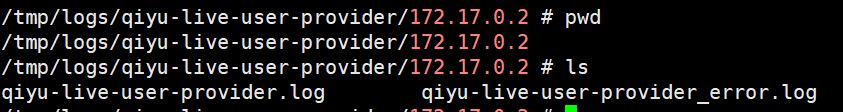

### 3 Docker应用内引入Arthas插件

Arthas 是一款线上监控诊断产品，通过全局视角实时查看应用 load、内存、gc、线程的状态信息，并能在不修改应用代码的情况下，对业务问题进行诊断，包括查看方法调用的出入参、异常，监测方法执行耗时，类加载信息等，大大提升线上问题排查效率。

官网：https://arthas.aliyun.com/doc/quick-start.html

官网下载arthas-bin.zip文件到本地

修改user-provider模块的pom文件，在之前的打包Docker镜像的插件下加入这个resource标签：

```xml
<resource>
    <targetPath>/</targetPath>
    <directory>${arthus.zip.address}</directory>
    <include>arthas-bin.zip</include>
</resource>
```

其中${arthus.zip.address}引用的是pom文件中版本依赖properties标签，其中加入你的arthas-bin.zip本地地址的目录，我的如下：

```xml
<properties>
    <arthus.zip.address>D:\浏览器下载\</arthus.zip.address>
</properties>
```

**修改Dockerfile：**

```properties
FROM openjdk:17-jdk-alpine
VOLUME /tmp
COPY /arthas-bin.zip /opts/arthas-bin.zip	//新加入的一行
ADD qiyu-live-user-provider-docker.jar app.jar
ENV JAVA_OPTS="\
-server \
-Xmx1g \
-Xms1g \
-Xmn256m"
ENTRYPOINT java  ${JAVA_OPTS} -Djava.security.egd=file:/dev/./urandom --add-opens=java.base/java.lang=ALL-UNNAMED --add-opens=java.base/java.io=ALL-UNNAMED --add-opens=java.base/java.util=ALL-UNNAMED --add-opens=java.base/java.util.concurrent=ALL-UNNAMED --add-opens=java.rmi/sun.rmi.transport=ALL-UNNAMED --add-opens=java.base/java.lang.reflect=ALL-UNNAMED --add-opens=java.base/java.util=ALL-UNNAMED --add-opens=java.base/java.math=ALL-UNNAMED -jar app.jar
```

修改pom中的版本为1.0.4，**重新install user-provider模块**

Docker运行镜像：和《日志规范化》中的命令一致，知识更改了版本号

```properties
docker run 
-p 9090:9090 
--name qiyu-live-user-provider 
-d -v /tmp/logs/qiyu-live-user-provider:/tmp/logs/qiyu-live-user-provider 
--add-host 'localhost:192.168.111.2' 
--add-host 'localhost:192.168.111.1'
-e TZ=Asia/Shanghai 
qiyu-live-user-provider-docker:1.0.4

# 去掉换行符
docker run -p 9090:9090 --name qiyu-live-user-provider -d -v /tmp/logs/qiyu-live-user-provider:/tmp/logs/qiyu-live-user-provider --add-host 'localhost:192.168.111.2' --add-host 'localhost:192.168.111.1' -e TZ=Asia/Shanghai qiyu-live-user-provider-docker:1.0.4
```

进入容器内部：

```shell
docker exec -it [容器id] /bin/sh
```

Dockerfile中指定拷贝到容器内的opts目录下

```shell
cd /opts
```

解压运行：

```shell
unzip arthas-bin.zip

java -jar arthas-boot.jar
# 运行后根据提示输入 编号
```

查看监控：

```shell
dashboard
```

示例图：
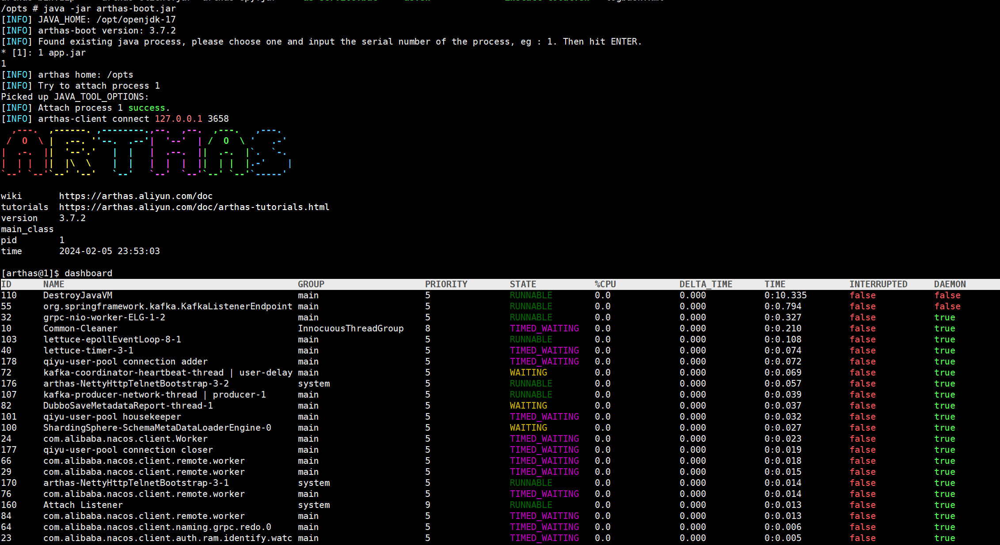

## 3.9 将Nacos作为配置中心

### 1 将application.yml转移到Nacos

修改子模块user-provider下的bootstrap.yml：

```yaml
spring:
  application:
    name: qiyu-live-user-provider
  cloud:
    nacos:
      username: qiyu
      password: qiyu
      discovery:
#        server-addr: localhost:8848
        server-addr: localhost:8848
        namespace: 1bc15ccf-f070-482e-8325-c3c46e427aaf
      config:
        import-check:
          enabled: false
        # 当前服务启动后去nacos中读取配置文件的后缀
        file-extension: yml
        # 读取配置的nacos地址
        server-addr: localhost:8848
        # 读取配置的nacos的名空间
        namespace: 1bc15ccf-f070-482e-8325-c3c46e427aaf
        group: DEFAULT_GROUP
  config:
    import:
      - optional:nacos:${spring.application.name}.yml
```

pom：

```xml
<dependency>
    <groupId>com.alibaba.cloud</groupId>
    <artifactId>spring-cloud-starter-alibaba-nacos-config</artifactId>
</dependency>
<!--在SpringBoot 2.4.x的版本之后，对于bootstrap.properties/bootstrap.yaml配置文件(我们合起来成为Bootstrap配置文件)的支持，需要导入该jar包-->
<dependency>
    <groupId>org.springframework.cloud</groupId>
    <artifactId>spring-cloud-starter-bootstrap</artifactId>
    <version>3.0.2</version>
</dependency>
```

在nacos发布对应的namespace发布一个配置：qiyu-live-user-provider.yml

内容就是application.yml的内容，复制粘贴到nacos，再将本地的application.yml全部注释

### 2 将sharding-jdbc配置转移到Nacos

首先，现在使用的sharding-jdbc版本（5.3.2）已经不支持从Nacos读取sharding配置了（以前旧版本可以），所以我们要根据底层源码编写一个类来让sharding能够从Nacos读取配置

**在子子模块qiyu-live-framework-datasource-starter：**

添加依赖pom：

```xml
<dependency>
    <groupId>org.apache.shardingsphere</groupId>
    <artifactId>shardingsphere-jdbc-core</artifactId>
    <version>${sharding.jdbc.version}</version>
</dependency>
<dependency>
    <groupId>com.alibaba.nacos</groupId>
    <artifactId>nacos-client</artifactId>
</dependency>
```

新建NacosDriverURLProvider：

```java
package org.qiyu.live.framework.datasource.starter;

import com.alibaba.nacos.api.NacosFactory;
import com.alibaba.nacos.api.PropertyKeyConst;
import com.alibaba.nacos.api.config.ConfigService;
import com.alibaba.nacos.api.exception.NacosException;
import org.apache.commons.lang3.StringUtils;
import org.apache.shardingsphere.driver.jdbc.core.driver.ShardingSphereDriverURLProvider;
import org.slf4j.Logger;
import org.slf4j.LoggerFactory;

import java.util.Properties;

/**
 * 根据Sharding-JDBC底层源码仿写，让其能够从nacos读取sharding-jdbc的配置文件
 */
public class NacosDriverURLProvider implements ShardingSphereDriverURLProvider {

    private static Logger logger = LoggerFactory.getLogger(NacosDriverURLProvider.class);
    private static final String NACOS_TYPE = "nacos:";
    private static final String GROUP = "DEFAULT_GROUP";

    @Override
    public boolean accept(String url) {
        return StringUtils.isNotBlank(url) && url.contains(NACOS_TYPE);
    }

    /**
     * 从url中获取到nacos的连接配置信息
     *
     * @param url （jdbc:shardingsphere:nacos:qiyu.nacos.com:8848:qiyu-live-user-shardingjdbc.yaml?username=qiyu&&password=qiyu&&namespace1bc15ccf-f070-482e-8325-c3c46e427aaf）
     * @return
     */
    @Override
    public byte[] getContent(final String url) {
        if (StringUtils.isEmpty(url)) {
            return null;
        }
        //得到例如：qiyu.nacos.com:8848:qiyu-live-user-shardingjdbc.yaml?username=qiyu&&password=qiyu&&namespace=1bc15ccf-f070-482e-8325-c3c46e427aaf 格式的url
        String nacosUrl = url.substring(url.lastIndexOf(NACOS_TYPE) + NACOS_TYPE.length());
        /**
         * 得到三个字符串，分别是：
         * qiyu.nacos.com
         * 8848
         * qiyu-live-user-shardingjdbc.yaml
         */
        String nacosStr[] = nacosUrl.split(":");
        String nacosFileStr = nacosStr[2];
        /**
         * 得到两个字符串
         * qiyu-live-user-shardingjdbc.yaml
         * username=qiyu&&password=qiyu&&namespace=1bc15ccf-f070-482e-8325-c3c46e427aaf
         */
        String nacosFileProp[] = nacosFileStr.split("\\?");
        String dataId = nacosFileProp[0];
        String acceptProp[] = nacosFileProp[1].split("&&");
        //这里获取到
        Properties properties = new Properties();
        properties.setProperty(PropertyKeyConst.SERVER_ADDR, nacosStr[0] + ":" + nacosStr[1]);
        for (String propertyName : acceptProp) {
            String[] propertyItem = propertyName.split("=");
            String key = propertyItem[0];
            String value = propertyItem[1];
            if ("username".equals(key)) {
                properties.setProperty(PropertyKeyConst.USERNAME, value);
            } else if ("password".equals(key)) {
                properties.setProperty(PropertyKeyConst.PASSWORD, value);
            } else if ("namespace".equals(key)) {
                properties.setProperty(PropertyKeyConst.NAMESPACE, value);
            }
        }
        ConfigService configService = null;
        try {
            configService = NacosFactory.createConfigService(properties);
            String content = configService.getConfig(dataId, GROUP, 6000);
            logger.info(content);
            return content.getBytes();
        } catch (NacosException e) {
            throw new RuntimeException(e);
        }
    }
}
```

新建/META-INF/services/org.apache.shardingsphere.driver.jdbc.core.driver.ShardingSphereDriverURLProvider：

```properties
org.qiyu.live.framework.datasource.starter.NacosDriverURLProvider
```

> 到这里就完成sharding功能拓展了

**修改Nacos中的qiyu-live-user-provider.yml：**

> 修改spring.datasource.url为: jdbc:shardingsphere:nacos:localhost:8848:qiyu-live-user-shardingjdbc.yaml?username=qiyu&&password=qiyu&&namespace=1bc15ccf-f070-482e-8325-c3c46e427aaf

在Nacos中对应的namespace中发布一个配置文件qiyu-live-user-shardingjdbc.yaml，内容就是原来本地qiyu-db-sharding.yaml的内容，再将本地的qiyu-db-sharding.yaml全部注释掉

## 3.10 Docker容器集群化管理

**如果没有集群管理工具，我们的运行在Docker的集群要如何进行部署？**

- docker run -p 9091:9091  --name qiyu-live-user-provider-01 -d --add-host  'qiyu.nacos.com:127.0.0.1'  -e 'jvm参数内容'  registry.baidubce.com/qiyu-live-test/qiyu-live-user-provider-docker:1.0.2

- docker run -p 9092:9092  --name qiyu-live-user-provider-02 -d --add-host  'qiyu.nacos.com:127.0.0.1'  -e 'jvm参数内容'  registry.baidubce.com/qiyu-live-test/qiyu-live-user-provider-docker:1.0.2

- docker run -p 9093:9093  --name qiyu-live-user-provider-03 -d --add-host  'qiyu.nacos.com:127.0.0.1'  -e 'jvm参数内容'  registry.baidubce.com/qiyu-live-test/qiyu-live-user-provider-docker:1.0.2

只能执行多条命令区分端口和容器名，但是这样也太麻烦了


**什么是Docker-Compose？**

Compose 是用于定义和运行多容器 Docker 应用程序的工具。通过 Compose，您可以使用 YML 文件来配置应用程序需要的所有服务。然后，**使用一个命令，就可以从 YML 文件配置中创建并启动所有服务**。

**Docker-Compose的安装：**

在Docker服务器上：

```shell
curl -L https://github.com/docker/compose/releases/download/1.25.5/docker-compose-`uname -s`-`uname -m` > /usr/local/bin/docker-compose
```

```
sudo chmod +x /usr/local/bin/docker-compose
```

```
sudo ln -s /usr/local/bin/docker-compose /usr/bin/docker-compose
```

```
docker-compose --version
```

> docker-compose安装成功，我们编写好docker-compose.yml文件后，就可以使用docker-compose up -d命令启动对应的集群了


前面我们还没有将qiyu-live-api模块的配置放入nacos，也还没有将其打包成Docker镜像，现在我们先来做这两步

修改qiyu-live-api模块的pom文件：

```xml
加入这两个依赖
<dependency>
    <groupId>com.alibaba.cloud</groupId>
    <artifactId>spring-cloud-starter-alibaba-nacos-config</artifactId>
</dependency>
<!--在SpringBoot 2.4.x的版本之后，对于bootstrap.properties/bootstrap.yaml配置文件(我们合起来成为Bootstrap配置文件)的支持，需要导入该jar包-->
<dependency>
    <groupId>org.springframework.cloud</groupId>
    <artifactId>spring-cloud-starter-bootstrap</artifactId>
    <version>3.0.2</version>
</dependency>

引入和user-provider中相同的插件
<properties>
	<arthus.zip.address>D:\浏览器下载\</arthus.zip.address>
</properties>
<!--用于设置版本，下面docker打包要用-->
<version>1.0.4</version>
<build>
    <finalName>${artifactId}-docker</finalName>
    <plugins>
        <!--打包成docker镜像-->
        <plugin>
            <groupId>com.spotify</groupId>
            <artifactId>docker-maven-plugin</artifactId>
            <version>1.2.0</version>
            <executions>
                <!-- 当mvn执行install操作的时候，执行docker的build -->
                <execution>
                    <id>build</id>
                    <phase>install</phase>
                    <goals>
                        <goal>build</goal>
                    </goals>
                </execution>
            </executions>
            <configuration>
                <!--自己的Docker服务器地址和端口-->
                <dockerHost>http://192.168.111.100:2375</dockerHost>
                <imageTags>
                    <imageTag>${project.version}</imageTag>
                </imageTags>
                <imageName>${project.build.finalName}</imageName>
                <!--指定Dockerfile文件的位置-->
                <dockerDirectory>${project.basedir}/docker</dockerDirectory>
                <resources>
                    <!-- 指定jar包路径，这里对应Dockerfile中复制 jar 包到 docker 容器指定目录配置，也可以写到 Dockerfile 中 -->
                    <resource>
                        <targetPath>/</targetPath>
                        <!-- 将下边目录的内容，拷贝到docker镜像中 -->
                        <directory>${project.build.directory}</directory>
                        <include>${project.build.finalName}.jar</include>
                    </resource>
                    <resource>
                        <targetPath>/</targetPath>
                        <directory>${arthus.zip.address}</directory>
                        <include>arthas-bin.zip</include>
                    </resource>
                </resources>
            </configuration>
        </plugin>
        <!--将SpringBoot应用打包成jar包-->
        <plugin>
            <groupId>org.springframework.boot</groupId>
            <artifactId>spring-boot-maven-plugin</artifactId>
        </plugin>
    </plugins>
</build>
```

像3.8中一样位置处新建docker.DockerFile文件：内容和3.8中一致

```properties
FROM openjdk:17-jdk-alpine
VOLUME /tmp
COPY /arthas-bin.zip /opts/arthas-bin.zip
ADD qiyu-live-api-docker.jar app.jar
ENV JAVA_OPTS="\
-server \
-Xmx1g \
-Xms1g \
-Xmn256m"
ENTRYPOINT java  ${JAVA_OPTS} -Djava.security.egd=file:/dev/./urandom --add-opens=java.base/java.lang=ALL-UNNAMED --add-opens=java.base/java.io=ALL-UNNAMED --add-opens=java.base/java.util=ALL-UNNAMED --add-opens=java.base/java.util.concurrent=ALL-UNNAMED --add-opens=java.rmi/sun.rmi.transport=ALL-UNNAMED --add-opens=java.base/java.lang.reflect=ALL-UNNAMED --add-opens=java.base/java.util=ALL-UNNAMED --add-opens=java.base/java.math=ALL-UNNAMED -jar app.jar
```

修改bootstrap.yml：

```yaml
spring:
  application:
    name: qiyu-live-api
  cloud:
    nacos:
      username: qiyu
      password: qiyu
      discovery:
        server-addr: localhost:8848
        namespace: 1bc15ccf-f070-482e-8325-c3c46e427aaf
      config:
        import-check:
          enabled: false
        # 当前服务启动后去nacos中读取配置文件的后缀
        file-extension: yml
        # 读取配置的nacos地址
        server-addr: localhost:8848
        # 读取配置的nacos的名空间
        namespace: 1bc15ccf-f070-482e-8325-c3c46e427aaf
        group: DEFAULT_GROUP
  config:
    import:
      - optional:nacos:${spring.application.name}.yml
```

在nacos对应的namespace中添加配置文件qiyu-live-api.yml，内容：

```yaml
dubbo:
  application:
    name: qiyu-live-api
    qos-enable: false
  registry:
    address: nacos://localhost:8848?namespace=1bc15ccf-f070-482e-8325-c3c46e427aaf&&username=qiyu&&password=qiyu

server:
  servlet:
    context-path: /live/api		# 新增，用于后面引入gateway使用
```

然后注释掉本地的qiyu-live-api.yml

执行clean -> install进行打包成Docker镜像


**docker-compose启动服务集群：**

在安装了docker-compose的服务器上，找位置新建docker-compose.yml（推荐在各自的模块下的docker目录中也新建一份，若是IDEA本机安装了docker，可以在idea的terminal中直接运行）

启动user-provider的yml文件内容：

```yaml
version: '3'
services:
  qiyu-live-user-provider-docker-1:
    container_name: qiyu-live-user-provider-docker-1
    image: 'qiyu-live-user-provider-docker:1.0.4'
    ports:
      - "9091:9091"
    volumes:
      - /tmp/logs/qiyu-live-user-provider:/tmp/logs/qiyu-live-user-provider
    environment:
      - TZ=Asia/Shanghai
      - DUBBO_IP_TO_REGISTRY=192.168.111.100  #自己Docker服务器的地址
      - DUBBO_PORT_TO_REGISTRY=9091
      - DUBBO_PORT_TO_BIND=9091
      - JAVA_OPTS=-XX:MetaspaceSize=128m -XX:MaxMetaspaceSize=128m -Xms512m -Xmx512m -Xmn128m -Xss256k
    extra_hosts:
      - 'localhost:192.168.111.1'
      - 'localhost:192.168.111.2'

  qiyu-live-user-provider-docker-2:
    container_name: qiyu-live-user-provider-docker-2
    image: 'qiyu-live-user-provider-docker:1.0.4'
    ports:
      - "9092:9092"
    volumes:
      - /tmp/logs/qiyu-live-user-provider:/tmp/logs/qiyu-live-user-provider
    environment:
      - TZ=Asia/Shanghai
      - DUBBO_IP_TO_REGISTRY=192.168.111.100  #自己Docker服务器的地址
      - DUBBO_PORT_TO_REGISTRY=9092
      - DUBBO_PORT_TO_BIND=9092
      - JAVA_OPTS=-XX:MetaspaceSize=128m -XX:MaxMetaspaceSize=128m -Xms512m -Xmx512m -Xmn128m -Xss256k
    extra_hosts:
      - 'localhost:192.168.111.1'
      - 'localhost:192.168.111.2'
```

使用Docker-compose启动user-provider集群：

在docker-compose.yml文件的目录下运行：

```shell
# 运行当前目录下的yml文件，也可以使用-f [yml文件的路径]指定
docker-compose up -d

# 使用ps命令查看运行容器的id
docker ps

# 查看容器的运行日志，看是否成功运行
docker logs -f [id]
```


启动qiyu-live-api的yml文件内容：

```yaml
version: '3'
services:
  qiyu-live-api-docker-1:
    container_name: qiyu-live-api-docker-1
    image: 'qiyu-live-api-docker:1.0.4'
    ports:
      - "8081:8081"
    volumes:
      - /tmp/logs/qiyu-live-api:/tmp/logs/qiyu-live-api
    environment:
      - spring.cloud.nacos.discovery.ip=192.168.111.100   # 和user-provider中的dubbo_ip对应相等，不配置引入网关将无法访问
      - TZ=Asia/Shanghai
      - server.port=8081
      - JAVA_OPTS=-XX:MetaspaceSize=128m -XX:MaxMetaspaceSize=128m -Xms512m -Xmx512m -Xmn128m -Xss256k
    extra_hosts:
      - 'localhost:192.168.111.1'
  qiyu-live-api-docker-2:
    container_name: qiyu-live-api-docker-2
    image: 'qiyu-live-api-docker:1.0.4'
    ports:
      - "8082:8082"
    volumes:
      - /tmp/logs/qiyu-live-api:/tmp/logs/qiyu-live-api
    environment:
      - spring.cloud.nacos.discovery.ip=192.168.111.100   # 和user-provider中的dubbo_ip对应相等
      - TZ=Asia/Shanghai
      - server.port=8082
      - JAVA_OPTS=-XX:MetaspaceSize=128m -XX:MaxMetaspaceSize=128m -Xms512m -Xmx512m -Xmn128m -Xss256k
    extra_hosts:
      - 'localhost:192.168.111.1'
```

使用Docker-compose启动qiyu-live-api集群：

在docker-compose.yml文件的目录下运行：

```shell
# 运行当前目录下的yml文件，也可以使用-f [yml文件的路径]指定
docker-compose up -d

# 使用ps命令查看运行容器的id
docker ps

# 查看容器的运行日志，看是否成功运行
docker logs -f [id]
```

## 3.11 引入Gateway网关

**为什么要使用Gateway网关？**

- 使用网关后，可以对下游的Web服务做负载均衡
- 采用API Gateway可以与微服务注册中心连接，实现微服务无感知动态扩容。
- API Gateway对于无法访问的服务，可以做到自动熔断，无需人工参与。
- API Gateway可以方便的实现蓝绿部署，金丝雀发布或A/B发布。
- API Gateway做为系统统一入口，我们可以将各个微服务公共功能放在API Gateway中实现，以尽可能减少各服务的职责。

**新建子模块qiyu-live-gateway：**

pom：

```xml
<?xml version="1.0" encoding="UTF-8"?>
<project xmlns="http://maven.apache.org/POM/4.0.0"
         xmlns:xsi="http://www.w3.org/2001/XMLSchema-instance"
         xsi:schemaLocation="http://maven.apache.org/POM/4.0.0 http://maven.apache.org/xsd/maven-4.0.0.xsd">
    <parent>
        <artifactId>qiyu-live-app</artifactId>
        <groupId>org.hah</groupId>
        <version>1.0-SNAPSHOT</version>
    </parent>
    <modelVersion>4.0.0</modelVersion>

    <artifactId>qiyu-live-gateway</artifactId>

    <dependencies>
        <!--gateway 内部引入了webflux-->
        <dependency>
            <groupId>org.springframework.cloud</groupId>
            <artifactId>spring-cloud-starter-gateway</artifactId>
            <version>${spring-cloud-starter-gateway.version}</version>
        </dependency>
        <dependency>
            <groupId>org.springframework.cloud</groupId>
            <artifactId>spring-cloud-starter-loadbalancer</artifactId>
            <version>${spring-cloud-starter-loadbalancer.version}</version>
        </dependency>
        <dependency>
            <groupId>com.alibaba.cloud</groupId>
            <artifactId>spring-cloud-starter-alibaba-nacos-discovery</artifactId>
        </dependency>

        <dependency>
            <groupId>com.alibaba.cloud</groupId>
            <artifactId>spring-cloud-starter-alibaba-nacos-config</artifactId>
        </dependency>
        <dependency>
            <groupId>org.springframework.cloud</groupId>
            <artifactId>spring-cloud-starter-bootstrap</artifactId>
            <version>${spring-cloud-starter-bootstrap.version}</version>
        </dependency>
        <dependency>
            <groupId>com.alibaba</groupId>
            <artifactId>fastjson</artifactId>
            <version>${alibaba-fastjson.version}</version>
        </dependency>
        <!--引入其中的logback的IpLogConversionRule-->
        <dependency>
            <groupId>org.hah</groupId>
            <artifactId>qiyu-live-common-interface</artifactId>
            <version>1.0-SNAPSHOT</version>
        </dependency>
    </dependencies>

    <version>1.0.1</version>

    <build>
        <finalName>${artifactId}-docker</finalName>
        <plugins>
            <!--打包成docker镜像-->
            <plugin>
                <groupId>com.spotify</groupId>
                <artifactId>docker-maven-plugin</artifactId>
                <version>1.2.0</version>
                <executions>
                    <!-- 当mvn执行install操作的时候，执行docker的build -->
                    <execution>
                        <id>build</id>
                        <phase>install</phase>
                        <goals>
                            <goal>build</goal>
                        </goals>
                    </execution>
                </executions>
                <configuration>
                    <!--自己的Docker服务器地址和端口-->
                    <dockerHost>http://192.168.111.100:2375</dockerHost>
                    <imageTags>
                        <imageTag>${project.version}</imageTag>
                    </imageTags>
                    <imageName>${project.build.finalName}</imageName>
                    <!--指定Dockerfile文件的位置-->
                    <dockerDirectory>${project.basedir}/docker</dockerDirectory>
                    <resources>
                        <!-- 指定jar包路径，这里对应Dockerfile中复制 jar 包到 docker 容器指定目录配置，也可以写到 Dockerfile 中 -->
                        <resource>
                            <targetPath>/</targetPath>
                            <!-- 将下边目录的内容，拷贝到docker镜像中 -->
                            <directory>${project.build.directory}</directory>
                            <include>${project.build.finalName}.jar</include>
                        </resource>
                        <resource>
                            <targetPath>/</targetPath>
                            <directory>${arthus.zip.address}</directory>
                            <include>arthas-bin.zip</include>
                        </resource>

                    </resources>
                </configuration>
            </plugin>
            <!--将SpringBoot应用打包成jar包-->
            <plugin>
                <groupId>org.springframework.boot</groupId>
                <artifactId>spring-boot-maven-plugin</artifactId>
            </plugin>
        </plugins>
    </build>
</project>
```

bootstrap.yml：

```yaml
server:
  port: 8088
spring:
  application:
    name: qiyu-live-gateway
  cloud:
    nacos:
      username: qiyu
      password: qiyu
      discovery:
        server-addr: localhost:8848
        namespace: 1bc15ccf-f070-482e-8325-c3c46e427aaf
      config:
        import-check:
          enabled: false
        file-extension: yaml
        server-addr: localhost:8848
        namespace: 1bc15ccf-f070-482e-8325-c3c46e427aaf
  config:
    import:
      - optional:nacos:${spring.application.name}.yaml

logging:
  level:
    org.springframework.cloud.gateway: DEBUG
    reactor.netty.http.client: DEBUG
```

在nacos新建配置文件qiyu-live-gateway.yaml：

```yaml
spring:
  cloud:
    gateway:
      discovery:
        locator:
          enabled: true
      routes:
        - id: qiyu-live-api
          uri: lb://qiyu-live-api
          predicates:
            - Path=/live/api/**
          filters:
            - RewritePath=/live/api/(?<segment>.*), /${segment}
            #- StripPrefix=2  # 去除前两段路径 "/live/api"
```

将user-provider中的logback-xml文件复制到gateway子模块中去

新建org.qiyu.live.gateway.GatewayApplication：

```java
@SpringBootApplication
@EnableDiscoveryClient
public class GatewayApplication {

    public static void main(String[] args) {
        SpringApplication springApplication = new SpringApplication(GatewayApplication.class);
        springApplication.setWebApplicationType(WebApplicationType.REACTIVE);//gateway基于webflux响应式编程，webflux底层又是使用netty
        springApplication.run(args);
    }
}
```

> 注意前面api模块的Docker-compose.yml中要配置与dubbo_ip相对应的IP，否则网关路由时将无法连接到服务

## 3.12 JMeter压测userInfo接口

测试并发数增大后，到达多少后是**吞吐量**瓶颈。

**压测要关注哪些点？**

- 错误率

要求可靠性99%，99.99%

- **吞吐量**

有分QPS/TPS，但是在jmeter压力测试中，统一是吞吐量。吞吐量才是衡量一个系统性能指标的参数，而jmeter的并发度只能做个参考。通常来说QPS是指每秒的读请求并发量，TPS是指每秒的写请求并发量 。

- 并发度和吞吐量的区别

并发度：并发度1000是指1000个线程在jmeter客户端发起循环调用，这样给到后台的压力可能大于1000/s。

吞吐量：每秒吞吐量1000，这个是指一秒内，请求抵达服务端，再从服务端传回给到客户端的成功次数。


更改user-provider配置：设置dubbo线程池数量和redis最大连接数

```yaml
dubbo:
  application:
    name: ${spring.application.name}
  registry:
    #docker启动的时候，注入host的配置
    address: nacos://qiyu.nacos.com:8848?namespace=1bc15ccf-f070-482e-8325-c3c46e427aaf&&username=qiyu&&password=qiyu
  protocol:
    name: dubbo
    port: 9090
    threadpool: fixed
    dispatcher: execution
    threads: 500	# 设置为500
    accepts: 500  

  # redis连接数的增加：
  data:
    redis:
      port: 8801
      host: cloud.db
      lettuce:
        pool:
          min-idle: 10
          max-active: 100	# 从50调整到100
          max-idle: 10
```

**机器配置**

腾讯云的服务器1台，2core 2gb机器，配置了一个docker容器，使用的jvm参数如下：

```
-XX:MetaspaceSize=128m 
-XX:MaxMetaspaceSize=128m 
-Xms1024m 
-Xmx1024m 
-Xmn512m 
-Xss256k
```

Docker的cpu和内存没有设置上限，关闭掉机器上的多余进程

**打开资料中的user-provider-test.jmx**（JMeter需要自己上网查询安装JMeter Dubbo测试插件），设置好参数，启动进行测试

## 3.13 登录注册功能完善

### 1 发送短信模块

我们使用的是容联云平台的短信服务，具有免费额度，也可以选择阿里云也有免费额度

容联云：https://www.yuntongxun.com/

创建数据表：

创建数据库qiyu_live_msg，在其中创建表：

```sql
CREATE TABLE `t_sms`  (
  `id` bigint UNSIGNED NOT NULL AUTO_INCREMENT COMMENT '主键id',
  `code` int UNSIGNED NULL DEFAULT 0 COMMENT '验证码',
  `phone` varchar(200) CHARACTER SET utf8mb4 COLLATE utf8mb4_0900_ai_ci NULL DEFAULT '' COMMENT '手机号',
  `sendTime` datetime NULL DEFAULT CURRENT_TIMESTAMP COMMENT '发送时间',
  `updateTime` datetime NULL DEFAULT CURRENT_TIMESTAMP ON UPDATE CURRENT_TIMESTAMP COMMENT '更新时间',
  PRIMARY KEY (`id`) USING BTREE
) ENGINE = InnoDB AUTO_INCREMENT = 15 CHARACTER SET = utf8mb4 COLLATE = utf8mb4_0900_ai_ci ROW_FORMAT = Dynamic;
```

**新建子模块qiyu-live-msg-interface：**

pom：

```xml
<dependency>
    <groupId>org.hah</groupId>
    <artifactId>qiyu-live-common-interface</artifactId>
    <version>1.0-SNAPSHOT</version>
</dependency>
```

```java
package org.qiyu.live.msg.provider.interfaces;

import org.qiyu.live.msg.provider.dto.MsgCheckDTO;
import org.qiyu.live.msg.provider.enums.MsgSendResultEnum;

public interface ISmsRpc {

    /**
     * 发送短信接口
     *
     * @param phone
     * @return
     */
    MsgSendResultEnum sendLoginCode(String phone);

    /**
     * 校验登录验证码
     *
     * @param phone
     * @param code
     * @return
     */
    MsgCheckDTO checkLoginCode(String phone, Integer code);

    /**
     * 插入一条短信记录
     *
     * @param phone
     * @param code
     */
    void insertOne(String phone, Integer code);
}
```

```
package org.qiyu.live.msg.provider.enums;

public enum MsgSendResultEnum {

    SEND_SUCCESS(0,"成功"),
    SEND_FAIL(1,"发送失败"),
    MSG_PARAM_ERROR(2,"消息格式异常");

    int code;
    String desc;

    MsgSendResultEnum(int code, String desc) {
        this.code = code;
        this.desc = desc;
    }

    public int getCode() {
        return code;
    }

    public void setCode(int code) {
        this.code = code;
    }

    public String getDesc() {
        return desc;
    }

    public void setDesc(String desc) {
        this.desc = desc;
    }

}
```

```java
package org.qiyu.live.msg.provider.dto;

import lombok.AllArgsConstructor;
import lombok.Data;

import java.io.Serial;
import java.io.Serializable;

/**
 * 记录短信相关信息
 */
@Data
@AllArgsConstructor
public class MsgCheckDTO implements Serializable {


    @Serial
    private static final long serialVersionUID = 2383695129958767484L;
    private boolean checkStatus;
    private String desc;
}
```


**新建子模块qiyu-live-msg-provider：**

pom：

```xml
<dependencies>
    <dependency>
        <groupId>org.apache.dubbo</groupId>
        <artifactId>dubbo-spring-boot-starter</artifactId>
        <version>3.2.0-beta.3</version>
    </dependency>
    <dependency>
        <groupId>com.alibaba.cloud</groupId>
        <artifactId>spring-cloud-starter-alibaba-nacos-discovery</artifactId>
    </dependency>
    <dependency>
        <groupId>com.alibaba.cloud</groupId>
        <artifactId>spring-cloud-starter-alibaba-nacos-config</artifactId>
    </dependency>
    <!--在SpringBoot 2.4.x的版本之后，对于bootstrap.properties/bootstrap.yaml配置文件(我们合起来成为Bootstrap配置文件)的支持，需要导入该jar包-->
    <dependency>
        <groupId>org.springframework.cloud</groupId>
        <artifactId>spring-cloud-starter-bootstrap</artifactId>
        <version>3.0.2</version>
    </dependency>

    <dependency>
        <groupId>org.springframework.boot</groupId>
        <artifactId>spring-boot-starter-web</artifactId>
        <exclusions>
            <exclusion>
                <artifactId>log4j-to-slf4j</artifactId>
                <groupId>org.apache.logging.log4j</groupId>
            </exclusion>
        </exclusions>
    </dependency>
    <dependency>
        <groupId>mysql</groupId>
        <artifactId>mysql-connector-java</artifactId>
        <version>${qiyu-mysql.version}</version>
    </dependency>

    <dependency>
        <groupId>org.apache.shardingsphere</groupId>
        <artifactId>shardingsphere-jdbc-core</artifactId>
        <version>${sharding.jdbc.version}</version>
    </dependency>

    <dependency>
        <groupId>com.baomidou</groupId>
        <artifactId>mybatis-plus-boot-starter</artifactId>
        <version>${mybatis-plus.version}</version>
    </dependency>
    
    <!--容联云短信SDK-->
    <dependency>
        <groupId>com.cloopen</groupId>
        <artifactId>java-sms-sdk</artifactId>
        <version>1.0.4</version>
    </dependency>

    <!--下面都是自定义组件或starter-->
    <dependency>
        <groupId>org.hah</groupId>
        <artifactId>qiyu-live-common-interface</artifactId>
        <version>1.0-SNAPSHOT</version>
    </dependency>

    <dependency>
        <groupId>org.hah</groupId>
        <artifactId>qiyu-live-framework-datasource-starter</artifactId>
        <version>1.0-SNAPSHOT</version>
    </dependency>

    <dependency>
        <groupId>org.hah</groupId>
        <artifactId>qiyu-live-framework-redis-starter</artifactId>
        <version>1.0-SNAPSHOT</version>
    </dependency>

    <dependency>
        <groupId>org.hah</groupId>
        <artifactId>qiyu-live-msg-interface</artifactId>
        <version>1.0-SNAPSHOT</version>
    </dependency>
</dependencies>

<!--用于设置版本，下面docker打包要用-->
<version>1.0.4</version>

<build>
    <finalName>${artifactId}-docker</finalName>
    <plugins>
        <!--打包成docker镜像-->
        <plugin>
            <groupId>com.spotify</groupId>
            <artifactId>docker-maven-plugin</artifactId>
            <version>1.2.0</version>
            <executions>
                <!-- 当mvn执行install操作的时候，执行docker的build -->
                <execution>
                    <id>build</id>
                    <phase>install</phase>
                    <goals>
                        <goal>build</goal>
                    </goals>
                </execution>
            </executions>
            <configuration>
                <!--自己的Docker服务器地址和端口-->
                <dockerHost>http://192.168.111.100:2375</dockerHost>
                <imageTags>
                    <imageTag>${project.version}</imageTag>
                </imageTags>
                <imageName>${project.build.finalName}</imageName>
                <!--指定Dockerfile文件的位置-->
                <dockerDirectory>${project.basedir}/docker</dockerDirectory>
                <resources>
                    <!-- 指定jar包路径，这里对应Dockerfile中复制 jar 包到 docker 容器指定目录配置，也可以写到 Dockerfile 中 -->
                    <resource>
                        <targetPath>/</targetPath>
                        <!-- 将下边目录的内容，拷贝到docker镜像中 -->
                        <directory>${project.build.directory}</directory>
                        <include>${project.build.finalName}.jar</include>
                    </resource>
                    <resource>
                        <targetPath>/</targetPath>
                        <directory>${arthus.zip.address}</directory>
                        <include>arthas-bin.zip</include>
                    </resource>

                </resources>
            </configuration>
        </plugin>
        <!--将SpringBoot应用打包成jar包-->
        <plugin>
            <groupId>org.springframework.boot</groupId>
            <artifactId>spring-boot-maven-plugin</artifactId>
        </plugin>
    </plugins>
</build>
```

bootstrap.yml：

```yaml
spring:
  application:
    name: qiyu-live-msg-provider
  cloud:
    nacos:
      username: qiyu
      password: qiyu
      discovery:
        server-addr: localhost:8848
        namespace: 1bc15ccf-f070-482e-8325-c3c46e427aaf
      config:
        import-check:
          enabled: false
        # 当前服务启动后去nacos中读取配置文件的后缀
        file-extension: yaml
        # 读取配置的nacos地址
        server-addr: localhost:8848
        # 读取配置的nacos的名空间
        namespace: 1bc15ccf-f070-482e-8325-c3c46e427aaf
        group: DEFAULT_GROUP
  config:
    import:
      - optional:nacos:${spring.application.name}.yml
```

logback-spring.xml复制user-provider的

在nacos新建配置文件qiyu-live-msg-provider.yaml：

```yaml
spring:
  application:
    name: qiyu-live-msg-provider
  datasource:
    hikari:
      minimum-idle: 10
      maximum-pool-size: 200
    driver-class-name: com.mysql.cj.jdbc.Driver
    #测试表：访问主库
    url: jdbc:mysql://localhost:8808/qiyu_live_msg?useUnicode=true&characterEncoding=utf8
    username: root
    password: root
  data:
    redis:
      port: 6379
      host: localhost
      password: 123456
      lettuce:
        pool:
          min-idle: 10
          max-active: 100
          max-idle: 10
dubbo:
  application:
    name: ${spring.application.name}
  registry:
    address: nacos://localhost:8848?namespace=1bc15ccf-f070-482e-8325-c3c46e427aaf&&username=qiyu&&password=qiyu
  protocol:
    name: dubbo
    port: 9093
```

```java
package org.qiyu.live.msg.provider.config;

import java.util.concurrent.*;

public class ThreadPoolManager {

    public static ThreadPoolExecutor commonAsyncPool = new ThreadPoolExecutor(2, 8, 3, TimeUnit.SECONDS, new ArrayBlockingQueue<>(1000)
            , new ThreadFactory() {
        @Override
        public Thread newThread(Runnable r) {
            Thread newThread = new Thread(r);
            newThread.setName(" commonAsyncPool - " + ThreadLocalRandom.current().nextInt(10000));
            return newThread;
        }
    });

}
```

```java
package org.qiyu.live.msg.provider.dao.po;

import com.baomidou.mybatisplus.annotation.IdType;
import com.baomidou.mybatisplus.annotation.TableId;
import com.baomidou.mybatisplus.annotation.TableName;
import lombok.Data;

import java.util.Date;

/**
 * 记录短信相关信息
 */
@TableName("t_sms")
@Data
public class SmsPO {

    @TableId(type = IdType.AUTO)
    private Long id;
    private Integer code;
    private String phone;
    private Date sendTime;
    private Date updateTime;
}
```

```java
package org.qiyu.live.msg.provider.dao.mapper;

import com.baomidou.mybatisplus.core.mapper.BaseMapper;
import org.apache.ibatis.annotations.Mapper;
import org.qiyu.live.msg.provider.dao.po.SmsPO;

@Mapper
public interface SmsMapper extends BaseMapper<SmsPO> {
}
```

```java
package org.qiyu.live.msg.provider.rpc;

import jakarta.annotation.Resource;
import org.apache.dubbo.config.annotation.DubboService;
import org.qiyu.live.msg.provider.dto.MsgCheckDTO;
import org.qiyu.live.msg.provider.enums.MsgSendResultEnum;
import org.qiyu.live.msg.provider.interfaces.ISmsRpc;
import org.qiyu.live.msg.provider.service.ISmsService;

@DubboService
public class SmsRpcImpl implements ISmsRpc {

    @Resource
    private ISmsService smsService;

    @Override
    public MsgSendResultEnum sendLoginCode(String phone) {
        return smsService.sendLoginCode(phone);
    }

    @Override
    public MsgCheckDTO checkLoginCode(String phone, Integer code) {
        return smsService.checkLoginCode(phone,code);
    }

    @Override
    public void insertOne(String phone, Integer code) {
        smsService.insertOne(phone,code);
    }
}
```

```java
package org.qiyu.live.msg.provider.service;

import org.qiyu.live.msg.provider.dto.MsgCheckDTO;
import org.qiyu.live.msg.provider.enums.MsgSendResultEnum;

public interface ISmsService {

    /**
     * 发送短信接口
     *
     * @param phone
     * @return
     */
    MsgSendResultEnum sendLoginCode(String phone);

    /**
     * 校验登录验证码
     *
     * @param phone
     * @param code
     * @return
     */
    MsgCheckDTO checkLoginCode(String phone, Integer code);

    /**
     * 插入一条短信记录
     *
     * @param phone
     * @param code
     */
    void insertOne(String phone, Integer code);
}
```

```java
package org.qiyu.live.msg.provider.service.impl;

import cn.hutool.core.util.RandomUtil;
import com.baomidou.mybatisplus.core.toolkit.StringUtils;
import com.cloopen.rest.sdk.BodyType;
import com.cloopen.rest.sdk.CCPRestSmsSDK;
import jakarta.annotation.Resource;
import org.qiyu.live.framework.redis.starter.key.MsgProviderCacheKeyBuilder;
import org.qiyu.live.msg.provider.config.ThreadPoolManager;
import org.qiyu.live.msg.provider.dao.mapper.SmsMapper;
import org.qiyu.live.msg.provider.dao.po.SmsPO;
import org.qiyu.live.msg.provider.dto.MsgCheckDTO;
import org.qiyu.live.msg.provider.enums.MsgSendResultEnum;
import org.qiyu.live.msg.provider.service.ISmsService;
import org.slf4j.Logger;
import org.slf4j.LoggerFactory;
import org.springframework.data.redis.core.RedisTemplate;
import org.springframework.stereotype.Service;

import java.util.HashMap;
import java.util.Set;
import java.util.UUID;
import java.util.concurrent.TimeUnit;

@Service
public class SmsServiceImpl implements ISmsService {

    private static Logger logger = LoggerFactory.getLogger(SmsServiceImpl.class);

    @Resource
    private SmsMapper smsMapper;

    @Resource
    private RedisTemplate<String, Integer> redisTemplate;

    @Resource
    private MsgProviderCacheKeyBuilder msgProviderCacheKeyBuilder;

    @Override
    public MsgSendResultEnum sendLoginCode(String phone) {
        if (StringUtils.isEmpty(phone)) {
            return MsgSendResultEnum.MSG_PARAM_ERROR;
        }
        // 生成6为验证码，有效期60s，同一个手机号不能重复发，Redis去存储验证码
        String key = msgProviderCacheKeyBuilder.buildSmsLoginCodeKey(phone);
        if (Boolean.TRUE.equals(redisTemplate.hasKey(key))) {
            logger.warn("该手机号短信发送过于频繁，phone is {}", phone);
            return MsgSendResultEnum.SEND_FAIL;
        }
        int code = RandomUtil.randomInt(1000, 9999);
        redisTemplate.opsForValue().set(key, code, 60, TimeUnit.SECONDS);
        // 发送验证码(模拟实现)
        ThreadPoolManager.commonAsyncPool.execute(() -> {
            boolean sendStatus = this.sendSmsToCCP(phone, code);
            if (sendStatus) {
                this.insertOne(phone, code);
            }
        });
        return MsgSendResultEnum.SEND_SUCCESS;
    }

    @Override
    public MsgCheckDTO checkLoginCode(String phone, Integer code) {
        // 参数校验
        if (StringUtils.isEmpty(phone) || code == null || code < 1000) {
            return new MsgCheckDTO(false, "参数异常");
        }
        // redis校验验证码
        String key = msgProviderCacheKeyBuilder.buildSmsLoginCodeKey(phone);
        Integer cacheCode = redisTemplate.opsForValue().get(key);
        if (cacheCode == null || cacheCode < 1000) {
            return new MsgCheckDTO(false, "验证码已过期");
        }
        if (cacheCode.equals(code)) {
            redisTemplate.delete(key);
            return new MsgCheckDTO(true, "验证码校验成功");
        }
        return new MsgCheckDTO(false, "验证码校验失败");
    }

    @Override
    public void insertOne(String phone, Integer code) {
        SmsPO smsPO = new SmsPO();
        smsPO.setPhone(phone);
        smsPO.setCode(code);
        smsMapper.insert(smsPO);
    }

    /**
     * 通过容联云平台发送短信，可以将账号配置信息抽取到Nacos配置中心
     * @param phone
     * @param code
     * @return
     */
    private boolean sendSmsToCCP(String phone, Integer code) {
        try {
            // 生产环境请求地址：app.cloopen.com
            String serverIp = "app.cloopen.com";
            // 请求端口
            String serverPort = "8883";
            // 主账号,登陆云通讯网站后,可在控制台首页看到开发者主账号ACCOUNT SID和主账号令牌AUTH TOKEN
            String accountSId = "2c94811c8cd4da0a018d938a40291c0a";
            String accountToken = "34e714f93f32438d90301ed6521c09c5";
            // 请使用管理控制台中已创建应用的APPID
            String appId = "2c94811c8cd4da0a018d938a41a91c11";
            CCPRestSmsSDK sdk = new CCPRestSmsSDK();
            sdk.init(serverIp, serverPort);
            sdk.setAccount(accountSId, accountToken);
            sdk.setAppId(appId);
            sdk.setBodyType(BodyType.Type_JSON);
            String to = phone;
            String templateId = "1";
            // 测试开发短信模板：【云通讯】您的验证码是{1}，请于{2}分钟内正确输入。其中{1}和{2}为短信模板参数。
            String[] datas = {String.valueOf(code), "1"};
            String subAppend = "1234";  // 可选 扩展码，四位数字 0~9999
            String reqId = UUID.randomUUID().toString();  // 可选 第三方自定义消息id，最大支持32位英文数字，同账号下同一自然天内不允许重复
            // HashMap<String, Object> result = sdk.sendTemplateSMS(to,templateId,datas);
            HashMap<String, Object> result = sdk.sendTemplateSMS(to, templateId, datas, subAppend, reqId);
            if ("000000".equals(result.get("statusCode"))) {
                // 正常返回输出data包体信息（map）
                HashMap<String, Object> data = (HashMap<String, Object>) result.get("data");
                Set<String> keySet = data.keySet();
                for (String key : keySet) {
                    Object object = data.get(key);
                    logger.info(key + " = " + object);
                }
            } else {
                // 异常返回输出错误码和错误信息
                logger.error("错误码=" + result.get("statusCode") + " 错误信息= " + result.get("statusMsg"));
            }
            return true;
        }catch (Exception e) {
            logger.error("[sendSmsToCCP] error is ", e);
            throw new RuntimeException(e);
        }
    }

    /**
     * 模拟发送短信过程，感兴趣的朋友可以尝试对接一些第三方的短信平台
     *
     * @param phone
     * @param code
     */
    private boolean mockSendSms(String phone, Integer code) {
        try {
            logger.info(" ============= 创建短信发送通道中 ============= ,phone is {},code is {}", phone, code);
            Thread.sleep(1000);
            logger.info(" ============= 短信已经发送成功 ============= ");
            return true;
        } catch (InterruptedException e) {
            throw new RuntimeException(e);
        }
    }


}
```

```java
package org.qiyu.live.msg.provider;

import jakarta.annotation.Resource;
import org.apache.dubbo.config.spring.context.annotation.EnableDubbo;
import org.qiyu.live.msg.provider.dto.MsgCheckDTO;
import org.qiyu.live.msg.provider.enums.MsgSendResultEnum;
import org.qiyu.live.msg.provider.service.ISmsService;
import org.springframework.boot.CommandLineRunner;
import org.springframework.boot.SpringApplication;
import org.springframework.boot.WebApplicationType;
import org.springframework.boot.autoconfigure.SpringBootApplication;
import org.springframework.cloud.client.discovery.EnableDiscoveryClient;

import java.util.Scanner;

@SpringBootApplication
@EnableDiscoveryClient
@EnableDubbo
public class MsgProviderApplication implements CommandLineRunner {

    public static void main(String[] args) {
        SpringApplication springApplication = new SpringApplication(MsgProviderApplication.class);
        springApplication.setWebApplicationType(WebApplicationType.NONE);
        springApplication.run(args);
    }
    
    @Resource
    private ISmsService smsService;

    @Override
    public void run(String... args) throws Exception {
        String phone = "xxxxxxxx";
        MsgSendResultEnum msgSendResultEnum = smsService.sendLoginCode(phone);
        System.out.println(msgSendResultEnum);
        while (true) {
            System.out.println("输入验证码：");
            Scanner scanner = new Scanner(System.in);
            int code = scanner.nextInt();
            MsgCheckDTO msgCheckDTO = smsService.checkLoginCode(phone, code);
            System.out.println(msgCheckDTO);
        }
    }
}
```

qiyu-live-framework/qiyu-live-framework-redis-starter：

```java
package org.qiyu.live.framework.redis.starter.key;

import org.springframework.beans.factory.annotation.Configurable;
import org.springframework.context.annotation.Conditional;

@Configurable
@Conditional(RedisKeyLoadMatch.class)
public class MsgProviderCacheKeyBuilder extends RedisKeyBuilder{

    private static String SMS_LOGIN_CODE_KEY = "smsLoginCode";

    public String buildSmsLoginCodeKey(String phone) {
        return super.getPrefix() + SMS_LOGIN_CODE_KEY + super.getSplitItem() + phone;
    }

}

```

```
org.qiyu.live.framework.redis.starter.config.RedisConfig
org.qiyu.live.framework.redis.starter.id.RedisSeqIdHelper
org.qiyu.live.framework.redis.starter.key.UserProviderCacheKeyBuilder
org.qiyu.live.framework.redis.starter.key.MsgProviderCacheKeyBuilder
```


### 2 新建t_user_phone分表以及sharding配置

db: qiyu-live-user,建表存储过程：在mysql-master-1中建立100张分表

```sql
DELIMITER ;;
CREATE DEFINER=`root`@`%` PROCEDURE `create_t_user_phone_100`()
BEGIN 
 
 DECLARE i INT; 
 DECLARE table_name VARCHAR(30); 
 DECLARE table_pre VARCHAR(30); 
 DECLARE sql_text VARCHAR(3000); 
 DECLARE table_body VARCHAR(2000); 
 SET i=0; 
 SET table_name=''; 
 
 SET sql_text=''; 
 SET table_body = ' (
 id bigint unsigned NOT NULL AUTO_INCREMENT COMMENT \'主键 id\',
 phone varchar(200) CHARACTER SET utf8mb3 COLLATE utf8mb3_bin NOT NULL DEFAULT \'\' COMMENT \'手机号\',
 user_id bigint DEFAULT -1 COMMENT \'用户 id\',
 status tinyint DEFAULT -1 COMMENT \'状态(0 无效，1 有效)\',
 create_time datetime DEFAULT CURRENT_TIMESTAMP COMMENT \'创建时间\',
 update_time datetime DEFAULT CURRENT_TIMESTAMP ON UPDATE CURRENT_TIMESTAMP COMMENT \'更新时间\',
 PRIMARY KEY (id),
 UNIQUE KEY `udx_phone` (`phone`),
 KEY idx_user_id (user_id)
) ENGINE=InnoDB DEFAULT CHARSET=utf8mb3 COLLATE=utf8mb3_bin;';
 WHILE i<100 DO 
 IF i<10 THEN
 SET table_name = CONCAT('t_user_phone_0',i);
 ELSE
 SET table_name = CONCAT('t_user_phone_',i);
 END IF;
 
 SET sql_text=CONCAT('CREATE TABLE ',table_name, table_body); 
 SELECT sql_text; 
 SET @sql_text=sql_text; 
 PREPARE stmt FROM @sql_text; 
 EXECUTE stmt; 
 DEALLOCATE PREPARE stmt; 
 SET i=i+1; 
 END WHILE; 
 
 END;;
DELIMITER ;
```

**更改nacos配置文件 qiyu-live-user-shardingjdbc.yaml：**

仿照前面分表的配置，去配置t_user_phone分表规则：

```yaml
  - !SHARDING
    tables:
      t_user:
        actualDataNodes: user_ds.t_user_${(0..99).collect(){it.toString().padLeft(2,'0')}}
        tableStrategy:
          standard:
            shardingColumn: user_id
            shardingAlgorithmName: t_user-inline
      t_user_tag:
        actualDataNodes: user_ds.t_user_tag_${(0..99).collect(){it.toString().padLeft(2,'0')}}
        tableStrategy:
          standard:
            shardingColumn: user_id
            shardingAlgorithmName: t_user_tag-inline
      t_user_phone:
        actualDataNodes: user_ds.t_user_phone_${(0..99).collect(){it.toString().padLeft(2,'0')}}
        tableStrategy:
          standard:
            shardingColumn: user_id
            shardingAlgorithmName: t_user_phone-inline

    shardingAlgorithms:
      t_user-inline:
        type: INLINE
        props:
          algorithm-expression: t_user_${(user_id % 100).toString().padLeft(2,'0')}
      t_user_tag-inline:
        type: INLINE
        props:
          algorithm-expression: t_user_tag_${(user_id % 100).toString().padLeft(2,'0')}
      t_user_phone-inline:
        type: INLINE
        props:
          algorithm-expression: t_user_phone_${(user_id % 100).toString().padLeft(2,'0')}
```

### 3 新建服务鉴权token模块

因为token的校验访问频率很高，所以单独抽出一个模块，放到user-provider中也可以

**新建qiyu-live-account-interface：**

```java
package org.qiyu.live.account.interfaces;

public interface IAccountTokenRPC {


    /**
     * 创建一个登录token
     *
     * @param userId
     * @return
     */
    String createAndSaveLoginToken(Long userId);

    /**
     * 校验用户token
     *
     * @param tokenKey
     * @return
     */
    Long getUserIdByToken(String tokenKey);

}
```


**新建qiyu-live-account-provider：**

```xml
<?xml version="1.0" encoding="UTF-8"?>
<project xmlns="http://maven.apache.org/POM/4.0.0"
         xmlns:xsi="http://www.w3.org/2001/XMLSchema-instance"
         xsi:schemaLocation="http://maven.apache.org/POM/4.0.0 http://maven.apache.org/xsd/maven-4.0.0.xsd">
    <parent>
        <artifactId>qiyu-live-app</artifactId>
        <groupId>org.hah</groupId>
        <version>1.0-SNAPSHOT</version>
    </parent>
    <modelVersion>4.0.0</modelVersion>

    <artifactId>qiyu-live-account-provider</artifactId>

    <properties>
        <maven.compiler.source>17</maven.compiler.source>
        <maven.compiler.target>17</maven.compiler.target>
    </properties>

    <dependencies>
        <dependency>
            <groupId>org.apache.dubbo</groupId>
            <artifactId>dubbo-spring-boot-starter</artifactId>
            <version>${dubbo.version}</version>
        </dependency>
        <dependency>
            <groupId>com.alibaba.cloud</groupId>
            <artifactId>spring-cloud-starter-alibaba-nacos-discovery</artifactId>
        </dependency>
        <dependency>
            <groupId>com.alibaba.cloud</groupId>
            <artifactId>spring-cloud-starter-alibaba-nacos-config</artifactId>
        </dependency>
        <dependency>
            <groupId>org.springframework.cloud</groupId>
            <artifactId>spring-cloud-starter-bootstrap</artifactId>
            <version>4.0.1</version>
        </dependency>
        
        <!--自定义-->
        <dependency>
            <groupId>org.hah</groupId>
            <artifactId>qiyu-live-account-interface</artifactId>
            <version>1.0-SNAPSHOT</version>
        </dependency>
        <dependency>
            <groupId>org.hah</groupId>
            <artifactId>qiyu-live-common-interface</artifactId>
            <version>1.0-SNAPSHOT</version>
        </dependency>
        <dependency>
            <groupId>org.hah</groupId>
            <artifactId>qiyu-live-framework-redis-starter</artifactId>
            <version>1.0-SNAPSHOT</version>
        </dependency>
    </dependencies>


</project>
```

bootstrap.yml：

```yaml
spring:
  application:
    name: qiyu-live-account-provider
  cloud:
    nacos:
      username: qiyu
      password: qiyu
      discovery:
        server-addr: localhost:8848
        namespace: 1bc15ccf-f070-482e-8325-c3c46e427aaf
      config:
        import-check:
          enabled: false
        # 当前服务启动后去nacos中读取配置文件的后缀
        file-extension: yml
        # 读取配置的nacos地址
        server-addr: localhost:8848
        # 读取配置的nacos的名空间
        namespace: 1bc15ccf-f070-482e-8325-c3c46e427aaf
        group: DEFAULT_GROUP
  config:
    import:
      - optional:nacos:${spring.application.name}.yml
```

nacos新建qiyu-live-account-provider.yml：

```yaml
spring:
  application:
    name: qiyu-live-account-provider
  data:
    redis:
      port: 6379
      host: localhost
      password: 1
      lettuce:
        pool:
          min-idle: 10
          max-active: 100
          max-idle: 10

dubbo:
  application:
    name: ${spring.application.name}
  registry:
    address: nacos://localhost:8848?namespace=1bc15ccf-f070-482e-8325-c3c46e427aaf&&username=qiyu&&password=qiyu
  protocol:
    name: dubbo
    port: 9090
    threadpool: fixed
    dispatcher: execution
    threads: 500
    accepts: 500
```

复制user-privider模块的logback-spring.xml

```java
package org.qiyu.live.account.provider.service;

public interface IAccountTokenService {

    /**
     * 创建一个登录token
     *
     * @param userId
     * @return
     */
    String createAndSaveLoginToken(Long userId);

    /**
     * 校验用户token
     *
     * @param tokenKey
     * @return
     */
    Long getUserIdByToken(String tokenKey);
}
```

```java
package org.qiyu.live.account.provider.service.impl;

import io.micrometer.common.util.StringUtils;
import jakarta.annotation.Resource;
import org.qiyu.live.framework.redis.starter.key.AccountProviderCacheKeyBuilder;
import org.qiyu.live.account.provider.service.IAccountTokenService;
import org.springframework.data.redis.core.StringRedisTemplate;
import org.springframework.stereotype.Service;

import java.util.UUID;
import java.util.concurrent.TimeUnit;

@Service
public class AccountTokenServiceImpl implements IAccountTokenService {
    
    @Resource
    private StringRedisTemplate stringRedisTemplate;
    
    @Resource
    private AccountProviderCacheKeyBuilder cacheKeyBuilder;
    
    @Override
    public String createAndSaveLoginToken(Long userId) {
        String token = UUID.randomUUID().toString();
        stringRedisTemplate.opsForValue().set(cacheKeyBuilder.buildUserLoginTokenKey(token), userId.toString(), 30L, TimeUnit.DAYS);
        return token;
    }

    @Override
    public Long getUserIdByToken(String tokenKey) {
        String userIdStr = stringRedisTemplate.opsForValue().get(cacheKeyBuilder.buildUserLoginTokenKey(tokenKey));
        if(StringUtils.isEmpty(userIdStr)) {
            return null;
        }
        return Long.valueOf(userIdStr);
    }
}
```

```java
package org.qiyu.live.account.provider.rpc;

import jakarta.annotation.Resource;
import org.apache.dubbo.config.annotation.DubboService;
import org.qiyu.live.account.interfaces.IAccountTokenRPC;
import org.qiyu.live.account.provider.service.IAccountTokenService;

@DubboService
public class AccountTokenRpcImpl implements IAccountTokenRPC {
    
    @Resource
    private IAccountTokenService accountTokenService;

    @Override
    public String createAndSaveLoginToken(Long userId) {
        return accountTokenService.createAndSaveLoginToken(userId);
    }

    @Override
    public Long getUserIdByToken(String tokenKey) {
        return accountTokenService.getUserIdByToken(tokenKey);
    }
}
```

```java
package org.qiyu.live.account.provider;

import jakarta.annotation.Resource;
import org.apache.dubbo.config.spring.context.annotation.EnableDubbo;
import org.qiyu.live.account.provider.service.IAccountTokenService;
import org.springframework.boot.CommandLineRunner;
import org.springframework.boot.SpringApplication;
import org.springframework.boot.WebApplicationType;
import org.springframework.boot.autoconfigure.SpringBootApplication;
import org.springframework.cloud.client.discovery.EnableDiscoveryClient;

@SpringBootApplication
@EnableDubbo
@EnableDiscoveryClient
public class AccountProviderApplication implements CommandLineRunner {

    public static void main(String[] args) {
        //若Dubbo服务会自动关闭，加上CountDownLatch
        CountDownLatch countDownLatch = new CountDownLatch(1);
        SpringApplication springApplication = new SpringApplication(AccountProviderApplication.class);
        springApplication.setWebApplicationType(WebApplicationType.NONE);
        springApplication.run(args);
        countDownLatch.await();
    }

    @Resource
    private IAccountTokenService accountTokenService;

    @Override
    public void run(String... args) throws Exception {
        Long userId = 111113L;
        String token = accountTokenService.createAndSaveLoginToken(userId);
        Long userIdByToken = accountTokenService.getUserIdByToken(token);
        System.out.println("userId is " + userIdByToken);
    }
}
```

### 4 完善user-provider的登录注册功能

先工具类：**子模块qiyu-live-common-interface：**

```java
package org.qiyu.live.common.interfaces.enums;

public enum CommonStatusEnum {

    INVALID_STATUS(0,"无效"),
    VALID_STATUS(1,"有效");

    CommonStatusEnum(int code, String desc) {
        this.code = code;
        this.desc = desc;
    }

    int code;
    String desc;

    public int getCode() {
        return code;
    }

    public void setCode(int code) {
        this.code = code;
    }

    public String getDesc() {
        return desc;
    }

    public void setDesc(String desc) {
        this.desc = desc;
    }
}
```

```java
package org.qiyu.live.common.interfaces.utils;

import java.security.InvalidKeyException;
import java.security.Key;
import java.security.NoSuchAlgorithmException;
import java.security.SecureRandom;
import java.security.spec.InvalidKeySpecException;

import javax.crypto.Cipher;
import javax.crypto.SecretKey;
import javax.crypto.SecretKeyFactory;
import javax.crypto.spec.DESKeySpec;

import org.apache.commons.codec.binary.Base64;

public class DESUtils {

    // 算法名称
    public static final String KEY_ALGORITHM = "DES";
    // 算法名称/加密模式/填充方式
    // DES共有四种工作模式-->>ECB：电子密码本模式、CBC：加密分组链接模式、CFB：加密反馈模式、OFB：输出反馈模式
    public static final String CIPHER_ALGORITHM = "DES/ECB/PKCS5Padding";
    public static final String PUBLIC_KEY = "BAS9j2C3D4E5F60708";

    /**
     * 生成密钥key对象
     *
     * @param keyStr 密钥字符串
     * @return 密钥对象
     * @throws InvalidKeyException
     * @throws NoSuchAlgorithmException
     * @throws InvalidKeySpecException
     * @throws Exception
     */
    private static SecretKey keyGenerator(String keyStr) throws Exception {
        byte input[] = HexString2Bytes(keyStr);
        DESKeySpec desKey = new DESKeySpec(input);
        // 创建一个密匙工厂，然后用它把DESKeySpec转换成
        SecretKeyFactory keyFactory = SecretKeyFactory.getInstance("DES");
        SecretKey securekey = keyFactory.generateSecret(desKey);
        return securekey;
    }

    private static int parse(char c) {
        if (c >= 'a')
            return (c - 'a' + 10) & 0x0f;
        if (c >= 'A')
            return (c - 'A' + 10) & 0x0f;
        return (c - '0') & 0x0f;
    }

    // 从十六进制字符串到字节数组转换
    public static byte[] HexString2Bytes(String hexstr) {
        byte[] b = new byte[hexstr.length() / 2];
        int j = 0;
        for (int i = 0; i < b.length; i++) {
            char c0 = hexstr.charAt(j++);
            char c1 = hexstr.charAt(j++);
            b[i] = (byte) ((parse(c0) << 4) | parse(c1));
        }
        return b;
    }

    /**
     * 加密数据
     *
     * @param data 待加密数据
     * @return 加密后的数据
     */
    public static String encrypt(String data) {
        Key deskey = null;
        try {
            deskey = keyGenerator(PUBLIC_KEY);
            // 实例化Cipher对象，它用于完成实际的加密操作
            Cipher cipher = Cipher.getInstance(CIPHER_ALGORITHM);
            SecureRandom random = new SecureRandom();
            // 初始化Cipher对象，设置为加密模式
            cipher.init(Cipher.ENCRYPT_MODE, deskey, random);
            byte[] results = cipher.doFinal(data.getBytes());
            // 执行加密操作。加密后的结果通常都会用Base64编码进行传输
            return Base64.encodeBase64String(results);
        } catch (Exception e) {
            throw new RuntimeException(e);
        }
    }

    /**
     * 解密数据
     *
     * @param data 待解密数据
     * @return 解密后的数据
     */
    public static String decrypt(String data) {
        Key deskey = null;
        try {
            deskey = keyGenerator(PUBLIC_KEY);
            Cipher cipher = Cipher.getInstance(CIPHER_ALGORITHM);
            // 初始化Cipher对象，设置为解密模式
            cipher.init(Cipher.DECRYPT_MODE, deskey);
            // 执行解密操作
            return new String(cipher.doFinal(Base64.decodeBase64(data)));
        } catch (Exception e) {
            throw new RuntimeException(e);
        }
    }

    public static void main(String[] args) throws Exception {
        String phone = "17889289032";
        String encryptStr = DESUtils.encrypt(phone);
        String decryStr = DESUtils.decrypt(encryptStr);
        System.out.println(encryptStr);
        System.out.println(decryStr);
    }

}
```


**再RedisKeyBuilder：子qiyu-live-framework-redis-starter：**

在UserProviderCacheKeyBuilder添加：

```java
private static String USER_PHONE_LIST_KEY = "userPhoneList";
private static String USER_PHONE_OBJ_KEY = "userPhoneObj";
private static String USER_LOGIN_TOKEN_KEY = "userLoginToken";
public String buildUserPhoneListKey(Long userId) {
    return super.getPrefix() + USER_PHONE_LIST_KEY + super.getSplitItem() + userId;
}
public String buildUserPhoneObjKey(String phone) {
    return super.getPrefix() + USER_PHONE_OBJ_KEY + super.getSplitItem() + phone;
}
public String buildUserLoginTokenKey(String tokenKey) {
    return super.getPrefix() + USER_LOGIN_TOKEN_KEY + super.getSplitItem() + tokenKey;
}
```


**qiyu-live-user-interface：**

```xml
<dependency>
    <groupId>org.hah</groupId>
    <artifactId>qiyu-live-account-interface</artifactId>
    <version>1.0-SNAPSHOT</version>
</dependency>
```

```java
package org.qiyu.live.user.dto;

import lombok.Data;

import java.io.Serial;
import java.io.Serializable;

@Data
public class UserLoginDTO implements Serializable {
    @Serial
    private static final long serialVersionUID = -4290788036479984698L;
    
    private Long userId;
    private String token;
    private boolean loginStatus;
    String desc;
    
    public static UserLoginDTO loginError(String desc) {
        UserLoginDTO userLoginDTO = new UserLoginDTO();
        userLoginDTO.setLoginStatus(false);
        userLoginDTO.setDesc(desc);
        return userLoginDTO;
    }
    
    public static UserLoginDTO loginSuccess(Long userId, String token) {
        UserLoginDTO userLoginDTO = new UserLoginDTO();
        userLoginDTO.setLoginStatus(true);
        userLoginDTO.setUserId(userId);
        userLoginDTO.setToken(token);
        return userLoginDTO;
    }
    
}
```

```java
package org.qiyu.live.user.dto;

import lombok.Data;

import java.io.Serial;
import java.io.Serializable;
import java.util.Date;

@Data
public class UserPhoneDTO implements Serializable {
    @Serial
    private static final long serialVersionUID = 4502843195713255060L;

    private Long id;
    private Long userId;
    private String phone;
    private Integer status;
    private Date createTime;
    private Date updateTime;
}
```

```java
package org.qiyu.live.user.interfaces;

import org.qiyu.live.user.dto.UserLoginDTO;
import org.qiyu.live.user.dto.UserPhoneDTO;

import java.util.List;

/**
 * 用户手机相关RPC
 */
public interface IUserPhoneRpc {

    //登录 + 注册初始化
    //userId + token
    UserLoginDTO login(String phone);

    //根据手机号找到相应用户ID
    UserPhoneDTO queryByPhone(String phone);

    //根据用户Id查询手机号(一对多：一个用户有多个手机号)
    List<UserPhoneDTO> queryByUserId(Long userId);
}
```


**qiyu-live-user-provider：**

```java
package org.qiyu.live.user.provider.dao.po;

import com.baomidou.mybatisplus.annotation.IdType;
import com.baomidou.mybatisplus.annotation.TableId;
import com.baomidou.mybatisplus.annotation.TableName;
import lombok.AllArgsConstructor;
import lombok.Data;
import lombok.NoArgsConstructor;

import java.util.Date;

@Data
@AllArgsConstructor
@NoArgsConstructor
@TableName("t_user_phone")
public class UserPhonePO {
    
    @TableId(type = IdType.AUTO)
    private Long id;
    private Long userId;
    private String phone;
    private Integer status;
    private Date createTime;
    private Date updateTime;
}
```

```java
package org.qiyu.live.user.provider.dao.mapper;

import com.baomidou.mybatisplus.core.mapper.BaseMapper;
import org.apache.ibatis.annotations.Mapper;
import org.qiyu.live.user.provider.dao.po.UserPhonePO;

@Mapper
public interface IUserPhoneMapper extends BaseMapper<UserPhonePO> {
}
```

```java
package org.qiyu.live.user.provider.service;

import org.qiyu.live.user.dto.UserLoginDTO;
import org.qiyu.live.user.dto.UserPhoneDTO;

import java.util.List;

public interface IUserPhoneService {

    //登录 + 注册初始化
    //userId + token
    UserLoginDTO login(String phone);

    //根据手机号找到相应用户ID
    UserPhoneDTO queryByPhone(String phone);

    //根据用户Id查询手机号(一对多：一个用户有多个手机号)
    List<UserPhoneDTO> queryByUserId(Long userId);
}
```

```java
package org.qiyu.live.user.provider.service.impl;

import cn.hutool.core.bean.BeanUtil;
import com.baomidou.mybatisplus.core.conditions.query.LambdaQueryWrapper;
import com.baomidou.mybatisplus.core.toolkit.CollectionUtils;
import com.baomidou.mybatisplus.core.toolkit.StringUtils;
import jakarta.annotation.Resource;
import org.qiyu.live.framework.redis.starter.id.RedisSeqIdHelper;
import org.qiyu.live.framework.redis.starter.key.UserProviderCacheKeyBuilder;
import org.qiyu.live.common.interfaces.enums.CommonStatusEnum;
import org.qiyu.live.common.interfaces.utils.ConvertBeanUtils;
import org.qiyu.live.common.interfaces.utils.DESUtils;
import org.qiyu.live.user.dto.UserDTO;
import org.qiyu.live.user.dto.UserLoginDTO;
import org.qiyu.live.user.dto.UserPhoneDTO;
import org.qiyu.live.user.provider.dao.mapper.IUserPhoneMapper;
import org.qiyu.live.user.provider.dao.po.UserPhonePO;
import org.qiyu.live.user.provider.service.IUserPhoneService;
import org.qiyu.live.user.provider.service.IUserService;
import org.springframework.data.redis.core.RedisTemplate;
import org.springframework.stereotype.Service;

import java.util.Collections;
import java.util.List;
import java.util.UUID;
import java.util.concurrent.TimeUnit;
import java.util.stream.Collectors;

@Service
public class UserPhoneServiceImpl implements IUserPhoneService {

    @Resource
    private IUserPhoneMapper userPhoneMapper;

    @Resource
    private RedisTemplate<String, Object> redisTemplate;

    @Resource
    private UserProviderCacheKeyBuilder userProviderCacheKeyBuilder;

    @Resource
    private RedisSeqIdHelper redisSeqIdHelper;

    @Resource
    private IUserService userService;

    @Override
    public UserLoginDTO login(String phone) {
        // 参数校验
        if (StringUtils.isEmpty(phone)) {
            return null;
        }
        // 是否注册通过
        UserPhoneDTO userPhoneDTO = this.queryByPhone(phone);
        // 如果注册过，创建token并返回
        if (userPhoneDTO != null) {
            return UserLoginDTO.loginSuccess(userPhoneDTO.getUserId(), "");//这里token创建使用新模块代替
        }
        // 没注册过，就注册登录
        return this.registerAndLogin(phone);
    }

    /**
     * 注册新手机号用户
     *
     * @return
     */
    private UserLoginDTO registerAndLogin(String phone) {
        Long userId = redisSeqIdHelper.nextId("user");
        UserDTO userDTO = new UserDTO();
        userDTO.setUserId(userId);
        userDTO.setNickName("旗鱼用户-" + userId);
        // 插入用户表
        userService.insertOne(userDTO);
        UserPhonePO userPhonePO = new UserPhonePO();
        userPhonePO.setUserId(userId);
        userPhonePO.setPhone(DESUtils.encrypt(phone));
        userPhonePO.setStatus(CommonStatusEnum.VALID_STATUS.getCode());
        userPhoneMapper.insert(userPhonePO);
        // 需要删除空值对象，因为我们查询有无对应用户的时候，缓存了空对象，这里我们创建了就可以删除了
        redisTemplate.delete(userProviderCacheKeyBuilder.buildUserPhoneObjKey(phone));
        return UserLoginDTO.loginSuccess(userId, this.createAndSaveLoginToken(userId));
    }

    private String createAndSaveLoginToken(Long userId) {
        String token = UUID.randomUUID().toString();
        String redisKey = userProviderCacheKeyBuilder.buildUserLoginTokenKey(token);
        redisTemplate.opsForValue().set(redisKey, userId, 30L, TimeUnit.DAYS);
        return token;
    }

    @Override
    public UserPhoneDTO queryByPhone(String phone) {
        if (StringUtils.isEmpty(phone)) {
            return null;
        }
        String redisKey = userProviderCacheKeyBuilder.buildUserPhoneObjKey(phone);
        UserPhoneDTO userPhoneDTO = (UserPhoneDTO) redisTemplate.opsForValue().get(redisKey);
        if (userPhoneDTO != null) {
            if (userPhoneDTO.getUserId() == null) {// 缓存穿透校验
                return null;
            }
            return userPhoneDTO;
        }
        // 没有缓存，从数据库查询
        userPhoneDTO = this.queryByPhoneFromDB(phone);
        if (userPhoneDTO != null) {
            userPhoneDTO.setPhone(DESUtils.decrypt(userPhoneDTO.getPhone()));
            redisTemplate.opsForValue().set(redisKey, userPhoneDTO, 30L, TimeUnit.MINUTES);
            return userPhoneDTO;
        }
        // 缓存穿透：缓存空对象
        redisTemplate.opsForValue().set(redisKey, new UserPhoneDTO(), 1L, TimeUnit.MINUTES);
        return null;
    }

    private UserPhoneDTO queryByPhoneFromDB(String phone) {
        LambdaQueryWrapper<UserPhonePO> queryWrapper = new LambdaQueryWrapper<>();
        queryWrapper.eq(UserPhonePO::getPhone, DESUtils.encrypt(phone)).eq(UserPhonePO::getStatus, CommonStatusEnum.VALID_STATUS.getCode()).last("limit 1");
        return ConvertBeanUtils.convert(userPhoneMapper.selectOne(queryWrapper), UserPhoneDTO.class);
    }

    @Override
    public List<UserPhoneDTO> queryByUserId(Long userId) {
        // 参数校验
        if (userId == null) {
            return Collections.emptyList();
        }
        String redisKey = userProviderCacheKeyBuilder.buildUserPhoneListKey(userId);
        List<Object> userPhoneList = redisTemplate.opsForList().range(redisKey, 0, -1);
        // Redis有缓存
        if (!CollectionUtils.isEmpty(userPhoneList)) {
            if (((UserPhoneDTO) userPhoneList.get(0)).getUserId() == null) {// 缓存穿透校验
                return Collections.emptyList();
            }
            return userPhoneList.stream().map(x -> (UserPhoneDTO) x).collect(Collectors.toList());
        }
        // 没有缓存，查询MySQL
        List<UserPhoneDTO> userPhoneDTOS = this.queryByUserIdFromDB(userId);
        if (!CollectionUtils.isEmpty(userPhoneDTOS)) {
            userPhoneDTOS.stream().forEach(x -> x.setPhone(DESUtils.decrypt(x.getPhone())));
            redisTemplate.opsForList().leftPushAll(redisKey, userPhoneDTOS.toArray());
            redisTemplate.expire(redisKey, 30L, TimeUnit.MINUTES);
            return userPhoneDTOS;
        }
        // 缓存穿透：缓存空对象
        redisTemplate.opsForList().leftPush(redisKey, new UserPhoneDTO());
        redisTemplate.expire(redisKey, 1L, TimeUnit.MINUTES);
        return Collections.emptyList();
    }

    private List<UserPhoneDTO> queryByUserIdFromDB(Long userId) {
        LambdaQueryWrapper<UserPhonePO> queryWrapper = new LambdaQueryWrapper<>();
        queryWrapper.eq(UserPhonePO::getUserId, userId).eq(UserPhonePO::getStatus, CommonStatusEnum.VALID_STATUS.getCode());
        return ConvertBeanUtils.convertList(userPhoneMapper.selectList(queryWrapper), UserPhoneDTO.class);
    }
}
```

```java
package org.qiyu.live.user.provider.rpc;

import jakarta.annotation.Resource;
import org.apache.dubbo.config.annotation.DubboService;
import org.qiyu.live.user.dto.UserLoginDTO;
import org.qiyu.live.user.dto.UserPhoneDTO;
import org.qiyu.live.user.interfaces.IUserPhoneRpc;
import org.qiyu.live.user.provider.service.IUserPhoneService;

import java.util.List;

@DubboService
public class UserPhoneRpcImpl implements IUserPhoneRpc {
    
    @Resource
    private IUserPhoneService userPhoneService;

    @Override
    public UserLoginDTO login(String phone) {
        return userPhoneService.login(phone);
    }


    @Override
    public UserPhoneDTO queryByPhone(String phone) {
        return userPhoneService.queryByPhone(phone);
    }

    @Override
    public List<UserPhoneDTO> queryByUserId(Long userId) {
        return userPhoneService.queryByUserId(userId);
    }
}
```

### 5 编写api模块整合登录功能

**子模块qiyu-live-common-interface：**

```java
package org.qiyu.live.common.interfaces.vo;

import lombok.Data;

/**
 * 统一返回给前端的VO对象
 */
@Data
public class WebResponseVO {

    private int code;
    private String msg;
    private Object data;

    public static WebResponseVO bizError(String msg) {
        WebResponseVO webResponseVO = new WebResponseVO();
        webResponseVO.setCode(501);
        webResponseVO.setMsg(msg);
        return webResponseVO;
    }

    public static WebResponseVO bizError(int code, String msg) {
        WebResponseVO webResponseVO = new WebResponseVO();
        webResponseVO.setCode(code);
        webResponseVO.setMsg(msg);
        return webResponseVO;
    }


    public static WebResponseVO sysError() {
        WebResponseVO webResponseVO = new WebResponseVO();
        webResponseVO.setCode(500);
        return webResponseVO;
    }

    public static WebResponseVO sysError(String msg) {
        WebResponseVO webResponseVO = new WebResponseVO();
        webResponseVO.setCode(500);
        webResponseVO.setMsg(msg);
        return webResponseVO;
    }

    public static WebResponseVO errorParam() {
        WebResponseVO webResponseVO = new WebResponseVO();
        webResponseVO.setCode(400);
        webResponseVO.setMsg("error-param");
        return webResponseVO;
    }

    public static WebResponseVO errorParam(String msg) {
        WebResponseVO webResponseVO = new WebResponseVO();
        webResponseVO.setCode(400);
        webResponseVO.setMsg(msg);
        return webResponseVO;
    }

    public static WebResponseVO success() {
        WebResponseVO webResponseVO = new WebResponseVO();
        webResponseVO.setCode(200);
        webResponseVO.setMsg("success");
        return webResponseVO;
    }

    public static WebResponseVO success(Object data) {
        WebResponseVO webResponseVO = new WebResponseVO();
        webResponseVO.setData(data);
        webResponseVO.setCode(200);
        webResponseVO.setMsg("success");
        return webResponseVO;
    }
}
```


**子模块qiyu-live-api：**

```java
package org.qiyu.live.api.vo;

import lombok.Data;

@Data
public class UserLoginVO {

    private Long userId;
}
```

```java
package org.qiyu.live.api.config;

import org.springframework.context.annotation.Bean;
import org.springframework.context.annotation.Configuration;
import org.springframework.web.cors.CorsConfiguration;
import org.springframework.web.cors.UrlBasedCorsConfigurationSource;
import org.springframework.web.filter.CorsFilter;

import java.util.ArrayList;
import java.util.List;

/**
 * 跨域配置类
 */
@Configuration
public class CorsConfig {
    @Bean
    public CorsFilter corsFilter() {
        CorsConfiguration config = new CorsConfiguration();
        config.addAllowedMethod("*");
        config.addAllowedOrigin("*");
        config.addAllowedHeader("*");

        UrlBasedCorsConfigurationSource source = new UrlBasedCorsConfigurationSource();
        source.registerCorsConfiguration("/**", buildConfig());
        return new CorsFilter(source);
    }

    private CorsConfiguration buildConfig() {
        CorsConfiguration corsConfiguration = new CorsConfiguration();
        // sessionId 多次访问一致
        corsConfiguration.setAllowCredentials(true);
        // 允许访问的客户端域名
        List<String> allowedOriginPatterns = new ArrayList<>();
        allowedOriginPatterns.add("*");
        corsConfiguration.setAllowedOriginPatterns(allowedOriginPatterns);
        // 允许任何头
        corsConfiguration.addAllowedHeader("*");
        // 允许任何方法(post、get等)
        corsConfiguration.addAllowedMethod("*");
        return corsConfiguration;
    }
}
```

```java
package org.qiyu.live.api.service;

import jakarta.servlet.http.HttpServletResponse;
import org.qiyu.live.common.interfaces.vo.WebResponseVO;

public interface IUserLoginService {

    /**
     * 发送登录验证码
     *
     * @param phone
     * @return
     */
    WebResponseVO sendLoginCode(String phone);

    /**
     * 手机号+验证码登录
     *
     * @param phone
     * @param code
     * @return
     */
    WebResponseVO login(String phone, Integer code, HttpServletResponse response);
}
```

```java
package org.qiyu.live.api.service.impl;

import cn.hutool.core.bean.BeanUtil;
import io.micrometer.common.util.StringUtils;
import jakarta.servlet.http.Cookie;
import jakarta.servlet.http.HttpServletResponse;
import org.apache.dubbo.config.annotation.DubboReference;
import org.qiyu.live.api.service.IUserLoginService;
import org.qiyu.live.api.vo.UserLoginVO;
import org.qiyu.live.common.interfaces.vo.WebResponseVO;
import org.qiyu.live.msg.provider.dto.MsgCheckDTO;
import org.qiyu.live.msg.provider.enums.MsgSendResultEnum;
import org.qiyu.live.msg.provider.interfaces.ISmsRpc;
import org.qiyu.live.user.dto.UserLoginDTO;
import org.qiyu.live.user.interfaces.IUserPhoneRpc;
import org.slf4j.Logger;
import org.slf4j.LoggerFactory;
import org.springframework.stereotype.Service;

import java.util.regex.Pattern;

@Service
public class UserLoginServiceImpl implements IUserLoginService {

    private static final String PHONE_REG = "^(13[0-9]|14[01456879]|15[0-35-9]|16[2567]|17[0-8]|18[0-9]|19[0-35-9])\\d{8}$";
    private static final Logger LOGGER = LoggerFactory.getLogger(UserLoginServiceImpl.class);

    @DubboReference
    private ISmsRpc smsRpc;

    @DubboReference
    private IUserPhoneRpc userPhoneRpc;
    
    @DubboReference
    private IAccountTokenRPC accountTokenRPC;

    @Override
    public WebResponseVO sendLoginCode(String phone) {
        // 参数校验
        if (StringUtils.isEmpty(phone)) {
            return WebResponseVO.errorParam("手机号不能为空");
        }
        if (!Pattern.matches(PHONE_REG, phone)) {
            return WebResponseVO.errorParam("手机号格式错误");
        }
        MsgSendResultEnum msgSendResultEnum = smsRpc.sendLoginCode(phone);
        if (msgSendResultEnum == MsgSendResultEnum.SEND_SUCCESS) {
            return WebResponseVO.success();
        }
        return WebResponseVO.sysError("短信发送太频繁，请稍后再试");
    }

    @Override
    public WebResponseVO login(String phone, Integer code, HttpServletResponse response) {
        // 参数校验
        if (StringUtils.isEmpty(phone)) {
            return WebResponseVO.errorParam("手机号不能为空");
        }
        if (!Pattern.matches(PHONE_REG, phone)) {
            return WebResponseVO.errorParam("手机号格式错误");
        }
        if (code == null || code < 1000) {
            return WebResponseVO.errorParam("验证码格式异常");
        }
        // 检查验证码是否匹配
        MsgCheckDTO msgCheckDTO = smsRpc.checkLoginCode(phone, code);
        if (!msgCheckDTO.isCheckStatus()) {// 校验没通过
            return WebResponseVO.bizError(msgCheckDTO.getDesc());
        }
        // 封装token到cookie返回
        UserLoginDTO userLoginDTO = userPhoneRpc.login(phone);
        String token = accountTokenRPC.createAndSaveLoginToken(userLoginDTO.getUserId());
        Cookie cookie = new Cookie("qytk", token);
        // 设置在哪个域名的访问下，才携带此cookie进行访问
        // https://app.qiyu.live.com//
        // https://api.qiyu.live.com//
        // 取公共部分的顶级域名，如果在hosts中自定义域名有跨域限制无法解决的话就注释掉setDomain和setPath
        // cookie.setDomain("qiyu.live.com");
        // 这里我们不设置域名，就设置为localhost
        cookie.setDomain("localhost");
        // 域名下的所有路径
        cookie.setPath("/");
        // 设置cookie过期时间，单位为秒，设置为token的过期时间，30天
        cookie.setMaxAge(30 * 24 * 3600);
        // 加上它，不然浏览器不会记录cookie
        response.setHeader("Access-Control-Allow-Credentials", "true");
        response.addCookie(cookie);
        return WebResponseVO.success(BeanUtil.copyProperties(userLoginDTO, UserLoginVO.class));
    }
}
```

```java
package org.qiyu.live.api.controller;

import jakarta.annotation.Resource;
import jakarta.servlet.http.HttpServletResponse;
import org.qiyu.live.api.service.IUserLoginService;
import org.qiyu.live.common.interfaces.vo.WebResponseVO;
import org.springframework.web.bind.annotation.PostMapping;
import org.springframework.web.bind.annotation.RequestMapping;
import org.springframework.web.bind.annotation.RestController;

@RestController
@RequestMapping("/userLogin")
public class UserLoginController {

    @Resource
    private IUserLoginService userLoginService;

    // 发送验证码
    @PostMapping("/sendLoginCode")
    public WebResponseVO sendLoginCode(String phone) {
        return userLoginService.sendLoginCode(phone);
    }

    // 登录请求 验证码是否合法 -> 初始化注册/老用户登录
    @PostMapping("/login")
    public WebResponseVO login(String phone, Integer code, HttpServletResponse response) {
        return userLoginService.login(phone, code, response);
    }

}
```

> 因为新接入了account模块进行登录token的存入与检查，所以原来userPhoneServiceImpl里的token就不用创建了
>
> ```java
> @Override
> public UserLoginDTO login(String phone) {
>     ...
>     if (userPhoneDTO != null) {
>         return UserLoginDTO.loginSuccess(userPhoneDTO.getUserId(),"");
>     ...
> }
> 
> /**
>  * 注册新手机号用户
>  *
>  * @return
>  */
> private UserLoginDTO registerAndLogin(String phone) {
>     ...
>     // return UserLoginDTO.loginSuccess(userId, this.createAndSaveLoginToken(userId));
>     return UserLoginDTO.loginSuccess(userId, null);
> }
> ```

### 6 网关过滤器接入鉴权校验

**qiyu-live-common-interface：**

```Java、
package org.qiyu.live.common.interfaces.enums;

/**
 * 网关服务传递给下游的header枚举
 */
public enum GatewayHeaderEnum {

    USER_LOGIN_ID("用户id","qiyu_gh_user_id");

    String desc;
    String name;

    GatewayHeaderEnum(String desc, String name) {
        this.desc = desc;
        this.name = name;
    }

    public String getDesc() {
        return desc;
    }

    public String getName() {
        return name;
    }
}
```

**qiyu-live-gateway：**

```xml
<dependency>
    <groupId>org.apache.dubbo</groupId>
    <artifactId>dubbo-spring-boot-starter</artifactId>
    <version>3.2.0-beta.3</version>
</dependency>
<dependency>
    <groupId>org.hah</groupId>
    <artifactId>qiyu-live-account-interface</artifactId>
    <version>1.0-SNAPSHOT</version>
</dependency>
```

```java
package org.qiyu.live.gateway.properties;

import org.springframework.boot.context.properties.ConfigurationProperties;
import org.springframework.cloud.context.config.annotation.RefreshScope;
import org.springframework.context.annotation.Configuration;

import java.util.List;

@ConfigurationProperties(prefix = "qiyu.gateway")
@Configuration
@RefreshScope
public class GatewayApplicationProperties {

    private List<String> notCheckUrlList;

    public List<String> getNotCheckUrlList() {
        return notCheckUrlList;
    }

    public void setNotCheckUrlList(List<String> notCheckUrlList) {
        this.notCheckUrlList = notCheckUrlList;
    }

    @Override
    public String toString() {
        return "GatewayApplicationProperties{" +
                "notCheckUrlList=" + notCheckUrlList +
                '}';
    }
}
```

```java
package org.qiyu.live.gateway.filter;

import io.micrometer.common.util.StringUtils;
import jakarta.annotation.Resource;
import org.apache.dubbo.config.annotation.DubboReference;
import org.qiyu.live.account.interfaces.IAccountTokenRPC;
import org.qiyu.live.common.interfaces.enums.GatewayHeaderEnum;
import org.qiyu.live.gateway.properties.GatewayApplicationProperties;
import org.slf4j.Logger;
import org.slf4j.LoggerFactory;
import org.springframework.cloud.gateway.filter.GatewayFilterChain;
import org.springframework.cloud.gateway.filter.GlobalFilter;
import org.springframework.core.Ordered;
import org.springframework.http.HttpCookie;
import org.springframework.http.HttpHeaders;
import org.springframework.http.server.reactive.ServerHttpRequest;
import org.springframework.http.server.reactive.ServerHttpResponse;
import org.springframework.stereotype.Component;
import org.springframework.util.CollectionUtils;
import org.springframework.web.server.ServerWebExchange;
import reactor.core.publisher.Mono;

import java.util.List;

import static io.netty.handler.codec.http.cookie.CookieHeaderNames.MAX_AGE;
import static org.springframework.web.cors.CorsConfiguration.ALL;

@Component
public class AccountCheckFilter implements GlobalFilter, Ordered {

    private static final Logger LOGGER = LoggerFactory.getLogger(AccountCheckFilter.class);

    @DubboReference
    private IAccountTokenRPC accountTokenRPC;
    @Resource
    private GatewayApplicationProperties gatewayApplicationProperties;

    @Override
    public Mono<Void> filter(ServerWebExchange exchange, GatewayFilterChain chain) {
        // 获取请求url，判断是否为空，如果为空则返回请求不通过
        ServerHttpRequest request = exchange.getRequest();
        String reqUrl = request.getURI().getPath();
        
        // 允许跨域请求（设置了这里得删除其它两处跨域处理）
        ServerHttpResponse response = exchange.getResponse();
        HttpHeaders headers = response.getHeaders();
        // headers.add(HttpHeaders.ACCESS_CONTROL_ALLOW_ORIGIN, "http://web.qiyu.live.com:5500");
        // 这里我们不设置域名，就设置为localhost
        headers.add(HttpHeaders.ACCESS_CONTROL_ALLOW_ORIGIN, "http://localhost:5500");
        headers.add(HttpHeaders.ACCESS_CONTROL_ALLOW_METHODS, "POST, GET");
        headers.add(HttpHeaders.ACCESS_CONTROL_ALLOW_CREDENTIALS, "true");
        headers.add(HttpHeaders.ACCESS_CONTROL_ALLOW_HEADERS, "*");
        headers.add(HttpHeaders.ACCESS_CONTROL_EXPOSE_HEADERS, ALL);
        headers.add(HttpHeaders.ACCESS_CONTROL_MAX_AGE, MAX_AGE);
        
        if (StringUtils.isEmpty(reqUrl)) {
            return Mono.empty();
        }
        // 根据url，判断是否存在于url白名单中，如果存在，则不对token进行校验
        List<String> notCheckUrlList = gatewayApplicationProperties.getNotCheckUrlList();
        for (String notCheckUrl : notCheckUrlList) {
            if (reqUrl.startsWith(notCheckUrl)) {
                LOGGER.info("请求没有进行token校验，直接传达给业务下游");
                // 直接将请求转给下游
                return chain.filter(exchange);
            }
        }
        // 如果不存在url白名单，那么就需要提取cookie，并且对cookie做基本的格式校验
        List<HttpCookie> httpCookieList = request.getCookies().get("qytk");
        if (CollectionUtils.isEmpty(httpCookieList)) {
            LOGGER.error("请求没有检索到qytk的cookie，被拦截");
            return Mono.empty();
        }
        String qiyuTokenCookieValue = httpCookieList.get(0).getValue();
        if (StringUtils.isEmpty(qiyuTokenCookieValue) || StringUtils.isEmpty(qiyuTokenCookieValue.trim())) {
            LOGGER.error("请求的cookie中的qytk是空，被拦截");
            return Mono.empty();
        }
        // token获取到之后，调用rpc判断token是否合法，如果合法则吧token换取到的userId传递给到下游
        Long userId = accountTokenRPC.getUserIdByToken(qiyuTokenCookieValue);
        // 如果token不合法，则拦截请求，日志记录token失效
        if (userId == null) {
            LOGGER.error("请求的token失效了，被拦截");
            return Mono.empty();
        }
        // 将userId传递给下游
        // gateway --(header)--> springboot-web(interceptor-->get header)
        ServerHttpRequest.Builder builder = request.mutate();
        builder.header(GatewayHeaderEnum.USER_LOGIN_ID.getName(), String.valueOf(userId));
        LOGGER.info("token校验成功！");
        return chain.filter(exchange.mutate().request(builder.build()).build());
    }

    @Override
    public int getOrder() {
        return 0;
    }
}
```

> 在上面我们配置了跨域处理，我们要删除api中的两处跨域处理：
>
> 1 删除qiyu-live-api的UserLoginServiceImpl的login()方法中的下列语句：
>
> ```java
> // 加上它，不然浏览器不会记录cookie
> response.setHeader("Access-Control-Allow-Credentials", "true");
> ```
>
> 2 删除qiyu-live-api中的config.CorsConfig.java

nacos中的qiyu-live-gateway.yaml：

```yaml
spring:
  cloud:
    gateway:
      discovery:
        locator:
          enabled: true
      routes:
        - id: qiyu-live-api
          uri: lb://qiyu-live-api
          predicates:
            - Path=/live/api/**

dubbo:
  application:
    name: qiyu-live-gateway
    qos-enable: false
  registry:
    address: nacos://localhost:8848?namespace=1bc15ccf-f070-482e-8325-c3c46e427aaf&&username=qiyu&&password=qiyu

qiyu:
  gateway:
    notCheckUrlList:
      - /live/api/userLogin/
```

### 7 将userId传递给下游服务

如果我们在每个请求进来时，都手动获取网关传下来的header中的userId，那么会多很多冗余代码，所以我们可以将获取userId的操作放到下游每个服务的过滤器interceptor中去

但是每个服务都写一个相同的interceptor也会冗余，所以我们将其抽取为一个starter

**新建子子模块qiyu-live-framework-web-starter：**

```xml
<dependencies>
    <dependency>
        <groupId>org.springframework.boot</groupId>
        <artifactId>spring-boot-starter-web</artifactId>
        <exclusions>
            <exclusion>
                <artifactId>log4j-to-slf4j</artifactId>
                <groupId>org.apache.logging.log4j</groupId>
            </exclusion>
        </exclusions>
    </dependency>

    <!--自定义-->
    <dependency>
        <groupId>org.hah</groupId>
        <artifactId>qiyu-live-common-interface</artifactId>
        <version>1.0-SNAPSHOT</version>
    </dependency>
    <dependency>
        <groupId>org.hah</groupId>
        <artifactId>qiyu-live-framework-redis-starter</artifactId>
        <version>1.0-SNAPSHOT</version>
    </dependency>
    
</dependencies>
```

```java
package org.qiyu.live.web.starter.context;

import org.qiyu.live.web.starter.constants.RequestConstants;

import java.util.HashMap;
import java.util.Map;

/**
 * 用户请求上下文环境
 */
public class QiyuRequestContext {
    
    private static final ThreadLocal<Map<Object, Object>> resources = new InheritableThreadLocalMap<>();
    
    public static void set(Object key, Object value) {
        if(key == null) {
            throw new IllegalArgumentException("key can not be null!");
        }
        if(value == null) {
            resources.get().remove(key);
        }
        resources.get().put(key, value);
    }
    
    public static Long getUserId() {
        Object userId = get(RequestConstants.QIYU_USER_ID);
        return userId == null ? null : (Long) userId;
    }
    
    public static Object get(Object key) {
        if (key == null) {
            throw new IllegalArgumentException("key can not be null!");
        }
        return resources.get().get(key);
    }

    //设计一个clear方法，防止内存泄漏，springboot-web容器处理请求，tomcat，工作线程会去处理我们的业务请求，工作线程是会长时间存在的，
    public static void clear() {
        resources.remove();
    }

    //实现父子线程之间的线程本地变量传递，方便我们后序的异步操作
    //A-->threadLocal ("userId",1001)
    //A-->new Thread(B)-->B线程属于A线程的子线程，threadLocal get("userId")
    private static final class InheritableThreadLocalMap<T extends Map<Object, Object>> extends InheritableThreadLocal<Map<Object, Object>> {

        @Override
        protected Map<Object, Object> initialValue() {
            return new HashMap();
        }

        @Override
        protected Map<Object, Object> childValue(Map<Object, Object> parentValue) {
            if (parentValue != null) {
                return (Map<Object, Object>) ((HashMap<Object, Object>) parentValue).clone();
            } else {
                return null;
            }
        }
    }
}
```

```java
package org.qiyu.live.web.starter.context;

import jakarta.servlet.http.HttpServletRequest;
import jakarta.servlet.http.HttpServletResponse;
import org.qiyu.live.common.interfaces.enums.GatewayHeaderEnum;
import org.qiyu.live.web.starter.constants.RequestConstants;
import org.springframework.util.StringUtils;
import org.springframework.web.servlet.HandlerInterceptor;
import org.springframework.web.servlet.ModelAndView;

/**
 * 旗鱼直播 用户信息拦截器
 */
public class QiyuUserInfoInterceptor implements HandlerInterceptor {

    //所有web请求来到这里的时候，都要被拦截
    @Override
    public boolean preHandle(HttpServletRequest request, HttpServletResponse response, Object handler) throws Exception {
        String userIdStr = request.getHeader(GatewayHeaderEnum.USER_LOGIN_ID.getName());
        //参数判断，userID是否为空
        //可能走的是白名单url
        if (StringUtils.isEmpty(userIdStr)) {
            System.out.println("白名单请求：放行");
            return true;
        }
        //如果userId不为空，则把它放在线程本地变量里面去
        QiyuRequestContext.set(RequestConstants.QIYU_USER_ID, Long.valueOf(userIdStr));
        return true;
    }

    @Override
    public void postHandle(HttpServletRequest request, HttpServletResponse response, Object handler, ModelAndView modelAndView) throws Exception {
        QiyuRequestContext.clear();
    }
}
```

```java
package org.qiyu.live.web.starter.constants;

public enum RequestConstants {

    QIYU_USER_ID,
}
```

```java
package org.qiyu.live.web.starter.config;

import org.qiyu.live.web.starter.context.QiyuUserInfoInterceptor;
import org.springframework.context.annotation.Bean;
import org.springframework.context.annotation.Configuration;
import org.springframework.web.servlet.config.annotation.InterceptorRegistry;
import org.springframework.web.servlet.config.annotation.WebMvcConfigurer;

@Configuration
public class WebConfig implements WebMvcConfigurer {

    @Bean
    public QiyuUserInfoInterceptor qiyuUserInfoInterceptor() {
        return new QiyuUserInfoInterceptor();
    }

    @Override
    public void addInterceptors(InterceptorRegistry registry) {
        registry.addInterceptor(qiyuUserInfoInterceptor()).addPathPatterns("/**").excludePathPatterns("/error");
    }
}
```

新建META-INF/spring/org.springframework.boot.autoconfigure.AutoConfiguration.imports：

```properties
org.qiyu.live.web.starter.config.WebConfig
```


**在qiyu-live-api模块：**

引入刚创建的starter

```xml
<dependency>
    <groupId>org.hah</groupId>
    <artifactId>qiyu-live-framework-web-starter</artifactId>
    <version>1.0-SNAPSHOT</version>
</dependency>
```

```java
package org.qiyu.live.api.controller;

import org.qiyu.live.common.interfaces.vo.WebResponseVO;
import org.qiyu.live.web.starter.context.QiyuRequestContext;
import org.springframework.web.bind.annotation.PostMapping;
import org.springframework.web.bind.annotation.RequestMapping;
import org.springframework.web.bind.annotation.RestController;

@RestController
@RequestMapping("/home")
public class HomePageController {
    
    @PostMapping("/initPage")
    public WebResponseVO initPage() {
        Long userId = QiyuRequestContext.getUserId();
        System.out.println(userId);
        //前端调用initPage --> success状态则代表已经登录过，token有效，前端可隐藏登录按钮
        return WebResponseVO.success();
    }
}
```

> 这个controller使用来通知前端，是否已经登录成功并携带token，并演示怎么获取userId，自己的项目请根据需求获取

# end
