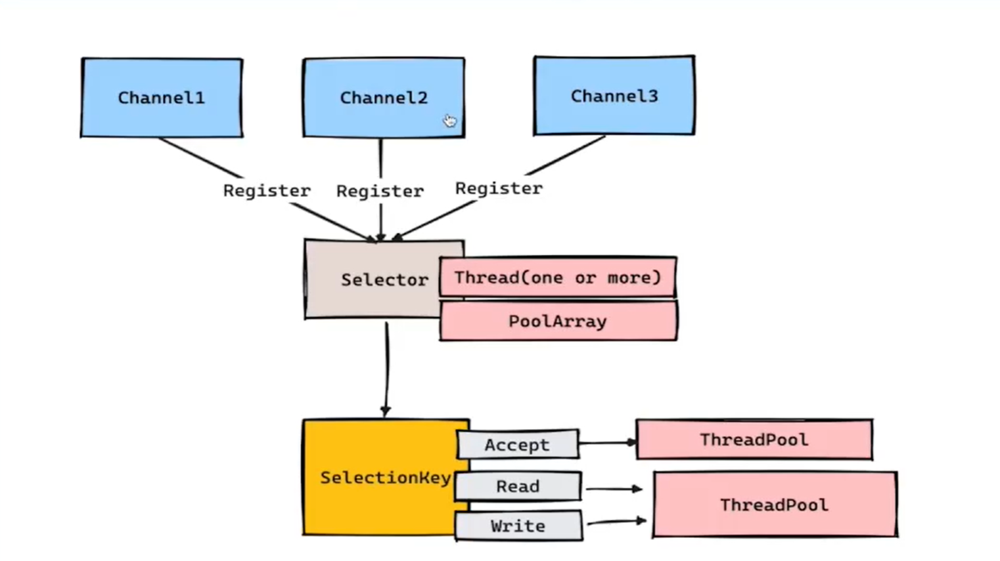
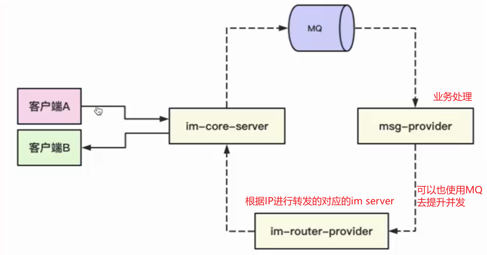

# start

[TOC]

# 1 IM系统的简介与实现思路

IM系统的业务本质就是客户端与客户端进行消息的实时传递，而其技术基础就是基于Socket连接的**实时数据读写**

IM全称是Instant Messaging，成为了社交/直播/电商等产品中非常流行的一类技术

## 1.1 推模型和拉模型

**起初IM使用的是拉模型：**

系统的实现.assets/image-20240211230524012.png)

> 但是拉模型存在客户端拉去的无效请求，会给服务端造成巨大压力

**所以我们推出了推模型：**

系统的实现.assets/image-20240211231023730.png)

考虑存储和内容校验后的推模型：

系统的实现.assets/image-20240211231158537.png)

## 1.2 在线消息推送和离线消息拉取

**基于推模式我们在线消息推送的模型1：广播模式：**

系统的实现.assets/image-20240211231531191.png)

> 但是广播消息会发送给所有的IM服务，但是我们某个用户肯定某次只想与其通信的另一个客户端之间的IM服务器通信，所以广播模式不很如意，若以我们推出了以下的路由模式，就是将广播换成了一个路由模块，可以定位到具体的IM机器

**基于推模式我们在线消息推送的模型2：路由模式：**

系统的实现.assets/image-20240211231604405.png)


**离线消息拉取：**

当我们离线时，不会有无效的拉去请求打在服务端上，所以上线时我们就可以使用拉模式

系统的实现.assets/image-20240211232405854.png)

## 1.3 用户心跳检测和在线回调通知

在上面1.2中我们判断是在线还是离线，就需要进行用户的在线检测，我们使用Redis来保存用户的心跳时间来进行在线离线的判断

系统的实现.assets/image-20240211233352583.png)

系统的实现.assets/image-20240211233545782.png)

## 1.4 发送消息的ACK确认机制

我们推送出去的消息怎么知道有没有正确接收呢？ACK确认机制

系统的实现.assets/image-20240211235041473.png)

怎么设计？

系统的实现.assets/image-20240211234846810.png)

使用RedisMap存储发送过的消息，若我们成功接收到了ACK，我们就将RedisMap中移除对应的消息，若没有收到ACK，那么在一定延迟后，我们再次去发送消息

# 2 应用选型和网络IO模型

## 2.1 WebSocket和HTTP长连接

**WebSocket**是一种**在单个TCP连接上进行全双工通信的协议**。 WebSocket使得客户端和服务器之间的数据交换变得更加简单，**允许服务端主动向客户端推送数据**，比较适合用于Web浏览器页面中


WebSocket请求的过程介绍：

- 首先，客户端发起http请求，经过3次握手后，建立起TCP连接；http请求里存放VebSocket支持的版本号等信息，如：Upgrade、Connection、WebSocket--Version等
- 然后，服务器收到客户端的握手请求后，同样采用HTTP协议回馈数据
- 最后，客户端收到连接成功的消息后，开始借助于TCP传输信道进行全双工通信


**HTTP长连接**是指原始的TCP连接，只不过在发送了数据之后不会直接关闭连接同通道，可以给后续的请求复用当前的连接通道，更加适合用于App场景中的长连接


**性能对比：**

100条连接，分别通过Tcp长连接和WebSocket去给同一台Netty服务器发送ping请求100w次，平均耗时评测结果如下：

Http长连接平均耗时2ms，而WebSocket平均耗时20ms

**结论：**

- 在高并发高吞吐的场景下，Tcp的性能会优于Ws
- 如果是开发Web浏览器页面，建议用Ws
- 如果是开发客户端App应用，建议走长连接

> 补充：基于Http实现的建立CS通信的还有SSE，但是SSE只支持服务端向客户端推送消息，比如站内信，但是SSE比WS更轻量级，开发成本更低，无需引入其他组件

## 2.2 网络的三种IO模型

### 1 BIO

系统的实现.assets/image-20240212223135963.png)

代码演示：

通过打断点执行，发现，服务端的accept以及read确实会阻塞，客户端没有响应操作之前，服务端的代码并不会向下执行

```java
public class BioServer {

    public static void main(String[] args) throws IOException {
        ServerSocket serverSocket = new ServerSocket();
        //绑定端口9090
        serverSocket.bind(new InetSocketAddress(9090));
        //阻塞等待客户端连接
        Socket socket = serverSocket.accept();
        while (true) {
            InputStream inputStream = socket.getInputStream();
            byte[] bytes = new byte[10];
            //阻塞调用read读取消息
            int len = inputStream.read(bytes);
            System.out.println("服务端接收到的数据是：" + new String(bytes, 0, len));
        }
    }
}
```

```java
public class BioClient {

    public static void main(String[] args) throws IOException, InterruptedException {
        //连接bio server
        Socket socket = new Socket();
        socket.connect(new InetSocketAddress(9090));
        OutputStream outputStream = socket.getOutputStream();
        //发送数据
        while (true) {
            outputStream.write("test".getBytes());
            outputStream.flush();
            System.out.println("发送数据");
            Thread.sleep(1000);
        }
    }
}
```

我们可以对BioServer进行一个优化，每次有新的请求进来，我们就异步的去接收消息：

```java
public class BioServer2 {
    
    private static final ExecutorService THREAD_POOL = new ThreadPoolExecutor(10, 10, 3, TimeUnit.MINUTES, new ArrayBlockingQueue<>(1000));

    public static void main(String[] args) throws IOException {
        ServerSocket serverSocket = new ServerSocket();
        //绑定端口9090
        serverSocket.bind(new InetSocketAddress(9090));
        while (true) {
            try {
                //阻塞等待客户端连接
                Socket socket = serverSocket.accept();
                THREAD_POOL.execute(() -> {
                    while (true) {
                        InputStream inputStream = socket.getInputStream();
                        byte[] bytes = new byte[10];
                        //阻塞调用read读取消息
                        int len = inputStream.read(bytes);
                        System.out.println("服务端接收到的数据是：" + new String(bytes, 0, len));
                    }
                });
            } catch (IOException e) {
                throw new RuntimeException(e);
            }
        }
    }
}
```

但是：每次来一个请求，就创建一个连接，假设我们极端情况下，一台服务器下维持了1000条连接，但是这一千条连接都是没有数据发送的状态，那么我们的服务端就必须要有1000条线程去进行维持，并且都是处于read的阻塞状态。这不就是白白的资源浪费么？

### 2 NIO

系统的实现.assets/image-20240212223245985.png)

系统的实现.assets/image-20240212223318879.png)

代码演示：

IO多路复用的**POLL**模型：

```java
public class NioSimpleServer {
    
    private static final List<SocketChannel> acceptSocketList = new ArrayList<>();

    public static void main(String[] args) throws IOException {
        ServerSocketChannel serverSocketChannel = ServerSocketChannel.open();
        serverSocketChannel.socket().bind(new InetSocketAddress(9090));
        serverSocketChannel.configureBlocking(false);
        new Thread(() -> {
            while (true) {
                for (SocketChannel socketChannel : acceptSocketList) {
                    ByteBuffer byteBuffer = ByteBuffer.allocate(10);
                    int len = 0;
                    try {
                        //在nio中，read也是非阻塞的，一直轮询看是否有数据
                        len = socketChannel.read(byteBuffer);
                    } catch (IOException e) {
                        throw new RuntimeException(e);
                    }
                    System.out.println("服务端接收到的数据：" + new String(byteBuffer.array(), 0, len));
                }
                try {
                    Thread.sleep(1000);
                } catch (InterruptedException e) {
                    throw new RuntimeException(e);
                }
            }
        }).start();
        
        while (true) {
            //nio的accept是非阻塞调用，一直轮询看是否有连接
            SocketChannel socketChannel = serverSocketChannel.accept();
            if(socketChannel != null) {
                System.out.println("连接建立");
                socketChannel.configureBlocking(false);
                acceptSocketList.add(socketChannel);
            }
        }
    }
}
```

上面代码只是IO多路复用中的SELECT/POLL模型，需要遍历所有socket来读取准备好的数据，并且不知道哪个socket的数据准备好了

**如果我们的acceptSocket的数量很多，那么无效的遍历操作将会很多，将会很耗费CPU资源**


IO多路复用的**EPOLL**模型：



系统的实现.assets/image-20240212234008379.png)

> 使用epoll_create创建一个事件循环和要监听的红黑树，然后使用epoll_ctl往监听的红黑树上添加clientSocket，当数据准备完成时，我们将准备好的socket添加到reply_list中，使用epoll_wait通知数据准备完成，不会和SELECT/POLL模型一样无限制轮询

```java
public class NIOSelectorServer {

    /*标识数字*/
    private int flag = 0;
    /*缓冲区大小*/
    private int BLOCK = 4096;
    /*接受数据缓冲区*/
    private ByteBuffer sendbuffer = ByteBuffer.allocate(BLOCK);
    /*发送数据缓冲区*/
    private ByteBuffer receivebuffer = ByteBuffer.allocate(BLOCK);
    private Selector selector;

    public NIOSelectorServer(int port) throws IOException {
        // 打开服务器套接字通道 
        ServerSocketChannel serverSocketChannel = ServerSocketChannel.open();
        // 服务器配置为非阻塞 
        serverSocketChannel.configureBlocking(false);
        // 检索与此通道关联的服务器套接字 
        ServerSocket serverSocket = serverSocketChannel.socket();
        // 进行服务的绑定 
        serverSocket.bind(new InetSocketAddress(port));
        // 通过open()方法找到Selector 
        selector = Selector.open();
        System.out.println(selector);
        // 注册到selector，等待连接 
        serverSocketChannel.register(selector, SelectionKey.OP_ACCEPT);
        System.out.println("Server Start----8888:");
    }


    // 监听 
    private void listen() throws IOException {
        while (true) {
            // 这里如果没有IO事件抵达 就会进入阻塞状态
            selector.select();
            System.out.println("select");
            // 返回此选择器的已选择键集。 
            Set<SelectionKey> selectionKeys = selector.selectedKeys();
            Iterator<SelectionKey> iterator = selectionKeys.iterator();
            while (iterator.hasNext()) {
                SelectionKey selectionKey = iterator.next();
                iterator.remove();
                handleKey(selectionKey);
            }
        }
    }

    // 处理请求 
    private void handleKey(SelectionKey selectionKey) throws IOException {
        // 接受请求 
        ServerSocketChannel server = null;
        SocketChannel client = null;
        String receiveText;
        String sendText;
        int count = 0;
        // 测试此键的通道是否已准备好接受新的套接字连接。 
        if (selectionKey.isAcceptable()) {
            // 返回为之创建此键的通道。 
            server = (ServerSocketChannel) selectionKey.channel();
            // 接受到此通道套接字的连接。 
            // 非阻塞模式这里不会阻塞
            client = server.accept();
            // 配置为非阻塞 
            client.configureBlocking(false);
            // 注册到selector，等待连接 
            client.register(selector, SelectionKey.OP_READ);
        } else if (selectionKey.isReadable()) {
            // 返回为之创建此键的通道。 
            client = (SocketChannel) selectionKey.channel();
            // 将缓冲区清空以备下次读取 
            receivebuffer.clear();
            // 读取服务器发送来的数据到缓冲区中 
            count = client.read(receivebuffer);
            if (count > 0) {
                receiveText = new String(receivebuffer.array(), 0, count);
                System.out.println("服务器端接受客户端数据--:" + receiveText);
                client.register(selector, SelectionKey.OP_WRITE);
            }
        } else if (selectionKey.isWritable()) {
            // 返回为之创建此键的通道。 
            client = (SocketChannel) selectionKey.channel();
            // 将缓冲区清空以备下次写入 
            sendbuffer.clear();
            sendText = "message from server--" + flag++;
            // 向缓冲区中输入数据 
            sendbuffer.put(sendText.getBytes());
            // 将缓冲区各标志复位,因为向里面put了数据标志被改变要想从中读取数据发向服务器,就要复位 
            sendbuffer.flip();
            // 输出到通道 
            client.write(sendbuffer);
            System.out.println("服务器端向客户端发送数据--：" + sendText);
            client.register(selector, SelectionKey.OP_READ);
        }
    }
    
    public static void main(String[] args) throws IOException {
        int port = 9090;
        NIOSelectorServer server = new NIOSelectorServer(port);
        server.listen();
    }
} 
```

### 3 AIO

系统的实现.assets/image-20240212223400185.png)

代码演示：

```java
package io.aio;

import java.io.IOException;
import java.net.InetSocketAddress;
import java.nio.ByteBuffer;
import java.nio.channels.AsynchronousServerSocketChannel;
import java.nio.channels.AsynchronousSocketChannel;
import java.nio.channels.CompletionHandler;
import java.nio.charset.Charset;
import java.util.concurrent.ExecutionException;
import java.util.concurrent.Future;
import java.util.concurrent.TimeUnit;
import java.util.concurrent.TimeoutException;

public class AIOServer {

    public final static int PORT = 9888;
    private AsynchronousServerSocketChannel server;

    public AIOServer() throws IOException {
        server = AsynchronousServerSocketChannel.open().bind(new InetSocketAddress(PORT));
    }

    /**
     * 不推荐使用future的方式去进行编程，这种方式去实现AIO其实本质和BIO没有太大的区别
     */
    public void startWithFuture() throws InterruptedException,
            ExecutionException, TimeoutException {
        while (true) {// 循环接收客户端请求
            Future<AsynchronousSocketChannel> future = server.accept();
            AsynchronousSocketChannel socket = future.get();// get() 是为了确保 accept 到一个连接
            handleWithFuture(socket);
        }
    }

    public void handleWithFuture(AsynchronousSocketChannel channel) throws InterruptedException, ExecutionException, TimeoutException {
        ByteBuffer readBuf = ByteBuffer.allocate(2);
        readBuf.clear();

        while (true) {// 一次可能读不完
            // get 是为了确保 read 完成，超时时间可以有效避免DOS攻击，如果客户端一直不发送数据，则进行超时处理
            Integer integer = channel.read(readBuf).get(10, TimeUnit.SECONDS);
            System.out.println("read: " + integer);
            if (integer == -1) {
                break;
            }
            readBuf.flip();
            System.out.println("received: " + Charset.forName("UTF-8").decode(readBuf));
            readBuf.clear();
        }
    }

    /**
     * 即提交一个 I/O 操作请求，并且指定一个 CompletionHandler。
     * 当异步 I/O 操作完成时，便发送一个通知，此时这个 CompletionHandler 对象的 completed 或者 failed 方法将会被调用。
     */
    public void startWithCompletionHandler() throws InterruptedException, ExecutionException, TimeoutException {
        server.accept(null,
                new CompletionHandler<AsynchronousSocketChannel, Object>() {
                    public void completed(AsynchronousSocketChannel result, Object attachment) {
                        server.accept(null, this);// 再此接收客户端连接
                        handleWithCompletionHandler(result);
                    }

                    @Override
                    public void failed(Throwable exc, Object attachment) {
                        exc.printStackTrace();
                    }
                });
    }

    public void handleWithCompletionHandler(final AsynchronousSocketChannel channel) {
        try {
            final ByteBuffer buffer = ByteBuffer.allocate(4);
            final long timeout = 10L;
            channel.read(buffer, timeout, TimeUnit.SECONDS, null, new CompletionHandler<Integer, Object>() {
                @Override
                public void completed(Integer result, Object attachment) {
                    System.out.println("read:" + result);
                    if (result == -1) {
                        try {
                            channel.close();
                        } catch (IOException e) {
                            e.printStackTrace();
                        }
                        return;
                    }
                    buffer.flip();
                    System.out.println("received message:" + Charset.forName("UTF-8").decode(buffer));
                    buffer.clear();
                    channel.read(buffer, timeout, TimeUnit.SECONDS, null, this);
                }

                @Override
                public void failed(Throwable exc, Object attachment) {
                    exc.printStackTrace();
                }
            });
        } catch (Exception e) {
            e.printStackTrace();
        }
    }

    public static void main(String args[]) throws Exception {
        // new AIOServer().startWithFuture();
        new AIOServer().startWithCompletionHandler();
        Thread.sleep(100000);
    }
}
```

```java
public class AIOClient {

    public static void main(String... args) throws Exception {
        AsynchronousSocketChannel client = AsynchronousSocketChannel.open();
        client.connect(new InetSocketAddress("localhost", 9888)).get();
        while (true) {
            client.write(ByteBuffer.wrap("123456789".getBytes()));
            Thread.sleep(1000);
        }
    }
}
```


**为什么Netty没有使用AIO而是采用NIO的思路去进行设计？**

- 不比nio快在Unix系统上
- 不支持数据报
- 不必要的线程模型（太多没什么用的抽象化）

总而言之，可以理解为，在Unix系统上AIO性能综合表现不如NIO好，所以Netty使用了NIO作为底层的核心。

# 3 IM系统的搭建与全链路的实现

IM系统全链路：


## 3.1 Netty核心server的搭建

### 1 基于Netty搭建IM系统基本骨架和编解码器

**新建qiyu-live-im-interface：**

```java
package org.qiyu.live.im.constants;

public class ImConstants {
    
    public static final short DEFAULT_MAGIC = 18673;
}
```

```java
package org.qiyu.live.im.constants;

public enum ImMsgCodeEnum {
    
    IM_LOGIN_MSG(1001, "登录im消息包"),
    IM_LOGOUT_MSG(1002, "登出im消息包"),
    IM_BIZ_MSG(1003, "常规业务消息包"),
    IM_HEARTBEAT_MSG(1004, "im服务心跳消息包");

    private int code;
    private String desc;

    ImMsgCodeEnum(int code, String desc) {
        this.code = code;
        this.desc = desc;
    }

    public int getCode() {
        return code;
    }

    public String getDesc() {
        return desc;
    }
}
```

**新建qiyu-live-im-core-server：**

```xml
<dependencies>
    <dependency>
        <groupId>org.springframework.boot</groupId>
        <artifactId>spring-boot-starter-web</artifactId>
        <exclusions>
            <exclusion>
                <artifactId>log4j-to-slf4j</artifactId>
                <groupId>org.apache.logging.log4j</groupId>
            </exclusion>
        </exclusions>
    </dependency>
    <dependency>
        <groupId>org.apache.dubbo</groupId>
        <artifactId>dubbo-spring-boot-starter</artifactId>
        <version>3.2.0-beta.3</version>
    </dependency>
    <dependency>
        <groupId>com.alibaba.cloud</groupId>
        <artifactId>spring-cloud-starter-alibaba-nacos-discovery</artifactId>
    </dependency>
    <dependency>
        <groupId>com.alibaba.cloud</groupId>
        <artifactId>spring-cloud-starter-alibaba-nacos-config</artifactId>
    </dependency>
    <!--在SpringBoot 2.4.x的版本之后，对于bootstrap.properties/bootstrap.yaml配置文件(我们合起来成为Bootstrap配置文件)的支持，需要导入该jar包-->
    <dependency>
        <groupId>org.springframework.cloud</groupId>
        <artifactId>spring-cloud-starter-bootstrap</artifactId>
        <version>3.0.2</version>
    </dependency>
    <!--Netty-->
    <dependency>
        <groupId>io.netty</groupId>
        <artifactId>netty-all</artifactId>
        <version>${netty-all.version}</version>
    </dependency>
    <dependency>
        <groupId>org.springframework.boot</groupId>
        <artifactId>spring-boot-starter-data-redis</artifactId>
        <exclusions>
            <exclusion>
                <groupId>io.lettuce</groupId>
                <artifactId>lettuce-core</artifactId>
            </exclusion>
        </exclusions>
    </dependency>
    <!--Netty依赖与lettuce冲突，换用jedis-->
    <dependency>
        <groupId>redis.clients</groupId>
        <artifactId>jedis</artifactId>
    </dependency>
    <dependency>
        <groupId>com.alibaba</groupId>
        <artifactId>fastjson</artifactId>
        <version>${alibaba-fastjson.version}</version>
    </dependency>
    <dependency>
        <groupId>org.slf4j</groupId>
        <artifactId>slf4j-api</artifactId>
    </dependency>
    
    <!--自定义-->
    <dependency>
        <groupId>org.hah</groupId>
        <artifactId>qiyu-live-im-interface</artifactId>
        <version>1.0-SNAPSHOT</version>
    </dependency>
    <dependency>
        <groupId>org.hah</groupId>
        <artifactId>qiyu-live-common-interface</artifactId>
        <version>1.0-SNAPSHOT</version>
    </dependency>
    <dependency>
        <groupId>org.hah</groupId>
        <artifactId>qiyu-live-framework-redis-starter</artifactId>
        <version>1.0-SNAPSHOT</version>
        <exclusions>
            <exclusion>
                <groupId>org.springframework.boot</groupId>
                <artifactId>spring-boot-starter-data-redis</artifactId>
            </exclusion>
        </exclusions>
    </dependency>
</dependencies>
```

复制logback-spring.xml到resources目录下去

```java
package org.qiyu.live.im.core.server.common;

import lombok.Data;
import org.qiyu.live.im.ImConstants;

import java.io.Serial;
import java.io.Serializable;

/**
 * Netty消息体
 */
@Data
public class ImMsg implements Serializable {
    @Serial
    private static final long serialVersionUID = -7007538930769644633L;
    //魔数：用于做基本校验
    private short magic;
    
    //用于记录body的长度
    private int len;
    
    //用于标识当前消息的作用，后序交给不同的handler去处理
    private int code;
    
    //存储消息体的内容，一般会按照字节数组的方式去存放
    private byte[] body;
    
    public static ImMsg build(int code, String data) {
        ImMsg imMsg = new ImMsg();
        imMsg.setMagic(ImConstants.DEFAULT_MAGIC);
        imMsg.setCode(code);
        imMsg.setBody(data.getBytes());
        imMsg.setLen(imMsg.getBody().length);
        return imMsg;
    }
}
```

```java
package org.qiyu.live.im.core.server.common;

import io.netty.buffer.ByteBuf;
import io.netty.channel.ChannelHandlerContext;
import io.netty.handler.codec.MessageToByteEncoder;

/**
 * 处理消息的编码过程
 */
public class ImMsgEncoder extends MessageToByteEncoder {

    @Override
    protected void encode(ChannelHandlerContext channelHandlerContext, Object msg, ByteBuf out) throws Exception {
        ImMsg imMsg = (ImMsg) msg;
        //按照ImMsg属性的类型顺序
        out.writeShort(imMsg.getMagic());
        out.writeInt(imMsg.getCode());
        out.writeInt(imMsg.getLen());
        out.writeBytes(imMsg.getBody());
        channelHandlerContext.writeAndFlush(out);
    }
}
```

```java
package org.qiyu.live.im.core.server.common;

import io.netty.buffer.ByteBuf;
import io.netty.channel.ChannelHandlerContext;
import io.netty.handler.codec.ByteToMessageDecoder;
import org.qiyu.live.im.ImConstants;

import java.util.List;

/**
 * 处理消息的解码过程
 */
public class ImMsgDecoder extends ByteToMessageDecoder {
    
    //ImMsg的最低基本字节数
    private final int BASE_LEN = 2 + 4 + 4;

    @Override
    protected void decode(ChannelHandlerContext channelHandlerContext, ByteBuf byteBuf, List<Object> out) throws Exception {
        //进行byteBuf内容的基本校验：长度校验 和 magic值校验
        if(byteBuf.readableBytes() >= BASE_LEN) {
            if(byteBuf.readShort() != ImConstants.DEFAULT_MAGIC) {
                channelHandlerContext.close();
                return;
            }
            int code = byteBuf.readInt();
            int len = byteBuf.readInt();
            //byte数组的字节数小于len，说明消息不完整
            if(byteBuf.readableBytes() < len) {
                channelHandlerContext.close();
                return;
            }
            byte[] body = new byte[len];
            byteBuf.readBytes(body);
            //将byteBuf转换为ImMsg对象
            ImMsg imMsg = new ImMsg();
            imMsg.setCode(code);
            imMsg.setLen(len);
            imMsg.setBody(body);
            imMsg.setMagic(ImConstants.DEFAULT_MAGIC);
            out.add(imMsg);
        }
    }
}
```

```java
package org.qiyu.live.im.core.server;

import io.netty.bootstrap.ServerBootstrap;
import io.netty.channel.Channel;
import io.netty.channel.ChannelFuture;
import io.netty.channel.ChannelInitializer;
import io.netty.channel.nio.NioEventLoopGroup;
import io.netty.channel.socket.nio.NioServerSocketChannel;
import org.qiyu.live.im.core.server.common.ImMsgDecoder;
import org.qiyu.live.im.core.server.common.ImMsgEncoder;
import org.qiyu.live.im.core.server.handler.ImServerCoreHandler;
import org.slf4j.Logger;
import org.slf4j.LoggerFactory;

/**
 * Netty启动类
 */
public class NettyImServerApplication {
    
    private static final Logger LOGGER = LoggerFactory.getLogger(NettyImServerApplication.class);
    
    //要监听的端口
    private int port;

    public int getPort() {
        return port;
    }

    public void setPort(int port) {
        this.port = port;
    }
    
    //基于Netty去启动一个java进程，绑定监听的端口
    public void startApplication(int port) throws InterruptedException {
        setPort(port);
        //处理accept事件
        NioEventLoopGroup bossGroup = new NioEventLoopGroup();
        //处理read&write事件
        NioEventLoopGroup workerGroup = new NioEventLoopGroup();
        ServerBootstrap bootstrap = new ServerBootstrap();
        bootstrap.group(bossGroup, workerGroup);
        bootstrap.channel(NioServerSocketChannel.class);
        //netty初始化相关的handler
        bootstrap.childHandler(new ChannelInitializer<>() {
            @Override
            protected void initChannel(Channel channel) throws Exception {
                //打印日志，方便观察
                LOGGER.info("初始化连接渠道");
                //设计消息体ImMsg
                //添加编解码器
                channel.pipeline().addLast(new ImMsgEncoder());
                channel.pipeline().addLast(new ImMsgDecoder());
                //设置这个netty处理handler
                channel.pipeline().addLast(new ImServerCoreHandler());
            }
        });
        //基于JVM的钩子函数去实现优雅关闭
        Runtime.getRuntime().addShutdownHook(new Thread(() -> {
            bossGroup.shutdownGracefully();
            workerGroup.shutdownGracefully();
        }));
        
        ChannelFuture channelFuture = bootstrap.bind(port).sync();
        LOGGER.info("Netty服务启动成功，监听端口为{}", getPort());
        //这里会阻塞主线程，实现服务长期开启的效果
        channelFuture.channel().closeFuture().sync();
    }

    public static void main(String[] args) throws InterruptedException {
        NettyImServerApplication nettyImServerApplication = new NettyImServerApplication();
        nettyImServerApplication.startApplication(9090);
    }
}
```

### 2 IM系统核心Handler的设计与实现

运用到的设计模式：

1. 工厂模式（简单工厂）
2. 单例模式（饿汉式：静态成员变量）
3. 策略模式

三种设计模式结合使用，环环相扣


```java
package org.qiyu.live.im.core.server.handler;

import io.netty.channel.ChannelHandlerContext;
import io.netty.channel.SimpleChannelInboundHandler;
import org.qiyu.live.im.core.server.common.ImMsg;
import org.qiyu.live.im.core.server.handler.impl.ImHandlerFactoryImpl;

public class ImServerCoreHandler extends SimpleChannelInboundHandler {
    
    private ImHandlerFactory imHandlerFactory = new ImHandlerFactoryImpl();
    
    @Override
    protected void channelRead0(ChannelHandlerContext channelHandlerContext, Object msg) throws Exception {
        if(!(msg instanceof ImMsg)) {
            throw new IllegalArgumentException("error msg, msg is :" + msg);
        }
        ImMsg imMsg = (ImMsg) msg;
        imHandlerFactory.doMsgHandler(channelHandlerContext, imMsg);
    }
}
```

> 上面这个类是核心handler类，实现了SimpleChannelInboundHandler，
>
> 因为我们要接收的消息体有四种：
>
> 1. 登录消息包：登录token验证，channel 和 userId 关联
> 2. 登出消息包：正常断开im连接时发送的
> 3. 业务消息包：最常用的消息类型，例如我们的im收发数据
> 4. 心跳消息包：定时给im发送心跳包
> 4. ACK消息包：来自客户端回应的ACK包（3.10再实现）
>
> 所以我们使用**策略模式**，来定义不同消息包的处理方式
>
> 然后我们使用**工厂模式**，来管理四种不同的策略，这里是简单工厂模式
>
> 然后在工厂的实现类中定义一个静态的map，里面根据code值放入不同的策略处理器，实现**单例模式**（类似Spring IOC）

抽象工厂和工厂实现类：

```java
package org.qiyu.live.im.core.server.handler;

import io.netty.channel.ChannelHandlerContext;
import org.qiyu.live.im.core.server.common.ImMsg;

/**
 * 简单工厂模式
 */
public interface ImHandlerFactory {
    /**
     * 按照ImMsg的code类型去处理对应的消息
     * @param ctx
     * @param imMsg
     */
    void doMsgHandler(ChannelHandlerContext ctx, ImMsg imMsg);
}
```

```java
package org.qiyu.live.im.core.server.handler.impl;

import io.netty.channel.ChannelHandlerContext;
import org.qiyu.live.im.core.server.common.ImMsg;
import org.qiyu.live.im.core.server.handler.ImHandlerFactory;
import org.qiyu.live.im.core.server.handler.SimpleHandler;
import org.qiyu.live.im.ImMsgCodeEnum;

import java.util.HashMap;
import java.util.Map;

public class ImHandlerFactoryImpl implements ImHandlerFactory {
    
    private static Map<Integer, SimpleHandler> simpleHandlerMap = new HashMap<>();
    
    static {
        //登录消息包：登录token验证，channel 和 userId 关联
        //登出消息包：正常断开im连接时发送的
        //业务消息包：最常用的消息类型，例如我们的im收发数据
        //心跳消息包：定时给im发送心跳包
        simpleHandlerMap.put(ImMsgCodeEnum.IM_LOGIN_MSG.getCode(), new LoginMsgHandler());
        simpleHandlerMap.put(ImMsgCodeEnum.IM_LOGOUT_MSG.getCode(), new LogoutMsgHandler());
        simpleHandlerMap.put(ImMsgCodeEnum.IM_BIZ_MSG.getCode(), new BizImMsgHandler());
        simpleHandlerMap.put(ImMsgCodeEnum.IM_HEARTBEAT_MSG.getCode(), new HeartBeatImMsgHandler());
    }

    @Override
    public void doMsgHandler(ChannelHandlerContext ctx, ImMsg imMsg) {
        SimpleHandler simpleHandler = simpleHandlerMap.get(imMsg.getCode());
        if(simpleHandler == null) {
            throw new IllegalArgumentException("msg code is error, code is :" + imMsg.getCode());
        }
        simpleHandler.handler(ctx, imMsg);
    }
}
```

策略模式接口和四个具体策略：（后面再对这些handler进行具体实现）

```java
package org.qiyu.live.im.core.server.handler;

import io.netty.channel.ChannelHandlerContext;
import org.qiyu.live.im.core.server.common.ImMsg;

/**
 * 处理消息的处理器接口（策略模式）
 */
public interface SimpleHandler {
    void handler(ChannelHandlerContext ctx, ImMsg imMsg);
}
```

```java
package org.qiyu.live.im.core.server.handler.impl;

import io.netty.channel.ChannelHandlerContext;
import org.qiyu.live.im.core.server.common.ImMsg;
import org.qiyu.live.im.core.server.handler.SimpleHandler;

/**
 * 登录消息处理器
 */
public class LoginMsgHandler implements SimpleHandler {
    @Override
    public void handler(ChannelHandlerContext ctx, ImMsg imMsg) {
        System.out.println("[login]:" + imMsg);
        ctx.writeAndFlush(imMsg);
    }
}
```

```java
package org.qiyu.live.im.core.server.handler.impl;

import io.netty.channel.ChannelHandlerContext;
import org.qiyu.live.im.core.server.common.ImMsg;
import org.qiyu.live.im.core.server.handler.SimpleHandler;

/**
 * 登出消息处理器
 */
public class LogoutMsgHandler implements SimpleHandler {
    @Override
    public void handler(ChannelHandlerContext ctx, ImMsg imMsg) {
        System.out.println("[logout]:" + imMsg);
        ctx.writeAndFlush(imMsg);
    }
}
```

```java
package org.qiyu.live.im.core.server.handler.impl;

import io.netty.channel.ChannelHandlerContext;
import org.qiyu.live.im.core.server.common.ImMsg;
import org.qiyu.live.im.core.server.handler.SimpleHandler;

/**
 * 业务消息处理器
 */
public class BizImMsgHandler implements SimpleHandler {
    @Override
    public void handler(ChannelHandlerContext ctx, ImMsg imMsg) {
        System.out.println("[bizImMsg]:" + imMsg);
        ctx.writeAndFlush(imMsg);
    }
}
```

```java
package org.qiyu.live.im.core.server.handler.impl;

import io.netty.channel.ChannelHandlerContext;
import org.qiyu.live.im.core.server.common.ImMsg;
import org.qiyu.live.im.core.server.handler.SimpleHandler;

/**
 * 心跳消息处理器
 */
public class HeartBeatImMsgHandler implements SimpleHandler {
    @Override
    public void handler(ChannelHandlerContext ctx, ImMsg imMsg) {
        System.out.println("[heartbear]:" + imMsg);
        ctx.writeAndFlush(imMsg);
    }
}
```

### 3 编写Netty客户端进行测试

先注释掉ImMsgEncoder中的channelHandlerContext.writeAndFlush(out);才进行测试，否则会报错

```java
/**
 * 处理消息的编码过程
 */
public class ImMsgEncoder extends MessageToByteEncoder {

    @Override
    protected void encode(ChannelHandlerContext channelHandlerContext, Object msg, ByteBuf out) throws Exception {
        ImMsg imMsg = (ImMsg) msg;
        //按照ImMsg属性的类型顺序
        out.writeShort(imMsg.getMagic());
        out.writeInt(imMsg.getCode());
        out.writeInt(imMsg.getLen());
        out.writeBytes(imMsg.getBody());
        // channelHandlerContext.writeAndFlush(out);
    }
}
```

编写在test包中：

Client的Handler

```java
package imClient;

import io.netty.channel.ChannelHandlerContext;
import io.netty.channel.ChannelInboundHandlerAdapter;
import org.qiyu.live.im.core.server.common.ImMsg;

public class ClientHandler extends ChannelInboundHandlerAdapter {

    @Override
    public void channelRead(ChannelHandlerContext ctx, Object msg) throws Exception {
        ImMsg imMsg = (ImMsg) msg;
        System.out.println("【服务端响应数据】 result is " + imMsg);
    }
}
```

```java
package imClient;

import io.netty.bootstrap.Bootstrap;
import io.netty.channel.Channel;
import io.netty.channel.ChannelFuture;
import io.netty.channel.ChannelInitializer;
import io.netty.channel.nio.NioEventLoopGroup;
import io.netty.channel.socket.nio.NioSocketChannel;
import org.qiyu.live.im.core.server.common.ImMsg;
import org.qiyu.live.im.core.server.common.ImMsgDecoder;
import org.qiyu.live.im.core.server.common.ImMsgEncoder;
import org.qiyu.live.im.ImMsgCodeEnum;

public class ImClientApplication {
    
    private void startConnection(String address, int port) throws InterruptedException {
        NioEventLoopGroup clientGroup = new NioEventLoopGroup();
        Bootstrap bootstrap = new Bootstrap();
        bootstrap.group(clientGroup);
        bootstrap.channel(NioSocketChannel.class);
        bootstrap.handler(new ChannelInitializer<>() {
            @Override
            protected void initChannel(Channel channel) throws Exception {
                System.out.println("初始化连接建立");
                channel.pipeline().addLast(new ImMsgEncoder());
                channel.pipeline().addLast(new ImMsgDecoder());
                channel.pipeline().addLast(new ClientHandler());
            }
        });
        ChannelFuture channelFuture = bootstrap.connect(address, port).sync();
        Channel channel = channelFuture.channel();
        for (int i = 0; i < 100; i++) {
            channel.writeAndFlush(ImMsg.build(ImMsgCodeEnum.IM_LOGIN_MSG.getCode(), "login"));
            channel.writeAndFlush(ImMsg.build(ImMsgCodeEnum.IM_LOGOUT_MSG.getCode(), "logout"));
            channel.writeAndFlush(ImMsg.build(ImMsgCodeEnum.IM_BIZ_MSG.getCode(), "biz"));
            channel.writeAndFlush(ImMsg.build(ImMsgCodeEnum.IM_HEARTBEAT_MSG.getCode(), "heart"));
            Thread.sleep(3000);
        }
    }

    public static void main(String[] args) throws InterruptedException {
        ImClientApplication imClientApplication = new ImClientApplication();
        imClientApplication.startConnection("localhost", 9090);
    }
}
```

先启动server，再启动client，若能成功接收消息则测试成功

## 3.2 IM系统的认证接入(登入登出Handler的具体实现)

### 1 将server转换为SpringBoot启动

修改NettyImServerApplication为NettyImServerStarter：

然后将port使用@Value注解从Nacos读取配置，删除get、set方法，将代码中的getPort()替换为port，将代码中的new ImServerCoreHandler()替换为注入的imServerCoreHandler，删除startApplication()方法的参数，删除main方法，添加afterPropertiesSet初始化方法

```java
package org.qiyu.live.im.core.server.starter;

import io.netty.channel.ChannelInitializer;
import jakarta.annotation.Resource;
import org.qiyu.live.im.core.server.common.ImMsgDecoder;
import org.qiyu.live.im.core.server.common.ImMsgEncoder;
import org.qiyu.live.im.core.server.handler.ImServerCoreHandler;
import org.springframework.beans.factory.InitializingBean;
import org.springframework.beans.factory.annotation.Value;
import org.springframework.cloud.context.config.annotation.RefreshScope;
import org.springframework.context.annotation.Configuration;
import io.netty.bootstrap.ServerBootstrap;
import io.netty.channel.Channel;
import io.netty.channel.ChannelFuture;
import io.netty.channel.nio.NioEventLoopGroup;
import io.netty.channel.socket.nio.NioServerSocketChannel;
import org.slf4j.Logger;
import org.slf4j.LoggerFactory;

@Configuration
@RefreshScope
public class NettyImServerStarter implements InitializingBean {

    private static final Logger LOGGER = LoggerFactory.getLogger(NettyImServerStarter.class);

    //要监听的端口
    @Value("${qiyu.im.port}")
    private int port;
    @Resource
    private ImServerCoreHandler imServerCoreHandler;

    //基于Netty去启动一个java进程，绑定监听的端口
    public void startApplication() throws InterruptedException {
        //处理accept事件
        NioEventLoopGroup bossGroup = new NioEventLoopGroup();
        //处理read&write事件
        NioEventLoopGroup workerGroup = new NioEventLoopGroup();
        ServerBootstrap bootstrap = new ServerBootstrap();
        bootstrap.group(bossGroup, workerGroup);
        bootstrap.channel(NioServerSocketChannel.class);
        //netty初始化相关的handler
        bootstrap.childHandler(new ChannelInitializer<>() {
            @Override
            protected void initChannel(Channel channel) throws Exception {
                //打印日志，方便观察
                LOGGER.info("初始化连接渠道");
                //设计消息体ImMsg
                //添加编解码器
                channel.pipeline().addLast(new ImMsgEncoder());
                channel.pipeline().addLast(new ImMsgDecoder());
                //设置这个netty处理handler
                channel.pipeline().addLast(imServerCoreHandler);
            }
        });
        //基于JVM的钩子函数去实现优雅关闭
        Runtime.getRuntime().addShutdownHook(new Thread(() -> {
            bossGroup.shutdownGracefully();
            workerGroup.shutdownGracefully();
        }));
        ChannelFuture channelFuture = bootstrap.bind(port).sync();
        LOGGER.info("Netty服务启动成功，监听端口为{}", port);
        //这里会阻塞主线程，实现服务长期开启的效果
        channelFuture.channel().closeFuture().sync();
    }

    @Override
    public void afterPropertiesSet() throws Exception {
        new Thread(new Runnable() {
            @Override
            public void run() {
                try {
                    startApplication();
                } catch (InterruptedException e) {
                    throw new RuntimeException(e);
                }
            }
        }, "qiyu-live-im-server").start();
    }
}
```

> **然后给四个具体的实现类Handler都加上@Component注解交给Spring管理**

ImServerCoreHandler将imHandlerFactory替换为Spring注入：

```java
package org.qiyu.live.im.core.server.handler;

import io.netty.channel.ChannelHandler;
import io.netty.channel.ChannelHandlerContext;
import io.netty.channel.SimpleChannelInboundHandler;
import org.qiyu.live.im.core.server.common.ImMsg;
import org.qiyu.live.im.core.server.handler.impl.ImHandlerFactoryImpl;
import org.springframework.stereotype.Component;

@Component
@ChannelHandler.Sharable
public class ImServerCoreHandler extends SimpleChannelInboundHandler {
    
    private ImHandlerFactory imHandlerFactory = new ImHandlerFactoryImpl();

    @Override
    protected void channelRead0(ChannelHandlerContext channelHandlerContext, Object msg) throws Exception {
        if(!(msg instanceof ImMsg)) {
            throw new IllegalArgumentException("error msg, msg is :" + msg);
        }
        ImMsg imMsg = (ImMsg) msg;
        imHandlerFactory.doMsgHandler(channelHandlerContext, imMsg);
    }   
}
```

ImHandlerFactoryImpl将自己实现的单例模式替换为由Spring进行管理的单例：

```java
package org.qiyu.live.im.core.server.handler.impl;

import io.netty.channel.ChannelHandlerContext;
import jakarta.annotation.Resource;
import org.qiyu.live.im.constants.ImMsgCodeEnum;
import org.qiyu.live.im.core.server.common.ImMsg;
import org.qiyu.live.im.core.server.handler.ImHandlerFactory;
import org.qiyu.live.im.core.server.handler.SimpleHandler;
import org.springframework.beans.factory.InitializingBean;
import org.springframework.context.ApplicationContext;
import org.springframework.stereotype.Component;

import java.util.HashMap;
import java.util.Map;

@Component
public class ImHandlerFactoryImpl implements ImHandlerFactory, InitializingBean {

    private static Map<Integer, SimpleHandler> simpleHandlerMap = new HashMap<>();

    @Resource
    private ApplicationContext applicationContext;

    @Override
    public void afterPropertiesSet() throws Exception {
        //登录消息包：登录token验证，channel 和 userId 关联
        //登出消息包：正常断开im连接时发送的
        //业务消息包：最常用的消息类型，例如我们的im收发数据
        //心跳消息包：定时给im发送心跳包
        simpleHandlerMap.put(ImMsgCodeEnum.IM_LOGIN_MSG.getCode(), applicationContext.getBean(LoginMsgHandler.class));
        simpleHandlerMap.put(ImMsgCodeEnum.IM_LOGOUT_MSG.getCode(), applicationContext.getBean(LogoutMsgHandler.class));
        simpleHandlerMap.put(ImMsgCodeEnum.IM_BIZ_MSG.getCode(), applicationContext.getBean(BizImMsgHandler.class));
        simpleHandlerMap.put(ImMsgCodeEnum.IM_HEARTBEAT_MSG.getCode(), applicationContext.getBean(HeartBeatImMsgHandler.class));
    }

    @Override
    public void doMsgHandler(ChannelHandlerContext ctx, ImMsg imMsg) {
        SimpleHandler simpleHandler = simpleHandlerMap.get(imMsg.getCode());
        if (simpleHandler == null) {
            throw new IllegalArgumentException("msg code is error, code is :" + imMsg.getCode());
        }
        simpleHandler.handler(ctx, imMsg);
    }
}
```

启动类：

```java
package org.qiyu.live.im.core.server;

import org.springframework.boot.SpringApplication;
import org.springframework.boot.WebApplicationType;
import org.springframework.boot.autoconfigure.SpringBootApplication;
import org.springframework.cloud.client.discovery.EnableDiscoveryClient;

import java.util.concurrent.CountDownLatch;

/**
 * netty启动类
 */
@SpringBootApplication
@EnableDiscoveryClient
public class ImCoreServerApplication {

    public static void main(String[] args) throws InterruptedException {
        CountDownLatch countDownLatch = new CountDownLatch(1);
        SpringApplication springApplication = new SpringApplication(ImCoreServerApplication.class);
        springApplication.setWebApplicationType(WebApplicationType.NONE);
        springApplication.run(args);
        countDownLatch.await();
    }
}
```

bootstrap.yml：

```yaml
spring:
  application:
    name: qiyu-live-im-core-server
  cloud:
    nacos:
      username: qiyu
      password: qiyu
      discovery:
        server-addr: localhost:8848
        namespace: 1bc15ccf-f070-482e-8325-c3c46e427aaf
      config:
        import-check:
          enabled: false
        # 当前服务启动后去nacos中读取配置文件的后缀
        file-extension: yml
        # 读取配置的nacos地址
        server-addr: localhost:8848
        # 读取配置的nacos的名空间
        namespace: 1bc15ccf-f070-482e-8325-c3c46e427aaf
        group: DEFAULT_GROUP
  config:
    import:
      - optional:nacos:${spring.application.name}.yml
```

在nacos创建qiyu-live-im-core-server.yml：

```yaml
spring:
  application:
    name: qiyu-live-im-core-server
  data:
    redis:
      port: 6379
      host: localhost
      password: 123456
      lettuce:
        pool:
          min-idle: 10
          max-active: 100
          max-idle: 10

dubbo:
  application:
    name: ${spring.application.name}
    qos-enable: false
  registry:
    address: nacos://localhost:8848?namespace=1bc15ccf-f070-482e-8325-c3c46e427aaf&&username=qiyu&&password=qiyu

qiyu:
  im:
    port: 8085
```

启动服务，看是否能正常启动Netty

### 2 编写IM的认证模块

**qiyu-live-im-interface：**

```java
package org.qiyu.live.im.constants;

public enum AppIdEnum {
    QIYU_LIVE_BIZ(10001, "旗鱼直播业务");

    private int code;
    private String desc;

    AppIdEnum(int code, String desc) {
        this.code = code;
        this.desc = desc;
    }

    public int getCode() {
        return code;
    }

    public String getDesc() {
        return desc;
    }
}
```

```java
package org.qiyu.live.im.dto;

import lombok.Data;

import java.io.Serial;
import java.io.Serializable;

/**
 * ImMsg内的body属性的消息体
 */
@Data
public class ImMsgBody implements Serializable {
    @Serial
    private static final long serialVersionUID = -7657602083071950966L;
    /**
     * 接入im服务的各个业务线id
     */
    private int appId;
    /**
     * 用户id
     */
    private Long userId;
    /**
     * 从业务服务中获取，用于在im服务建立连接时使用，从中获取userId与userId进行比较
     */
    private String token;
    /**
     * 业务类型标识
     */
    private int bizCode;
    /**
     * 和业务服务进行消息传递
     */
    private String data;
}
```

```java
package org.qiyu.live.im.interfaces;

public interface ImTokenRpc {

    /**
     * 创建用户登录im服务的token
     */
    String createImLoginToken(Long userId, int appId);

    /**
     * 根据token检索用户id
     */
    Long getUserIdByToken(String token);
}
```

**qiyu-live-framework-redis-starter：**

```java
package org.qiyu.live.framework.redis.starter.key;

import org.springframework.context.annotation.Conditional;
import org.springframework.context.annotation.Configuration;


@Configuration
@Conditional(RedisKeyLoadMatch.class)
public class ImProviderCacheKeyBuilder extends RedisKeyBuilder {

    private static String IM_LOGIN_TOKEN = "imLoginToken";

    public String buildImLoginTokenKey(String token) {
        return super.getPrefix() + IM_LOGIN_TOKEN + super.getSplitItem() + token;
    }

}
```

在META-INF/spring/org.springframework.boot.autoconfigure.AutoConfiguration.imports中粘贴上面新builder的路径

**新建qiyu-live-im-provider：**

```xml
<dependency>
    <groupId>org.apache.dubbo</groupId>
    <artifactId>dubbo-spring-boot-starter</artifactId>
    <version>3.2.0-beta.3</version>
</dependency>
<dependency>
    <groupId>com.alibaba.cloud</groupId>
    <artifactId>spring-cloud-starter-alibaba-nacos-discovery</artifactId>
</dependency>
<dependency>
    <groupId>com.alibaba.cloud</groupId>
    <artifactId>spring-cloud-starter-alibaba-nacos-config</artifactId>
</dependency>
<!--在SpringBoot 2.4.x的版本之后，对于bootstrap.properties/bootstrap.yaml配置文件(我们合起来成为Bootstrap配置文件)的支持，需要导入该jar包-->
<dependency>
    <groupId>org.springframework.cloud</groupId>
    <artifactId>spring-cloud-starter-bootstrap</artifactId>
    <version>3.0.2</version>
</dependency>

<dependency>
    <groupId>org.springframework.boot</groupId>
    <artifactId>spring-boot-starter-web</artifactId>
    <exclusions>
        <exclusion>
            <artifactId>log4j-to-slf4j</artifactId>
            <groupId>org.apache.logging.log4j</groupId>
        </exclusion>
    </exclusions>
</dependency>

<!--自定义-->
<dependency>
    <groupId>org.hah</groupId>
    <artifactId>qiyu-live-im-interface</artifactId>
    <version>1.0-SNAPSHOT</version>
</dependency>
<dependency>
    <groupId>org.hah</groupId>
    <artifactId>qiyu-live-common-interface</artifactId>
    <version>1.0-SNAPSHOT</version>
</dependency>
<dependency>
    <groupId>org.hah</groupId>
    <artifactId>qiyu-live-framework-redis-starter</artifactId>
    <version>1.0-SNAPSHOT</version>
</dependency>
```

bootstrap.yml：

```yaml
spring:
  application:
    name: qiyu-live-im-provider
  cloud:
    nacos:
      username: qiyu
      password: qiyu
      discovery:
        server-addr: localhost:8848
        namespace: 1bc15ccf-f070-482e-8325-c3c46e427aaf
      config:
        import-check:
          enabled: false
        # 当前服务启动后去nacos中读取配置文件的后缀
        file-extension: yml
        # 读取配置的nacos地址
        server-addr: localhost:8848
        # 读取配置的nacos的名空间
        namespace: 1bc15ccf-f070-482e-8325-c3c46e427aaf
        group: DEFAULT_GROUP
  config:
    import:
      - optional:nacos:${spring.application.name}.yml
```

在nacos创建qiyu-live-im-provider.yml：

```yaml
spring:
  application:
    name: qiyu-live-im-provider
  data:
    redis:
      port: 6379
      host: localhost
      password: 123456
      lettuce:
        pool:
          min-idle: 10
          max-active: 100
          max-idle: 10

dubbo:
  application:
    name: ${spring.application.name}
  registry:
    address: nacos://localhost:8848?namespace=1bc15ccf-f070-482e-8325-c3c46e427aaf&&username=qiyu&&password=qiyu
  protocol:
    name: dubbo
    port: 9093
    threadpool: fixed
    dispatcher: execution
    threads: 500
    accepts: 500
```

复制logback-spring.xml

```java
package org.qiyu.live.im.provider.service;

public interface ImTokenService {

    /**
     * 创建用户登录im服务的token
     */
    String createImLoginToken(Long userId, int appId);

    /**
     * 根据token检索用户id
     */
    Long getUserIdByToken(String token);
}
```

```java
package org.qiyu.live.im.provider.service.impl;

import jakarta.annotation.Resource;
import org.qiyu.live.framework.redis.starter.key.ImProviderCacheKeyBuilder;
import org.qiyu.live.im.provider.service.ImTokenService;
import org.springframework.data.redis.core.RedisTemplate;
import org.springframework.stereotype.Service;

import java.util.UUID;
import java.util.concurrent.TimeUnit;

@Service
public class ImTokenServiceImpl implements ImTokenService {

    @Resource
    private RedisTemplate<String, Object> redisTemplate;
    @Resource
    private ImProviderCacheKeyBuilder imProviderCacheKeyBuilder;

    @Override
    public String createImLoginToken(Long userId, int appId) {
        String token = UUID.randomUUID() + "%" + appId;
        redisTemplate.opsForValue().set(imProviderCacheKeyBuilder.buildImLoginTokenKey(token), userId, 5L, TimeUnit.MINUTES);
        return token;
    }

    @Override
    public Long getUserIdByToken(String token) {
        Object userId = redisTemplate.opsForValue().get(imProviderCacheKeyBuilder.buildImLoginTokenKey(token));
        return userId == null ? null : Long.valueOf((Integer) userId);
    }
}
```

```java
package org.qiyu.live.im.provider.rpc;

import jakarta.annotation.Resource;
import org.apache.dubbo.config.annotation.DubboService;
import org.qiyu.live.im.interfaces.ImTokenRpc;
import org.qiyu.live.im.provider.service.ImTokenService;

@DubboService
public class ImTokenRpcImpl implements ImTokenRpc {
    
    @Resource
    private ImTokenService imTokenService;
    
    @Override
    public String createImLoginToken(Long userId, int appId) {
        return imTokenService.createImLoginToken(userId, appId);
    }

    @Override
    public Long getUserIdByToken(String token) {
        return imTokenService.getUserIdByToken(token);
    }
}
```

```java
package org.qiyu.live.im.provider;

import jakarta.annotation.Resource;
import org.apache.dubbo.config.spring.context.annotation.EnableDubbo;
import org.qiyu.live.im.constants.AppIdEnum;
import org.qiyu.live.im.provider.service.ImTokenService;
import org.springframework.boot.CommandLineRunner;
import org.springframework.boot.SpringApplication;
import org.springframework.boot.WebApplicationType;
import org.springframework.boot.autoconfigure.SpringBootApplication;
import org.springframework.cloud.client.discovery.EnableDiscoveryClient;

import java.util.concurrent.CountDownLatch;

@SpringBootApplication
@EnableDubbo
@EnableDiscoveryClient
public class ImProviderApplication implements CommandLineRunner {

    public static void main(String[] args) throws InterruptedException {
        CountDownLatch countDownLatch = new CountDownLatch(1);
        SpringApplication springApplication = new SpringApplication(ImProviderApplication.class);
        springApplication.setWebApplicationType(WebApplicationType.NONE);
        springApplication.run(args);
        countDownLatch.await();
    }
    
    @Resource
    private ImTokenService imTokenService;

    @Override
    public void run(String... args) throws Exception {
        Long userId = 11113L;
        String token = imTokenService.createImLoginToken(userId, AppIdEnum.QIYU_LIVE_BIZ.getCode());
        System.out.println("token is " + token);
        Long userIdByToken = imTokenService.getUserIdByToken(token);
        System.out.println("userIdResult is " + userIdByToken);
    }
}
```

### 3 登入登出Handler具体实现

**qiyu-live-im-core-server：**

```java
package org.qiyu.live.im.core.server.common;

import io.netty.channel.ChannelHandlerContext;

import java.util.HashMap;
import java.util.Map;

/**
 * 封装ChannelHandlerContext的缓存，将已建立连接的ChannelHandlerContext放到这里
 */
public class ChannelHandlerContextCache {
    
    private static Map<Long, ChannelHandlerContext> channelHandlerContextMap = new HashMap<>();
    
    public static ChannelHandlerContext get(Long userId) {
        return channelHandlerContextMap.get(userId);
    }
    
    public static void put(Long userId, ChannelHandlerContext channelHandlerContext) {
        channelHandlerContextMap.put(userId, channelHandlerContext);
    }
    
    public static void remove(Long userId) {
        channelHandlerContextMap.remove(userId);
    }
}
```

```java
package org.qiyu.live.im.core.server.common;

import io.netty.util.AttributeKey;

/**
 * 保存Netty的域信息（看作SpringBoot的RequestAttribute）
 */
public class ImContextAttr {

    /**
     * 绑定用户id
     */
    public static AttributeKey<Long> USER_ID = AttributeKey.valueOf("userId");

    /**
     * 绑定appId
     */
    public static AttributeKey<Integer> APP_ID = AttributeKey.valueOf("appId");
}
```

```java
package org.qiyu.live.im.core.server.common;

import io.netty.channel.ChannelHandlerContext;

/**
 * 封装 获取/存入 netty域信息的工具类
 */
public class ImContextUtils {
    
    public static Long getUserId(ChannelHandlerContext ctx) {
        return ctx.attr(ImContextAttr.USER_ID).get();
    }
    
    public static void setUserId(ChannelHandlerContext ctx, Long userId) {
        ctx.attr(ImContextAttr.USER_ID).set(userId);
    }
    
    public static void removeUserId(ChannelHandlerContext ctx) {
        ctx.attr(ImContextAttr.USER_ID).remove();
    }
    
    public static Integer getAppId(ChannelHandlerContext ctx) {
        return ctx.attr(ImContextAttr.APP_ID).get();
    }
    
    public static void setAppId(ChannelHandlerContext ctx, Integer appId) {
        ctx.attr(ImContextAttr.APP_ID).set(appId);
    }

    public static void removeAppId(ChannelHandlerContext ctx) {
        ctx.attr(ImContextAttr.APP_ID).remove();
    }
}
```


**LoginMsgHandler具体实现：**

```java
package org.qiyu.live.im.core.server.handler.impl;

import com.alibaba.fastjson.JSON;
import io.micrometer.common.util.StringUtils;
import io.netty.channel.ChannelHandlerContext;
import org.apache.dubbo.config.annotation.DubboReference;
import org.qiyu.live.im.constants.AppIdEnum;
import org.qiyu.live.im.constants.ImMsgCodeEnum;
import org.qiyu.live.im.core.server.common.ChannelHandlerContextCache;
import org.qiyu.live.im.core.server.common.ImContextUtils;
import org.qiyu.live.im.core.server.common.ImMsg;
import org.qiyu.live.im.core.server.handler.SimpleHandler;
import org.qiyu.live.im.dto.ImMsgBody;
import org.qiyu.live.im.interfaces.ImTokenRpc;
import org.slf4j.Logger;
import org.slf4j.LoggerFactory;
import org.springframework.stereotype.Component;

/**
 * 登录消息处理器
 */
@Component
public class LoginMsgHandler implements SimpleHandler {

    private static final Logger LOGGER = LoggerFactory.getLogger(LoginMsgHandler.class);

    @DubboReference
    private ImTokenRpc imTokenRpc;

    /**
     * 想要建立连接的话，我们需要进行一系列的参数校验，
     * 然后参数无误后，验证存储的userId和消息中的userId是否相同，相同才允许建立连接
     */
    @Override
    public void handler(ChannelHandlerContext ctx, ImMsg imMsg) {
        // 防止重复请求：login允许连接才放如userId，若已经允许连接就不再接收login请求包
        if (ImContextUtils.getUserId(ctx) != null) {
            return;
        }
        byte[] body = imMsg.getBody();
        if (body == null || body.length == 0) {
            ctx.close();
            LOGGER.error("body error, imMsg is {}", imMsg);
            throw new IllegalArgumentException("body error");
        }
        ImMsgBody imMsgBody = JSON.parseObject(new String(body), ImMsgBody.class);
        String token = imMsgBody.getToken();
        Long userIdFromMsg = imMsgBody.getUserId();
        Integer appId = imMsgBody.getAppId();
        if (StringUtils.isEmpty(token) || userIdFromMsg < 10000 || appId < 10000) {
            ctx.close();
            LOGGER.error("param error, imMsg is {}", imMsg);
            throw new IllegalArgumentException("param error");
        }
        Long userId = imTokenRpc.getUserIdByToken(token);
        // 从RPC获取的userId和传递过来的userId相等，则没出现差错，允许建立连接
        if (userId != null && userId.equals(userIdFromMsg)) {
            // 按照userId保存好相关的channel信息
            ChannelHandlerContextCache.put(userId, ctx);
            // 将userId保存到netty域信息中，用于正常/非正常logout的处理
            ImContextUtils.setUserId(ctx, userId);
            ImContextUtils.setAppId(ctx, appId);
            // 将im消息回写给客户端
            ImMsgBody respBody = new ImMsgBody();
            respBody.setAppId(AppIdEnum.QIYU_LIVE_BIZ.getCode());
            respBody.setUserId(userId);
            respBody.setData("true");
            ImMsg respMsg = ImMsg.build(ImMsgCodeEnum.IM_LOGIN_MSG.getCode(), JSON.toJSONString(respBody));
            LOGGER.info("[LoginMsgHandler] login success, userId is {}, appId is {}", userId, appId);
            ctx.writeAndFlush(respMsg);
            return;
        }
        // 不允许建立连接
        ctx.close();
        LOGGER.error("token error, imMsg is {}", imMsg);
        throw new IllegalArgumentException("token error");
    }
}
```

**LogoutMsgHandler具体实现：**

```java
package org.qiyu.live.im.core.server.handler.impl;

import com.alibaba.fastjson.JSON;
import io.netty.channel.ChannelHandlerContext;
import org.qiyu.live.im.constants.ImMsgCodeEnum;
import org.qiyu.live.im.core.server.common.ChannelHandlerContextCache;
import org.qiyu.live.im.core.server.common.ImContextUtils;
import org.qiyu.live.im.core.server.common.ImMsg;
import org.qiyu.live.im.core.server.handler.SimpleHandler;
import org.qiyu.live.im.dto.ImMsgBody;
import org.slf4j.Logger;
import org.slf4j.LoggerFactory;
import org.springframework.stereotype.Component;

/**
 * 登出消息处理器
 */
@Component
public class LogoutMsgHandler implements SimpleHandler {

    private static final Logger LOGGER = LoggerFactory.getLogger(LogoutMsgHandler.class);
    
    @Override
    public void handler(ChannelHandlerContext ctx, ImMsg imMsg) {
        Long userId = ImContextUtils.getUserId(ctx);
        Integer appId = ImContextUtils.getAppId(ctx);
        if(userId == null || appId == null){
            LOGGER.error("attr error, imMsg is {}", imMsg);
            //有可能是错误的消息包导致，直接放弃连接
            ctx.close();
            throw new IllegalArgumentException("attr error");
        }
        //将IM消息回写给客户端
        ImMsgBody respBody = new ImMsgBody();
        respBody.setUserId(userId);
        respBody.setAppId(appId);
        respBody.setData("true");
        ctx.writeAndFlush(ImMsg.build(ImMsgCodeEnum.IM_LOGOUT_MSG.getCode(), JSON.toJSONString(respBody)));
        LOGGER.info("[LogoutMsgHandler] logout success, userId is {}, appId is {}", userId, appId);
        //理想情况下：客户端短线的时候发送短线消息包
        ChannelHandlerContextCache.remove(userId);
        ImContextUtils.removeUserId(ctx);
        ImContextUtils.removeAppId(ctx);
        ctx.close();
    }
}
```

ImServerCoreHandler新重写一个方法：

```java
@Component
public class ImServerCoreHandler extends SimpleChannelInboundHandler {
    ...

    /**
     * 客户端正常或意外掉线，都会触发这里
     * @param ctx
     * @throws Exception
     */
    @Override
    public void channelInactive(ChannelHandlerContext ctx) throws Exception {
        Long userId = ctx.attr(ImContextAttr.USER_ID).get();
        hannelHandlerContextCache.remove(userId);
    }
}
```

**登入功能测试：**

测试也改由SpringBoot启动

qiyu-live-im-core-server的test包下：

```java
package imClient.handler;

import com.alibaba.fastjson.JSON;
import imClient.ClientHandler;
import io.netty.bootstrap.Bootstrap;
import io.netty.channel.Channel;
import io.netty.channel.ChannelFuture;
import io.netty.channel.ChannelInitializer;
import io.netty.channel.nio.NioEventLoopGroup;
import io.netty.channel.socket.nio.NioSocketChannel;
import org.apache.dubbo.config.annotation.DubboReference;
import org.qiyu.live.im.constants.AppIdEnum;
import org.qiyu.live.im.constants.ImMsgCodeEnum;
import org.qiyu.live.im.core.server.common.ImMsg;
import org.qiyu.live.im.core.server.common.ImMsgDecoder;
import org.qiyu.live.im.core.server.common.ImMsgEncoder;
import org.qiyu.live.im.dto.ImMsgBody;
import org.qiyu.live.im.interfaces.ImTokenRpc;
import org.springframework.beans.factory.InitializingBean;
import org.springframework.stereotype.Service;

@Service
public class ImClientHandler implements InitializingBean {
    
    @DubboReference
    private ImTokenRpc imTokenRpc;
    
    @Override
    public void afterPropertiesSet() throws Exception {
        new Thread(new Runnable() {
            @Override
            public void run() {
                NioEventLoopGroup clientGroup = new NioEventLoopGroup();
                Bootstrap bootstrap = new Bootstrap();
                bootstrap.group(clientGroup);
                bootstrap.channel(NioSocketChannel.class);
                bootstrap.handler(new ChannelInitializer<>() {
                    @Override
                    protected void initChannel(Channel channel) throws Exception {
                        System.out.println("初始化连接建立");
                        channel.pipeline().addLast(new ImMsgEncoder());
                        channel.pipeline().addLast(new ImMsgDecoder());
                        channel.pipeline().addLast(new ClientHandler());
                    }
                });
                ChannelFuture channelFuture = null;
                try {
                    channelFuture = bootstrap.connect("localhost", 8085).sync();
                } catch (InterruptedException e) {
                    throw new RuntimeException(e);
                }
                Long userId = 11113L;
                Channel channel = channelFuture.channel();
                for (int i = 0; i < 100; i++) {
                    String token = imTokenRpc.createImLoginToken(userId, AppIdEnum.QIYU_LIVE_BIZ.getCode());
                    ImMsgBody imMsgBody = new ImMsgBody();
                    imMsgBody.setUserId(userId);
                    imMsgBody.setAppId(AppIdEnum.QIYU_LIVE_BIZ.getCode());
                    imMsgBody.setToken(token);
                    channel.writeAndFlush(ImMsg.build(ImMsgCodeEnum.IM_LOGIN_MSG.getCode(), JSON.toJSONString(imMsgBody)));
                    try {
                        Thread.sleep(3000);
                    } catch (InterruptedException e) {
                        throw new RuntimeException(e);
                    }
                }
            }
        }).start();
    }
}
```

```java
package imClient;

import org.springframework.boot.SpringApplication;
import org.springframework.boot.WebApplicationType;
import org.springframework.boot.autoconfigure.SpringBootApplication;
import org.springframework.cloud.client.discovery.EnableDiscoveryClient;

@SpringBootApplication
@EnableDiscoveryClient
public class ImClientApplication {

    public static void main(String[] args) {
        SpringApplication springApplication = new SpringApplication(ImClientApplication.class);
        springApplication.setWebApplicationType(WebApplicationType.NONE);
        springApplication.run(args);
    }
}
```

## 3.3 心跳包功能实现

**qiyu-live-framework-redis-starter：**

```java
package org.qiyu.live.framework.redis.starter.key;

import org.springframework.context.annotation.Conditional;
import org.springframework.context.annotation.Configuration;

@Configuration
@Conditional(RedisKeyLoadMatch.class)
public class ImCoreServerProviderCacheKeyBuilder extends RedisKeyBuilder {

    private static String IM_ONLINE_ZSET = "imOnlineZset";
    private static String IM_ACK_MAP = "imAckMap";

    public String buildImAckMapKey(Long userId,Integer appId) {
        return super.getPrefix() + IM_ACK_MAP + super.getSplitItem() + appId + super.getSplitItem() + userId % 100;
    }

    /**
     * 按照用户id取模10000，得出具体缓存所在的key
     *
     * @param userId
     * @return
     */
    public String buildImLoginTokenKey(Long userId, Integer appId) {
        return super.getPrefix() + IM_ONLINE_ZSET + super.getSplitItem() + appId + super.getSplitItem() + userId % 10000;
    }

}
```

在META-INF/spring/org.springframework.boot.autoconfigure.AutoConfiguration.imports中粘贴上面新builder的路径

**qiyu-live-im-interface：**

```java
package org.qiyu.live.im.constants;

public class ImConstants {
    
    public static final short DEFAULT_MAGIC = 18673;

    /**
     * 发送心跳包的默认间隔时间
     */
    public static final int DEFAULT_HEART_BEAT_GAP = 30;
}
```


**qiyu-live-im-core-server：**

**HeartBeatImMsgHandler的具体实现：**

```java
package org.qiyu.live.im.core.server.handler.impl;

import com.alibaba.fastjson.JSON;
import io.netty.channel.ChannelHandlerContext;
import jakarta.annotation.Resource;
import org.qiyu.live.framework.redis.starter.key.ImCoreServerProviderCacheKeyBuilder;
import org.qiyu.live.im.constants.ImConstants;
import org.qiyu.live.im.constants.ImMsgCodeEnum;
import org.qiyu.live.im.core.server.common.ImContextUtils;
import org.qiyu.live.im.core.server.common.ImMsg;
import org.qiyu.live.im.core.server.handler.SimpleHandler;
import org.qiyu.live.im.dto.ImMsgBody;
import org.slf4j.Logger;
import org.slf4j.LoggerFactory;
import org.springframework.data.redis.core.RedisTemplate;
import org.springframework.stereotype.Component;

import java.util.concurrent.TimeUnit;

/**
 * 心跳消息处理器
 */
@Component
public class HeartBeatImMsgHandler implements SimpleHandler {

    private static final Logger LOGGER = LoggerFactory.getLogger(HeartBeatImMsgHandler.class);
    @Resource
    private RedisTemplate<String, Object> redisTemplate;
    @Resource
    private ImCoreServerProviderCacheKeyBuilder cacheKeyBuilder;
    
    @Override
    public void handler(ChannelHandlerContext ctx, ImMsg imMsg) {
        System.out.println("[heartbear]:" + imMsg);
        // 心跳包的基本校验
        Long userId = ImContextUtils.getUserId(ctx);
        Integer appId = ImContextUtils.getAppId(ctx);
        if (userId == null || appId == null) {
            LOGGER.error("attr error, imMsg is {}", imMsg);
            // 有可能是错误的消息包导致，直接放弃连接
            ctx.close();
            throw new IllegalArgumentException("attr error");
        }
        // 心跳包record记录
        String redisKey = cacheKeyBuilder.buildImLoginTokenKey(userId, appId);
        this.recordOnlineTime(userId, redisKey);
        this.removeExpireRecord(redisKey);
        redisTemplate.expire(redisKey, 5L, TimeUnit.MINUTES);
        //回写给客户端
        ImMsgBody respBody = new ImMsgBody();
        respBody.setUserId(userId);
        respBody.setAppId(appId);
        respBody.setData("true");
        LOGGER.info("[HeartBeatImMsgHandler] heartbeat msg, userId is {}, appId is {}", userId, appId);
        ctx.writeAndFlush(ImMsg.build(ImMsgCodeEnum.IM_HEARTBEAT_MSG.getCode(), JSON.toJSONString(respBody)));
    }

    /**
     * 清理掉过期不在线的用户留下的心跳记录（两次心跳时间更友好）
     * 为什么不直接设置TTL让他自动过期？
     * 因为我们build redisKey的时候，是对userId%10000进行构建的，一个用户心跳记录只是zset中的一个键值对，而不是整个zset对象
     */
    private void removeExpireRecord(String redisKey) {
        redisTemplate.opsForZSet().removeRangeByScore(redisKey, 0, System.currentTimeMillis() - 2 * ImConstants.DEFAULT_HEART_BEAT_GAP * 1000);
    }

    /**
     * 记录用户最近一次心跳时间到Redis上
     */
    private void recordOnlineTime(Long userId, String redisKey) {
        redisTemplate.opsForZSet().add(redisKey, userId, System.currentTimeMillis());
    }
}
```

在LogoutMsgHandler最后添加：

```java
@Resource
private RedisTemplate<String, Object> redisTemplate;
@Resource
private ImCoreServerProviderCacheKeyBuilder cacheKeyBuilder;

// 删除心跳包存活缓存
stringRedisTemplate.delete(cacheKeyBuilder.buildImLoginTokenKey(userId, appId));
```


**心跳包测试：**

修改ImClientHandler：

```java
@Service
public class ImClientHandler implements InitializingBean {
    
    @DubboReference
    private ImTokenRpc imTokenRpc;
    
    @Override
    public void afterPropertiesSet() throws Exception {
        new Thread(new Runnable() {
            @Override
            public void run() {
                NioEventLoopGroup clientGroup = new NioEventLoopGroup();
                Bootstrap bootstrap = new Bootstrap();
                bootstrap.group(clientGroup);
                bootstrap.channel(NioSocketChannel.class);
                bootstrap.handler(new ChannelInitializer<>() {
                    @Override
                    protected void initChannel(Channel channel) throws Exception {
                        System.out.println("初始化连接建立");
                        channel.pipeline().addLast(new ImMsgEncoder());
                        channel.pipeline().addLast(new ImMsgDecoder());
                        channel.pipeline().addLast(new ClientHandler());
                    }
                });

                //测试代码段1：建立连接并保存channel
                Map<Long, Channel> userIdChannelMap = new HashMap<>();
                for (int i = 0; i < 10; i++) {
                    Long userId = 10000L + i;
                    ChannelFuture channelFuture = null;
                    try {
                        channelFuture = bootstrap.connect("localhost", 8085).sync();
                    } catch (InterruptedException e) {
                        throw new RuntimeException(e);
                    }
                    Channel channel = channelFuture.channel();
                    String token = imTokenRpc.createImLoginToken(userId, AppIdEnum.QIYU_LIVE_BIZ.getCode());
                    ImMsgBody imMsgBody = new ImMsgBody();
                    imMsgBody.setUserId(userId);
                    imMsgBody.setAppId(AppIdEnum.QIYU_LIVE_BIZ.getCode());
                    imMsgBody.setToken(token);
                    channel.writeAndFlush(ImMsg.build(ImMsgCodeEnum.IM_LOGIN_MSG.getCode(), JSON.toJSONString(imMsgBody)));
                    userIdChannelMap.put(userId, channel);
                }

                try {
                    Thread.sleep(3000);
                } catch (InterruptedException e) {
                    throw new RuntimeException(e);
                }
                //测试代码段2：持续发送心跳包
                while (true) {
                    for (Long userId : userIdChannelMap.keySet()) {
                        ImMsgBody heartBeatBody = new ImMsgBody();
                        heartBeatBody.setUserId(userId);
                        heartBeatBody.setAppId(AppIdEnum.QIYU_LIVE_BIZ.getCode());
                        ImMsg heartBeatMsg = ImMsg.build(ImMsgCodeEnum.IM_HEARTBEAT_MSG.getCode(), JSON.toJSONString(heartBeatBody));
                        userIdChannelMap.get(userId).writeAndFlush(heartBeatMsg);
                    }
                    try {
                        Thread.sleep(1000);
                    } catch (InterruptedException e) {
                        throw new RuntimeException(e);
                    }
                }
            }
        }).start();
    }
}
```

## 3.4 业务包功能实现


业务包的功能是，让消息能供从im-server发送到msg-provider进行业务处理

**qiyu-live-common-interface：**

```java
package org.qiyu.live.common.interfaces.topic;

public class ImCoreServerProviderTopicNames {

    /**
     * 接收im系统发送的业务消息包
     */
    public static final String QIYU_LIVE_IM_BIZ_MSG_TOPIC = "qiyu_live_im_biz_msg_topic";
}
```


**qiyu-live-im-core-server和qiyu-live-msg-provider：**

两个模块都引入kafka依赖：

```xml
<dependency>
    <groupId>org.springframework.kafka</groupId>
    <artifactId>spring-kafka</artifactId>
</dependency>
```

两个模块都nacos配置文件添加kafka配置：

```yaml
  # Kafka配置，前缀是spring
  kafka:
    bootstrap-servers: localhost:9092
    producer:
      key-serializer: org.apache.kafka.common.serialization.StringSerializer
      value-serializer: org.apache.kafka.common.serialization.StringSerializer
      retries: 3
    consumer:
      key-deserializer: org.apache.kafka.common.serialization.StringDeserializer
      value-deserializer: org.apache.kafka.common.serialization.StringDeserializer
```

qiyu-live-msg-provider添加发送消息的Kafka消费者：

```java
package org.qiyu.live.msg.provider.kafka;

import org.qiyu.live.common.interfaces.topic.ImCoreServerProviderTopicNames;
import org.springframework.kafka.annotation.KafkaListener;
import org.springframework.stereotype.Component;

@Component
public class ImBizMsgKafkaConsumer {
    
    @KafkaListener(topics = ImCoreServerProviderTopicNames.QIYU_LIVE_IM_BIZ_MSG_TOPIC, groupId = "im-send-biz-msg")
    public void consumeImTopic(String msg) {
        //这是测试代码，后序会完善 业务服务逻辑的实现和转发
        System.out.println(msg);
    }
}
```


**BizImMsgHandler的具体实现：**

业务包功能的实现

```java
package org.qiyu.live.im.core.server.handler.impl;

import io.netty.channel.ChannelHandlerContext;
import jakarta.annotation.Resource;
import org.qiyu.live.common.interfaces.topic.ImCoreServerProviderTopicNames;
import org.qiyu.live.im.core.server.common.ImContextUtils;
import org.qiyu.live.im.core.server.common.ImMsg;
import org.qiyu.live.im.core.server.handler.SimpleHandler;
import org.slf4j.Logger;
import org.slf4j.LoggerFactory;
import org.springframework.kafka.core.KafkaTemplate;
import org.springframework.kafka.support.SendResult;
import org.springframework.stereotype.Component;

import java.util.concurrent.CompletableFuture;


/**
 * 业务消息处理器
 */
@Component
public class BizImMsgHandler implements SimpleHandler {

    private static final Logger LOGGER = LoggerFactory.getLogger(BizImMsgHandler.class);

    @Resource
    private KafkaTemplate<String, String> kafkaTemplate;

    @Override
    public void handler(ChannelHandlerContext ctx, ImMsg imMsg) {
        // 前期的参数校验
        Long userId = ImContextUtils.getUserId(ctx);
        Integer appId = ImContextUtils.getAppId(ctx);
        if (userId == null || appId == null) {
            LOGGER.error("attr error, imMsg is {}", imMsg);
            // 有可能是错误的消息包导致，直接放弃连接
            ctx.close();
            throw new IllegalArgumentException("attr error");
        }
        byte[] body = imMsg.getBody();
        if (body == null || body.length == 0) {
            LOGGER.error("body error ,imMsg is {}", imMsg);
            return;
        }
        // 发送消息
        CompletableFuture<SendResult<String, String>> sendResult = kafkaTemplate.send(ImCoreServerProviderTopicNames.QIYU_LIVE_IM_BIZ_MSG_TOPIC, new String(body));
        sendResult.whenComplete((v, e) -> {
            if (e == null) {
                LOGGER.info("[BizImMsgHandler]消息投递成功, sendResult is {}", v);
            }
        }).exceptionally(e -> {
            LOGGER.error("send error, error is :", e);
            throw new RuntimeException(e);
        });
    }
}
```


**业务包测试：**

将测试代码段2改为下面这部分

```java
//测试代码段2：持续发送业务消息包
while (true) {
    for (Long userId : userIdChannelMap.keySet()) {
        ImMsgBody bizBody = new ImMsgBody();
        bizBody.setUserId(userId);
        bizBody.setAppId(AppIdEnum.QIYU_LIVE_BIZ.getCode());
        JSONObject jsonObject = new JSONObject();
        jsonObject.put("userId", userId);
        jsonObject.put("objectId", 100001L);
        jsonObject.put("content", "你好，我是" + userId);
        bizBody.setData(JSON.toJSONString(jsonObject));
        ImMsg bizMsg = ImMsg.build(ImMsgCodeEnum.IM_BIZ_MSG.getCode(), JSON.toJSONString(bizBody));
        userIdChannelMap.get(userId).writeAndFlush(bizMsg);
    }
    try {
        Thread.sleep(1000);
    } catch (InterruptedException e) {
        throw new RuntimeException(e);
    }
}
```

## 3.5 Router模块的设计与实现

到现在，我们Netty的核心server的核心handler实现完成

### 1 Router模块的搭建

**新建qiyu-live-im-core-server-interface：**

```xml
<dependency>
    <groupId>org.hah</groupId>
    <artifactId>qiyu-live-im-interface</artifactId>
    <version>1.0-SNAPSHOT</version>
</dependency>
```

```java
package org.qiyu.live.im.core.server.interfaces.rpc;

/**
 * 专门给Router层的服务进行调用的接口
 */
public interface IRouterHandlerRpc {

    /**
     * 按照用户id进行消息的发送
     */
    void sendMsg(ImMsgBody imMsgBody);
}
```


**qiyu-live-im-core-server：**

```xml
<dependency>
    <groupId>org.hah</groupId>
    <artifactId>qiyu-live-im-core-server-interface</artifactId>
    <version>1.0-SNAPSHOT</version>
</dependency>
```

测试代码：

```java
package org.qiyu.live.im.core.server.rpc;

import org.apache.dubbo.config.annotation.DubboService;
import org.qiyu.live.im.core.server.interfaces.rpc.IRouterHandlerRpc;

@DubboService
public class RouterHandlerRpcImpl implements IRouterHandlerRpc {
    @Override
    public void sendMsg(ImMsgBody imMsgBody) {
        System.out.println("this is im-core-server");
    }
}
```

启动类添加@EnableDubbo

```java
@SpringBootApplication
@EnableDiscoveryClient
@EnableDubbo
public class ImCoreServerApplication {
```

修改nacos配置文件，添加dubbo配置：

```yaml
dubbo:
  application:
    name: ${spring.application.name}
    qos-enable: false
  registry:
    address: nacos://localhost:8848?namespace=1bc15ccf-f070-482e-8325-c3c46e427aaf&&username=qiyu&&password=qiyu
  protocol:
    name: dubbo
    port: 9095
    threadpool: fixed
    dispatcher: execution
    threads: 500
    accepts: 500
```


**新建qiyu-live-im-router-interface：**

```xml
<dependency>
    <groupId>org.hah</groupId>
    <artifactId>qiyu-live-im-interface</artifactId>
    <version>1.0-SNAPSHOT</version>
</dependency>
```

```java
package org.qiyu.live.im.router.interfaces;

public interface ImRouterRpc {

    /**
     * 按照用户id进行消息的发送
     */
    boolean sendMsg(ImMsgBody imMsgBody);
}
```


**新建qiyu-live-im-router-provider：**

```xml
<dependency>
    <groupId>org.springframework.boot</groupId>
    <artifactId>spring-boot-starter-web</artifactId>
    <exclusions>
        <exclusion>
            <artifactId>log4j-to-slf4j</artifactId>
            <groupId>org.apache.logging.log4j</groupId>
        </exclusion>
    </exclusions>
</dependency>

<dependency>
    <groupId>org.apache.dubbo</groupId>
    <artifactId>dubbo-spring-boot-starter</artifactId>
    <version>3.2.0-beta.3</version>
</dependency>
<dependency>
    <groupId>com.alibaba.cloud</groupId>
    <artifactId>spring-cloud-starter-alibaba-nacos-discovery</artifactId>
</dependency>
<dependency>
    <groupId>com.alibaba.cloud</groupId>
    <artifactId>spring-cloud-starter-alibaba-nacos-config</artifactId>
</dependency>
<!--在SpringBoot 2.4.x的版本之后，对于bootstrap.properties/bootstrap.yaml配置文件(我们合起来成为Bootstrap配置文件)的支持，需要导入该jar包-->
<dependency>
    <groupId>org.springframework.cloud</groupId>
    <artifactId>spring-cloud-starter-bootstrap</artifactId>
    <version>3.0.2</version>
</dependency>
<dependency>
    <groupId>com.alibaba</groupId>
    <artifactId>fastjson</artifactId>
    <version>${alibaba-fastjson.version}</version>
    <exclusions>
        <exclusion>
            <groupId>com.alibaba.fastjson2</groupId>
            <artifactId>fastjson2</artifactId>
        </exclusion>
    </exclusions>
</dependency>
<dependency>
    <groupId>org.slf4j</groupId>
    <artifactId>slf4j-api</artifactId>
</dependency>
<dependency>
    <groupId>org.springframework.kafka</groupId>
    <artifactId>spring-kafka</artifactId>
</dependency>

<!--自定义-->
<dependency>
    <groupId>org.hah</groupId>
    <artifactId>qiyu-live-im-interface</artifactId>
    <version>1.0-SNAPSHOT</version>
</dependency>
<dependency>
    <groupId>org.hah</groupId>
    <artifactId>qiyu-live-common-interface</artifactId>
    <version>1.0-SNAPSHOT</version>
</dependency>
<dependency>
    <groupId>org.hah</groupId>
    <artifactId>qiyu-live-im-core-server-interface</artifactId>
    <version>1.0-SNAPSHOT</version>
</dependency>
<dependency>
    <groupId>org.hah</groupId>
    <artifactId>qiyu-live-im-router-interface</artifactId>
    <version>1.0-SNAPSHOT</version>
</dependency>
<dependency>
    <groupId>org.hah</groupId>
    <artifactId>qiyu-live-framework-redis-starter</artifactId>
    <version>1.0-SNAPSHOT</version>
</dependency>
```

bootstrap.yml：

```yaml
spring:
  application:
    name: qiyu-live-im-router-provider
  cloud:
    nacos:
      username: qiyu
      password: qiyu
      discovery:
        server-addr: localhost:8848
        namespace: 1bc15ccf-f070-482e-8325-c3c46e427aaf
      config:
        import-check:
          enabled: false
        # 当前服务启动后去nacos中读取配置文件的后缀
        file-extension: yml
        # 读取配置的nacos地址
        server-addr: localhost:8848
        # 读取配置的nacos的名空间
        namespace: 1bc15ccf-f070-482e-8325-c3c46e427aaf
        group: DEFAULT_GROUP
  config:
    import:
      - optional:nacos:${spring.application.name}.yml
        
dubbo:
  consumer:
    cluster: imRouter
```

复制logback-spring.xml

nacos新建qiyu-live-im-router-provider.yml：

```yaml
spring:
  application:
    name: qiyu-live-im-router-provider
  data:
    redis:
      port: 6379
      host: localhost
      password: 123456
      lettuce:
        pool:
          min-idle: 10
          max-active: 100
          max-idle: 10

dubbo:
  application:
    name: ${spring.application.name}
  registry:
    address: nacos://localhost:8848?namespace=1bc15ccf-f070-482e-8325-c3c46e427aaf&&username=qiyu&&password=qiyu
  protocol:
    name: dubbo
    port: 9096
    threadpool: fixed
    dispatcher: execution
    threads: 500
    accepts: 500
```

```java
package org.qiyu.live.im.router.provider.rpc;

import jakarta.annotation.Resource;
import org.apache.dubbo.config.annotation.DubboService;
import org.qiyu.live.im.router.interfaces.ImRouterRpc;
import org.qiyu.live.im.router.provider.service.ImRouterService;

@DubboService
public class ImRouterRpcImpl implements ImRouterRpc {
    
    @Resource
    private ImRouterService routerService;

    @Override
    public boolean sendMsg(ImMsgBody imMsgBody) {
        routerService.sendMsg(userId, msgJson);
        return true;
    }
}
```

```java
package org.qiyu.live.im.router.provider.service;

public interface ImRouterService {

    boolean sendMsg(ImMsgBody imMsgBody);
}
```

### 2 基于RPC上下文根据ip实现转发


这里我们要实现链路中的Router模块，让消息能定向转发到对应的im-server

> 基于Cluster去做spi扩展，实现根据rpc上下文来选择具体请求的机器（根据ip+端口的格式进行区分）

```java
package org.qiyu.live.im.router.provider.service.impl;

import org.apache.dubbo.config.annotation.DubboReference;
import org.apache.dubbo.rpc.RpcContext;
import org.qiyu.live.im.core.server.interfaces.rpc.IRouterHandlerRpc;
import org.qiyu.live.im.router.provider.service.ImRouterService;
import org.springframework.stereotype.Service;

@Service
public class ImRouterServiceImpl implements ImRouterService {
    
    @DubboReference
    private IRouterHandlerRpc routerHandlerRpc;
    
    @Override
    public boolean sendMsg(ImMsgBody imMsgBody) {
        //现在是测试代码，具体代码在下一节实现
        String objectImServerIp = "192.168.31.222:9095";//core-server的ip地址+routerHandlerRpc调用的端口
        RpcContext.getContext().set("ip", objectImServerIp);
        routerHandlerRpc.sendMsg(userId, msgJson);
        return true;
    }
}
```

```java
package org.qiyu.live.im.router.provider.cluster;

import org.apache.dubbo.rpc.Invoker;
import org.apache.dubbo.rpc.RpcException;
import org.apache.dubbo.rpc.cluster.Cluster;
import org.apache.dubbo.rpc.cluster.Directory;

/**
 * 基于Cluster去做spi扩展，实现根据rpc上下文来选择具体请求的机器
 */
public class ImRouterCluster implements Cluster {

    @Override
    public <T> Invoker<T> join(Directory<T> directory, boolean buildFilterChain) throws RpcException {
        return new ImRouterClusterInvoker<>(directory);
    }
}
```

```java
package org.qiyu.live.im.router.provider.cluster;

import io.micrometer.common.util.StringUtils;
import org.apache.dubbo.rpc.*;
import org.apache.dubbo.rpc.cluster.Directory;
import org.apache.dubbo.rpc.cluster.LoadBalance;
import org.apache.dubbo.rpc.cluster.support.AbstractClusterInvoker;

import java.util.List;

public class ImRouterClusterInvoker<T> extends AbstractClusterInvoker<T> {

    public ImRouterClusterInvoker(Directory<T> directory) {
        super(directory);
    }

    @Override
    protected Result doInvoke(Invocation invocation, List list, LoadBalance loadbalance) throws RpcException {
        checkWhetherDestroyed();
        String ip = (String) RpcContext.getContext().get("ip");
        if (StringUtils.isEmpty(ip)) {
            throw new RuntimeException("ip can not be null!");
        }
        //获取到指定的rpc服务提供者的所有地址信息
        List<Invoker<T>> invokers = list(invocation);
        Invoker<T> matchInvoker = invokers.stream().filter(invoker -> {
            //拿到我们服务提供者的暴露地址（ip:端口 的格式）
            String serverIp = invoker.getUrl().getHost() + ":" + invoker.getUrl().getPort();
            return serverIp.equals(ip);
        }).findFirst().orElse(null);
        if (matchInvoker == null) {
            throw new RuntimeException("ip is invalid");
        }
        return matchInvoker.invoke(invocation);
    }
}
```

新建META-INF/dubbo/internal/org.apache.dubbo.rpc.cluster.Cluster：

```properties
imRouter=org.qiyu.live.im.router.provider.cluster.ImRouterCluster
```

在bootstrap.yml指定：

```yaml
dubbo:
  consumer:
    cluster: imRouter
```


**测试：**

```java
@SpringBootApplication
@EnableDubbo
@EnableDiscoveryClient
public class ImRouterProviderApplication implements CommandLineRunner {

    public static void main(String[] args) {
        SpringApplication springApplication = new SpringApplication(ImRouterProviderApplication.class);
        springApplication.setWebApplicationType(WebApplicationType.NONE);
        springApplication.run(args);
    }
    
    @Resource
    private ImRouterService routerService;

    @Override
    public void run(String... args) throws Exception {
        for(int i = 0; i < 1000; i++) {
            ImMsgBody imMsgBody = new ImMsgBody();
            routerService.sendMsg(imMsgBody);
            Thread.sleep(1000);
        }
    }
}
```

### 3 绑定基于转发的IP


> 上面我们在ImRouterServiceImpl中手动指定了ip+端口，现在我们要在im-server端将自己的ip+端口保存到Redis，然后在ImRouterServiceImpl中取出来

**qiyu-live-im-core-server：**

在NettyImServerStarter中，在【基于JVM的钩子函数去实现优雅关闭】的代码段下面添加上以下代码：用于保存启动时im服务器的ip和端口信息到本地缓存ChannelHandlerContextCache中

然后启动im-core-server时要在VM Options中添加以下注释中的参数

```java
@Resource
private Environment environment;

//将启动时im服务器的ip和端口记录下来，用于Router模块转发时使用
//添加启动参数：
// -DDUBBO_IP_TO_REGISTRY=192.168.31.222  (启动服务的机器的ip地址)
// -DDUBBO_PORT_TO_REGISTRY=9095
//注意VM参数添加的是-D参数，前面是两个D，后面获取property时只有一个D
try {
    String registryIp = InetAddress.getLocalHost().getHostAddress();
    // String registryIp = environment.getProperty("DUBBO_IP_TO_REGISTRY");//部署时我们使用这条语句获取ip地址
    String registryPort = environment.getProperty("DUBBO_PORT_TO_REGISTRY");
    System.out.println(registryIp + ":" + registryPort);
    if(StringUtils.isEmpty(registryIp) || StringUtils.isEmpty(registryPort)) {
        throw new IllegalArgumentException("启动参数中的注册端口和注册ip不能为空");
    }
    ChannelHandlerContextCache.setServerIpAddress(registryIp + ":" + registryPort);
    LOGGER.info("Netty服务启动成功，机器启动ip和dubbo服务端口为{}", registryIp + ":" + registryPort);
} catch (UnknownHostException e) {
    throw new RuntimeException(e);
}
```

```java 
package org.qiyu.live.im.core.server.common;

import io.netty.channel.ChannelHandlerContext;

import java.util.HashMap;
import java.util.Map;

/**
 * 封装ChannelHandlerContext的缓存，将已建立连接的ChannelHandlerContext放到这里
 */
public class ChannelHandlerContextCache {

    /**
     * 当前IM服务启动的时候，在Nacos对外暴露的ip和端口
     */
    private static String SERVER_IP_ADDRESS = "";
    private static Map<Long, ChannelHandlerContext> channelHandlerContextMap = new HashMap<>();

    public static ChannelHandlerContext get(Long userId) {
        return channelHandlerContextMap.get(userId);
    }

    public static void put(Long userId, ChannelHandlerContext channelHandlerContext) {
        channelHandlerContextMap.put(userId, channelHandlerContext);
    }

    public static void remove(Long userId) {
        channelHandlerContextMap.remove(userId);
    }

    public static void setServerIpAddress(String serverIpAddress) {
        ChannelHandlerContextCache.SERVER_IP_ADDRESS = serverIpAddress;
    }

    public static String getServerIpAddress() {
        return SERVER_IP_ADDRESS;
    }

}
```

在LoginMsgHandler中，在【将im消息回写给客户端】的代码段下面添加上以下代码：用于将该userId连接的im-server保存到Redis，供Router转发时取出使用

```java
// 将im服务器的ip+端口地址保存到Redis，以供Router服务取出进行转发
stringRedisTemplate.opsForValue().set(ImCoreServerConstants.IM_BIND_IP_KEY + appId + ":" + userId,
        ChannelHandlerContextCache.getServerIpAddress(),
        2 * ImConstants.DEFAULT_HEART_BEAT_GAP, TimeUnit.SECONDS);
```

```
package org.qiyu.live.im.core.server.interfaces.constants;

public class ImCoreServerConstants {
    
    public static final String IM_BIND_IP_KEY = "qiyu-live-im-core-server:bindIp:";
}
```

在LogoutMsgHandler中，在【客户端短线的时候发送短线消息包】的代码段下面添加上以下代码：删除对应缓存

```java
// 删除供Router取出的存在Redis的IM服务器的ip+端口地址
stringRedisTemplate.delete(ImCoreServerConstants.IM_BIND_IP_KEY + appId + ":" + userId);
```

在HeartBeatImMsgHandler中，在【回写给客户端】的代码段上面添加上以下代码：用于更新Redis缓存时间

```java
// 将以供Router服务取出进行转发的im服务器的ip+端口地址进行延时
redisTemplate.expire(ImCoreServerConstants.IM_BIND_IP_KEY + appId + ":" + userId, 2 * ImConstants.DEFAULT_HEART_BEAT_GAP, TimeUnit.SECONDS);
```


**qiyu-live-im-router-provider：**

修改ImRouterServiceImpl的代码：

```java
@Service
public class ImRouterServiceImpl implements ImRouterService {

    @DubboReference
    private IRouterHandlerRpc routerHandlerRpc;
    @Resource
    private StringRedisTemplate stringRedisTemplate;

    /**
     * 将从Redis中取出来的原来的im服务器的ip+端口后并存入RPC上下文，在自定义cluster中取出进行ip匹配，转发到原来的那台im服务器
     */
    @Override
    public boolean sendMsg(Long userId, ImMsgBody imMsgBody) {
        String bindAddress = stringRedisTemplate.opsForValue().get(ImCoreServerConstants.IM_BIND_IP_KEY + imMsgBody.getAppId() + ":" + imMsgBody.getUserId());
        if (StringUtils.isEmpty(bindAddress)) {
            return false;
        }
        RpcContext.getContext().set("ip", bindAddress);
        routerHandlerRpc.sendMsg(imMsgBody);
        return true;
    }
}
```

## 3.6 IM收到来自Router的精确转发后的处理

**qiyu-live-im-core-server：**

```java
@DubboService
public class RouterHandlerRpcImpl implements IRouterHandlerRpc {
    
    @Resource
    private IRouterHandlerService routerHandlerService;
    @Override
    public void sendMsg(ImMsgBody imMsgBody) {
        routerHandlerService.onReceive(imMsgBody);
    }
}
```

```java
public interface IRouterHandlerService {


    /**
     * 当收到来自Router定向转发的业务服务的请求时，进行处理
     */
    void onReceive(ImMsgBody imMsgBody);
}
```

收到来自Router定向转发的业务服务的请求时，进行处理：

```java
@Service
public class RouterHandlerServiceImpl implements IRouterHandlerService {

    @Override
    public void onReceive(ImMsgBody imMsgBody) {
        // 需要进行消息通知的userId
        Long userId = imMsgBody.getUserId();
        ChannelHandlerContext ctx = ChannelHandlerContextCache.get(userId);
        //消息到达时，对应客户端未下线
        if (ctx != null) {
            ImMsg respMsg = ImMsg.build(ImMsgCodeEnum.IM_BIZ_MSG.getCode(), JSON.toJSONString(imMsgBody));
            ctx.writeAndFlush(respMsg);
        }
    }
}
```

## 3.7 业务包下游业务服务逻辑的实现


根据我们这张图，我们上面已经实现了im-server通过mq通知业务服务，实现了router定向转发到对应的im-server

**但是还没有实现我们的业务服务msg-provider调用router**


**qiyu-live-msg-interface：**

```xml
<dependency>
    <groupId>org.hah</groupId>
    <artifactId>qiyu-live-im-interface</artifactId>
    <version>1.0-SNAPSHOT</version>
</dependency>
```

```java
package org.qiyu.live.msg.provider.dto;

import lombok.Data;

import java.io.Serial;
import java.io.Serializable;
import java.util.Date;

@Data
public class MessageDTO implements Serializable {
    @Serial
    private static final long serialVersionUID = 1259190053670615404L;

    /**
     * 己方用户id（也是发送方用户id）
     */
    private Long userId;

    /**
     * 通信目标用户id
     */
    private Long objectId;

    /**
     * 消息类型
     */
    private Integer type;
    /**
     * 消息内容
     */
    private String content;
    private Date createTime;
    private Date updateTime;
}
```

```java
package org.qiyu.live.msg.provider.enums;

public enum ImMsgBizCodeEum {
    
    LIVING_ROOM_IM_CHAT_MSG_BIZ(5555, "直播间im聊天消息");
    
    int code;
    String desc;

    ImMsgBizCodeEum(int code, String desc) {
        this.code = code;
        this.desc = desc;
    }

    public int getCode() {
        return code;
    }

    public String getDesc() {
        return desc;
    }
}
```


**qiyu-live-msg-provider：**

```xml
<dependency>
    <groupId>com.alibaba</groupId>
    <artifactId>fastjson</artifactId>
    <version>${alibaba-fastjson.version}</version>
    <exclusions>
        <exclusion>
            <groupId>com.alibaba.fastjson2</groupId>
            <artifactId>fastjson2</artifactId>
        </exclusion>
    </exclusions>
</dependency>

<dependency>
    <groupId>org.hah</groupId>
    <artifactId>qiyu-live-im-interface</artifactId>
    <version>1.0-SNAPSHOT</version>
</dependency>
<dependency>
    <groupId>org.hah</groupId>
    <artifactId>qiyu-live-im-router-interface</artifactId>
    <version>1.0-SNAPSHOT</version>
</dependency>
```

```java
@Component
public class ImBizMsgKafkaConsumer {

    @Resource
    private MessageHandler singleMessageHandler;

    @KafkaListener(topics = ImCoreServerProviderTopicNames.QIYU_LIVE_IM_BIZ_MSG_TOPIC, groupId = "im-send-biz-msg")
    public void consumeImTopic(String msg) {
        ImMsgBody imMsgBody = JSON.parseObject(msg, ImMsgBody.class);
        singleMessageHandler.onMsgReceive(imMsgBody);
    }
}
```

```java
package org.qiyu.live.msg.provider.kafka.handler;

import org.qiyu.live.im.dto.ImMsgBody;

public interface MessageHandler {
    /**
     * 处理im发送过来的业务消息包
     */
    void onMsgReceive(ImMsgBody imMsgBody);
}
```

```java
package org.qiyu.live.msg.provider.kafka.handler.impl;

import com.alibaba.fastjson.JSONObject;
import com.alibaba.fastjson2.JSON;
import org.apache.dubbo.config.annotation.DubboReference;
import org.qiyu.live.im.constants.AppIdEnum;
import org.qiyu.live.im.dto.ImMsgBody;
import org.qiyu.live.im.router.interfaces.ImRouterRpc;
import org.qiyu.live.msg.provider.dto.MessageDTO;
import org.qiyu.live.msg.provider.enums.ImMsgBizCodeEum;
import org.qiyu.live.msg.provider.kafka.handler.MessageHandler;
import org.springframework.stereotype.Component;

@Component
public class SingleMessageHandlerImpl implements MessageHandler {
    
    @DubboReference
    private ImRouterRpc routerRpc; 
    
    @Override
    public void onMsgReceive(ImMsgBody imMsgBody) {
        int bizCode = imMsgBody.getBizCode();
        // 直播间的聊天消息
        if (bizCode == ImMsgBizCodeEum.LIVING_ROOM_IM_CHAT_MSG_BIZ.getCode()) {
            MessageDTO messageDTO = JSON.parseObject(imMsgBody.getData(), MessageDTO.class);
            //还不是直播间业务，暂时不做过多的处理

            ImMsgBody respMsgBody = new ImMsgBody();
            //这里的userId设置的是objectId，因为是发送给对方客户端
            respMsgBody.setUserId(messageDTO.getObjectId());
            respMsgBody.setAppId(AppIdEnum.QIYU_LIVE_BIZ.getCode());
            respMsgBody.setBizCode(ImMsgBizCodeEum.LIVING_ROOM_IM_CHAT_MSG_BIZ.getCode());
            JSONObject jsonObject = new JSONObject();
            jsonObject.put("senderId", messageDTO.getUserId());
            jsonObject.put("content", messageDTO.getContent());
            respMsgBody.setData(jsonObject.toJSONString());
            //将消息推送给router进行转发给im服务器
            routerRpc.sendMsg(respMsgBody);
        }
    }
}
```

## 3.8 编写客户端进行全链路测试

**准备工作：**

先将qiyu-live-im-core-server中的ClientHandler、LoginMsgHandler、LogoutMsgHandler、HeartBeatImMsgHandler、BizImMsgHandler中的LOGGER日志或控制台打印的所有的imMsg信息替换成他其中的imMsgBody的信息，否则二进制数据不方便观察数据

```java
// ClientHandler中
System.out.println("【服务端响应数据】 result is " + new String(imMsg.getBody()));

// 服务端四个handler中：
LOGGER.error("body error, imMsgBody is {}", new String(imMsg.getBody()));
```


**修改ImClientHandler的代码：**

```java
@Service
public class ImClientHandler implements InitializingBean {

    @DubboReference
    private ImTokenRpc imTokenRpc;

    @Override
    public void afterPropertiesSet() throws Exception {
        new Thread(new Runnable() {
            @Override
            public void run() {
                NioEventLoopGroup clientGroup = new NioEventLoopGroup();
                Bootstrap bootstrap = new Bootstrap();
                bootstrap.group(clientGroup);
                bootstrap.channel(NioSocketChannel.class);
                bootstrap.handler(new ChannelInitializer<>() {
                    @Override
                    protected void initChannel(Channel channel) throws Exception {
                        System.out.println("初始化连接建立");
                        channel.pipeline().addLast(new ImMsgEncoder());
                        channel.pipeline().addLast(new ImMsgDecoder());
                        channel.pipeline().addLast(new ClientHandler());
                    }
                });

                // 测试代码段1：发送登录消息包，并持续直播间聊天
                ChannelFuture channelFuture = null;
                try {
                    channelFuture = bootstrap.connect("localhost", 8085).sync();
                    Channel channel = channelFuture.channel();
                    Scanner scanner = new Scanner(System.in);
                    System.out.print("请输入userId：");
                    Long userId = scanner.nextLong();
                    System.out.print("\n请输入objectId：");
                    Long objectId = scanner.nextLong();
                    String token = imTokenRpc.createImLoginToken(userId, AppIdEnum.QIYU_LIVE_BIZ.getCode());
                    // 发送登录消息包
                    ImMsgBody imMsgBody = new ImMsgBody();
                    imMsgBody.setUserId(userId);
                    imMsgBody.setAppId(AppIdEnum.QIYU_LIVE_BIZ.getCode());
                    imMsgBody.setToken(token);
                    channel.writeAndFlush(ImMsg.build(ImMsgCodeEnum.IM_LOGIN_MSG.getCode(), JSON.toJSONString(imMsgBody)));
                    // 心跳包机制
                    sendHeartBeat(userId, channel);
                    // 直播间持续聊天
                    while (true) {
                        System.out.println("请输入聊天内容：");
                        String content = scanner.nextLine();
                        ImMsgBody bizBody = new ImMsgBody();
                        bizBody.setUserId(userId);
                        bizBody.setAppId(AppIdEnum.QIYU_LIVE_BIZ.getCode());
                        bizBody.setBizCode(5555);
                        JSONObject jsonObject = new JSONObject();
                        jsonObject.put("userId", userId);
                        jsonObject.put("objectId", objectId);
                        jsonObject.put("content", content);
                        bizBody.setData(JSON.toJSONString(jsonObject));
                        ImMsg bizMsg = ImMsg.build(ImMsgCodeEnum.IM_BIZ_MSG.getCode(), JSON.toJSONString(bizBody));
                        channel.writeAndFlush(bizMsg);
                    }
                } catch (InterruptedException e) {
                    throw new RuntimeException(e);
                }
            }
        }).start();
    }
    private void sendHeartBeat(Long userId, Channel channel) {
        new Thread(() -> {
            while (true) {
                try {
                    //每隔30秒发送心跳包
                    Thread.sleep(30000);
                } catch (InterruptedException e) {
                    throw new RuntimeException(e);
                }
                ImMsgBody imMsgBody = new ImMsgBody();
                imMsgBody.setUserId(userId);
                imMsgBody.setAppId(AppIdEnum.QIYU_LIVE_BIZ.getCode());
                ImMsg heartBeatMsg = ImMsg.build(ImMsgCodeEnum.IM_HEARTBEAT_MSG.getCode(), JSON.toJSONString(imMsgBody));
                channel.writeAndFlush(heartBeatMsg);
            }
        }).start();
    }
}
```

测试启动顺序：ImProviderApplication --> ImCoreServerApplication -->  ImRouterProviderApplication --> MsgProviderApplication --> 拷贝ImClientApplication，启动两个客户端

输入测试数据：

系统的实现.assets/image-20240216012602543.png)

出现此界面的效果即为成功

> 到这里，我们的下图中IM系统的在线推送模型的基本功能骨架与全链路算是实现，接下来，我们就是要在全链路上进行功能的完善
>
> 系统的实现.assets/image-20240211231604405.png)

## 3.9 用户在线检测功能的开发

**准备工作：**

先将前面的代码完善一下：

LogoutMsgHandler：将以下三行代码单独抽出为一个方法：

```java
//原位置进行调用：
handlerLogout(userId, appId);

public void handlerLogout(Long userId, Integer appId) {
    // 理想情况下：客户端短线的时候发送短线消息包
    ChannelHandlerContextCache.remove(userId);
    // 删除供Router取出的存在Redis的IM服务器的ip+端口地址
    stringRedisTemplate.delete(ImCoreServerConstants.IM_BIND_IP_KEY + appId + ":" + userId);
    // 删除心跳包存活缓存
    stringRedisTemplate.delete(cacheKeyBuilder.buildImLoginTokenKey(userId, appId));
}
```

ImServerCoreHandler：im服务的核心handler中，修改异常掉线的处理逻辑

```java
@Resource
private LogoutMsgHandler logoutMsgHandler;

/**
 * 客户端正常或意外掉线，都会触发这里
 * @param ctx
 * @throws Exception
 */
@Override
public void channelInactive(ChannelHandlerContext ctx) {
    Long userId = ImContextUtils.getUserId(ctx);
    int appId = ImContextUtils.getAppId(ctx);
    logoutMsgHandler.handlerLogout(userId, appId);
}
```


下面进行用户在线检测功能的实现：

**qiyu-live-im-interface：**

```java
package org.qiyu.live.im.interfaces;

/**
 * 判断用户是否在线的RPC
 */
public interface ImOnlineRpc {

    /**
     * 判断对应业务的userId的主机是否在线
     */
    boolean isOnline(Long userId, int appId);
}
```


**qiyu-live-im-provider：**

```xml
<dependency>
    <groupId>org.hah</groupId>
    <artifactId>qiyu-live-im-core-server-interface</artifactId>
    <version>1.0-SNAPSHOT</version>
</dependency>
```

```java
package org.qiyu.live.im.provider.rpc;

import jakarta.annotation.Resource;
import org.apache.dubbo.config.annotation.DubboService;
import org.qiyu.live.im.interfaces.ImOnlineRpc;
import org.qiyu.live.im.provider.service.ImOnlineService;

@DubboService
public class ImOnlineRpcImpl implements ImOnlineRpc {
    
    @Resource
    private ImOnlineService imOnlineService;
    
    @Override
    public boolean isOnline(Long userId, int appId) {
        return imOnlineService.isOnline(userId, appId);
    }
}
```

```java
package org.qiyu.live.im.provider.service;

public interface ImOnlineService {

    /**
     * 判断对应业务的userId的主机是否在线
     */
    boolean isOnline(Long userId, int appId);
}
```

```java
package org.qiyu.live.im.provider.service.impl;

import jakarta.annotation.Resource;
import org.qiyu.live.im.core.server.interfaces.constants.ImCoreServerConstants;
import org.qiyu.live.im.provider.service.ImOnlineService;
import org.springframework.data.redis.core.StringRedisTemplate;
import org.springframework.stereotype.Service;

@Service
public class ImOnlineServiceImpl implements ImOnlineService {
    
    @Resource
    private StringRedisTemplate stringRedisTemplate;
    
    @Override
    public boolean isOnline(Long userId, int appId) {
        //判断Redis中有有无对应的im服务器的启动ip地址的缓存（也可以判断Redis中是否有心跳包）
        return Boolean.TRUE.equals(stringRedisTemplate.hasKey(ImCoreServerConstants.IM_BIND_IP_KEY + appId + ":" + userId));
    }
}
```

在Redis中添加一条数据1001，进行测试：结果是只有第一个是true

```java
@Resource
private ImOnlineService imOnlineService;

@Override
public void run(String... args) throws Exception {
    for(int i = 0; i < 10; i++) {
        System.out.println(imOnlineService.isOnline(1001L + i, AppIdEnum.QIYU_LIVE_BIZ.getCode()));
    }
}
```

## 3.10 处理客户端的ACK消息

**qiyu-live-im-interface：**

ImMsgBody添加以下字段：

```java
/**
 * 唯一的消息id标识
 */
private String msgId;
```

ImMsgCodeEnum添加以下枚举：

```java
IM_ACK_MSG(1005, "im服务的ACK消息包");
```

**qiyu-live-framework-redis-starter：**

ImCoreServerProviderCacheKeyBuilder中添加新的keybuilder

```java
@Configuration
@Conditional(RedisKeyLoadMatch.class)
public class ImCoreServerProviderCacheKeyBuilder extends RedisKeyBuilder {

    private static String IM_ONLINE_ZSET = "imOnlineZset";
    private static String IM_ACK_MAP = "imAckMap";
    private static String IM_ACK_MSG_ID = "imAckMsgId";

    public String buildImAckMapKey(Long userId,Integer appId) {
        return super.getPrefix() + IM_ACK_MAP + super.getSplitItem() + appId + super.getSplitItem() + userId % 100;
    }

    /**
     * 按照用户id取模10000，得出具体缓存所在的key
     *
     * @param userId
     * @return
     */
    public String buildImLoginTokenKey(Long userId, Integer appId) {
        return super.getPrefix() + IM_ONLINE_ZSET + super.getSplitItem() + appId + super.getSplitItem() + userId % 10000;
    }
    
    public String buildImAckMsgIdKey() {
        return IM_ACK_MSG_ID;
    }
}
```


开始完成im server的处理ACK消息的逻辑：

系统的实现.assets/image-20240211235041473.png)

**qiyu-live-im-core-server：**

```java
package org.qiyu.live.im.core.server.service;

import org.qiyu.live.im.dto.ImMsgBody;

public interface IMsgAckCheckService {

    /**
     * 主要是客户端发送ack包给到服务端后，调用进行ack记录的移除
     */
    void doMsgAck(ImMsgBody imMsgBody);

    /**
     * 往Redis中记录下还未收到的消息的ack和已经重试的次数times
     */
    void recordMsgAck(ImMsgBody imMsgBody, int times);

    /**
     * 发送延迟消息，用于进行消息重试功能 
     */
    void sendDelayMsg(ImMsgBody imMsgBody);

    /**
     * 获取ack消息的重试次数
     */
    int getMsgAckTimes(String msgId, Long userId, int appId);
}
```

处理ACK消息与Redis之间的service api，供其它部分调用：

```java
package org.qiyu.live.im.core.server.service.impl;

import com.alibaba.fastjson.JSON;
import jakarta.annotation.Resource;
import org.qiyu.live.framework.redis.starter.id.RedisSeqIdHelper;
import org.qiyu.live.framework.redis.starter.key.ImCoreServerProviderCacheKeyBuilder;
import org.qiyu.live.common.interfaces.topic.ImCoreServerProviderTopicNames;
import org.qiyu.live.im.core.server.service.IMsgAckCheckService;
import org.qiyu.live.im.dto.ImMsgBody;
import org.slf4j.Logger;
import org.slf4j.LoggerFactory;
import org.springframework.data.redis.core.RedisTemplate;
import org.springframework.kafka.core.KafkaTemplate;
import org.springframework.kafka.support.SendResult;
import org.springframework.stereotype.Service;

import java.util.concurrent.CompletableFuture;

@Service
public class IMsgAckCheckServiceImpl implements IMsgAckCheckService {

    private static final Logger LOGGER = LoggerFactory.getLogger(IMsgAckCheckServiceImpl.class);
    @Resource
    private RedisTemplate<String, Object> redisTemplate;
    @Resource
    private ImCoreServerProviderCacheKeyBuilder cacheKeyBuilder;
    @Resource
    private KafkaTemplate<String, String> kafkaTemplate;

    @Override
    public void doMsgAck(ImMsgBody imMsgBody) {
        // 删除唯一标识的msgId对应的key-value键值对，代表该消息已经被客户端确认
        String key = cacheKeyBuilder.buildImAckMapKey(imMsgBody.getUserId(), imMsgBody.getAppId());
        redisTemplate.opsForHash().delete(key, imMsgBody.getMsgId());
    }

    @Override
    public void recordMsgAck(ImMsgBody imMsgBody, int times) {
        // 记录未被确认的消息id以及重试次数
        redisTemplate.opsForHash().put(cacheKeyBuilder.buildImAckMapKey(imMsgBody.getUserId(), imMsgBody.getAppId()), imMsgBody.getMsgId(), times);
    }

    @Override
    public void sendDelayMsg(ImMsgBody imMsgBody) {
        String json = JSON.toJSONString(imMsgBody);
        CompletableFuture<SendResult<String, String>> sendResult = kafkaTemplate.send(ImCoreServerProviderTopicNames.QIYU_LIVE_IM_ACK_MSG_TOPIC, json);
        sendResult.whenComplete((v, e) -> {
            if (e != null) {
                LOGGER.info("[IMsgAckCheckServiceImpl] msg is {}, sendResult is {}", json, v);
            }
        }).exceptionally(e -> {
            LOGGER.error("[IMsgAckCheckServiceImpl] ack msg send error, error is ", e);
            return null;
        });
    }

    @Override
    public int getMsgAckTimes(String msgId, Long userId, int appId) {
        Object times = redisTemplate.opsForHash().get(cacheKeyBuilder.buildImAckMapKey(userId, appId), msgId);
        if (times == null) {
            return -1;
        }
        return (int) times;
    }
}
```

修改RouterHandlerServiceImpl类：**发送消息给客户端B后，保存未确认的消息到Redis，并发送延迟消息**：

```java
@Service
public class RouterHandlerServiceImpl implements IRouterHandlerService {
    
    @Resource
    private IMsgAckCheckService iMsgAckCheckService;
    @Resource
    private ImCoreServerProviderCacheKeyBuilder cacheKeyBuilder;
    @Resource
    private RedisSeqIdHelper redisSeqIdHelper;

    @Override
    public void onReceive(ImMsgBody imMsgBody) {
        // 设置消息的唯一标识msgId
        Long msgId = redisSeqIdHelper.nextId(cacheKeyBuilder.buildImAckMsgIdKey());
        imMsgBody.setMsgId(String.valueOf(msgId));
        if (sendMsgToClient(imMsgBody)) {
            //收到相应给客户端B的数据时，记录下客户端B还未发送ACK的消息(第一次记录)
            iMsgAckCheckService.recordMsgAck(imMsgBody, 1);
            //发送延时消息，进行未接收到消息的重复消费
            iMsgAckCheckService.sendDelayMsg(imMsgBody);
        }
    }

    /**
     * 对发送消息给客户端做一下封装，方便外界只调用这部分代码
     */
    @Override
    public boolean sendMsgToClient(ImMsgBody imMsgBody) {
        // 需要进行消息通知的userId
        Long userId = imMsgBody.getUserId();
        ChannelHandlerContext ctx = ChannelHandlerContextCache.get(userId);
        // 消息到达时，对应客户端未下线
        if (ctx != null) {
            ImMsg respMsg = ImMsg.build(ImMsgCodeEnum.IM_BIZ_MSG.getCode(), JSON.toJSONString(imMsgBody));
            //给目标客户端回写消息
            ctx.writeAndFlush(respMsg);
            return true;
        }
        return false;
    }
}
```

编写AckImMsgHandler，**实现处理接收来自客户端的ACK消息包，接收后删除对应消息在Redis中的缓存(doMsgAck)：**

```java
package org.qiyu.live.im.core.server.handler.impl;

import com.alibaba.fastjson2.JSON;
import io.netty.channel.ChannelHandlerContext;
import jakarta.annotation.Resource;
import org.qiyu.live.im.core.server.common.ImContextUtils;
import org.qiyu.live.im.core.server.common.ImMsg;
import org.qiyu.live.im.core.server.handler.SimpleHandler;
import org.qiyu.live.im.core.server.service.IMsgAckCheckService;
import org.qiyu.live.im.dto.ImMsgBody;
import org.slf4j.Logger;
import org.slf4j.LoggerFactory;
import org.springframework.stereotype.Component;

/**
 * 确认消息处理器
 */
@Component
public class AckImMsgHandler implements SimpleHandler {

    private static final Logger LOGGER = LoggerFactory.getLogger(AckImMsgHandler.class);
    
    @Resource
    private IMsgAckCheckService iMsgAckCheckService;

    @Override
    public void handler(ChannelHandlerContext ctx, ImMsg imMsg) {
        Long userId = ImContextUtils.getUserId(ctx);
        Integer appId = ImContextUtils.getAppId(ctx);
        if (userId == null || appId == null) {
            LOGGER.error("attr error, imMsgBody is {}", new String(imMsg.getBody()));
            // 有可能是错误的消息包导致，直接放弃连接
            ctx.close();
            throw new IllegalArgumentException("attr error");
        }
        //收到ACK消息，删除未确认消息记录
        iMsgAckCheckService.doMsgAck(JSON.parseObject(new String(imMsg.getBody()), ImMsgBody.class));
    }
}
```

在ImHandlerFactoryImpl工厂实现类中，添加AckImMsgHandler的单例缓存：

```java
simpleHandlerMap.put(ImMsgCodeEnum.IM_ACK_MSG.getCode(), applicationContext.getBean(AckImMsgHandler.class));
```

编写延迟消息的kafka消费者处理类：**会判断ACK消息是否已经接收（就是判断redis中是否还有对应的消息记录），若ACK还未被接收，则再次重发消息**

```java
package org.qiyu.live.im.core.server.kafka;

import com.alibaba.fastjson.JSON;
import jakarta.annotation.PostConstruct;
import jakarta.annotation.Resource;
import org.qiyu.live.common.interfaces.topic.ImCoreServerProviderTopicNames;
import org.qiyu.live.im.core.server.service.IMsgAckCheckService;
import org.qiyu.live.im.core.server.service.IRouterHandlerService;
import org.qiyu.live.im.dto.ImMsgBody;
import org.slf4j.Logger;
import org.slf4j.LoggerFactory;
import org.springframework.kafka.annotation.KafkaListener;
import org.springframework.kafka.support.Acknowledgment;
import org.springframework.stereotype.Component;

import java.util.concurrent.*;

@Component
public class ImAckConsumer {
    private static final Logger LOGGER = LoggerFactory.getLogger(ImAckConsumer.class);
    @Resource
    private IMsgAckCheckService msgAckCheckService;
    @Resource
    private IRouterHandlerService routerHandlerService;
    private static final DelayQueue<DelayedTask> DELAY_QUEUE = new DelayQueue<>();

    private static final ExecutorService DELAY_QUEUE_THREAD_POOL = new ThreadPoolExecutor(
            3, 10,
            10L, TimeUnit.SECONDS,
            new ArrayBlockingQueue<>(100)
    );

    @PostConstruct()
    private void init() {
        DELAY_QUEUE_THREAD_POOL.submit(() -> {
            while (true) {
                try {
                    DelayedTask task = DELAY_QUEUE.take();
                    task.execute();
                } catch (InterruptedException e) {
                    e.printStackTrace();
                }
            }
        }, "Thread-im-ack-msg-retry");
    }

    @KafkaListener(topics = ImCoreServerProviderTopicNames.QIYU_LIVE_IM_ACK_MSG_TOPIC, groupId = "im-ack-msg-retry")
    public void consumeAckMsg(String imMsgBodyJson, Acknowledgment ack) {
        ImMsgBody imMsgBody = JSON.parseObject(imMsgBodyJson, ImMsgBody.class);

        DELAY_QUEUE.offer(new DelayedTask(4000, () -> {
            int retryTimes = msgAckCheckService.getMsgAckTimes(imMsgBody.getMsgId(), imMsgBody.getUserId(), imMsgBody.getAppId());
            LOGGER.info("[ImAckConsumer]retryTimes is {}, msgId is {}", retryTimes, imMsgBody.getMsgId());
            // 返回-1代表Redis中已经没有对应记录，代表ACK消息已经收到了
            if (retryTimes < 0) {
                return;
            }
            // 只支持一次重发
            if (retryTimes < 2) {
                // 发送消息给客户端
                routerHandlerService.sendMsgToClient(imMsgBody);
                // 再次记录未收到ack的消息记录，time加1
                msgAckCheckService.recordMsgAck(imMsgBody, retryTimes + 1);
                // 再次重发消息
                msgAckCheckService.sendDelayMsg(imMsgBody);
                LOGGER.info("[ImAckConsumer]DelayQueue重发了一次消息");
            } else {
                // 已经执行过一次重发，不再重试，直接删除
                msgAckCheckService.doMsgAck(imMsgBody);
            }
            //手动提交
            ack.acknowledge();
            LOGGER.info("[ImAckConsumer] Kafka手动提交了offset，msg is {}", imMsgBody);
        }));
    }
}
```

nacos中im.core.server的配置文件：

```yaml
  # Kafka配置，前缀是spring
  kafka:
    bootstrap-servers: localhost:9092
    producer:
      key-serializer: org.apache.kafka.common.serialization.StringSerializer
      value-serializer: org.apache.kafka.common.serialization.StringSerializer
      retries: 3
    consumer:
      key-deserializer: org.apache.kafka.common.serialization.StringDeserializer
      value-deserializer: org.apache.kafka.common.serialization.StringDeserializer
    listener:
      ack-mode: manual # 手动确认模式
```


**测试：**

在3.8 测试的基础上，修改ClientHandler代码，实现接收im server的数据后，发回ACK消息

```java
public class ClientHandler extends ChannelInboundHandlerAdapter {

    @Override
    public void channelRead(ChannelHandlerContext ctx, Object msg) throws Exception {
        ImMsg imMsg = (ImMsg) msg;
        if (imMsg.getCode() == ImMsgCodeEnum.IM_BIZ_MSG.getCode()) {
            //是业务消息，就要发回ACK
            ImMsgBody imMsgBody = JSON.parseObject(new String(imMsg.getBody()), ImMsgBody.class);
            ImMsgBody ackBody = new ImMsgBody();
            ackBody.setUserId(imMsgBody.getUserId());
            ackBody.setAppId(imMsgBody.getAppId());
            ackBody.setMsgId(imMsgBody.getMsgId());
            ImMsg ackMsg = ImMsg.build(ImMsgCodeEnum.IM_ACK_MSG.getCode(), JSON.toJSONString(ackBody));
            ctx.writeAndFlush(ackMsg);
        }
        System.out.println("【服务端响应数据】 result is " + new String(imMsg.getBody()));
    }
}
```

测试启动顺序：ImProviderApplication --> ImCoreServerApplication -->  ImRouterProviderApplication --> MsgProviderApplication --> ImClientApplication

若有fastjson2报错，将pom中的fastjson依赖全部排除fastjson2:

```xml
<dependency>
    <groupId>com.alibaba</groupId>
    <artifactId>fastjson</artifactId>
    <version>${alibaba-fastjson.version}</version>
    <exclusions>
        <exclusion>
            <groupId>com.alibaba.fastjson2</groupId>
            <artifactId>fastjson2</artifactId>
        </exclusion>
    </exclusions>
</dependency>
```

在ImClientApplication输入两次100001与自己通话

理想测试结果：

系统的实现.assets/image-20240217222230149.png)

如果超时未删除Redis中的缓存，客户端可能会出现重复的相同消息

#  4 IM系统前端的整合

## 4.1 开播按钮的显示

先在本地MySQL中找一个数据库创建两张表：（不用创建分表）

```sql
# 正在直播的直播间表
CREATE TABLE `t_living_room` (
  `id` int unsigned NOT NULL AUTO_INCREMENT,
  `anchor_id` bigint DEFAULT NULL COMMENT '主播id',
  `type` tinyint NOT NULL DEFAULT '0' COMMENT '直播间类型（1普通直播间，2pk直播间）',
  `status` tinyint NOT NULL DEFAULT '0' COMMENT '状态（0无效1有效）',
  `room_name` varchar(60) CHARACTER SET utf8mb4 COLLATE utf8mb4_0900_ai_ci DEFAULT 'EMPTY_STR' COMMENT '直播间名称',
  `covert_img` varchar(255) CHARACTER SET utf8mb4 COLLATE utf8mb4_0900_ai_ci DEFAULT NULL COMMENT '直播间封面',
  `watch_num` int DEFAULT '0' COMMENT '观看数量',
  `good_num` int DEFAULT '0' COMMENT '点赞数量',
  `start_time` datetime DEFAULT CURRENT_TIMESTAMP COMMENT '开播时间',
  `update_time` datetime DEFAULT NULL ON UPDATE CURRENT_TIMESTAMP,
  PRIMARY KEY (`id`)
) ENGINE=InnoDB AUTO_INCREMENT=1 DEFAULT CHARSET=utf8mb4 COLLATE=utf8mb4_0900_ai_ci;

# 历史直播记录
-- Create syntax for TABLE 't_living_room_record'
CREATE TABLE `t_living_room_record` (
  `id` int unsigned NOT NULL AUTO_INCREMENT,
  `anchor_id` bigint DEFAULT NULL COMMENT '主播id',
  `type` tinyint NOT NULL DEFAULT '0' COMMENT '直播间类型（0默认类型）',
  `status` tinyint NOT NULL DEFAULT '0' COMMENT '状态（0无效1有效）',
  `room_name` varchar(60) CHARACTER SET utf8mb4 COLLATE utf8mb4_0900_ai_ci DEFAULT 'EMPTY_STR' COMMENT '直播间名称',
  `covert_img` varchar(255) CHARACTER SET utf8mb4 COLLATE utf8mb4_0900_ai_ci DEFAULT NULL COMMENT '直播间封面',
  `watch_num` int DEFAULT '0' COMMENT '观看数量',
  `good_num` int DEFAULT '0' COMMENT '点赞数量', 
  `start_time` datetime DEFAULT CURRENT_TIMESTAMP COMMENT '开播时间',
  `end_time` datetime DEFAULT NULL COMMENT '关播时间',
  `update_time` datetime DEFAULT NULL ON UPDATE CURRENT_TIMESTAMP,
  PRIMARY KEY (`id`)
) ENGINE=InnoDB AUTO_INCREMENT=1 DEFAULT CHARSET=utf8mb4 COLLATE=utf8mb4_0900_ai_ci;
```


**qiyu-live-api：**

```java
@Data
public class HomePageVO {

    private boolean loginStatus;
    private long userId;
    private String nickName;
    private String avatar;
    //是否是主播身份
    private boolean showStartLivingBtn;
}
```

```java
@RestController
@RequestMapping("/home")
public class HomePageController {
    @Resource
    private IHomePageService homePageService;

    @PostMapping("/initPage")
    public WebResponseVO initPage() {
        Long userId = QiyuRequestContext.getUserId();
        HomePageVO homePageVO = new HomePageVO();
        homePageVO.setLoginStatus(false);
        if (userId != null) {
            homePageVO = homePageService.initPage(userId);
            homePageVO.setLoginStatus(true);
        }
        return WebResponseVO.success(homePageVO);
    }
}
```

```java
public interface IHomePageService {


    HomePageVO initPage(Long userId);
}
```

```java
@Service
public class IHomePageServiceImpl implements IHomePageService {

    @DubboReference
    private IUserRpc userRpc;
    @DubboReference
    private IUserTagRpc userTagRpc;

    @Override
    public HomePageVO initPage(Long userId) {
        UserDTO userDTO = userRpc.getUserById(userId);
        System.out.println(userDTO);
        HomePageVO homePageVO = new HomePageVO();
        homePageVO.setLoginStatus(false);
        if (userId != null) {
            homePageVO.setAvatar(userDTO.getAvatar());
            homePageVO.setUserId(userDTO.getUserId());
            homePageVO.setNickName(userDTO.getNickName());
            //VIP用户才能开播
            homePageVO.setShowStartLivingBtn(userTagRpc.containTag(userId, UserTagsEnum.IS_VIP));
        }
        return homePageVO;
    }
}
```

## 4.2 点击开播前往直播页以及关播

**qiyu-live-living-interface：**

```xml
<dependency>
    <groupId>org.hah</groupId>
    <artifactId>qiyu-live-common-interface</artifactId>
    <version>1.0-SNAPSHOT</version>
</dependency>
```

```java
/**
 * 直播间相关请求DTO
 */
@Data
public class LivingRoomReqDTO implements Serializable {

    @Serial
    private static final long serialVersionUID = -4370401310595190339L;
    private Integer id;
    private Long anchorId;
    private Long pkObjId;
    private String roomName;
    private Integer roomId;
    private String covertImg;
    private Integer type;
    private Integer appId;
    private int page;
    private int pageSize;
}
```

```java
/**
 * 直播间相关请求回应DTO
 */
@Data
public class LivingRoomRespDTO implements Serializable {

    @Serial
    private static final long serialVersionUID = -4370402310595190339L;
    private Integer id;
    private Long anchorId;
    private String roomName;
    private String covertImg;
    private Integer type;
    private Integer watchNum;
    private Integer goodNum;
    private Long pkObjId;
}
```

```java
public interface ILivingRoomRpc {

    /**
     * 开启直播间
     *
     * @param livingRoomReqDTO
     * @return
     */
    Integer startLivingRoom(LivingRoomReqDTO livingRoomReqDTO);

    /**
     * 关闭直播间
     *
     * @param livingRoomReqDTO
     * @return
     */
    boolean closeLiving(LivingRoomReqDTO livingRoomReqDTO);
    
    /**
     * 根据用户id查询是否正在开播
     *
     * @param roomId
     * @return
     */
    LivingRoomRespDTO queryByRoomId(Integer roomId);
}
```


**qiyu-live-living-provider：**

```xml
<dependency>
    <groupId>org.apache.dubbo</groupId>
    <artifactId>dubbo-spring-boot-starter</artifactId>
    <version>3.2.0-beta.3</version>
</dependency>
<dependency>
    <groupId>com.alibaba.cloud</groupId>
    <artifactId>spring-cloud-starter-alibaba-nacos-discovery</artifactId>
</dependency>
<dependency>
    <groupId>com.alibaba.cloud</groupId>
    <artifactId>spring-cloud-starter-alibaba-nacos-config</artifactId>
</dependency>
<!--在SpringBoot 2.4.x的版本之后，对于bootstrap.properties/bootstrap.yaml配置文件(我们合起来成为Bootstrap配置文件)的支持，需要导入该jar包-->
<dependency>
    <groupId>org.springframework.cloud</groupId>
    <artifactId>spring-cloud-starter-bootstrap</artifactId>
    <version>3.0.2</version>
</dependency>

<dependency>
    <groupId>org.springframework.boot</groupId>
    <artifactId>spring-boot-starter-web</artifactId>
    <exclusions>
        <exclusion>
            <artifactId>log4j-to-slf4j</artifactId>
            <groupId>org.apache.logging.log4j</groupId>
        </exclusion>
    </exclusions>
</dependency>
<dependency>
    <groupId>mysql</groupId>
    <artifactId>mysql-connector-java</artifactId>
    <version>${qiyu-mysql.version}</version>
</dependency>
<dependency>
    <groupId>com.baomidou</groupId>
    <artifactId>mybatis-plus-boot-starter</artifactId>
    <version>${mybatis-plus.version}</version>
</dependency>

<!--下面都是自定义组件或starter-->
<dependency>
    <groupId>org.hah</groupId>
    <artifactId>qiyu-live-common-interface</artifactId>
    <version>1.0-SNAPSHOT</version>
</dependency>
<dependency>
    <groupId>org.hah</groupId>
    <artifactId>qiyu-live-living-interface</artifactId>
    <version>1.0-SNAPSHOT</version>
</dependency>
```

bootstrap.yml：

```yaml
spring:
  application:
    name: qiyu-live-living-provider
  cloud:
    nacos:
      username: qiyu
      password: qiyu
      discovery:
        server-addr: localhost:8848
        namespace: 1bc15ccf-f070-482e-8325-c3c46e427aaf
      config:
        import-check:
          enabled: false
        # 当前服务启动后去nacos中读取配置文件的后缀
        file-extension: yml
        # 读取配置的nacos地址
        server-addr: localhost:8848
        # 读取配置的nacos的名空间
        namespace: 1bc15ccf-f070-482e-8325-c3c46e427aaf
        group: DEFAULT_GROUP
  config:
    import:
      - optional:nacos:${spring.application.name}.yml
```

Nacos创建qiyu-live-living-provider.yml：

```yaml
spring:
  application:
    name: qiyu-live-living-provider
  datasource:
    hikari:
      minimum-idle: 10
      maximum-pool-size: 200
    driver-class-name: com.mysql.cj.jdbc.Driver
    #访问主库
    url: jdbc:mysql://localhost:8808/qiyu_live_user?useUnicode=true&characterEncoding=utf8
    username: root
    password: root


dubbo:
  application:
    name: ${spring.application.name}
  registry:
    address: nacos://localhost:8848?namespace=1bc15ccf-f070-482e-8325-c3c46e427aaf&&username=qiyu&&password=qiyu
  protocol:
    name: dubbo
    port: 9098
    threadpool: fixed
    dispatcher: execution
    threads: 500
    accepts: 500
```

复制logback-spring.xml

```java
@SpringBootApplication
@EnableDubbo
@EnableDiscoveryClient
public class LivingProviderApplication {

    public static void main(String[] args) throws InterruptedException {
        CountDownLatch countDownLatch = new CountDownLatch(1);
        SpringApplication springApplication = new SpringApplication(LivingProviderApplication.class);
        springApplication.setWebApplicationType(WebApplicationType.NONE);
        springApplication.run(args);
        countDownLatch.await();
    }
}
```

```java
/**
 * 正在直播的直播间表
 */
@TableName("t_living_room")
@Data
public class LivingRoomPO {

    @TableId(type = IdType.AUTO)
    private Integer id;
    private Long anchorId;
    private Integer type;
    private String roomName;
    private String covertImg;
    private Integer status;
    private Integer watchNum;
    private Integer goodNum;
    private Date startTime;
    private Date updateTime;
}
```

```java
/**
 * 直播记录表
 * 比直播表多了个endTime
 */
@TableName("t_living_room_record")
@Data
public class LivingRoomRecordPO {

    @TableId(type = IdType.AUTO)
    private Integer id;
    private Long anchorId;
    private Integer type;
    private String roomName;
    private String covertImg;
    private Integer status;
    private Integer watchNum;
    private Integer goodNum;
    private Date startTime;
    private Date endTime;
    private Date updateTime;
}
```

```java
@Mapper
public interface LivingRoomMapper extends BaseMapper<LivingRoomPO> {
    
}
```

```java
@Mapper
public interface LivingRoomRecordMapper extends BaseMapper<LivingRoomRecordPO> {
}
```

```java
@DubboService
public class LivingRomRpcImpl implements ILivingRoomRpc {

    @Resource
    private ILivingRoomService livingRoomService;

    @Override
    public Integer startLivingRoom(LivingRoomReqDTO livingRoomReqDTO) {
        return livingRoomService.startLivingRoom(livingRoomReqDTO);
    }

    @Override
    public boolean closeLiving(LivingRoomReqDTO livingRoomReqDTO) {
        return livingRoomService.closeLiving(livingRoomReqDTO);
    }

    @Override
    public LivingRoomRespDTO queryByRoomId(Integer roomId) {
        return livingRoomService.queryByRoomId(roomId);
    }
}
```

```java
public interface ILivingRoomService {

    /**
     * 开启直播间
     *
     * @param livingRoomReqDTO
     * @return
     */
    Integer startLivingRoom(LivingRoomReqDTO livingRoomReqDTO);

    /**
     * 关闭直播间
     *
     * @param livingRoomReqDTO
     * @return
     */
    boolean closeLiving(LivingRoomReqDTO livingRoomReqDTO);

    /**
     * 根据用户id查询是否正在开播
     *
     * @param roomId
     * @return
     */
    LivingRoomRespDTO queryByRoomId(Integer roomId);
}
```

```java
@Service
public class LivingRoomServiceImpl implements ILivingRoomService {

    @Resource
    private LivingRoomMapper livingRoomMapper;
    @Resource
    private LivingRoomRecordMapper livingRoomRecordMapper;

    @Override
    public Integer startLivingRoom(LivingRoomReqDTO livingRoomReqDTO) {
        LivingRoomPO livingRoomPO = BeanUtil.copyProperties(livingRoomReqDTO, LivingRoomPO.class);
        livingRoomPO.setStatus(CommonStatusEnum.VALID_STATUS.getCode());
        livingRoomPO.setStartTime(new Date());
        livingRoomMapper.insert(livingRoomPO);
        return livingRoomPO.getId();
    }

    @Override
    @Transactional(rollbackFor = Exception.class)
    public boolean closeLiving(LivingRoomReqDTO livingRoomReqDTO) {
        LivingRoomPO livingRoomPO = livingRoomMapper.selectById(livingRoomReqDTO.getRoomId());
        if (livingRoomPO == null) {
            return false;
        }
        if (!livingRoomReqDTO.getAnchorId().equals(livingRoomPO.getAnchorId())) {
            return false;
        }
        LivingRoomRecordPO livingRoomRecordPO = BeanUtil.copyProperties(livingRoomPO, LivingRoomRecordPO.class);
        livingRoomRecordPO.setEndTime(new Date());
        livingRoomRecordPO.setStatus(CommonStatusEnum.INVALID_STATUS.getCode());
        livingRoomRecordMapper.insert(livingRoomRecordPO);
        livingRoomMapper.deleteById(livingRoomPO.getId());
        return true;
    }

    @Override
    public LivingRoomRespDTO queryByRoomId(Integer roomId) {
        LambdaQueryWrapper<LivingRoomPO> queryWrapper = new LambdaQueryWrapper<>();
        queryWrapper.eq(LivingRoomPO::getId, roomId);
        queryWrapper.eq(LivingRoomPO::getStatus, CommonStatusEnum.VALID_STATUS.getCode());
        queryWrapper.last("limit 1");
        LivingRoomPO livingRoomPO = livingRoomMapper.selectOne(queryWrapper);
        return BeanUtil.copyProperties(livingRoomPO, LivingRoomRespDTO.class);
    }
}
```


**qiyu-live-api：**

api模块调用刚才的living-provider模块的功能：

```java
@RestController
@RequestMapping("/living")
public class LivingRoomController {

    @Resource
    private ILivingRoomService livingRoomService;

    @PostMapping("/startingLiving")
    public WebResponseVO startingLiving(Integer type) {
        if (type == null) {
            return WebResponseVO.errorParam("需要给定直播间类型");
        }
        Integer roomId = livingRoomService.startingLiving(type);
        LivingRoomInitVO livingRoomInitVO = new LivingRoomInitVO();
        livingRoomInitVO.setRoomId(roomId);
        return WebResponseVO.success(livingRoomInitVO);
    }
    
    @PostMapping("/closeLiving")
    public WebResponseVO closeLiving(Integer roomId) {
        if (roomId == null) {
            return WebResponseVO.errorParam("需要给定直播间id");
        }
        boolean status = livingRoomService.closeLiving(roomId);
        if (status) {
            return WebResponseVO.success();
        }
        return WebResponseVO.bizError("关播异常，请稍后再试");
    }
    
    @PostMapping("/anchorConfig")
    public WebResponseVO anchorConfig(Integer roomId) {
        Long userId = QiyuRequestContext.getUserId();
        return WebResponseVO.success(livingRoomService.anchorConfig(userId, roomId));
    }
}
```

```java
@Data
public class LivingRoomInitVO {

    private Long anchorId;
    private Long userId;
    private String anchorImg;
    private String roomName;
    private boolean isAnchor;
    private String avatar;
    private Integer roomId;
    private String watcherNickName;
    private String anchorNickName;
    //观众头像
    private String watcherAvatar;
    //默认背景图，为了方便讲解使用
    private String defaultBgImg;
    private Long pkObjId;
}
```

```java
public interface ILivingRoomService {
    
    /**
     * 开始直播
     */
    Integer startingLiving(Integer type);

    /**
     * 关闭直播
     */
    boolean closeLiving(Integer roomId);

    /**
     * 验证当前用户是否是主播身份
     */
    LivingRoomInitVO anchorConfig(Long userId, Integer roomId);
}
```

```java
@Service
public class LivingRoomServiceImpl implements ILivingRoomService {

    @DubboReference
    private ILivingRoomRpc livingRoomRpc;
    @DubboReference
    private IUserRpc userRpc;

    @Override
    public Integer startingLiving(Integer type) {
        Long userId = QiyuRequestContext.getUserId();
        UserDTO userDTO = userRpc.getUserById(userId);
        LivingRoomReqDTO livingRoomReqDTO = new LivingRoomReqDTO();
        livingRoomReqDTO.setAnchorId(userId);
        livingRoomReqDTO.setRoomName("主播-" + userId + "的直播间");
        livingRoomReqDTO.setCovertImg(userDTO.getAvatar());
        livingRoomReqDTO.setType(type);
        return livingRoomRpc.startLivingRoom(livingRoomReqDTO);
    }

    @Override
    public boolean closeLiving(Integer roomId) {
        LivingRoomReqDTO livingRoomReqDTO = new LivingRoomReqDTO();
        livingRoomReqDTO.setRoomId(roomId);
        livingRoomReqDTO.setAnchorId(QiyuRequestContext.getUserId());
        return livingRoomRpc.closeLiving(livingRoomReqDTO);
    }

    @Override
    public LivingRoomInitVO anchorConfig(Long userId, Integer roomId) {
        LivingRoomRespDTO respDTO = livingRoomRpc.queryByRoomId(roomId);
        LivingRoomInitVO respVO = BeanUtil.copyProperties(respDTO, LivingRoomInitVO.class);
        if (respDTO == null || respDTO.getAnchorId() == null || userId == null) {
            respVO.setAnchor(false);
        }else {
            respVO.setRoomId(respDTO.getId());
            respVO.setAnchor(respDTO.getAnchorId().equals(userId));
        }
        return respVO;
    }
}
```

> 开播将会在表t_living_room中插入一条记录，关播将会在表t_living_room_record中插入一条记录，然后删除t_living_room的对应记录

## 4.3 直播间列表加载实现

### 1 普通实现：直接从MySQL中查询

**qiyu-live-common-interface：**

```java
package org.qiyu.live.common.interfaces.dto;

import java.io.Serializable;
import java.util.List;

/**
 * 分页查询所用的包装类
 */
public class PageWrapper<T> implements Serializable {

    private List<T> list;
    private boolean hasNext;

    public List<T> getList() {
        return list;
    } 

    public void setList(List<T> list) {
        this.list = list;
    }

    public boolean isHasNext() {
        return hasNext;
    }

    public void setHasNext(boolean hasNext) {
        this.hasNext = hasNext;
    }

    @Override
    public String toString() {
        return "PageWrapper{" +
                "list=" + list +
                ", hasNext=" + hasNext +
                '}';
    }
}
```

**qiyu-live-api：**

先写几个VO对象：

```java
package org.qiyu.live.api.vo.req;

import lombok.Data;

@Data
public class LivingRoomReqVO {
    private Integer type;
    private int page;
    private int pageSize;
}
```

```java
package org.qiyu.live.api.vo.resp;

import lombok.Data;

import java.util.List;

@Data
public class LivingRoomPageRespVO {
    
    private List<LivingRoomRespVO> list;
    private boolean hasNext;
}
```

```java
package org.qiyu.live.api.vo.resp;

import lombok.Data;

@Data
public class LivingRoomRespVO {
    private Integer id;
    private String roomName;
    private Long anchorId;
    private Integer watchNum;
    private Integer goodNum;
    private String covertImg;
}
```


开始正式代码的书写：

api层：

```java
@RestController
@RequestMapping("/living")
public class LivingRoomController {

   ...

    @PostMapping("/list")
    public WebResponseVO list(LivingRoomReqVO livingRoomReqVO) {
        if (livingRoomReqVO == null || livingRoomReqVO.getType() == null) {
            return WebResponseVO.errorParam("需要给定直播间类型");
        }
        if (livingRoomReqVO.getPage() <= 0 || livingRoomReqVO.getPageSize() > 100) {
            return WebResponseVO.errorParam("分页查询参数错误");
        }
        return WebResponseVO.success(livingRoomService.list(livingRoomReqVO));
    }
}
```

```java
ILivingRoomService
/**
 * 查询直播间列表（分页）
 */
LivingRoomPageRespVO list(LivingRoomReqVO livingRoomReqVO);
```

```java
@Service
public class LivingRoomServiceImpl implements ILivingRoomService {

    ...

    @Override
    public LivingRoomPageRespVO list(LivingRoomReqVO livingRoomReqVO) {
        PageWrapper<LivingRoomRespDTO> resultPage = livingRoomRpc.list(BeanUtil.copyProperties(livingRoomReqVO, LivingRoomReqDTO.class));
        LivingRoomPageRespVO livingRoomPageRespVO = new LivingRoomPageRespVO();
        livingRoomPageRespVO.setList(ConvertBeanUtils.convertList(resultPage.getList(), LivingRoomRespVO.class));
        livingRoomPageRespVO.setHasNext(resultPage.isHasNext());
        return livingRoomPageRespVO;
    }
}
```


**qiyu-live-living-provider：**

mybatis-plus分页插件配置：

```java
@Configuration
public class MyBatisPageConfig {

    @Bean
    public PaginationInnerInterceptor paginationInnerInterceptor() {
        PaginationInnerInterceptor paginationInnerInterceptor = new PaginationInnerInterceptor();
        paginationInnerInterceptor.setMaxLimit(1000L);
        paginationInnerInterceptor.setDbType(DbType.MYSQL);
        // 开启count 的join优化，只针对left join
        paginationInnerInterceptor.setOptimizeJoin(true);
        return paginationInnerInterceptor;
    }

    @Bean
    public MybatisPlusInterceptor mybatisPlusInterceptor() {
        MybatisPlusInterceptor mybatisPlusInterceptor = new MybatisPlusInterceptor();
        mybatisPlusInterceptor.setInterceptors(Collections.singletonList(paginationInnerInterceptor()));
        return mybatisPlusInterceptor;
    }
}
```

rpc服务层：

```java
ILivingRoomRpc
/**
 * 直播间列表的分页查询
 *
 * @param livingRoomReqDTO
 * @return
 */
PageWrapper<LivingRoomRespDTO> list(LivingRoomReqDTO livingRoomReqDTO);
```

```java
LivingRomRpcImpl
    
@Override
public PageWrapper<LivingRoomRespDTO> list(LivingRoomReqDTO livingRoomReqDTO) {
    return livingRoomService.list(livingRoomReqDTO);
}
```

```java
ILivingRoomService
/**
 * 查询直播间列表（分页）
 */
PageWrapper<LivingRoomRespDTO> list(LivingRoomReqDTO livingRoomReqDTO);
```

```java
@Service
public class LivingRoomServiceImpl implements ILivingRoomService {

    ...

    @Override
    public PageWrapper<LivingRoomRespDTO> list(LivingRoomReqDTO livingRoomReqDTO) {
        LambdaQueryWrapper<LivingRoomPO> queryWrapper = new LambdaQueryWrapper<>();
        queryWrapper.eq(LivingRoomPO::getType, livingRoomReqDTO.getType());
        queryWrapper.eq(LivingRoomPO::getStatus, CommonStatusEnum.VALID_STATUS.getCode());
        Page<LivingRoomPO> livingRoomPOPage = livingRoomMapper.selectPage(new Page<>((long) livingRoomReqDTO.getPage(), (long) livingRoomReqDTO.getPageSize()), queryWrapper);
        PageWrapper<LivingRoomRespDTO> pageWrapper = new PageWrapper<>();
        pageWrapper.setList(ConvertBeanUtils.convertList(livingRoomPOPage.getRecords(), LivingRoomRespDTO.class));
        pageWrapper.setHasNext((long) livingRoomReqDTO.getPage() * livingRoomReqDTO.getPageSize() < livingRoomPOPage.getTotal());
        return pageWrapper;
    }   
}
```

### 2 查询优化：定期更新Redis数据从缓存查

> 我们需要对前面的单独查询roomId和查询list都做一下缓存封装：

**qiyu-live-api：**

修改LivingRoomServiceImpl中的anchorConfig方法：进行一些返回值的优化调整：

```java
@Override
public LivingRoomInitVO anchorConfig(Long userId, Integer roomId) {
    LivingRoomRespDTO respDTO = livingRoomRpc.queryByRoomId(roomId);
    LivingRoomInitVO respVO = new LivingRoomInitVO();
    respVO.setUserId(userId);
    if (respDTO == null || respDTO.getAnchorId() == null || userId == null) {
        //直播间不存在，设置roomId为-1
        respVO.setRoomId(-1);
    }else {
        respVO.setRoomId(respDTO.getId());
        respVO.setRoomName(respDTO.getRoomName());
        respVO.setAnchorId(respDTO.getAnchorId());
        respVO.setAnchor(respDTO.getAnchorId().equals(userId));
        respVO.setAnchorImg(respDTO.getCovertImg());
        respVO.setDefaultBgImg(respDTO.getCovertImg());
    }
    return respVO;
}
```


**qiyu-live-living-provider：**

```xml
<dependency>
    <groupId>org.hah</groupId>
    <artifactId>qiyu-live-framework-redis-starter</artifactId>
    <version>1.0-SNAPSHOT</version>
</dependency>
```

> 在redis-starter中加入keyBuilder：
>
> ```java
> @Configuration
> @Conditional(RedisKeyLoadMatch.class)
> public class LivingProviderCacheKeyBuilder extends RedisKeyBuilder {
> 
>     private static String LIVING_ROOM_LIST = "living_room_list";
>     private static String LIVING_ROOM_OBJ = "living_room_obj";
>     private static String REFRESH_LIVING_ROOM_LIST_LOCK = "refresh_living_room_list_lock";
>     private static String LIVING_ROOM_USER_SET = "living_room_user_set";
>     private static String LIVING_ONLINE_PK = "living_online_pk";
> 
>     public String buildLivingOnlinePk(Integer roomId) {
>         return super.getPrefix() + LIVING_ONLINE_PK + super.getSplitItem() + roomId;
>     }
> 
>     public String buildLivingRoomUserSet(Integer roomId, Integer appId) {
>         return super.getPrefix() + LIVING_ROOM_USER_SET + super.getSplitItem() + appId + super.getSplitItem() + roomId;
>     }
> 
>     public String buildRefreshLivingRoomListLock() {
>         return super.getPrefix() + REFRESH_LIVING_ROOM_LIST_LOCK;
>     }
> 
>     public String buildLivingRoomObj(Integer roomId) {
>         return super.getPrefix() + LIVING_ROOM_OBJ + super.getSplitItem() + roomId;
>     }
> 
>     public String buildLivingRoomList(Integer type) {
>         return super.getPrefix() + LIVING_ROOM_LIST + super.getSplitItem() + type;
>     }
> }
> ```
>
> 记得在META-INF/spring/org.springframework.boot.autoconfigure.AutoConfiguration.imports中加入对应的类名

nacos配置文件添加redis配置：

```yaml
  data:
    redis:
      host: localhost
      port: 6379
      password: 123456
      lettuce:
        pool:
          min-idle: 10   #最小空闲连接
          max-active: 100  #最大连接
          max-idle: 10   #最大空闲连接
```

**LivingRoomServiceImpl对开关播代码、查询单个直播间代码和查询直播间代码都做了Redis相关操作的修改：**

```java
@Service
public class LivingRoomServiceImpl implements ILivingRoomService {

    @Resource
    private LivingRoomMapper livingRoomMapper;
    @Resource
    private LivingRoomRecordMapper livingRoomRecordMapper;
    @Resource
    private RedisTemplate<String, Object> redisTemplate;
    @Resource
    private LivingProviderCacheKeyBuilder cacheKeyBuilder;

    @Override
    public Integer startLivingRoom(LivingRoomReqDTO livingRoomReqDTO) {
        LivingRoomPO livingRoomPO = BeanUtil.copyProperties(livingRoomReqDTO, LivingRoomPO.class);
        livingRoomPO.setStatus(CommonStatusEnum.VALID_STATUS.getCode());
        livingRoomPO.setStartTime(new Date());
        livingRoomMapper.insert(livingRoomPO);
        String cacheKey = cacheKeyBuilder.buildLivingRoomObj(livingRoomPO.getId());
        // 防止之前有空值缓存，这里做移除操作
        redisTemplate.delete(cacheKey);
        return livingRoomPO.getId();
    }

    @Override
    @Transactional(rollbackFor = Exception.class)
    public boolean closeLiving(LivingRoomReqDTO livingRoomReqDTO) {
        LivingRoomPO livingRoomPO = livingRoomMapper.selectById(livingRoomReqDTO.getRoomId());
        if (livingRoomPO == null) {
            return false;
        }
        if (!livingRoomReqDTO.getAnchorId().equals(livingRoomPO.getAnchorId())) {
            return false;
        }
        LivingRoomRecordPO livingRoomRecordPO = BeanUtil.copyProperties(livingRoomPO, LivingRoomRecordPO.class);
        livingRoomRecordPO.setEndTime(new Date());
        livingRoomRecordPO.setStatus(CommonStatusEnum.INVALID_STATUS.getCode());
        livingRoomRecordMapper.insert(livingRoomRecordPO);
        livingRoomMapper.deleteById(livingRoomPO.getId());
        // 移除掉直播间cache
        String cacheKey = cacheKeyBuilder.buildLivingRoomObj(livingRoomReqDTO.getRoomId());
        redisTemplate.delete(cacheKey);
        return true;
    }

    @Override
    public LivingRoomRespDTO queryByRoomId(Integer roomId) {
        String cacheKey = cacheKeyBuilder.buildLivingRoomObj(roomId);
        LivingRoomRespDTO queryResult = (LivingRoomRespDTO) redisTemplate.opsForValue().get(cacheKey);
        if (queryResult != null) {
            // 空值缓存
            if (queryResult.getId() == null) {
                return null;
            }
            return queryResult;
        }
        // 查询数据库
        LambdaQueryWrapper<LivingRoomPO> queryWrapper = new LambdaQueryWrapper<>();
        queryWrapper.eq(LivingRoomPO::getId, roomId);
        queryWrapper.eq(LivingRoomPO::getStatus, CommonStatusEnum.VALID_STATUS.getCode());
        queryWrapper.last("limit 1");
        queryResult = BeanUtil.copyProperties(livingRoomMapper.selectOne(queryWrapper), LivingRoomRespDTO.class);
        if (queryResult == null) {
            // 防止缓存穿透
            redisTemplate.opsForValue().set(cacheKey, new LivingRoomRespDTO(), 1L, TimeUnit.MINUTES);
            return null;
        }
        redisTemplate.opsForValue().set(cacheKey, queryResult, 30, TimeUnit.MINUTES);
        return queryResult;
    }

    @Override
    public PageWrapper<LivingRoomRespDTO> list(LivingRoomReqDTO livingRoomReqDTO) {
        // 因为直播平台同时在线直播人数不算太多，属于读多写少场景，所以将其缓存进Redis进行提速
        String cacheKey = cacheKeyBuilder.buildLivingRoomList(livingRoomReqDTO.getType());
        int page = livingRoomReqDTO.getPage();
        int pageSize = livingRoomReqDTO.getPageSize();
        Long total = redisTemplate.opsForList().size(cacheKey);
        List<Object> resultList = redisTemplate.opsForList().range(cacheKey, (long) (page - 1) * pageSize, (long) page * pageSize);
        PageWrapper<LivingRoomRespDTO> pageWrapper = new PageWrapper<>();
        if (CollectionUtils.isEmpty(resultList)) {
            pageWrapper.setList(Collections.emptyList());
            pageWrapper.setHasNext(false);
        } else {
            pageWrapper.setList(ConvertBeanUtils.convertList(resultList, LivingRoomRespDTO.class));
            pageWrapper.setHasNext((long) page * pageSize < total);
        }
        return pageWrapper;
    }

    @Override
    public List<LivingRoomRespDTO> listAllLivingRoomFromDB(Integer type) {

        LambdaQueryWrapper<LivingRoomPO> queryWrapper = new LambdaQueryWrapper<>();
        queryWrapper.eq(LivingRoomPO::getType, type);
        queryWrapper.eq(LivingRoomPO::getStatus, CommonStatusEnum.VALID_STATUS.getCode());
        //按照时间倒序展示
        queryWrapper.orderByDesc(LivingRoomPO::getStartTime);
        //为性能做保证，只查询1000个
        queryWrapper.last("limit 1000");
        return ConvertBeanUtils.convertList(livingRoomMapper.selectList(queryWrapper), LivingRoomRespDTO.class);
    }
}
```

**新加一个定期任务：（这里用的延迟线程池实现，还可以使用分布式定时任务(如xxl-job等)、Spring Scheduled等实现）**

该任务用于定期刷新Redis中缓存的直播间列表的list集合

因为Redis直播间列表属于读多写少的场景，并且首页直播间列表加载有一定延迟(这里是1s)也无碍，所以采取定期更新的措施

- 此处采取直播间的单个查询(String结构)和list查询(list结构)分开存储在Redis，这样做的**缺点是Redis额外消耗一倍的内存**
- 还可以使用Hash结构一起存储，单个查询时get(key)即可，但是分页查询时，list结构没有范围查询range，只能先读取所有数据到JVM，**缺点是消耗JVM内存**

```java
/**
 * 用于定期刷新Redis中缓存的直播间列表的list集合
 */
@Configuration
public class RefreshLivingRoomListJob implements InitializingBean {
    
    private static final Logger LOGGER = LoggerFactory.getLogger(RefreshLivingRoomListJob.class);
    
    @Resource
    private ILivingRoomService livingRoomService;
    @Resource
    private RedisTemplate<String, Object> redisTemplate;
    @Resource
    private LivingProviderCacheKeyBuilder cacheKeyBuilder;
    
    private static final ScheduledThreadPoolExecutor SCHEDULED_THREAD_POOL_EXECUTOR = new ScheduledThreadPoolExecutor(1);


    @Override
    public void afterPropertiesSet() throws Exception {
        //一秒钟刷新一次直播间列表数据
        SCHEDULED_THREAD_POOL_EXECUTOR.scheduleWithFixedDelay(new RefreshCacheListJob(), 3000, 1000, TimeUnit.MILLISECONDS);
    }
    
    class RefreshCacheListJob implements Runnable{
        @Override
        public void run() {
            String cacheKey = cacheKeyBuilder.buildRefreshLivingRoomListLock();
            //这把锁等他自动过期
            Boolean lockStatus = redisTemplate.opsForValue().setIfAbsent(cacheKey, 1, 1L, TimeUnit.SECONDS);
            if (lockStatus) {
                LOGGER.info("[RefreshLivingRoomListJob] starting  更新数据库中记录的直播间到Redis中去");
                refreshDBTiRedis(LivingRoomTypeEnum.DEFAULT_LIVING_ROOM.getCode());
                refreshDBTiRedis(LivingRoomTypeEnum.PK_LIVING_ROOM.getCode());
                LOGGER.info("[RefreshLivingRoomListJob] end  更新数据库中记录的直播间到Redis中去");
            }
        }
    }


    private void refreshDBTiRedis(Integer type) {
        String cacheKey = cacheKeyBuilder.buildLivingRoomList(type);
        List<LivingRoomRespDTO> resultList = livingRoomService.listAllLivingRoomFromDB(type);
        if (CollectionUtils.isEmpty(resultList)) {
            redisTemplate.unlink(cacheKey);
            return;
        }
        String tempListName = cacheKey + "_temp";
        //需要一行一行push进去，pushAll方法有bug，会添加到一条记录里去
        for (LivingRoomRespDTO livingRoomRespDTO : resultList) {
            redisTemplate.opsForList().rightPush(tempListName, livingRoomRespDTO);
        }
        //直接修改重命名这个list，不要直接对原来的list进行修改，减少阻塞的影响
        redisTemplate.rename(tempListName, cacheKey);
        redisTemplate.unlink(tempListName);
    }
}
```

```java
package org.qiyu.live.living.interfaces.constants;


public enum LivingRoomTypeEnum {

    DEFAULT_LIVING_ROOM(1,"普通直播间"),
    PK_LIVING_ROOM(2,"pk直播间");

    LivingRoomTypeEnum(int code, String desc) {
        this.code = code;
        this.desc = desc;
    }

    Integer code;
    String desc;

    public Integer getCode() {
        return code;
    }

    public String getDesc() {
        return desc;
    }
}
```

## 4.4 浏览器使用WebSocket协议接入IM服务器

> 之前我们在第3节中写的测试代码，都是我们在idea中写代码进行与im服务器进行连接，属于TCP长连接方式，
> 接下来我们要在浏览器使用WebSocket的方式与im服务器进行连接

我们首先要对im服务进行一些改造：


1 准备工作：

**qiyu-live-im-interface：**

ImMsgCodeEnum加入新消息包类型：

```java
WS_SHARD_MSG(1000, "首次建立ws连接消息包"),
```

**qiyu-live-im-core-server：**

新Encoder：

```java
package org.qiyu.live.im.core.server.common;

import com.alibaba.fastjson.JSON;
import io.netty.channel.ChannelHandlerContext;
import io.netty.channel.ChannelOutboundHandlerAdapter;
import io.netty.channel.ChannelPromise;
import io.netty.handler.codec.http.websocketx.TextWebSocketFrame;


public class WebsocketEncoder extends ChannelOutboundHandlerAdapter {

    @Override
    public void write(ChannelHandlerContext ctx, Object msg, ChannelPromise promise) throws Exception {
        if (!(msg instanceof ImMsg)) {
            super.write(ctx, msg, promise);
            return;
        }
        ImMsg imMsg = (ImMsg) msg;
        ctx.channel().writeAndFlush(new TextWebSocketFrame(JSON.toJSONString(imMsg)));
    }
}
```

2 将ImServerCoreHandler移动到./tcp目录下，并重命名为TcpImServerCoreHandler，代表当前的这个核心处理器为处理TCP连接的处理器

3 编写WebSocket连接核心处理器：

```java
/**
 * WebSocket连接处理器
 */
@Component
@ChannelHandler.Sharable
public class WsImServerCoreHandler extends SimpleChannelInboundHandler {

    private static final Logger LOGGER = LoggerFactory.getLogger(WsImServerCoreHandler.class);

    @Resource
    private ImHandlerFactory imHandlerFactory;
    @Resource
    private LogoutMsgHandler logoutMsgHandler;

    @Override
    protected void channelRead0(ChannelHandlerContext ctx, Object msg) throws Exception {
        if (msg instanceof WebSocketFrame) {
            wsMsgHandler(ctx, (WebSocketFrame) msg);
        }
    }

    /**
     * 客户端正常或意外掉线，都会触发这里
     *
     * @param ctx
     * @throws Exception
     */
    @Override
    public void channelInactive(ChannelHandlerContext ctx) {
        Long userId = ImContextUtils.getUserId(ctx);
        int appId = ImContextUtils.getAppId(ctx);
        logoutMsgHandler.logoutHandler(ctx, userId, appId);
    }

    private void wsMsgHandler(ChannelHandlerContext ctx, WebSocketFrame msg) {
        // 如过不是文本消息，统一后台不会处理
        if (!(msg instanceof TextWebSocketFrame)) {
            LOGGER.error("[WsImServerCoreHandler] wsMsgHandler, {} msg types not supported", msg.getClass().getName());
            return;
        }
        try {
            // 返回应答消息
            String content = (((TextWebSocketFrame) msg).text());
            JSONObject jsonObject = JSON.parseObject(content, JSONObject.class);
            ImMsg imMsg = new ImMsg();
            imMsg.setMagic(jsonObject.getShort("magic"));
            imMsg.setCode(jsonObject.getInteger("code"));
            imMsg.setLen(jsonObject.getInteger("len"));
            imMsg.setBody(jsonObject.getString("body").getBytes());
            imHandlerFactory.doMsgHandler(ctx, imMsg);
        } catch (Exception e) {
            LOGGER.error("[WsImServerCoreHandler] wsMsgHandler error is ", e);
        }
    }
}
```

4 编写WebSocket连接的握手处理器：

```java
/**
 * WebSocket协议的握手连接处理器
 */
@Component
@ChannelHandler.Sharable
@RefreshScope
public class WsSharkHandler extends ChannelInboundHandlerAdapter {

    private static final Logger LOGGER = LoggerFactory.getLogger(WsSharkHandler.class);

    @Value("${qiyu.im.ws.port}")
    private int port;
    
    @DubboReference
    private ImTokenRpc imTokenRpc;
    @Resource
    private LoginMsgHandler loginMsgHandler;
    @Resource
    private Environment environment;

    private WebSocketServerHandshaker webSocketServerHandshaker;

    @Override
    public void channelRead(ChannelHandlerContext ctx, Object msg) throws Exception {
        // 握手连接接入ws
        if (msg instanceof FullHttpRequest) {
            handlerHttpRequest(ctx, (FullHttpRequest) msg);
            return;
        }
        // 正常关闭链路
        if (msg instanceof CloseWebSocketFrame) {
            webSocketServerHandshaker.close(ctx.channel(), (CloseWebSocketFrame) ((WebSocketFrame) msg).retain());
            return;
        }
        ctx.fireChannelRead(msg);
    }

    private void handlerHttpRequest(ChannelHandlerContext ctx, FullHttpRequest msg) {
        String serverIp = environment.getProperty("DUBBO_IP_TO_REGISTRY");
        String webSocketUrl = "ws://" + serverIp + ":" + port;
        // 构造握手响应返回
        WebSocketServerHandshakerFactory wsFactory = new WebSocketServerHandshakerFactory(webSocketUrl, null, false);
        // 进行参数校验
        String uri = msg.uri();
        String token = uri.substring(uri.indexOf("token"), uri.indexOf("&")).replaceAll("token=", "");
        Long userId = Long.valueOf(uri.substring(uri.indexOf("userId")).replaceAll("userId=", ""));
        Long queryUserId = imTokenRpc.getUserIdByToken(token);
        //token的最后与%拼接的就是appId
        Integer appId = Integer.valueOf(token.substring(token.indexOf("%") + 1));
        if (queryUserId == null || !queryUserId.equals(userId)) {
            LOGGER.error("[WsSharkHandler] token 校验不通过！");
            ctx.close();
            return;
        }
        // 参数校验通过，建立ws握手连接
        webSocketServerHandshaker = wsFactory.newHandshaker(msg);
        if (webSocketServerHandshaker == null) {
            WebSocketServerHandshakerFactory.sendUnsupportedVersionResponse(ctx.channel());
            return;
        }
        ChannelFuture channelFuture = webSocketServerHandshaker.handshake(ctx.channel(), msg);
        // 首次握手建立ws连接后，返回一定的内容给到客户端
        if (channelFuture.isSuccess()) {
            //这里调用login消息包的处理器，直接做login成功的处理
            loginMsgHandler.loginSuccessHandler(ctx, userId, appId);
            LOGGER.info("[WsSharkHandler] channel is connect");
        }
    }
}
```

> 这里我们需要去到LoginMsgHandler，将允许建立连接的逻辑抽取出来，然后在原处进行调用：
>
> ```java
> 	...
> 	// 从RPC获取的userId和传递过来的userId相等，则没出现差错，允许建立连接
>  if (userId != null && userId.equals(userIdFromMsg)) {
>      loginSuccessHandler(ctx, userId, appId);
>      return;
>  }
>  ...
> }
> 
> /**
>  * 如果用户成功登录，就处理相关记录
>  */
> public void loginSuccessHandler(ChannelHandlerContext ctx, Long userId, Integer appId) {
>     // 按照userId保存好相关的channel信息
>     ChannelHandlerContextCache.put(userId, ctx);
>     // 将userId保存到netty域信息中，用于正常/非正常logout的处理
>     ImContextUtils.setUserId(ctx, userId);
>     ImContextUtils.setAppId(ctx, appId);
>     // 将im消息回写给客户端
>     ImMsgBody respBody = new ImMsgBody();
>     respBody.setAppId(AppIdEnum.QIYU_LIVE_BIZ.getCode());
>     respBody.setUserId(userId);
>     respBody.setData("true");
>     ImMsg respMsg = ImMsg.build(ImMsgCodeEnum.IM_LOGIN_MSG.getCode(), JSON.toJSONString(respBody));
>     // 将im服务器的ip+端口地址保存到Redis，以供Router服务取出进行转发
>     stringRedisTemplate.opsForValue().set(ImCoreServerConstants.IM_BIND_IP_KEY + appId + ":" + userId,
>             ChannelHandlerContextCache.getServerIpAddress(),
>             2 * ImConstants.DEFAULT_HEART_BEAT_GAP, TimeUnit.SECONDS);
>     LOGGER.info("[LoginMsgHandler] login success, userId is {}, appId is {}", userId, appId);
>     ctx.writeAndFlush(respMsg);
> }
> ```
>
> logoutHandler:
>
> ```java
>  public void logoutHandler(ChannelHandlerContext ctx, Long userId, Integer appId) {
>         //将IM消息回写给客户端
>         ImMsgBody respBody = new ImMsgBody();
>         respBody.setUserId(userId);
>         respBody.setAppId(appId);
>         respBody.setData("true");
>         ctx.writeAndFlush(ImMsg.build(ImMsgCodeEnum.IM_LOGOUT_MSG.getCode(), JSON.toJSONString(respBody)));
>         LOGGER.info("[LogoutMsgHandler] logout success, userId is {}, appId is {}", userId, appId);
>         handlerLogout(userId, appId);
>         ImContextUtils.removeUserId(ctx);
>         ImContextUtils.removeAppId(ctx);
>         ctx.close();
>     }
> ```
>
> 

5 编写WebSocket协议的im服务器启动类：

```java
package org.qiyu.live.im.core.server.starter;

import io.netty.bootstrap.ServerBootstrap;
import io.netty.channel.Channel;
import io.netty.channel.ChannelFuture;
import io.netty.channel.ChannelInitializer;
import io.netty.channel.nio.NioEventLoopGroup;
import io.netty.channel.socket.nio.NioServerSocketChannel;
import io.netty.handler.codec.http.HttpObjectAggregator;
import io.netty.handler.codec.http.HttpServerCodec;
import io.netty.handler.stream.ChunkedWriteHandler;
import jakarta.annotation.Resource;
import org.qiyu.live.im.core.server.common.ChannelHandlerContextCache;
import org.qiyu.live.im.core.server.common.WebsocketEncoder;
import org.qiyu.live.im.core.server.handler.ws.WsImServerCoreHandler;
import org.qiyu.live.im.core.server.handler.ws.WsSharkHandler;
import org.slf4j.Logger;
import org.slf4j.LoggerFactory;
import org.springframework.beans.factory.InitializingBean;
import org.springframework.beans.factory.annotation.Value;
import org.springframework.cloud.context.config.annotation.RefreshScope;
import org.springframework.context.annotation.Configuration;
import org.springframework.core.env.Environment;
import org.springframework.util.StringUtils;

@Configuration
@RefreshScope
public class WsNettyImServerStarter implements InitializingBean {

    private static Logger LOGGER = LoggerFactory.getLogger(WsNettyImServerStarter.class);

    //指定监听的端口
    @Value("${qiyu.im.ws.port}")
    private int port;
    @Resource
    private WsSharkHandler wsSharkHandler;
    @Resource
    private WsImServerCoreHandler wsImServerCoreHandler;
    @Resource
    private Environment environment;

    //基于netty去启动一个java进程，绑定监听的端口
    public void startApplication() throws InterruptedException {
        //处理accept事件
        NioEventLoopGroup bossGroup = new NioEventLoopGroup();
        //处理read&write事件
        NioEventLoopGroup workerGroup = new NioEventLoopGroup();
        ServerBootstrap bootstrap = new ServerBootstrap();
        bootstrap.group(bossGroup, workerGroup);
        bootstrap.channel(NioServerSocketChannel.class);
        //netty初始化相关的handler
        bootstrap.childHandler(new ChannelInitializer<>() {
            @Override
            protected void initChannel(Channel ch) throws Exception {
                //打印日志，方便观察
                LOGGER.info("初始化连接渠道");
                //因为基于http协议 使用http的编码和解码器
                ch.pipeline().addLast(new HttpServerCodec());
                //是以块方式写 添加处理器
                ch.pipeline().addLast(new ChunkedWriteHandler());
                //http数据在传输过程中是分段 就是可以将多个段聚合 这就是为什么当浏览器发生大量数据时 就会发生多次http请求
                ch.pipeline().addLast(new HttpObjectAggregator(8192));
                ch.pipeline().addLast(new WebsocketEncoder());
                ch.pipeline().addLast(wsSharkHandler);
                ch.pipeline().addLast(wsImServerCoreHandler);
            }
        });
        //基于JVM的钩子函数去实现优雅关闭
        Runtime.getRuntime().addShutdownHook(new Thread(() -> {
            bossGroup.shutdownGracefully();
            workerGroup.shutdownGracefully();
        }));
        //获取im的服务注册ip和暴露端口
        String registryIp = environment.getProperty("DUBBO_IP_TO_REGISTRY");
        String registryPort = environment.getProperty("DUBBO_PORT_TO_REGISTRY");
        if (StringUtils.isEmpty(registryPort) || StringUtils.isEmpty(registryIp)) {
            throw new IllegalArgumentException("启动参数中的注册端口和注册ip不能为空");
        }
        ChannelHandlerContextCache.setServerIpAddress(registryIp + ":" + registryPort);
        ChannelFuture channelFuture = bootstrap.bind(port).sync();
        LOGGER.info("服务启动成功，监听端口为{}", port);
        //这里会阻塞掉主线程，实现服务长期开启的效果
        channelFuture.channel().closeFuture().sync();
    }

    @Override
    public void afterPropertiesSet() throws Exception {
        Thread nettyServerThread = new Thread(new Runnable() {
            @Override
            public void run() {
                try {
                    startApplication();
                } catch (InterruptedException e) {
                    throw new RuntimeException(e);
                }
            }
        });
        nettyServerThread.setName("qiyu-live-im-server-ws");
        nettyServerThread.start();
    }
}
```

6 更改配置文件：

在nacos的配置文件中新增：qiyu.im.ws.port = 8086

7 编写api模块，返回给前端建立连接要用的token、serverAddress等信息

**qiyu-live-api：**

```xml
<dependency>
    <groupId>org.hah</groupId>
    <artifactId>qiyu-live-im-provider</artifactId>
    <version>1.0-SNAPSHOT</version>
</dependency>
```

```java
package org.qiyu.live.api.vo.resp;

import lombok.Data;

@Data
public class ImConfigVO {
    
    private String token;
    private String wsImServerAddress;
    private String tcpImServerAddress;
}
```

```java
@RestController
@RequestMapping("/im")
public class ImController {
    
    @Resource
    private ImService imService;
    
    @PostMapping("/getImConfig")
    public WebResponseVO getImConfig() {
        return WebResponseVO.success(imService.getImConfig());
    }
}
```

```java
public interface ImService {
    
    ImConfigVO getImConfig();
}
```

```java
@Service
public class ImServiceImpl implements ImService {

    @DubboReference
    private ImTokenRpc imTokenRpc;
    @Resource
    private DiscoveryClient discoveryClient;

    // 这里是通过DiscoveryClient获取Nacos中的注册信息，我们还可以通过在ImCoreServer中写一个rpc方法，和构建Router功能是一样，获取我们在启动参数中的添加的DUBBO注册ip
    @Override
    public ImConfigVO getImConfig() {
        ImConfigVO imConfigVO = new ImConfigVO();
        imConfigVO.setToken(imTokenRpc.createImLoginToken(QiyuRequestContext.getUserId(), AppIdEnum.QIYU_LIVE_BIZ.getCode()));
        // 获取到在Nacos中注册的对应服务名的实例集合
        List<ServiceInstance> serverInstanceList = discoveryClient.getInstances("qiyu-live-im-core-server");
        // 打乱集合顺序
        Collections.shuffle(serverInstanceList);
        ServiceInstance serviceInstance = serverInstanceList.get(0);
        imConfigVO.setTcpImServerAddress(serviceInstance.getHost() + ":8085");
        imConfigVO.setWsImServerAddress(serviceInstance.getHost() + ":8086");
        return imConfigVO;
    }
}
```

8 前端发送请求建立连接的url：

> let url = "ws://wsServerIp:port/token=???&&userId=???"
>
> 其中wsServerIp:port、token、userId均可由api模块的/im/getImConfig接口返回

## 4.5 实现直播间消息的批量发送给直播间用户

### 1 在用户连接/断开im服务器时进行与roomId的关联

**我们需要在用户连接/断开im服务器时进行与roomId的关联，然后进行直播间聊天消息的批量传递给其它在线的用户**


1 要进行userId与roomId的关联，那么我们ws连接服务器时，url就应该携带roomId，

所以我们去修改WsSharkHandler：修改下面这部分逻辑：在调用loginSuccessHandler多加入参数roomId，并修改了前端发送ws连接的参数格式

```java
	...	

	private void handlerHttpRequest(ChannelHandlerContext ctx, FullHttpRequest msg) {
        // 前端发送的连接ws url格式：ws://127.0.0.1:8809/{token}/{userId}/{code}/{param}
        String serverIp = environment.getProperty("DUBBO_IP_TO_REGISTRY");
        String webSocketUrl = "ws://" + serverIp + ":" + port;
        // 构造握手响应返回
        WebSocketServerHandshakerFactory wsFactory = new WebSocketServerHandshakerFactory(webSocketUrl, null, false);
        // 进行参数校验
        String uri = msg.uri();
        String[] paramArr = uri.split("/");
        String token = paramArr[1];
        Long userId = Long.valueOf(paramArr[2]);
        Long queryUserId = imTokenRpc.getUserIdByToken(token);
        //token的最后与%拼接的就是appId
        Integer appId = Integer.valueOf(token.substring(token.indexOf("%") + 1));
        if (queryUserId == null || !queryUserId.equals(userId)) {
            LOGGER.error("[WsSharkHandler] token 校验不通过！");
            ctx.close();
            return;
        }
        // 参数校验通过，建立ws握手连接
        webSocketServerHandshaker = wsFactory.newHandshaker(msg);
        if (webSocketServerHandshaker == null) {
            WebSocketServerHandshakerFactory.sendUnsupportedVersionResponse(ctx.channel());
            return;
        }
        ChannelFuture channelFuture = webSocketServerHandshaker.handshake(ctx.channel(), msg);
        // 首次握手建立ws连接后，返回一定的内容给到客户端
        if (channelFuture.isSuccess()) {
            Integer code = Integer.valueOf(paramArr[3]);
            Integer roomId = null;
            if (code == ParamCodeEnum.LIVING_ROOM_LOGIN.getCode()) {
                roomId = Integer.valueOf(paramArr[4]);
            }
            //这里调用login消息包的处理器，直接做login成功的处理
            loginMsgHandler.loginSuccessHandler(ctx, userId, appId, roomId);
            LOGGER.info("[WsSharkHandler] channel is connect");
        }
    }

    enum ParamCodeEnum {
        LIVING_ROOM_LOGIN(1001, "直播间登录");
        int code;
        String desc;
        ParamCodeEnum(int code, String desc) {
            this.code = code;
            this.desc = desc;
        }
        public int getCode() {
            return code;
        }
        public String getDesc() {
            return desc;
        }
    }
}
```

2 准备DTO进行消息传递：

**qiyu-live-im-core-server-interface：**

```java
@Data
public class ImOnlineDTO implements Serializable {

    @Serial
    private static final long serialVersionUID = 3106376010560727999L;
    private Long userId;
    private Integer appId;
    private Integer roomId;
    private long loginTime;
}
```

```java
@Data
public class ImOfflineDTO implements Serializable {

    @Serial
    private static final long serialVersionUID = 5005291896846703608L;
    private Long userId;
    private Integer appId;
    private Integer roomId;
    private long logoutTime;
}
```

**qiyu-live-im-core-server：**

ImContextAttr加上：

```java
/**
 * 绑定roomId
 */
public static AttributeKey<Integer> ROOM_ID = AttributeKey.valueOf("roomId");
```

ImContextUtils加上：

```java
public static Integer getRoomId(ChannelHandlerContext ctx) {
    return ctx.attr(ImContextAttr.ROOM_ID).get();
}
public static void setRoomId(ChannelHandlerContext ctx, Integer roomId) {
    ctx.attr(ImContextAttr.ROOM_ID).set(roomId);
}

public static void removeRoomId(ChannelHandlerContext ctx) {
    ctx.attr(ImContextAttr.ROOM_ID).remove();
}
```

**qiyu-live-common-interface：**

ImCoreServerProviderTopicNames加上：

```java
/**
 * 用户初次登录im服务发mq
 */
public static final String IM_ONLINE_TOPIC = "im-online-topic";

/**
 * 用户断开im服务发mq
 */
public static final String IM_OFFLINE_TOPIC = "im-offline-topic";
```

3 LoginMsgHandler进行发送mq消息，异步绑定userId与roomId：

```java
handler()方法调用逻辑改为 loginSuccessHandler(ctx, userId, appId, null);
loginSuccessHandler()方法最后一行加上 sendLoginMQ(userId, appId, roomId); 前面加上 ImContextUtils.setRoomId(ctx, roomId);

/**
 * ws协议用户初次登录的时候发送mq消息，将userId与roomId关联起来，便于直播间聊天消息的推送
 */
private void sendLoginMQ(Long userId, Integer appId, Integer roomId) {
    ImOnlineDTO imOnlineDTO = new ImOnlineDTO();
    imOnlineDTO.setUserId(userId);
    imOnlineDTO.setAppId(appId);
    imOnlineDTO.setRoomId(roomId);
    imOnlineDTO.setLoginTime(System.currentTimeMillis());
    CompletableFuture<SendResult<String, String>> sendResult = kafkaTemplate.send(ImCoreServerProviderTopicNames.IM_ONLINE_TOPIC, JSON.toJSONString(imOnlineDTO));
    sendResult.whenComplete((v, e) -> {
        if (e == null) {
            LOGGER.info("[sendLoginMQ] send result is {}", sendResult);
        }
    }).exceptionally(e -> {
                LOGGER.error("[sendLoginMQ] send loginMQ error, error is ", e);
                return null;
            }
    );
}
```

4 LogoutMsgHandler进行发送mq消息，异步取消userId与roomId的绑定：

```java
logoutHandler()方法removeUserId前加上 sendLogoutMQ(ctx, userId, appId);
logoutHandler()方法加上 ImContextUtils.removeRoomId(ctx);

/**
 * ws协议登出时，发送消息取消userId与roomId的关联
 */
private void sendLogoutMQ(ChannelHandlerContext ctx, Long userId, Integer appId) {
    ImOfflineDTO imOfflineDTO = new ImOfflineDTO();
    imOfflineDTO.setUserId(userId);
    imOfflineDTO.setAppId(appId);
    imOfflineDTO.setRoomId(ImContextUtils.getRoomId(ctx));
    imOfflineDTO.setLogoutTime(System.currentTimeMillis());
    CompletableFuture<SendResult<String, String>> sendResult = kafkaTemplate.send(ImCoreServerProviderTopicNames.IM_OFFLINE_TOPIC, JSON.toJSONString(imOfflineDTO));
    sendResult.whenComplete((v, e) -> {
        if (e == null) {
            LOGGER.info("[sendLogoutMQ] send result is {}", sendResult);
        }
    }).exceptionally(e -> {
                LOGGER.error("[sendLogoutMQ] send loginMQ error, error is ", e);
                return null;
            }
    );
}
```

5 编写**qiyu-live-living-provider模块**接收消息进行userId和roomId的处理：

```xml
<dependency>
    <groupId>com.alibaba</groupId>
    <artifactId>fastjson</artifactId>
    <version>${alibaba-fastjson.version}</version>
</dependency>
<dependency>
    <groupId>org.springframework.kafka</groupId>
    <artifactId>spring-kafka</artifactId>
</dependency>
<dependency>
    <groupId>org.hah</groupId>
    <artifactId>qiyu-live-im-core-server-interface</artifactId>
    <version>1.0-SNAPSHOT</version>
    <scope>compile</scope>
</dependency>
```

nacos配置文件添加：

```yaml
  # Kafka配置
  kafka:
    bootstrap-servers: localhost:9092
    # 指定listener的并发数
    listener:
      concurrency: 3
      ack-mode: manual
    producer:
      key-serializer: org.apache.kafka.common.serialization.StringSerializer
      value-serializer: org.apache.kafka.common.serialization.StringSerializer
      retries: 3
    consumer:
      key-deserializer: org.apache.kafka.common.serialization.StringDeserializer
      value-deserializer: org.apache.kafka.common.serialization.StringDeserializer
```

```java
package org.qiyu.live.living.provider.kafka;

import com.alibaba.fastjson.JSON;
import jakarta.annotation.Resource;
import org.qiyu.live.common.interfaces.topic.ImCoreServerProviderTopicNames;
import org.qiyu.live.im.core.server.interfaces.dto.ImOnlineDTO;
import org.qiyu.live.living.provider.service.ILivingRoomService;
import org.springframework.kafka.annotation.KafkaListener;
import org.springframework.stereotype.Component;

@Component
public class LivingRoomOnlineConsumer {
    
    @Resource
    private ILivingRoomService livingRoomService;
    
    @KafkaListener(topics = ImCoreServerProviderTopicNames.IM_ONLINE_TOPIC, groupId = "im-online-consumer")
    public void consumeOnline(String imOnlineDTOStr) {
        ImOnlineDTO imOnlineDTO = JSON.parseObject(imOnlineDTOStr, ImOnlineDTO.class);
        livingRoomService.userOnlineHandler(imOnlineDTO);
    }
}
```

```java
package org.qiyu.live.living.provider.kafka;

import com.alibaba.fastjson.JSON;
import jakarta.annotation.Resource;
import org.qiyu.live.common.interfaces.topic.ImCoreServerProviderTopicNames;
import org.qiyu.live.im.core.server.interfaces.dto.ImOfflineDTO;
import org.qiyu.live.living.provider.service.ILivingRoomService;
import org.springframework.kafka.annotation.KafkaListener;
import org.springframework.stereotype.Component;

@Component
public class LivingRoomOfflineConsumer {

    @Resource
    private ILivingRoomService livingRoomService;

    @KafkaListener(topics = ImCoreServerProviderTopicNames.IM_OFFLINE_TOPIC, groupId = "im-offline-consumer")
    public void consumeOnline(String imOfflineDTOStr) {
        ImOfflineDTO imOfflineDTO = JSON.parseObject(imOfflineDTOStr, ImOfflineDTO.class);
        livingRoomService.userOfflineHandler(imOfflineDTO);
    }
}
```

```java
LivingRomRpcImpl
@Override
public List<Long> queryUserIdsByRoomId(LivingRoomReqDTO livingRoomReqDTO) {
    return livingRoomService.queryUserIdsByRoomId(livingRoomReqDTO);
}
```

```java
ILivingRoomService
/**
 * 用户登录在线roomId与userId关联处理
 */
void userOnlineHandler(ImOnlineDTO imOnlineDTO);
/**
 * 用户离线roomId与userId关联处理
 */
void userOfflineHandler(ImOfflineDTO imOfflineDTO);
/**
 * 支持根据roomId查询出批量的userId（set）存储，3000个人，元素非常多，O(n)
 */
List<Long> queryUserIdsByRoomId(LivingRoomReqDTO livingRoomReqDTO);
```

```java
LivingRoomServiceImpl
    
@Override
public void userOnlineHandler(ImOnlineDTO imOnlineDTO) {
    Long userId = imOnlineDTO.getUserId();
    Integer appId = imOnlineDTO.getAppId();
    Integer roomId = imOnlineDTO.getRoomId();
    String cacheKey = cacheKeyBuilder.buildLivingRoomUserSet(roomId, appId);
    redisTemplate.opsForSet().add(cacheKey, userId);
    redisTemplate.expire(cacheKey, 12L, TimeUnit.HOURS);
}
@Override
public void userOfflineHandler(ImOfflineDTO imOfflineDTO) {
    Long userId = imOfflineDTO.getUserId();
    Integer appId = imOfflineDTO.getAppId();
    Integer roomId = imOfflineDTO.getRoomId();
    String cacheKey = cacheKeyBuilder.buildLivingRoomUserSet(roomId, appId);
    redisTemplate.opsForSet().remove(cacheKey, userId);
}
@Override
public List<Long> queryUserIdsByRoomId(LivingRoomReqDTO livingRoomReqDTO) {
    Integer roomId = livingRoomReqDTO.getRoomId();
    Integer appId = livingRoomReqDTO.getAppId();
    String cacheKey = cacheKeyBuilder.buildLivingRoomUserSet(roomId, appId);
    //使用scan分批查询数据，否则set元素太多容易造成redis和网络阻塞（scan会自动分成多次请求去执行）
    Cursor<Object> cursor = redisTemplate.opsForSet().scan(cacheKey, ScanOptions.scanOptions().match("*").count(100).build());
    List<Long> userIdList = new ArrayList<>();
    while (cursor.hasNext()) {
        userIdList.add((Long) cursor.next());
    }
    return userIdList;
}
```

### 2 在业务消息的业务处理层和Router层实现群聊推送

我们再来看一下之前的im服务的全链路图：


我们需要 **在业务消息的Router层和业务处理层实现群聊推送，并且在core-server层也进行批量处理我们router转发过来的消息**


- 业务层处理我们的批量推送

**qiyu-live-msg-provider：**

```xml
<dependency>
    <groupId>org.hah</groupId>
    <artifactId>qiyu-live-living-interface</artifactId>
    <version>1.0-SNAPSHOT</version>
</dependency>
```

MessageDTO：删除objectId，添加roomId：

```java
/**
 * 通信目标用户id
 */
// private Long objectId;
/**
 * 直播间id，用于查询在直播间的用户id，实现批量推送（实际上就是用roomId查询objectIdList）
 */
private Integer roomId;
```

修改SingleMessageHandlerImpl：将原来的objectId的封装变为batchSend的封装：

```java
@Component
public class SingleMessageHandlerImpl implements MessageHandler {
    
    @DubboReference
    private ImRouterRpc routerRpc; 
    @DubboReference
    private ILivingRoomRpc livingRoomRpc;
    
    @Override
    public void onMsgReceive(ImMsgBody imMsgBody) {
        int bizCode = imMsgBody.getBizCode();
        // 直播间的聊天消息
        if (bizCode == ImMsgBizCodeEnum.LIVING_ROOM_IM_CHAT_MSG_BIZ.getCode()) {
            //一个人发送，n个人接收
            //根据roomId去调用rpc方法查询直播间在线userId
            MessageDTO messageDTO = JSON.parseObject(imMsgBody.getData(), MessageDTO.class);
            Integer roomId = messageDTO.getRoomId();
            LivingRoomReqDTO reqDTO = new LivingRoomReqDTO();
            reqDTO.setRoomId(roomId);
            reqDTO.setAppId(imMsgBody.getAppId());
            //自己不用发
            List<Long> userIdList = livingRoomRpc.queryUserIdsByRoomId(reqDTO).stream().filter(x -> !x.equals(imMsgBody.getUserId())).collect(Collectors.toList());
            if (CollectionUtils.isEmpty(userIdList)) {
                System.out.println("[SingleMessageHandlerImpl] 要转发的userIdList为空");
                return;
            }
            
            List<ImMsgBody> respMsgBodies = new ArrayList<>();
            userIdList.forEach(userId -> {
                ImMsgBody respMsgBody = new ImMsgBody();
                respMsgBody.setAppId(AppIdEnum.QIYU_LIVE_BIZ.getCode());
                respMsgBody.setBizCode(ImMsgBizCodeEnum.LIVING_ROOM_IM_CHAT_MSG_BIZ.getCode());
                respMsgBody.setData(JSON.toJSONString(messageDTO));
                //设置发送目标对象的id
                respMsgBody.setUserId(userId);
                respMsgBodies.add(respMsgBody);
            });
            //将消息推送给router进行转发给im服务器
            routerRpc.batchSendMsg(respMsgBodies);
        }
    }
}
```


- Router转发层进行处理：

 **qiyu-live-im-router-provider：**

```java
public interface ImRouterRpc {
	...

    /**
     * 实现在直播间内进行消息的批量推送
     */
    void batchSendMsg(List<ImMsgBody> imMsgBodyList);
}
```

```java
@DubboService
public class ImRouterRpcImpl implements ImRouterRpc {
    
    ...

    @Override
    public void batchSendMsg(List<ImMsgBody> imMsgBodyList) {
        routerService.batchSendMsg(imMsgBodyList);
    }
}
```

```java
public interface ImRouterService {

    boolean sendMsg(ImMsgBody imMsgBody);

    void batchSendMsg(List<ImMsgBody> imMsgBodyList);
}
```

```java
@Service
public class ImRouterServiceImpl implements ImRouterService {

    @DubboReference
    private IRouterHandlerRpc routerHandlerRpc;
    @Resource
    private StringRedisTemplate stringRedisTemplate;

    /**
     * 将从Redis中取出来的原来的im服务器的ip+端口后并存入RPC上下文，在自定义cluster中取出进行ip匹配，转发到原来的那台im服务器
     */
    @Override
    public boolean sendMsg(ImMsgBody imMsgBody) {
        String bindAddress = stringRedisTemplate.opsForValue().get(ImCoreServerConstants.IM_BIND_IP_KEY + imMsgBody.getAppId() + ":" + imMsgBody.getUserId());
        if (StringUtils.isEmpty(bindAddress)) {
            return false;
        }
        bindAddress = bindAddress.substring(0, bindAddress.indexOf("%"));//新加的：去除后面拼接的userId
        RpcContext.getContext().set("ip", bindAddress);
        routerHandlerRpc.sendMsg(imMsgBody);
        return true;
    }
    
    /**
     * 不能每个ImMsgBody都调用一次RPC，因为这样将会有很大的网络消耗，
     * 所以我们要根据IP对ImMSgBody进行分组，然后再多次批量转发
     */
    @Override
    public void batchSendMsg(List<ImMsgBody> imMsgBodyList) {
        //我们需要对IP进行分组，对相同IP服务器的userIdList进行分组，每组进行一此调用，减少网络开销
        String cacheKeyPrefix = ImCoreServerConstants.IM_BIND_IP_KEY + imMsgBodyList.get(0).getAppId() + ":";
        List<String> cacheKeyList = imMsgBodyList.stream().map(ImMsgBody::getUserId).map(userId -> cacheKeyPrefix + userId).collect(Collectors.toList());
        //批量去除每个用户绑定的ip地址
        List<String> ipList = stringRedisTemplate.opsForValue().multiGet(cacheKeyList);
        Map<String, List<Long>> userIdMap = new HashMap<>();
        ipList.forEach(ip -> {
            String currentIp = ip.substring(0, ip.indexOf("%"));
            Long userId = Long.valueOf(ip.substring(ip.indexOf("%") + 1));

            List<Long> currentUserIdList = userIdMap.getOrDefault(currentIp, new ArrayList<Long>());
            currentUserIdList.add(userId);
            userIdMap.put(currentIp, currentUserIdList);
        });
        //根据注册IP对ImMsgBody进行分组
        //将连接到同一台ip地址的ImMsgBody组装到一个List中，进行统一发送
        Map<Long, ImMsgBody> userIdMsgMap = imMsgBodyList.stream().collect(Collectors.toMap(ImMsgBody::getUserId, body -> body));
        for (Map.Entry<String, List<Long>> entry : userIdMap.entrySet()) {
            //设置dubbo RPC上下文
            RpcContext.getContext().set("ip", entry.getKey());
            List<Long> currentUserIdList = entry.getValue();
            List<ImMsgBody> batchSendMsgBodyGroupByIpList = currentUserIdList.stream().map(userIdMsgMap::get).collect(Collectors.toList());
            routerHandlerRpc.batchSendMsg(batchSendMsgBodyGroupByIpList);
        }
    }
}
```

> 这里要修改LoginMsgHandler中的loginSuccesshandler()代码的存入IP地址的逻辑：
>
> 将value后面拼接上 %userId，用于上面ImRouterServiceImpl进行进行分割
>
> ```java
> // 将im服务器的ip+端口地址保存到Redis，以供Router服务取出进行转发
> stringRedisTemplate.opsForValue().set(ImCoreServerConstants.IM_BIND_IP_KEY + appId + ":" + userId,
>         ChannelHandlerContextCache.getServerIpAddress() + "%" + userId,
>         2 * ImConstants.DEFAULT_HEART_BEAT_GAP, TimeUnit.SECONDS);
> ```


- core-server层也进行批量处理我们router转发过来的消息

```java
/**
 * 专门给Router层的服务进行调用的接口
 */
public interface IRouterHandlerRpc {

    /**
     * 按照用户id进行消息的发送
     */
    void sendMsg(ImMsgBody imMsgBody);

    /**
     * 批量推送消息
     */
    void batchSendMsg(List<ImMsgBody> imMsgBodyList);
}
```

```java
@DubboService
public class RouterHandlerRpcImpl implements IRouterHandlerRpc {
    
    @Resource
    private IRouterHandlerService routerHandlerService;
    @Override
    public void sendMsg(ImMsgBody imMsgBody) {
        routerHandlerService.onReceive(imMsgBody);
    }

    @Override
    public void batchSendMsg(List<ImMsgBody> imMsgBodyList) {
        imMsgBodyList.forEach(imMsgBody -> {
            routerHandlerService.onReceive(imMsgBody);
        });
        
    }
}
```

### 3 前端的接入

**改写api模块：对anchorConfig()返回给前端的信息做一些调整：**

msg-interface中的MessageDTO加入以下属性：

```java
/**
 * 发送人名称
 */
private String senderName;
/**
 * 发送人头像
 */
private String senderAvatar;
```

**qiyu-live-api：**

LivingRoomInitVO加入以下属性：

```java
private String nickName;
```

LivingRoomServiceImpl：

```java
@Override
public LivingRoomInitVO anchorConfig(Long userId, Integer roomId) {
    LivingRoomRespDTO respDTO = livingRoomRpc.queryByRoomId(roomId);
    // UserDTO userDTO = userRpc.getUserById(userId);
    Map<Long, UserDTO> userDTOMap = userRpc.batchQueryUserInfo(Arrays.asList(respDTO.getAnchorId(), userId).stream().distinct().collect(Collectors.toList()));
    UserDTO anchor = userDTOMap.get(respDTO.getAnchorId());
    UserDTO watcher = userDTOMap.get(userId);
    LivingRoomInitVO respVO = new LivingRoomInitVO();
    respVO.setAnchorNickName(anchor.getNickName());
    respVO.setWatcherNickName(watcher.getNickName());
    respVO.setNickName(watcher.getNickName());
    respVO.setUserId(userId);
    respVO.setAvatar(StringUtils.isEmpty(anchor.getAvatar()) ? "https://s1.ax1x.com/2022/12/18/zb6q6f.png" : anchor.getAvatar());
    respVO.setWatcherAvatar(StringUtils.isEmpty(watcher.getAvatar()) ? "https://s1.ax1x.com/2022/12/18/zb6q6f.png" : watcher.getAvatar());
    respVO.setWatcherAvatar(watcher.getAvatar());
    if (respDTO == null || respDTO.getAnchorId() == null || userId == null) {
        //直播间不存在，设置roomId为-1
        respVO.setRoomId(-1);
    }else {
        respVO.setRoomId(respDTO.getId());
        respVO.setAnchorId(respDTO.getAnchorId());
        respVO.setAnchor(respDTO.getAnchorId().equals(userId));
    }
    respVO.setDefaultBgImg("http://www.news.cn/photo/20250425/e2f1fb2690d74d099f6b5478be683fcc/ad07d300366b41b29df095f5f8946217.jpg");
    return respVO;
}
```

> 然后前端发送的连接ws url格式：ws://127.0.0.1:8809/{token}/{userId}/{code}/{roomId}

# 补充：直播视频推拉流的实现思路

系统的实现.assets/image-20240227214833808.png)


- **常见的推拉流协议**

  - 常见的推拉流方面协议有RTP、RTSP、RTMP、HLS、SRT、WebRTC等几种
  - 这里使用RTMP

- **安装数据采集转换点Nginx步骤**

  - ```bash
    yum update
    yum install gcc
    yum install pcre pcre-devel
    yum install openssl openssl-devel
    yum install wget unzip
    ```

  - 下载nginx和nginx-http-flv-module（也可以用git clone）。nginx-http-flv-module基于nginx-rtmp-module，所以不用再安装nginx-rtmp-module。

    ```bash
    get http://nginx.org/download/nginx-1.20.1.tar.gz # 可到http://nginx.org/download/查看stable版本
    wget https://github.com/winshining/nginx-http-flv-module/archive/refs/heads/master.zip
    tar -zxvf nginx-1.20.1.tar.gz
    unzip master.zip
    ```

  - 添加模块，编译和安装nginx

    ```bash
    cd nginx-1.20.1
    ./configure --with-http_ssl_module --with-http_secure_link_module --add-module=../nginx-http-flv-module-master
    make
    sudo make install
    ```

  - make install后，nginx默认会安装在/usr/local/nginx/目录下在/usr/local/nginx/conf/nginx.conf中，添加相关的配置。

    ```properties
    http {
        include         mime.types;
        default_type    application/octet-stream;
    
        sendfile        on;
        keepalive_timeout   65;
    
        server {
            listen 80;
            server_name localhost;
    
            location / {
                root    html;
                index   index.html index.htm;
            }
    
            location /flv {
                flv_live on; #打开 HTTP 播放 FLV 直播流功能
                chunked_transfer_encoding on; #支持 'Transfer-Encoding: chunked' 方式回复
    
                add_header 'Access-Control-Allow-Origin' '*'; #添加额外的 HTTP 头
                add_header 'Access-Control-Allow-Credentials' 'true'; #添加额外的 HTTP 头
            }
        }
    }
    rtmp_auto_push on;
    rtmp {
        server {
            listen 1935;
            notify_method get;
            access_log  /var/log/nginx/access.log;
            chunk_size 4096;
            application live {
                # 开启直播模式
                live on;
                # 允许从任何源push流
                allow publish all;
                # 允许从任何地方来播放流
                allow play all;
                # 20秒内没有push，就断开链接。
                drop_idle_publisher 20s;
            }
        }
    }
    
    ```

  - rtmp推流地址： rtmp://example.com[:port]/appname/streamname

    http-flv拉流播放地址： 
    http://example.com[:port]/dir?[port=xxx&]app=appname&stream=streamname

    更多配置可以参考[nginx-http-flv-module README](https://link.juejin.cn?target=https%3A%2F%2Fgithub.com%2Fwinshining%2Fnginx-http-flv-module%2Fblob%2Fmaster%2FREADME.CN.md)。

    检查配置，重启nginx。

- **本地安装流采集器ffmpeg**

  - 进入官网下载即可：

    https://ffmpeg.org/download.html

    下载完毕之后，我们就可以选择一部本地的视频进行推流测试了：

  - ```bash
    ./ffmpeg -re -i ./test-v.mp4  -vcodec copy -acodec copy -f flv rtmp://live.server.com/live/01
    ```

    这里我们推送的是完整的视频test-v.mp4

    live需要和nginx上的application进行映射

    01是指我们的流的名字

- **拉流**

  - 去B站官方下载flv.js文件

  - ```html
    <!DOCTYPE html>
    <html lang="en">
    <head>
        <meta charset="UTF-8">
        <title>测试b站的flv.js</title>
    </head>
    <body>
        <video id="videoElement"
        controls
        autoplay
        muted autoplay="true" width="800"></video>
    </body>
    <script src="../js/flv.js"></script>
    <script>
        if (flvjs.isSupported()) {
            var videoElement = document.getElementById('videoElement');
            var flvPlayer = flvjs.createPlayer({
                type: 'flv',
                url: 'http://106.55.106.248/flv?app=live&&stream=01'
            });
            flvPlayer.attachMediaElement(videoElement);
            flvPlayer.load();
            flvPlayer.play();
            console.log('started');
        }
    </script>
    </html>
    ```

- **直播场景：**

  - 主播一般需要安装特定的直播软件，专门的客户端工具，exe。C++语言去实现，例如：斗鱼直播，b站直播，腾讯课堂直播。

# end