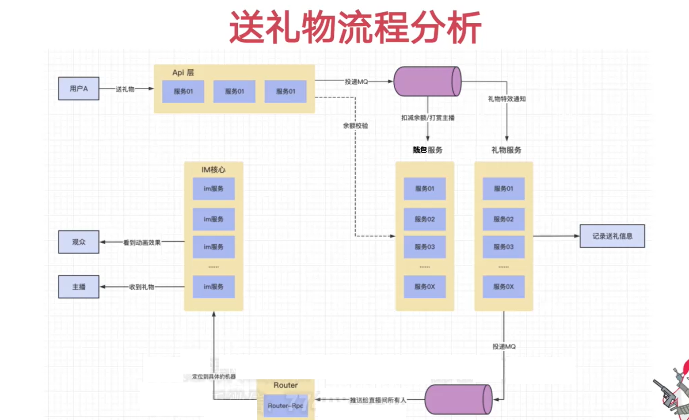
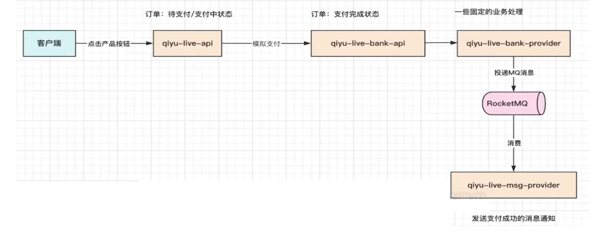

# start

[TOC]

# 1 直播间送礼打赏功能的设计与分析

直播送礼流程如下：



如上图有以下服务：

1. IM服务
2. API服务
3. 钱包服务
4. 礼物服务
5. Router服务
5. 支付中台

> 其中IM、API、Router服务整体已经搭建完成，可能需要一些小的改动，但是**钱包服务**和**礼物服务**还未开始搭建
>
> 还有一个就是我们的**支付中台**，钱包中的余额肯定是通过我们的支付中台进行充值来的



# 2 【优化】公共组件的优化

## 2.1 断言的优化

> 在我们的项目中有很多的if语句，看起来非常的冗余且代码量很大，所以我们可以通过**自定义断言机制 + 自定义异常类和全局异常处理器**来处理


**qiyu-live-framework-web-starter：**

```java
package org.qiyu.live.web.starter.error;

/**
 * 我们自定义异常的接口规范
 */
public interface QiyuBaseError {

    int getErrorCode();
    String getErrorMsg();
}
```

```java
package org.qiyu.live.web.starter.error;

/**
 * 自定义异常类的异常信息的枚举类，实现了 自定义异常的接口规范
 */
public enum BizBaseErrorEnum implements QiyuBaseError{

    PARAM_ERROR(100001,"参数异常"),
    TOKEN_ERROR(100002,"用户token异常");

    private int errorCode;
    private String errorMsg;

    BizBaseErrorEnum(int errorCode, String errorMsg) {
        this.errorCode = errorCode;
        this.errorMsg = errorMsg;
    }

    @Override
    public int getErrorCode() {
        return errorCode;
    }

    @Override
    public String getErrorMsg() {
        return errorMsg;
    }
}
```

```java
package org.qiyu.live.web.starter.error;

import java.io.Serial;

/**
 * 自定义异常类
 */
public class QiyuErrorException extends RuntimeException{

    @Serial
    private static final long serialVersionUID = -5253282130382649365L;
    private int errorCode;
    private String errorMsg;

    public QiyuErrorException(int errorCode,String errorMsg) {
        this.errorCode = errorCode;
        this.errorMsg = errorMsg;
    }

    public QiyuErrorException(QiyuBaseError qiyuBaseError) {
        this.errorCode = qiyuBaseError.getErrorCode();
        this.errorMsg = qiyuBaseError.getErrorMsg();
    }

    public int getErrorCode() {
        return errorCode;
    }

    public void setErrorCode(int errorCode) {
        this.errorCode = errorCode;
    }

    public String getErrorMsg() {
        return errorMsg;
    }

    public void setErrorMsg(String errorMsg) {
        this.errorMsg = errorMsg;
    }
}
```

```java
package org.qiyu.live.web.starter.error;

import jakarta.servlet.http.HttpServletRequest;
import org.qiyu.live.common.interfaces.vo.WebResponseVO;
import org.slf4j.Logger;
import org.slf4j.LoggerFactory;
import org.springframework.web.bind.annotation.ControllerAdvice;
import org.springframework.web.bind.annotation.ExceptionHandler;
import org.springframework.web.bind.annotation.ResponseBody;

/**
 * 全局异常处理器
 */
@ControllerAdvice
public class GlobalExceptionHandler {

    private static final Logger LOGGER = LoggerFactory.getLogger(GlobalExceptionHandler.class);

    @ExceptionHandler(value = Exception.class)
    @ResponseBody
    public WebResponseVO errorHandler(HttpServletRequest request, Exception e) {
        LOGGER.error(request.getRequestURI() + ",error is ", e);
        return WebResponseVO.sysError("系统异常");
    }


    @ExceptionHandler(value = QiyuErrorException.class)
    @ResponseBody
    public WebResponseVO sysErrorHandler(HttpServletRequest request, QiyuErrorException e) {
        //业务异常，参数传递有误,都会走到这里
        LOGGER.error(request.getRequestURI() + ",error code is {},error msg is {}", e.getErrorCode(), e.getErrorMsg());
        return WebResponseVO.bizError(e.getErrorCode(), e.getErrorMsg());
    }
}
```

```java
package org.qiyu.live.web.starter.error;

/**
 * 自定义断言类
 */
public class ErrorAssert {
    
    /**
     * 判断参数不能为空
     */
    public static void isNotNull(Object obj, QiyuBaseError qiyuBaseError) {
        if (obj == null) {
            throw new QiyuErrorException(qiyuBaseError);
        }
    }

    /**
     * 判断字符串不能为空
     */
    public static void isNotBlank(String str, QiyuBaseError qiyuBaseError) {
        if (str == null || str.trim().length() == 0) {
            throw new QiyuErrorException(qiyuBaseError);
        }
    }

    /**
     * flag == true
     */
    public static void isTure(boolean flag, QiyuBaseError qiyuBaseError) {
        if (!flag) {
            throw new QiyuErrorException(qiyuBaseError);
        }
    }

    /**
     * flag == true
     */
    public static void isTure(boolean flag, QiyuErrorException qiyuErrorException) {
        if (!flag) {
            throw qiyuErrorException;
        }
    }
}
```

在META-INF/spring/org.springframework.boot.autoconfigure.AutoConfiguration.imports加入:

```properties
org.qiyu.live.web.starter.error.GlobalExceptionHandler
```


现在开始优化我们API模块里的if语句：

先定义一些特有的异常信息，实现了自定义异常的接口规范：

```java
package org.qiyu.live.api.error;

import org.qiyu.live.web.starter.error.QiyuBaseError;

public enum QiyuApiError implements QiyuBaseError {
    
    LIVING_ROOM_TYPE_MISSING(10001, "需要给定直播间类型"),
    PHONE_NOT_BLANK(10002, "手机号不能为空"),
    PHONE_IN_VALID(10003, "手机号格式异常"),
    LOGIN_CODE_IN_VALID(10004, "验证码格式异常");


    QiyuApiError(int code, String desc) {
        this.code = code;
        this.desc = desc;
    }

    int code;
    String desc;


    @Override
    public int getErrorCode() {
        return code;
    }

    @Override
    public String getErrorMsg() {
        return desc;
    }
}
```

开始优化if：

```java
@RestController
@RequestMapping("/living")
public class LivingRoomController {

    ...
    @PostMapping("/closeLiving")
    public WebResponseVO closeLiving(Integer roomId) {
        ErrorAssert.isNotNull(roomId, BizBaseErrorEnum.PARAM_ERROR);
        boolean status = livingRoomService.closeLiving(roomId);
        if (status) {
            return WebResponseVO.success();
        }
        return WebResponseVO.bizError("关播异常，请稍后再试");
    }

    ...

    @PostMapping("/list")
    public WebResponseVO list(LivingRoomReqVO livingRoomReqVO) {
        ErrorAssert.isTure(livingRoomReqVO != null || livingRoomReqVO.getType() != null, QiyuApiError.LIVING_ROOM_TYPE_MISSING);
        ErrorAssert.isTure(livingRoomReqVO.getPage() > 0 || livingRoomReqVO.getPageSize() <= 100, BizBaseErrorEnum.PARAM_ERROR);
        return WebResponseVO.success(livingRoomService.list(livingRoomReqVO));
    }
}
```

```java
@Service
public class UserLoginServiceImpl implements IUserLoginService {

    ...
        
    @Override
    public WebResponseVO sendLoginCode(String phone) {
        // 参数校验
        ErrorAssert.isNotNull(phone, QiyuApiError.PHONE_NOT_BLANK);
        ErrorAssert.isTure(Pattern.matches(PHONE_REG, phone), QiyuApiError.PHONE_IN_VALID);
        MsgSendResultEnum msgSendResultEnum = smsRpc.sendLoginCode(phone);
        if (msgSendResultEnum == MsgSendResultEnum.SEND_SUCCESS) {
            return WebResponseVO.success();
        }
        return WebResponseVO.sysError("短信发送太频繁，请稍后再试");
    }

    @Override
    public WebResponseVO login(String phone, Integer code, HttpServletResponse response) {
        // 参数校验
        ErrorAssert.isNotNull(phone, QiyuApiError.PHONE_NOT_BLANK);
        ErrorAssert.isTure(Pattern.matches(PHONE_REG, phone), QiyuApiError.PHONE_IN_VALID);
        ErrorAssert.isTure(code != null || code >= 1000, QiyuApiError.LOGIN_CODE_IN_VALID);
        // 检查验证码是否匹配
        MsgCheckDTO msgCheckDTO = smsRpc.checkLoginCode(phone, code);
        if (!msgCheckDTO.isCheckStatus()) {// 校验没通过
            return WebResponseVO.bizError(msgCheckDTO.getDesc());
        }
        // 封装token到cookie返回
        UserLoginDTO userLoginDTO = userPhoneRpc.login(phone);
        String token = accountTokenRPC.createAndSaveLoginToken(userLoginDTO.getUserId());
        Cookie cookie = new Cookie("qytk", token);
        // 设置在哪个域名的访问下，才携带此cookie进行访问
        // https://app.qiyu.live.com//
        // https://api.qiyu.live.com//
        // 取公共部分的顶级域名，如果在hosts中自定义域名有跨域限制无法解决的话就注释掉setDomain和setPath
        // cookie.setDomain("qiyu.live.com");
        // 这里我们不设置域名，就设置为localhost
        cookie.setDomain("localhost");
        // 域名下的所有路径
        cookie.setPath("/");
        // 设置cookie过期时间，单位为秒，设置为token的过期时间，30天
        cookie.setMaxAge(30 * 24 * 3600);
        // 加上它，不然浏览器不会记录cookie
        // response.setHeader("Access-Control-Allow-Credentials", "true");
        response.addCookie(cookie);
        return WebResponseVO.success(BeanUtil.copyProperties(userLoginDTO, UserLoginVO.class));
    }
}
```

## 2.2 使用 计数器限流算法 进行限流

> 我们还需要对我们的系统进行**限流**处理，**避免并发量过大或者同一用户的恶意重复请求**

限流算法很多，常见的有三类，分别是：计数器算法、漏桶算法、令牌桶算法：

1. 计数器：在一段时间间隔内（时间窗/时间区间），处理请求的最大数量固定，超过部分不做处理。

2. 漏桶：漏桶大小固定，处理速度固定，但请求进入速度不固定（在突发情况请求过多时，会丢弃过多的请求）。
3. 令牌桶：令牌桶的大小固定，令牌的产生速度固定，但是消耗令牌（即请求）速度不固定（可以应对一些某些时间请求过多的情况）；每个请求都会从令牌桶中取出令牌，如果没有令牌则丢弃该次请求。

我们采取 **计数器算法 对同一用户请求同一接口做限流处理**


我们通过 自定义注解 的方式来设置 窗口期 和 limit：

```java
package org.qiyu.live.web.starter.constants;

public enum ErrorAppIdEnum {

    QIYU_API_ERROR(101,"qiyu-live-api");

    ErrorAppIdEnum(int code, String msg) {
        this.code = code;
        this.msg = msg;
    }

    int code;
    String msg;

    public int getCode() {
        return code;
    }

    public void setCode(int code) {
        this.code = code;
    }

    public String getMsg() {
        return msg;
    }

    public void setMsg(String msg) {
        this.msg = msg;
    }
}
```

```java
package org.qiyu.live.web.starter.context;

import jakarta.annotation.Resource;
import jakarta.servlet.http.HttpServletRequest;
import jakarta.servlet.http.HttpServletResponse;
import org.qiyu.live.web.starter.config.RequestLimit;
import org.qiyu.live.web.starter.error.QiyuErrorException;
import org.slf4j.Logger;
import org.slf4j.LoggerFactory;
import org.springframework.beans.factory.annotation.Value;
import org.springframework.data.redis.core.RedisTemplate;
import org.springframework.web.method.HandlerMethod;
import org.springframework.web.servlet.HandlerInterceptor;

import java.util.Optional;
import java.util.concurrent.TimeUnit;

/**
 * 对于重复请求，要有专门的拦截器去处理，进行相同用户下的限流
 */
public class RequestLimitInterceptor implements HandlerInterceptor {

    private static final Logger LOGGER = LoggerFactory.getLogger(RequestLimitInterceptor.class);

    @Resource
    private RedisTemplate<String, Object> redisTemplate;
    @Value("${spring.application.name}")
    private String applicationName;

    @Override
    public boolean preHandle(HttpServletRequest request, HttpServletResponse response, Object handler) throws Exception {
        if (handler instanceof HandlerMethod) {
            HandlerMethod handlerMethod = (HandlerMethod) handler;
            // 查看有无 @RequestLimit 注解标识该方法
            boolean hasLimit = handlerMethod.getMethod().isAnnotationPresent(RequestLimit.class);
            if (hasLimit) {
                RequestLimit requestLimit = handlerMethod.getMethod().getAnnotation(RequestLimit.class);
                Long userId = QiyuRequestContext.getUserId();
                // 没有userId标识是网关通过的白名单请求，放行
                if (userId == null) {
                    return true;
                }
                //(userId + url + requestValue) base64 -> String(key)
                String cacheKey = applicationName + ":" + userId + ":" + request.getRequestURI();
                int limit = requestLimit.limit();// 限制访问数量上限
                int second = requestLimit.second();// 时间窗口
                Integer reqTime = (Integer) Optional.ofNullable(redisTemplate.opsForValue().get(cacheKey)).orElse(0);
                if (reqTime == 0) {
                    redisTemplate.opsForValue().set(cacheKey, 1, second, TimeUnit.SECONDS);
                    return true;
                } else if (reqTime < limit) {
                    redisTemplate.opsForValue().increment(cacheKey, 1);
                    return true;
                }
                // 超过限流数量上限
                // 直接抛出全局异常，让异常捕获器处理
                LOGGER.error("[RequestLimitInterceptor] userId is {}, req too much", userId);
                throw new QiyuErrorException(-10001, requestLimit.msg());
            }
        }
        return true;
    }
}
 
```

```java
@Configuration
public class WebConfig implements WebMvcConfigurer {

    @Bean
    public QiyuUserInfoInterceptor qiyuUserInfoInterceptor() {
        return new QiyuUserInfoInterceptor();
    }

    @Bean
    public RequestLimitInterceptor requestLimitInterceptor(){
        return new RequestLimitInterceptor();
    }

    @Override
    public void addInterceptors(InterceptorRegistry registry) {
        registry.addInterceptor(qiyuUserInfoInterceptor()).addPathPatterns("/**").excludePathPatterns("/error");
        registry.addInterceptor(requestLimitInterceptor()).addPathPatterns("/**").excludePathPatterns("/error");
    }

}
```


**限流的使用：**

在API模块的LivingRoomController中对开关播进行限流的处理：

**记得给web-starter层加redis配置**

```java
@RequestLimit(limit = 1, second = 10, msg = "开播请求过于频繁，请稍后再试")
@PostMapping("/startingLiving")
public WebResponseVO startingLiving(Integer type) {
    if (type == null) {
        return WebResponseVO.errorParam("需要给定直播间类型");
    }
    Integer roomId = livingRoomService.startingLiving(type);
    LivingRoomInitVO livingRoomInitVO = new LivingRoomInitVO();
    livingRoomInitVO.setRoomId(roomId);
    return WebResponseVO.success(livingRoomInitVO);
}

@RequestLimit(limit = 1, second = 10, msg = "关播请求过于频繁，请稍后再试")
@PostMapping("/closeLiving")
public WebResponseVO closeLiving(Integer roomId) {
    ErrorAssert.isNotNull(roomId, BizBaseErrorEnum.PARAM_ERROR);
    boolean status = livingRoomService.closeLiving(roomId);
    if (status) {
        return WebResponseVO.success();
    }
    return WebResponseVO.bizError("关播异常，请稍后再试");
}
```

# 3 基本服务的搭建

## 3.1 礼物服务的搭建

礼物清单与送礼记录 应该有以下接口：

- 单个礼物查询接口
- 礼物面板查询接口
- 送礼记录接口
- 新增礼物接口
- 更新礼物接口

随意找个mysql数据库进行以下两张表的创建（不需要创建分表）：

```sql
-- Create syntax for TABLE 't_gift_config'
CREATE TABLE `t_gift_config` (
  `gift_id` int unsigned NOT NULL AUTO_INCREMENT COMMENT '礼物id',
  `price` int unsigned DEFAULT NULL COMMENT '虚拟货币价格',
  `gift_name` varchar(100) CHARACTER SET utf8mb4 COLLATE utf8mb4_0900_ai_ci DEFAULT NULL COMMENT '礼物名称',
  `status` tinyint unsigned DEFAULT NULL COMMENT '状态(0无效,1有效)',
  `cover_img_url` varchar(500) CHARACTER SET utf8mb4 COLLATE utf8mb4_0900_ai_ci DEFAULT NULL COMMENT '礼物封面地址',
  `svga_url` varchar(500) CHARACTER SET utf8mb4 COLLATE utf8mb4_0900_ai_ci DEFAULT NULL COMMENT 'svga资源地址',
  `create_time` datetime DEFAULT CURRENT_TIMESTAMP COMMENT '创建时间',
  `update_time` datetime DEFAULT CURRENT_TIMESTAMP ON UPDATE CURRENT_TIMESTAMP COMMENT '更新时间',
  PRIMARY KEY (`gift_id`)
) ENGINE=InnoDB AUTO_INCREMENT=22 DEFAULT CHARSET=utf8mb4 COLLATE=utf8mb4_0900_ai_ci COMMENT='礼物配置表';

-- Create syntax for TABLE 't_gift_record'
CREATE TABLE `t_gift_record` (
  `id` int unsigned NOT NULL AUTO_INCREMENT,
  `user_id` bigint DEFAULT NULL COMMENT '发送人',
  `object_id` bigint DEFAULT NULL COMMENT '收礼人',
  `gift_id` int DEFAULT NULL COMMENT '礼物id',
  `price` int DEFAULT NULL COMMENT '送礼金额',
  `price_unit` tinyint DEFAULT NULL COMMENT '送礼金额的单位',
  `source` tinyint DEFAULT NULL COMMENT '礼物来源',
  `send_time` datetime DEFAULT NULL COMMENT '发送时间',
  `update_time` datetime DEFAULT NULL COMMENT '更新时间',
  `json` json DEFAULT NULL,
  PRIMARY KEY (`id`)
) ENGINE=InnoDB AUTO_INCREMENT=2 DEFAULT CHARSET=utf8mb4 COLLATE=utf8mb4_0900_ai_ci COMMENT='送礼记录表';

INSERT INTO `t_gift_config` VALUES (22, 90, '天使少女-2', 1, '../svga/img/天使.png', '../svga/天使.svga', '2023-08-01 06:50:25', '2024-02-22 17:55:05');
INSERT INTO `t_gift_config` VALUES (23, 20, '皇冠-2', 1, '../svga/img/皇冠.png', '../svga/皇冠.svga', '2023-08-01 06:50:25', '2024-02-22 18:01:43');
INSERT INTO `t_gift_config` VALUES (24, 1, '爱心气泡-2', 1, '../svga/img/爱心.png', '../svga/爱心.svga', '2023-08-01 06:50:25', '2024-02-22 18:01:52');
INSERT INTO `t_gift_config` VALUES (25, 500, '保时捷-2', 1, '../svga/img/跑车.png', '../svga/跑车.svga', '2023-08-01 06:50:25', '2024-02-22 17:49:22');
INSERT INTO `t_gift_config` VALUES (27, 45, '飞天火箭-2', 1, '../svga/img/火箭.jpg', '../svga/火箭.svga', '2023-08-01 06:50:25', '2024-02-22 17:50:56');
INSERT INTO `t_gift_config` VALUES (28, 45, '万圣节-2', 1, '../svga/img/女巫.png', '../svga/女巫.svga', '2023-08-01 06:50:25', '2024-02-22 17:49:18');
INSERT INTO `t_gift_config` VALUES (29, 20, '神灯仙女-2', 1, '../svga/img/神灯仙女.png', '../svga/仙女.svga', '2024-02-22 17:59:17', '2024-02-22 18:02:01');
```

**redis-stater：**

先写好接下来要用的keybuilder：

```java
@Configuration
@Conditional(RedisKeyLoadMatch.class)
public class GiftProviderCacheKeyBuilder extends RedisKeyBuilder {

    private static String GIFT_CONFIG_CACHE = "gift_config_cache";
    private static String GIFT_LIST_CACHE = "gift_list_cache";
    private static String GIFT_CONSUME_KEY = "gift_consume_key";
    private static String GIFT_LIST_LOCK = "gift_list_lock";
    private static String LIVING_PK_KEY = "living_pk_key";
    private static String LIVING_PK_SEND_SEQ = "living_pk_send_seq";
    private static String LIVING_PK_IS_OVER = "living_pk_is over";

    public String buildLivingPkIsOver(Integer roomId) {
        return super.getPrefix() + LIVING_PK_IS_OVER + super.getSplitItem() + roomId;
    }

    public String buildLivingPkSendSeq(Integer roomId) {
        return super.getPrefix() + LIVING_PK_SEND_SEQ + super.getSplitItem() + roomId;
    }

    public String buildLivingPkKey(Integer roomId) {
        return super.getPrefix() + LIVING_PK_KEY + super.getSplitItem() + roomId;
    }

    public String buildGiftConsumeKey(String uuid) {
        return super.getPrefix() + GIFT_CONSUME_KEY + super.getSplitItem() + uuid;
    }

    public String buildGiftConfigCacheKey(int giftId) {
        return super.getPrefix() + GIFT_CONFIG_CACHE + super.getSplitItem() + giftId;
    }

    public String buildGiftListCacheKey() {
        return super.getPrefix() + GIFT_LIST_CACHE;
    }

    public String buildGiftListLockCacheKey() {
        return super.getPrefix() + GIFT_LIST_LOCK;
    }
}
```

记得在META-INF/spring/org.springframework.boot.autoconfigure.AutoConfiguration.imports中添加

**qiyu-live-gift-interface：**

```xml
<dependency>
    <groupId>org.hah</groupId>
    <artifactId>qiyu-live-common-interface</artifactId>
    <version>1.0-SNAPSHOT</version>
</dependency>
```

```java
package org.qiyu.live.gift.dto;

import lombok.Data;

import java.io.Serial;
import java.io.Serializable;
import java.util.Date;

@Data
public class GiftConfigDTO implements Serializable {


    @Serial
    private static final long serialVersionUID = -1394363192115983898L;
    private Integer giftId;
    private Integer price;
    private String giftName;
    private Integer status;
    private String coverImgUrl;
    private String svgaUrl;
    private Date createTime;
    private Date updateTime;
    
}
```

```java
package org.qiyu.live.gift.dto;

import lombok.Data;

import java.io.Serial;
import java.io.Serializable;
import java.util.Date;

@Data
public class GiftRecordDTO implements Serializable {
    
    @Serial
    private static final long serialVersionUID = -3007370091488635874L;
    private Long id;
    private Long userId;
    private Long objectId;
    private Integer source;
    private Integer price;
    private Integer priceUnit;
    private Integer giftId;
    private Date sendTime;
    
}
```


**qiyu-live-gift-provider：**

```xml
<dependency>
    <groupId>org.springframework.boot</groupId>
    <artifactId>spring-boot-starter-web</artifactId>
    <exclusions>
        <exclusion>
            <artifactId>log4j-to-slf4j</artifactId>
            <groupId>org.apache.logging.log4j</groupId>
        </exclusion>
    </exclusions>
</dependency>

<dependency>
    <groupId>org.apache.dubbo</groupId>
    <artifactId>dubbo-spring-boot-starter</artifactId>
    <version>3.2.0-beta.3</version>
</dependency>
<dependency>
    <groupId>com.alibaba.cloud</groupId>
    <artifactId>spring-cloud-starter-alibaba-nacos-discovery</artifactId>
</dependency>
<dependency>
    <groupId>com.alibaba.cloud</groupId>
    <artifactId>spring-cloud-starter-alibaba-nacos-config</artifactId>
</dependency>
<!--在SpringBoot 2.4.x的版本之后，对于bootstrap.properties/bootstrap.yaml配置文件(我们合起来成为Bootstrap配置文件)的支持，需要导入该jar包-->
<dependency>
    <groupId>org.springframework.cloud</groupId>
    <artifactId>spring-cloud-starter-bootstrap</artifactId>
    <version>3.0.2</version>
</dependency>
<dependency>
    <groupId>com.alibaba</groupId>
    <artifactId>fastjson</artifactId>
    <version>${alibaba-fastjson.version}</version>
    <exclusions>
        <exclusion>
            <groupId>com.alibaba.fastjson2</groupId>
            <artifactId>fastjson2</artifactId>
        </exclusion>
    </exclusions>
</dependency>
<dependency>
    <groupId>mysql</groupId>
    <artifactId>mysql-connector-java</artifactId>
    <version>${qiyu-mysql.version}</version>
</dependency>
<dependency>
    <groupId>com.baomidou</groupId>
    <artifactId>mybatis-plus-boot-starter</artifactId>
    <version>${mybatis-plus.version}</version>
</dependency>
<dependency>
    <groupId>org.springframework.kafka</groupId>
    <artifactId>spring-kafka</artifactId>
</dependency>


<!--自定义-->
<dependency>
    <groupId>org.hah</groupId>
    <artifactId>qiyu-live-common-interface</artifactId>
    <version>1.0-SNAPSHOT</version>
</dependency>
<dependency>
    <groupId>org.hah</groupId>
    <artifactId>qiyu-live-framework-redis-starter</artifactId>
    <version>1.0-SNAPSHOT</version>
</dependency>
<dependency>
    <groupId>org.hah</groupId>
    <artifactId>qiyu-live-gift-interface</artifactId>
    <version>1.0-SNAPSHOT</version>
</dependency>
```

bootstrap.yml：

```yaml
spring:
  application:
    name: qiyu-live-gift-provider
  cloud:
    nacos:
      username: qiyu
      password: qiyu
      discovery:
        server-addr: localhost:8848
        namespace: 1bc15ccf-f070-482e-8325-c3c46e427aaf
      config:
        import-check:
          enabled: false
        # 当前服务启动后去nacos中读取配置文件的后缀
        file-extension: yml
        # 读取配置的nacos地址
        server-addr: localhost:8848
        # 读取配置的nacos的名空间
        namespace: 1bc15ccf-f070-482e-8325-c3c46e427aaf
        group: DEFAULT_GROUP
  config:
    import:
      - optional:nacos:${spring.application.name}.yml
```

复制logback-spring.xml

在Nacos新建qiyu-live-gift-provider.yml：

```yaml
spring:
  application:
    name: qiyu-live-gift-provider
  datasource:
    hikari:
      minimum-idle: 10
      maximum-pool-size: 200
    driver-class-name: com.mysql.cj.jdbc.Driver
    #访问主库
    url: jdbc:mysql://localhost:8808/qiyu_live_user?useUnicode=true&characterEncoding=utf8
    username: root
    password: root
  data:
    redis:
      port: 6379
      host: localhost
      password: 123456
      lettuce:
        pool:
          min-idle: 10
          max-active: 100
          max-idle: 10

  # Kafka配置，前缀是spring
  kafka:
    bootstrap-servers: localhost:9092
    producer:
      key-serializer: org.apache.kafka.common.serialization.StringSerializer
      value-serializer: org.apache.kafka.common.serialization.StringSerializer
      retries: 3
    consumer:
      key-deserializer: org.apache.kafka.common.serialization.StringDeserializer
      value-deserializer: org.apache.kafka.common.serialization.StringDeserializer
dubbo:
  application:
    name: ${spring.application.name}
  registry:
    address: nacos://localhost:8848?namespace=1bc15ccf-f070-482e-8325-c3c46e427aaf&&username=qiyu&&password=qiyu
  protocol:
    name: dubbo
    port: 9098
```

```java
@SpringBootApplication
@EnableDubbo
@EnableDiscoveryClient
public class GiftProviderApplication {

    public static void main(String[] args) throws InterruptedException {
        CountDownLatch countDownLatch = new CountDownLatch(1);
        SpringApplication springApplication = new SpringApplication(GiftProviderApplication.class);
        springApplication.setWebApplicationType(WebApplicationType.NONE);
        springApplication.run(args);
        countDownLatch.await();
    }
}
```

```java
@DubboService
public class GiftConfigRpcImpl implements IGiftConfigRpc {
    
    @Resource
    private IGiftConfigService giftService;

    @Override
    public GiftConfigDTO getByGiftId(Integer giftId) {
        return giftService.getByGiftId(giftId);
    }

    @Override
    public List<GiftConfigDTO> queryGiftList() {
        return giftService.queryGiftList();
    }

    @Override
    public void insertOne(GiftConfigDTO giftConfigDTO) {
        giftService.insertOne(giftConfigDTO);
    }

    @Override
    public void updateOne(GiftConfigDTO giftConfigDTO) {
        giftService.updateOne(giftConfigDTO);
    }
}
```

```java
@DubboService
public class GiftRecordRpcImpl implements IGiftRecordRpc {
    
    @Resource
    private IGiftConfigService giftService;

    @Override
    public void insertOne(GiftRecordDTO giftRecordDTO) {
        
    }
}
```

```java
public interface IGiftConfigService {

    /**
     * 根据id查询礼物信息
     */
    GiftConfigDTO getByGiftId(Integer giftId);

    /**
     * 查询所有礼物信息
     */
    List<GiftConfigDTO> queryGiftList();

    /**
     * 插入一个礼物信息
     */
    void insertOne(GiftConfigDTO giftConfigDTO);

    /**
     * 更新礼物信息
     */
    void updateOne(GiftConfigDTO giftConfigDTO);
}
```

```java
public interface IGiftRecordService {

    /**
     * 插入一条送礼记录
     */
    void insertOne(GiftRecordDTO giftRecordDTO);
}
```

```java
@Service
public class GiftConfigServiceImpl implements IGiftConfigService {
    
    @Resource
    private GiftConfigMapper giftConfigMapper;
    
    @Override
    public GiftConfigDTO getByGiftId(Integer giftId) {
        LambdaQueryWrapper<GiftConfigPO> queryWrapper = new LambdaQueryWrapper<>();
        queryWrapper.eq(GiftConfigPO::getGiftId, giftId);
        queryWrapper.eq(GiftConfigPO::getStatus, CommonStatusEnum.VALID_STATUS.getCode());
        queryWrapper.last("limit 1");
        GiftConfigPO giftConfigPO = giftConfigMapper.selectOne(queryWrapper);
        return ConvertBeanUtils.convert(giftConfigPO, GiftConfigDTO.class);
    }

    @Override
    public List<GiftConfigDTO> queryGiftList() {
        String cacheKey = cacheKeyBuilder.buildGiftListCacheKey();
        List<GiftConfigDTO> giftConfigDTOS = redisTemplate.opsForList().range(cacheKey, 0, -1).stream().map(x -> (GiftConfigDTO) x).collect(Collectors.toList());
        if (!CollectionUtils.isEmpty(giftConfigDTOS)) {
            if (giftConfigDTOS.get(0).getGiftId() == null) {
                return Collections.emptyList();
            }
            return giftConfigDTOS;
        }
        LambdaQueryWrapper<GiftConfigPO> queryWrapper = new LambdaQueryWrapper<>();
        queryWrapper.eq(GiftConfigPO::getStatus, CommonStatusEnum.VALID_STATUS.getCode());
        List<GiftConfigPO> giftConfigPOList = giftConfigMapper.selectList(queryWrapper);
        giftConfigDTOS = ConvertBeanUtils.convertList(giftConfigPOList, GiftConfigDTO.class);
        if (CollectionUtils.isEmpty(giftConfigDTOS)) {
            redisTemplate.opsForList().leftPush(cacheKey, new GiftConfigDTO());
            redisTemplate.expire(cacheKey, 1L, TimeUnit.MINUTES);
            return Collections.emptyList();
        }
        // 往Redis初始化List时，要上锁，避免重复写入造成数据重复
        Boolean isLock = redisTemplate.opsForValue().setIfAbsent(cacheKeyBuilder.buildGiftListLockCacheKey(), 1, 3L, TimeUnit.SECONDS);
        if (Boolean.TRUE.equals(isLock)) {
            redisTemplate.opsForList().leftPushAll(cacheKey, giftConfigDTOS.toArray());
            redisTemplate.expire(cacheKey, 30L, TimeUnit.MINUTES);
        }
        return giftConfigDTOS;
    }

    @Override
    public void insertOne(GiftConfigDTO giftConfigDTO) {
        GiftConfigPO giftConfigPO = ConvertBeanUtils.convert(giftConfigDTO, GiftConfigPO.class);
        giftConfigPO.setStatus(CommonStatusEnum.VALID_STATUS.getCode());
        giftConfigMapper.insert(giftConfigPO);
    }

    @Override
    public void updateOne(GiftConfigDTO giftConfigDTO) {
        GiftConfigPO giftConfigPO = ConvertBeanUtils.convert(giftConfigDTO, GiftConfigPO.class);
        giftConfigMapper.updateById(giftConfigPO);
    }
}
```

```java
@Service
public class GiftRecordServiceImpl implements IGiftRecordService {
    
    @Resource
    private GiftRecordMapper giftRecordMapper;
    
    @Override
    public void insertOne(GiftRecordDTO giftRecordDTO) {
        GiftRecordPO giftRecordPO = ConvertBeanUtils.convert(giftRecordDTO, GiftRecordPO.class);
        giftRecordMapper.insert(giftRecordPO);
    }
}
```

```java
@Data
@TableName("t_gift_config")
public class GiftConfigPO {
    
    @TableId(type = IdType.AUTO)
    private Integer giftId;
    private Integer price;
    private String giftName;
    private Integer status;
    private String coverImgUrl;
    private String svgaUrl;
    private Date createTime;
    private Date updateTime;
}
```

```java
@Data
@TableName("t_gift_record")
public class GiftRecordPO {
    
    @TableId(type = IdType.AUTO)
    private Long id;
    private Long userId;
    private Long objectId;
    private Integer source;
    private Integer price;
    private Integer priceUnit;
    private Integer giftId;
    private Date sendTime;
    
}
```

```java
@Mapper
public interface GiftConfigMapper extends BaseMapper<GiftConfigPO> {
}
```

```java
@Mapper
public interface GiftRecordMapper extends BaseMapper<GiftRecordPO> {
}
```


**qiyu-live-api：**

```java
@RestController
@RequestMapping("/gift")
public class GiftController {
    
    @Resource
    private IGiftService giftService; 
    
    @PostMapping("/listGift")
    public WebResponseVO listGift() {
        List<GiftConfigVO> giftConfigVOS = giftService.listGift();
        return WebResponseVO.success(giftConfigVOS);
    }
    
    @PostMapping("/send")
    public WebResponseVO send(GiftReqVO giftReqVO) {
        return WebResponseVO.success(giftService.send(giftReqVO));
    }
}
```

```java
public interface IGiftService {
    
    List<GiftConfigVO> listGift();
    
    boolean send(GiftReqVO giftReqVO);
}
```

```java
@Service
public class GiftServiceImpl implements IGiftService {

    private static final Logger LOGGER = LoggerFactory.getLogger(GiftServiceImpl.class);
    @DubboReference
    private IGiftConfigRpc giftConfigRpc;
    @DubboReference
    private QiyuCurrencyAccountRpc qiyuCurrencyAccountRpc;
    @Resource
    private KafkaTemplate<String, String> kafkaTemplate;

    @Override
    public List<GiftConfigVO> listGift() {
        List<GiftConfigDTO> giftConfigDTOList = giftConfigRpc.queryGiftList();
        return ConvertBeanUtils.convertList(giftConfigDTOList, GiftConfigVO.class);
    }

    @Override
    public boolean send(GiftReqVO giftReqVO) {
        // 待实现
    }
}
```

## 3.2 钱包体系的搭建

- 钱包体系：

  1. 流水记录
  2. 钱包查询
  3. 打款/扣款
  4. 充值

  将支付+账户的体系进行融合

新建数据库qiyu_live_bank：并创建两张数据表：

```sql
-- Create syntax for TABLE 't_qiyu_currency_account'
CREATE TABLE `t_qiyu_currency_account` (
  `user_id` bigint unsigned NOT NULL COMMENT '用户id',
  `current_balance` int DEFAULT NULL COMMENT '当前余额',
  `total_charged` int DEFAULT NULL COMMENT '累计充值',
  `status` tinyint DEFAULT '1' COMMENT '账户状态(0无效1有效 2冻结）',
  `create_time` datetime DEFAULT CURRENT_TIMESTAMP,
  `update_time` datetime DEFAULT CURRENT_TIMESTAMP ON UPDATE CURRENT_TIMESTAMP,
  PRIMARY KEY (`user_id`)
) ENGINE=InnoDB DEFAULT CHARSET=utf8mb4 COLLATE=utf8mb4_0900_ai_ci COMMENT='账户余额表';

-- Create syntax for TABLE 't_qiyu_currency_trade'
CREATE TABLE `t_qiyu_currency_trade` (
  `id` bigint unsigned NOT NULL AUTO_INCREMENT,
  `user_id` bigint DEFAULT NULL COMMENT '用户id',
  `num` int DEFAULT NULL COMMENT '流水金额（单位：分）',
  `type` tinyint DEFAULT NULL COMMENT '流水类型',
  `status` tinyint DEFAULT '1' COMMENT '状态0无效1有效',
  `create_time` datetime DEFAULT CURRENT_TIMESTAMP,
  `update_time` datetime DEFAULT CURRENT_TIMESTAMP ON UPDATE CURRENT_TIMESTAMP,
  PRIMARY KEY (`id`)
) ENGINE=InnoDB AUTO_INCREMENT=869 DEFAULT CHARSET=utf8mb4 COLLATE=utf8mb4_0900_ai_ci COMMENT='流水记录表';

```

**qiyu-live-bank-interface：**

```xml
<dependency>
    <groupId>org.hah</groupId>
    <artifactId>qiyu-live-common-interface</artifactId>
    <version>1.0-SNAPSHOT</version>
</dependency>
```

```java
package org.qiyu.live.bank.dto;

import lombok.Data;

import java.io.Serial;
import java.io.Serializable;
import java.util.Date;

@Data
public class QiyuCurrencyAccountDTO implements Serializable {

    @Serial
    private static final long serialVersionUID = 4594540862190026761L;
    
    private Long userId;
    private int currentBalance;
    private int totalCharged;
    private Integer status;
    private Date createTime;
    private Date updateTime;
}
```

```java
package org.qiyu.live.bank.interfaces;

import org.qiyu.live.bank.dto.QiyuCurrencyAccountDTO;

public interface QiyuCurrencyAccountRpc {

    /**
     * 新增账户
     */
    boolean insertOne(Long userId);

    /**
     * 增加虚拟货币
     */
    void incr(Long userId, int num);

    /**
     * 扣减虚拟币
     */
    void decr(Long userId, int num);

    /**
     * 查询账户
     */
    QiyuCurrencyAccountDTO getByUserId(Long userId);
}
```

**redis-stater：**

先写好接下来要用的keybuilder：

```java
@Configuration
@Conditional(RedisKeyLoadMatch.class)
public class BankProviderCacheKeyBuilder extends RedisKeyBuilder {

    private static String BALANCE_CACHE = "balance_cache";

    private static String PAY_PRODUCT_CACHE = "pay_product_cache";

    private static String PAY_PRODUCT_ITEM_CACHE = "pay_product_item_cache";

    public String buildPayProductItemCache(Integer productId) {
        return super.getPrefix() + PAY_PRODUCT_ITEM_CACHE + super.getSplitItem() + productId;
    }

    /**
     * 按照产品的类型来进行检索
     *
     * @param type
     * @return
     */
    public String buildPayProductCache(Integer type) {
        return super.getPrefix() + PAY_PRODUCT_CACHE + super.getSplitItem() + type;
    }

    /**
     * 构建用户余额cache key
     *
     * @param userId
     * @return
     */
    public String buildUserBalance(Long userId) {
        return super.getPrefix() + BALANCE_CACHE + super.getSplitItem() + userId;
    }

}
```

记得在META-INF/spring/org.springframework.boot.autoconfigure.AutoConfiguration.imports中添加


**qiyu-live-bank-provider：**

```xml
<dependency>
    <groupId>org.springframework.boot</groupId>
    <artifactId>spring-boot-starter-web</artifactId>
    <exclusions>
        <exclusion>
            <artifactId>log4j-to-slf4j</artifactId>
            <groupId>org.apache.logging.log4j</groupId>
        </exclusion>
    </exclusions>
</dependency>

<dependency>
    <groupId>org.apache.dubbo</groupId>
    <artifactId>dubbo-spring-boot-starter</artifactId>
    <version>3.2.0-beta.3</version>
</dependency>
<dependency>
    <groupId>com.alibaba.cloud</groupId>
    <artifactId>spring-cloud-starter-alibaba-nacos-discovery</artifactId>
</dependency>
<dependency>
    <groupId>com.alibaba.cloud</groupId>
    <artifactId>spring-cloud-starter-alibaba-nacos-config</artifactId>
</dependency>
<!--在SpringBoot 2.4.x的版本之后，对于bootstrap.properties/bootstrap.yaml配置文件(我们合起来成为Bootstrap配置文件)的支持，需要导入该jar包-->
<dependency>
    <groupId>org.springframework.cloud</groupId>
    <artifactId>spring-cloud-starter-bootstrap</artifactId>
    <version>3.0.2</version>
</dependency>
<dependency>
    <groupId>com.alibaba</groupId>
    <artifactId>fastjson</artifactId>
    <version>${alibaba-fastjson.version}</version>
    <exclusions>
        <exclusion>
            <groupId>com.alibaba.fastjson2</groupId>
            <artifactId>fastjson2</artifactId>
        </exclusion>
    </exclusions>
</dependency>
<dependency>
    <groupId>mysql</groupId>
    <artifactId>mysql-connector-java</artifactId>
    <version>${qiyu-mysql.version}</version>
</dependency>
<dependency>
    <groupId>com.baomidou</groupId>
    <artifactId>mybatis-plus-boot-starter</artifactId>
    <version>${mybatis-plus.version}</version>
</dependency>
<dependency>
    <groupId>org.springframework.kafka</groupId>
    <artifactId>spring-kafka</artifactId>
</dependency>


<!--自定义-->
<dependency>
    <groupId>org.hah</groupId>
    <artifactId>qiyu-live-common-interface</artifactId>
    <version>1.0-SNAPSHOT</version>
</dependency>
<dependency>
    <groupId>org.hah</groupId>
    <artifactId>qiyu-live-framework-redis-starter</artifactId>
    <version>1.0-SNAPSHOT</version>
</dependency>
<dependency>
    <groupId>org.hah</groupId>
    <artifactId>qiyu-live-gift-interface</artifactId>
    <version>1.0-SNAPSHOT</version>
</dependency>
<dependency>
    <groupId>org.hah</groupId>
    <artifactId>qiyu-live-bank-interface</artifactId>
    <version>1.0-SNAPSHOT</version>
</dependency>
```

新建bootstrap.yml：

```yaml
spring:
  application:
    name: qiyu-live-bank-provider
  cloud:
    nacos:
      username: qiyu
      password: qiyu
      discovery:
        server-addr: localhost:8848
        namespace: 1bc15ccf-f070-482e-8325-c3c46e427aaf
      config:
        import-check:
          enabled: false
        # 当前服务启动后去nacos中读取配置文件的后缀
        file-extension: yml
        # 读取配置的nacos地址
        server-addr: localhost:8848
        # 读取配置的nacos的名空间
        namespace: 1bc15ccf-f070-482e-8325-c3c46e427aaf
        group: DEFAULT_GROUP
  config:
    import:
      - optional:nacos:${spring.application.name}.yml
```

复制logback-spring.xml

Nacos新建qiyu-live-bank-provider.yml：

```yaml
spring:
  application:
    name: qiyu-live-bank-provider
  datasource:
    hikari:
      minimum-idle: 10
      maximum-pool-size: 200
    driver-class-name: com.mysql.cj.jdbc.Driver
    #访问主库
    url: jdbc:mysql://localhost:8808/qiyu_live_bank?useUnicode=true&characterEncoding=utf8
    username: root
    password: root
  data:
    redis:
      port: 6379
      host: localhost
      password: 123456
      lettuce:
        pool:
          min-idle: 10
          max-active: 100
          max-idle: 10

  # Kafka配置，前缀是spring
  kafka:
    bootstrap-servers: localhost:9092
    producer:
      key-serializer: org.apache.kafka.common.serialization.StringSerializer
      value-serializer: org.apache.kafka.common.serialization.StringSerializer
      retries: 3
    consumer:
      key-deserializer: org.apache.kafka.common.serialization.StringDeserializer
      value-deserializer: org.apache.kafka.common.serialization.StringDeserializer
dubbo:
  application:
    name: ${spring.application.name}
  registry:
    address: nacos://localhost:8848?namespace=1bc15ccf-f070-482e-8325-c3c46e427aaf&&username=qiyu&&password=qiyu
  protocol:
    name: dubbo
    port: 9099

```

```java
@SpringBootApplication
@EnableDiscoveryClient
@EnableDubbo
public class BankProviderApplication {

    public static void main(String[] args) throws InterruptedException {
        CountDownLatch countDownLatch = new CountDownLatch(1);
        SpringApplication springApplication = new SpringApplication(BankProviderApplication.class);
        springApplication.setWebApplicationType(WebApplicationType.NONE);
        springApplication.run(args);
        countDownLatch.await();
    }
}
```

```java
/**
 * 旗鱼平台虚拟货币账户
 */
@Data
@TableName("t_qiyu_currency_account")
public class QiyuCurrencyAccountPO {
    
    @TableId(type = IdType.INPUT)
    private Long userId;
    private int currentBalance;
    private int totalCharged;
    private Integer status;
    private Date createTime;
    private Date updateTime;
}
```

```java
@Mapper
public interface QiyuCurrencyAccountMapper extends BaseMapper<QiyuCurrencyAccountPO> {
    
    @Update("update t_qiyu_currency_account set current_balance = current_balance + #{num} where user_id = #{userId}")
    void incr(@Param("userId") Long userId, @Param("num") int num);

    @Update("update t_qiyu_currency_account set current_balance = current_balance - #{num} where user_id = #{userId}")
    void decr(@Param("userId") Long userId, @Param("num") int num);
}
```

```java
@DubboService
public class QiyuCurrencyAccountRpcImpl implements QiyuCurrencyAccountRpc {
    
    @Resource
    private QiyuCurrencyAccountService qiyuCurrencyAccountService;

    @Override
    public boolean insertOne(Long userId) {
        return qiyuCurrencyAccountService.insertOne(userId);
    }

    @Override
    public void incr(Long userId, int num) {
        qiyuCurrencyAccountService.incr(userId, num);
    }

    @Override
    public void decr(Long userId, int num) {
        qiyuCurrencyAccountService.decr(userId, num);
    }

    @Override
    public QiyuCurrencyAccountDTO getByUserId(Long userId) {
        return qiyuCurrencyAccountService.getByUserId(userId);
    }
}
```

```java
public interface QiyuCurrencyAccountService {

    /**
     * 新增账户
     */
    boolean insertOne(Long userId);

    /**
     * 增加虚拟货币
     */
    void incr(Long userId, int num);

    /**
     * 扣减虚拟币
     */
    void decr(Long userId, int num);

    /**
     * 查询账户
     */
    QiyuCurrencyAccountDTO getByUserId(Long userId);
}
```

```java
@Service
public class QiyuCurrencyAccountServiceImpl implements QiyuCurrencyAccountService {
    
    @Resource
    private QiyuCurrencyAccountMapper qiyuCurrencyAccountMapper;

    @Override
    public boolean insertOne(Long userId) {
        try {
            QiyuCurrencyAccountPO accountPO = new QiyuCurrencyAccountPO();
            accountPO.setUserId(userId);
            qiyuCurrencyAccountMapper.insert(accountPO);
            return true;
        } catch (Exception e) {
            //有异常但是不抛出，只为了避免重复创建相同userId的账户
        }
        return false;
    }

    @Override
    public void incr(Long userId, int num) {
        qiyuCurrencyAccountMapper.incr(userId, num);
    }

    @Override
    public void decr(Long userId, int num) {
        qiyuCurrencyAccountMapper.decr(userId, num);
    }

    @Override
    public QiyuCurrencyAccountDTO getByUserId(Long userId) {
        return ConvertBeanUtils.convert(qiyuCurrencyAccountMapper.selectById(userId), QiyuCurrencyAccountDTO.class);
    }
}
```

# 4 送礼流程的实现

**送礼业务分析：**

大并发请求场景，1000个直播间，500人，50W人在线，20%的人送礼，10W人在线触发送礼行为
DB扛不住，解决思路：
1.MySQL换成写入性能相对较高的数据库
2.我们能不能从业务上去进行优化，用户送礼都在直播间，大家都连接上了im服务器，router层扩容(50台)，im-core-server层(100台)，MQ削峰
消费端也可以水平扩容
3.我们客户端发起送礼行为的时候，同步校验（校验账户余额是否足够，余额放入到Redis中）
4.拦下大部分的求，如果余额不足，（接口还得做防止重复点击，客户端也要放重复）
5.同步送礼接口，只完成简单的余额校验，发送mq，在mq的异步操作里面，完成二次余额校验，余额扣减，礼物发送
6.如果余额不足，是不是可以利用im，反向通知发送方，余额充足，利用im实现礼物特效推送

## 4.1 发送礼物使用MQ异步处理送礼逻辑

> 将发送过来的 礼物、送礼用户、roomId、收礼用户等信息统计起来后，发送给mq实现异步的送礼处理：

- API模块接收信息，进行MQ的发送：

准备工作：

**common.interfaces：**

```java
package org.qiyu.live.common.interfaces.dto;

import lombok.Data;

@Data
public class SendGiftMq {

    private Long userId;
    private Integer giftId;
    private Integer price;
    private Long receiverId;
    private Integer roomId;
    private String url;
    private String uuid;
    private Integer type;
}
```

```java
package org.qiyu.live.common.interfaces.topic;


public class GiftProviderTopicNames {

    /**
     * 移除礼物信息的缓存
     */
    public static final String REMOVE_GIFT_CACHE = "remove_gift_cache";

    /**
     * 发送礼物消息
     */
    public static final String SEND_GIFT = "send_gift";
}
```

**qiyu-live-api：**

```xml
<dependency>
    <groupId>com.alibaba</groupId>
    <artifactId>fastjson</artifactId>
    <version>${alibaba-fastjson.version}</version>
    <exclusions>
        <exclusion>
            <groupId>com.alibaba.fastjson2</groupId>
            <artifactId>fastjson2</artifactId>
        </exclusion>
    </exclusions>
</dependency>
<dependency>
    <groupId>org.springframework.kafka</groupId>
    <artifactId>spring-kafka</artifactId>
</dependency>
```

nacos配置文件添加Kafka配置：

```yaml
  # Kafka配置，前缀是spring
  kafka:
    bootstrap-servers: localhost:9092
    producer:
      key-serializer: org.apache.kafka.common.serialization.StringSerializer
      value-serializer: org.apache.kafka.common.serialization.StringSerializer
      retries: 3
    consumer:
      key-deserializer: org.apache.kafka.common.serialization.StringDeserializer
      value-deserializer: org.apache.kafka.common.serialization.StringDeserializer
```

GiftController：

```java
@PostMapping("/send")
public WebResponseVO send(GiftReqVO giftReqVO) {
    return WebResponseVO.success(giftService.send(giftReqVO));
}
```

GiftServiceImpl：

```java
public enum ApiErrorEnum implements QiyuBaseError {

    ...
    NOT_SEND_TO_YOURSELF(10008, "目前正有人连线，不能给自己送礼");
```

```java
@Override
public boolean send(GiftReqVO giftReqVO) {
    int giftId = giftReqVO.getGiftId();
    GiftConfigDTO giftConfigDTO = giftConfigRpc.getByGiftId(giftId);
    ErrorAssert.isNotNull(giftConfigDTO, ApiErrorEnum.GIFT_CONFIG_ERROR);
    ErrorAssert.isTure(!giftReqVO.getReceiverId().equals(giftReqVO.getSenderUserId()), ApiErrorEnum.NOT_SEND_TO_YOURSELF);
    // 进行异步消费
    SendGiftMq sendGiftMq = new SendGiftMq();
    sendGiftMq.setUserId(QiyuRequestContext.getUserId());
    sendGiftMq.setGiftId(giftId);
    sendGiftMq.setRoomId(giftReqVO.getRoomId());
    sendGiftMq.setReceiverId(giftReqVO.getReceiverId());
    sendGiftMq.setPrice(giftConfigDTO.getPrice());
    sendGiftMq.setUrl(giftConfigDTO.getSvgaUrl());
    sendGiftMq.setType(giftReqVO.getType());
    // 设置唯一标识UUID，防止重复消费
    sendGiftMq.setUuid(UUID.randomUUID().toString());
    CompletableFuture<SendResult<String, String>> sendResult = kafkaTemplate.send(GiftProviderTopicNames.SEND_GIFT, JSON.toJSONString(sendGiftMq));
    sendResult.whenComplete((v, e) -> {
        if (e == null) {
            LOGGER.info("[gift-send] send result is {}", sendResult);
        }
    }).exceptionally(e -> {
        LOGGER.info("[gift-send] send result is error:", e);
        return null;
    });
    // 同步消费逻辑
    // AccountTradeReqDTO accountTradeReqDTO = new AccountTradeReqDTO();
    // accountTradeReqDTO.setUserId(QiyuRequestContext.getUserId());
    // accountTradeReqDTO.setNum(giftConfigDTO.getPrice());
    // AccountTradeRespDTO tradeRespDTO = qiyuCurrencyAccountRpc.consumeForSendGift(accountTradeReqDTO);
    // ErrorAssert.isTure(tradeRespDTO != null && tradeRespDTO.isSuccess(), ApiErrorEnum.SEND_GIFT_ERROR);
    return true;
}
```


- MQ消费者处理送礼逻辑：

**qiyu-live-gift-provider：**

```xml
<dependency>
    <groupId>org.hah</groupId>
    <artifactId>qiyu-live-bank-interface</artifactId>
    <version>1.0-SNAPSHOT</version>
</dependency>
```

```java
@Component
public class SendGiftConsumer {

    private static final Logger LOGGER = LoggerFactory.getLogger(SendGiftConsumer.class);

    @DubboReference
    private QiyuCurrencyAccountRpc qiyuCurrencyAccountRpc;

    @KafkaListener(topics = GiftProviderTopicNames.SEND_GIFT, groupId = "send-gift-consumer")
    public void consumeSendGift(String sendGiftMqStr) {
        SendGiftMq sendGiftMq = JSON.parseObject(sendGiftMqStr, SendGiftMq.class);
        AccountTradeReqDTO accountTradeReqDTO = new AccountTradeReqDTO();
        accountTradeReqDTO.setUserId(sendGiftMq.getUserId());
        accountTradeReqDTO.setNum(sendGiftMq.getPrice());
        AccountTradeRespDTO tradeRespDTO = qiyuCurrencyAccountRpc.consumeForSendGift(accountTradeReqDTO);
        // 如果余额扣减成功
        if (tradeRespDTO.isSuccess()) {
            // TODO 1 触发礼物特效推送功能
            
        } else {
            // TODO 2 利用IM将发送失败的消息告知用户
        }
    }
}
```

> 功能还未完成完毕：
>
> 1. 钱包模块进行余额扣减和流水记录：qiyuCurrencyAccountRpc.consumeForSendGift()还需要去实现
> 2. 两个TODO还未实现
>
> 会在后面陆续实现

## 4.2 钱包模块进行余额扣减和流水记录

> 就是上面qiyuCurrencyAccountRpc.consumeForSendGift()方法的实现：

> 采用现在Redis中判断余额与余额扣减后（原子操作），再使用线程池异步进行DB的流水记录与余额扣减


**qiyu-live-bank-interface：**

QiyuCurrencyAccountRpc添加：

```java
/**
 * 查询账户余额
 */
Integer getBalance(Long userId);

/**
 * 专门给送礼用的扣减库存逻辑，进行了高并发优化
 */
AccountTradeRespDTO consumeForSendGift(AccountTradeReqDTO accountTradeReqDTO);
```

**qiyu-live-bank-provider：**

QiyuCurrencyAccountRpcImpl添加：

```java
@Override
public Integer getBalance(Long userId) {
    return qiyuCurrencyAccountService.getBalance(userId);
}

@Override
public AccountTradeRespDTO consumeForSendGift(AccountTradeReqDTO accountTradeReqDTO) {
    return qiyuCurrencyAccountService.consumeForSendGift(accountTradeReqDTO);
}
```

IQiyuCurrencyAccountService添加：

```java
/**
 * 查询账户余额
 */
Integer getBalance(Long userId);

/**
 * 专门给送礼用的扣减库存逻辑，进行了高并发优化
 */
AccountTradeRespDTO consumeForSendGift(AccountTradeReqDTO accountTradeReqDTO);
```

QiyuCurrencyAccountMapper添加：

```java
@Select("select current_balance from t_qiyu_currency_account where user_id = #{userId} and status = 1")
Integer queryBalance(Long userId);
```

QiyuCurrencyAccountServiceImpl添加与修改：

```java
@Resource
private RedisTemplate<String, Object> redisTemplate;
@Resource
private BankProviderCacheKeyBuilder cacheKeyBuilder;
private static ThreadPoolExecutor threadPoolExecutor = new ThreadPoolExecutor(2, 4, 30, TimeUnit.SECONDS, new ArrayBlockingQueue<>(1000));

@Override
public void decr(Long userId, int num) {
    String cacheKey = cacheKeyBuilder.buildUserBalance(userId);
    // 1 基于Redis的余额扣减
    redisTemplate.opsForValue().decrement(cacheKey, num);
    // 2 做DB层的操作（包括余额扣减和流水记录）
    threadPoolExecutor.execute(new Runnable() {
        @Override
        public void run() {
            // 在异步线程池中完成数据库层的扣减和流水记录，带有事务
            // 异步操作：CAP中的AP，没有追求强一致性，保证最终一致性即可（BASE理论）
            consumeDBHandler(userId, num);
        }
    });
}
@Override
public QiyuCurrencyAccountDTO getByUserId(Long userId) {
    return ConvertBeanUtils.convert(qiyuCurrencyAccountMapper.selectById(userId), QiyuCurrencyAccountDTO.class);
}
@Override
public Integer getBalance(Long userId) {
    String cacheKey = cacheKeyBuilder.buildUserBalance(userId);
    Integer balance = (Integer) redisTemplate.opsForValue().get(cacheKey);
    if (balance != null) {
        if (balance == -1) {
            return null;
        }
        return balance;
    }
    balance = qiyuCurrencyAccountMapper.queryBalance(userId);
    if (balance == null) {
        redisTemplate.opsForValue().set(cacheKey, -1, 1L, TimeUnit.MINUTES);
        return null;
    }
    redisTemplate.opsForValue().set(cacheKey, balance, 30L, TimeUnit.MINUTES);
    return balance;
}
// 大并发请求场景，1000个直播间，500人，50W人在线，20%的人送礼，10W人在线触发送礼行为
// DB扛不住
// 1.MySQL换成写入性能相对较高的数据库
// 2.我们能不能从业务上去进行优化，用户送礼都在直播间，大家都连接上了im服务器，router层扩容(50台)，im-core-server层(100台)，MQ削峰
// 消费端也可以水平扩容
// 3.我们客户端发起送礼行为的时候，同步校验（校验账户余额是否足够，余额放入到Redis中）
// 4.拦下大部分的求，如果余额不足，（接口还得做防止重复点击，客户端也要放重复）
// 5.同步送礼接口，只完成简单的余额校验，发送mq，在mq的异步操作里面，完成二次余额校验，余额扣减，礼物发送
// 6.如果余额不足，是不是可以利用im，反向通知发送方，余额充足，利用im实现礼物特效推送
@Override
public AccountTradeRespDTO consumeForSendGift(AccountTradeReqDTO accountTradeReqDTO) {
    // 1 余额判断并在Redis中扣减余额
    Long userId = accountTradeReqDTO.getUserId();
    int num = accountTradeReqDTO.getNum();
    String lockKey = "qiyu-live-bank-provider:balance:lock:" + userId;
    Boolean isLock = redisTemplate.opsForValue().setIfAbsent(lockKey, 1, 1L, TimeUnit.SECONDS);
    // 判断余额和余额扣减操作要保证原子性
    if (Boolean.TRUE.equals(isLock)) {
        try {
            Integer balance = this.getBalance(userId);
            if (balance == null || balance < num) {
                return AccountTradeRespDTO.buildFail(userId, "账户余额不足", 1);
            }
            // 封装的方法：包括redis余额扣减和 异步DB层处理
            this.decr(userId, num);
        } finally {
            redisTemplate.delete(lockKey);
        }
    } else {
        try {
            Thread.sleep(ThreadLocalRandom.current().nextLong(500, 1000));
        } catch (InterruptedException e) {
            e.printStackTrace();
        }
        // 等待0.5~1秒后重试
        consumeForSendGift(accountTradeReqDTO);
    }
    return AccountTradeRespDTO.buildSuccess(userId, "扣费成功");
}
// 发送礼物数据层的处理
@Transactional(rollbackFor = Exception.class)
public void consumeDBHandler(Long userId, int num) {
    // 扣减余额(DB层)
    qiyuCurrencyAccountMapper.decr(userId, num);
    // 流水记录
    qiyuCurrencyTradeService.insertOne(userId, num * -1, TradeTypeEnum.SEND_GIFT_TRADE.getCode());
}
```

## 4.3 送礼消费者的逻辑完善

```java
// 如果余额扣减成功
if (tradeRespDTO.isSuccess()) {
    // TODO 1 触发礼物特效推送功能
    
} else {
    // TODO 2 利用IM将发送失败的消息告知用户
}
```

> 在4.1 中我们的SendGiftConsumer.java 中的送礼消费流程还未完善


- 准备工作：

将ImMsgBizCodeEnum从 qiyu-live-msg-interface 移动到 qiyu-live-im-router-interface，并新增：

```java
LIVING_ROOM_SEND_GIFT_SUCCESS(5556, "送礼成功"),
LIVING_ROOM_SEND_GIFT_FAIL(5557, "送礼失败");
```

进行Kafka批量拉取消息的配置：

```java
@Configuration
public class BatchConfig {

    @Bean
    KafkaListenerContainerFactory<?> batchFactory() {
        ConcurrentKafkaListenerContainerFactory<String, String> factory = new
                ConcurrentKafkaListenerContainerFactory<>();
        factory.setConsumerFactory(new DefaultKafkaConsumerFactory<>(consumerConfigs()));
        factory.setBatchListener(true); // 开启批量监听
        return factory;
    }

    @Bean
    public Map<String, Object> consumerConfigs() {
        Map<String, Object> props = new HashMap<>();
        // props.put(ConsumerConfig.AUTO_OFFSET_RESET_CONFIG, "true");
        props.put(ConsumerConfig.BOOTSTRAP_SERVERS_CONFIG, "localhost:9092");
        props.put(ConsumerConfig.MAX_POLL_RECORDS_CONFIG, 100); //设置每次接收Message的数量
        props.put(ConsumerConfig.AUTO_COMMIT_INTERVAL_MS_CONFIG, "100");
        props.put(ConsumerConfig.SESSION_TIMEOUT_MS_CONFIG, 120000);
        props.put(ConsumerConfig.REQUEST_TIMEOUT_MS_CONFIG, 180000);
        props.put(ConsumerConfig.KEY_DESERIALIZER_CLASS_CONFIG, StringDeserializer.class);
        props.put(ConsumerConfig.VALUE_DESERIALIZER_CLASS_CONFIG, StringDeserializer.class);
        return props;
    }
}
```

- 逻辑完善：完成消息的传递，发送成功传给接收礼物的人，不成功返回给送礼物的人提示失败：

```java
@Component
public class SendGiftConsumer {

    private static final Logger LOGGER = LoggerFactory.getLogger(SendGiftConsumer.class);

    @DubboReference
    private QiyuCurrencyAccountRpc qiyuCurrencyAccountRpc;
    @DubboReference
    private ImRouterRpc routerRpc;
    @Resource
    private RedisTemplate<String, Object> redisTemplate;
    @Resource
    private GiftProviderCacheKeyBuilder cacheKeyBuilder;

    @KafkaListener(topics = GiftProviderTopicNames.SEND_GIFT, groupId = "send-gift-consumer", containerFactory = "batchFactory")
    public void consumeSendGift(List<ConsumerRecord<?, ?>> records) {
        // 批量拉取消息进行处理
        for (ConsumerRecord<?, ?> record : records) {
            String sendGiftMqStr = (String) record.value();
            SendGiftMq sendGiftMq = JSON.parseObject(sendGiftMqStr, SendGiftMq.class);
            String mqConsumerKey = cacheKeyBuilder.buildGiftConsumeKey(sendGiftMq.getUuid());
            Boolean lockStatus = redisTemplate.opsForValue().setIfAbsent(mqConsumerKey, -1, 5L, TimeUnit.MINUTES);
            if (Boolean.FALSE.equals(lockStatus)) {
                // 代表曾经消费过，防止重复消费
                continue;
            }
            Long userId = sendGiftMq.getUserId();
            AccountTradeReqDTO accountTradeReqDTO = new AccountTradeReqDTO();
            accountTradeReqDTO.setUserId(userId);
            accountTradeReqDTO.setNum(sendGiftMq.getPrice());
            AccountTradeRespDTO tradeRespDTO = qiyuCurrencyAccountRpc.consumeForSendGift(accountTradeReqDTO);

            // 如果余额扣减成功
            ImMsgBody imMsgBody = new ImMsgBody();
            imMsgBody.setAppId(AppIdEnum.QIYU_LIVE_BIZ.getCode());
            JSONObject jsonObject = new JSONObject();
            if (tradeRespDTO.isSuccess()) {
                // TODO 触发礼物特效推送功能
                imMsgBody.setBizCode(ImMsgBizCodeEnum.LIVING_ROOM_SEND_GIFT_SUCCESS.getCode());
                imMsgBody.setUserId(sendGiftMq.getReceiverId());// 传达给接收者
                jsonObject.put("url", sendGiftMq.getUrl());
                LOGGER.info("[sendGiftConsumer] send success, msg is {}", record);
            } else {
                // TODO 利用IM将发送失败的消息告知用户
                imMsgBody.setBizCode(ImMsgBizCodeEnum.LIVING_ROOM_SEND_GIFT_FAIL.getCode());
                imMsgBody.setUserId(userId);// 失败信息只传达给发送者
                jsonObject.put("msg", tradeRespDTO.getMsg());
                LOGGER.info("[sendGiftConsumer] send fail, msg is {}", tradeRespDTO.getMsg());
            }
            imMsgBody.setData(jsonObject.toJSONString());
            routerRpc.sendMsg(imMsgBody);
        }
    }
}
```

## 4.4 使用Caffeine本地缓存Gift进行优化

> 因为礼物信息读多写少，且数据量不大，所以使用本地缓存将礼物信息缓存起来

**qiyu-live-api：**

```xml
<dependency>
    <groupId>com.github.ben-manes.caffeine</groupId>
    <artifactId>caffeine</artifactId>
    <version>2.6.2</version>
</dependency>
```

```java
/**
 * 本地缓存Caffeine配置类
 */
@Configuration
public class CaffeineConfig {

    /**
     * 缓存GiftConfig礼物信息，因为礼物信息读多写少，且数据量不大
     */
    @Bean
    public Cache<Integer, GiftConfigDTO> giftConfigDTOCache() {
        return Caffeine.newBuilder()
                .maximumSize(1000)
                .expireAfterWrite(90, TimeUnit.SECONDS)
                .build();
    }
}
```

```java
@Service
public class GiftServiceImpl implements IGiftService {

    ..
    @Resource
    private Cache<Integer, GiftConfigDTO> giftConfigDTOCache;

    ...

    @Override
    public boolean send(GiftReqVO giftReqVO) {
        int giftId = giftReqVO.getGiftId();
        // 查询本地缓存
        GiftConfigDTO giftConfigDTO = giftConfigDTOCache.get(giftId, id -> giftConfigRpc.getByGiftId(giftId));
        ...
    }
}
```

# 5 支付产品列表展示与支付中台的搭建

## 5.1 支付产品列表展示

> 钱包中的余额肯定是通过我们的支付中台进行充值来的，所以我们要展示充值虚拟货币的商品项

在数据库qiyu-live-bank中新建一张表：

```sql
-- Create syntax for TABLE 't_pay_product'
CREATE TABLE `t_pay_product` (
  `id` int unsigned NOT NULL AUTO_INCREMENT COMMENT '主键id',
  `name` varchar(60) CHARACTER SET utf8mb4 COLLATE utf8mb4_0900_ai_ci DEFAULT NULL COMMENT '产品名称',
  `price` int DEFAULT '0' COMMENT '产品价格（单位分）',
  `extra` varchar(500) CHARACTER SET utf8mb4 COLLATE utf8mb4_0900_ai_ci DEFAULT NULL COMMENT '扩展字段',
  `type` tinyint DEFAULT '0' COMMENT '类型（0旗鱼直播间产品）',
  `valid_status` tinyint DEFAULT '0' COMMENT '状态（0无效，1有效）',
  `create_time` datetime DEFAULT CURRENT_TIMESTAMP COMMENT '创建时间',
  `update_time` datetime DEFAULT CURRENT_TIMESTAMP ON UPDATE CURRENT_TIMESTAMP COMMENT '更新时间',
  PRIMARY KEY (`id`)
) ENGINE=InnoDB AUTO_INCREMENT=6 DEFAULT CHARSET=utf8mb4 COLLATE=utf8mb4_0900_ai_ci COMMENT='付费产品表';

INSERT INTO `t_pay_product` VALUES (6, '30元旗鱼币', 3000, '{\"coin\":300,\"url\":\"www.tttt.com\"}', 0, 1, '2024-02-22 16:32:28', '2024-02-22 16:56:22');
INSERT INTO `t_pay_product` VALUES (7, '35元旗鱼币', 3500, '{\"coin\":350,\"url\":\"www.tttt.com\"}', 0, 1, '2024-02-22 16:32:28', '2024-02-22 16:57:13');
INSERT INTO `t_pay_product` VALUES (8, '40元旗鱼币', 4000, '{\"coin\":400,\"url\":\"www.tttt.com\"}', 0, 1, '2024-02-22 16:32:28', '2024-02-22 16:57:18');
INSERT INTO `t_pay_product` VALUES (9, '50元旗鱼币', 5000, '{\"coin\":500,\"url\":\"www.tttt.com\"}', 0, 1, '2024-02-22 16:32:28', '2024-02-22 16:57:21');
INSERT INTO `t_pay_product` VALUES (10, '100元旗鱼币', 10000, '{\"coin\":1000,\"url\":\"www.tttt.com\"}', 0, 1, '2024-02-22 16:32:28', '2024-02-22 16:57:26');
```


**qiyu-live-bank-interface：**

```java
@Data
public class PayProductDTO implements Serializable {

    @Serial
    private static final long serialVersionUID = 3297046546532825538L;
    private Long id;
    private String name;
    private Integer price;
    private String extra;
    private Integer type;
    private Integer validStatus;
    private Date createTime;
    private Date updateTime;
}
```

```java
public enum PayProductTypeEnum {
    
    QIYU_COIN(0, "直播间充值-旗鱼虚拟币产品");
    
    int code;
    String desc;

    PayProductTypeEnum(int code, String desc) {
        this.code = code;
        this.desc = desc;
    }

    public int getCode() {
        return code;
    }

    public String getDesc() {
        return desc;
    }
}
```

```java
public interface IPayProductRpc {

    /**
     * 根据产品类型，返回批量的商品信息
     */
    List<PayProductDTO> products(Integer type);
}
```


**qiyu-live-bank-provider：**

```java
@Data
@TableName("t_pay_product")
public class PayProductPO {
    
    @TableId(type = IdType.AUTO)
    private Long id;
    private String name;
    private Integer price;
    private String extra;
    private Integer type;
    private Integer validStatus;
    private Date createTime;
    private Date updateTime;
}
```

```java
@Mapper
public interface PayProductMapper extends BaseMapper<PayProductPO> {
}
```

```java
@DubboService
public class PayProductRpcImpl implements IPayProductRpc {
    
    @Resource
    private IPayProductService payProductService;

    @Override
    public List<PayProductDTO> products(Integer type) {
        return payProductService.products(type);
    }
}
```

```java
public interface IPayProductService {

    /**
     * 根据产品类型，返回批量的商品信息
     */
    List<PayProductDTO> products(Integer type);
}
```

```java
@Service
public class IPayProductServiceImpl implements IPayProductService {

    @Resource
    private PayProductMapper payProductMapper;
    @Resource
    private RedisTemplate<String, Object> redisTemplate;
    @Resource
    private BankProviderCacheKeyBuilder cacheKeyBuilder;

    @Override
    public List<PayProductDTO> products(Integer type) {
        String cacheKey = cacheKeyBuilder.buildPayProductCache(type);
        List<PayProductDTO> cacheList = redisTemplate.opsForList().range(cacheKey, 0, 30).stream().map(x -> (PayProductDTO) x).collect(Collectors.toList());
        if (!CollectionUtils.isEmpty(cacheList)) {
            if (cacheList.get(0).getId() == null) {
                return Collections.emptyList();
            }
            return cacheList;
        }
        LambdaQueryWrapper<PayProductPO> queryWrapper = new LambdaQueryWrapper<>();
        queryWrapper.eq(PayProductPO::getType, type);
        queryWrapper.eq(PayProductPO::getValidStatus, CommonStatusEnum.VALID_STATUS.getCode());
        queryWrapper.orderByDesc(PayProductPO::getPrice);
        List<PayProductDTO> payProductDTOS = ConvertBeanUtils.convertList(payProductMapper.selectList(queryWrapper), PayProductDTO.class);
        if (CollectionUtils.isEmpty(payProductDTOS)) {
            redisTemplate.opsForList().leftPush(cacheKey, new PayProductDTO());
            redisTemplate.expire(cacheKey, 1L, TimeUnit.MINUTES);
            return Collections.emptyList();
        }
        // List类型的putAll放入集合有bug，需要转换为数组
        redisTemplate.opsForList().leftPushAll(cacheKey, payProductDTOS.toArray());
        redisTemplate.expire(cacheKey, 30L, TimeUnit.MINUTES);
        return payProductDTOS;
    }
}
```


**qiyu-live-api：**

两个respVO：

```java
@Data
public class PayProductVO {

    /**
     * 当前余额
     */
    private Integer currentBalance;
    /**
     * 一系列付费产品
     */
    private List<PayProductItemVO> payProductItemVOList; 
}
```

```java
@Data
public class PayProductItemVO {
    
    private Long id;
    private String name;
    private Integer coinNum;
    
}
```

```java
@RestController
@RequestMapping("/bank")
public class BankController {
    
    @Resource
    private IBankService bankService;
    
    @PostMapping("/products")
    public WebResponseVO products(Integer type) {
        ErrorAssert.isNotNull(type, BizBaseErrorEnum.PARAM_ERROR);
        return WebResponseVO.success(bankService.products(type)); 
    }
}
```

```java
public interface IBankService {

    /**
     * 查询相关产品信息
     */
    PayProductVO products(Integer type);
}
```

```java、
@Service
public class BankServiceImpl implements IBankService {
    
    @DubboReference
    private IPayProductRpc payProductRpc;
    @DubboReference
    private QiyuCurrencyAccountRpc qiyuCurrencyAccountRpc;

    @Override
    public PayProductVO products(Integer type) {
        List<PayProductDTO> payProductDTOS = payProductRpc.products(type);
        List<PayProductItemVO> payProductItemVOS = new ArrayList<>();
        for (PayProductDTO payProductDTO : payProductDTOS) {
            PayProductItemVO payProductItemVO = new PayProductItemVO();
            payProductItemVO.setId(payProductDTO.getId());
            payProductItemVO.setName(payProductDTO.getName());
            payProductItemVO.setCoinNum(JSON.parseObject(payProductDTO.getExtra()).getInteger("coin"));
            payProductItemVOS.add(payProductItemVO);
        }
        PayProductVO payProductVO = new PayProductVO();
        payProductVO.setCurrentBalance(qiyuCurrencyAccountRpc.getBalance(QiyuRequestContext.getUserId()));
        payProductVO.setPayProductItemVOList(payProductItemVOS);
        return payProductVO;
    }
}
```

## 5.2 支付中台的搭建

1.申请调用第三方支付接口（签名-》支付宝/微信）（生成一条支付中状态的订单）
2.生成一个（特定的支付页）二维码（输入账户密码，支付）（第三方平台完成）
3.发送回调请求-》业务方
要求（可以接收不同平台的回调数据）
可以根据业务标识去回调不同的业务服务（自定义参数组成中，塞入一个业务code,根据业务code去回调不同的业务服务）


### 1 支付产品的查询与订单基本功能的完善

1. 根据id查询产品具体信息
2. 插入订单、修改订单


**qiyu-live-bank-provider：**

- 根据id查询产品具体信息

```java
public interface IPayProductRpc {

    /**
     * 根据产品类型，返回批量的商品信息
     */
    List<PayProductDTO> products(Integer type);

    /**
     * 根据产品id查询
     */
    PayProductDTO getByProductId(Integer productId);
}
```

```java
@DubboService
public class PayProductRpcImpl implements IPayProductRpc {
    
    @Resource
    private IPayProductService payProductService;

    @Override
    public List<PayProductDTO> products(Integer type) {
        return payProductService.products(type);
    }

    @Override
    public PayProductDTO getByProductId(Integer productId) {
        return payProductService.getByProductId(productId);
    }
}
```

```java
public interface IPayProductService {

    /**
     * 根据产品类型，返回批量的商品信息
     */
    List<PayProductDTO> products(Integer type);

    /**
     * 根据产品id查询
     */
    PayProductDTO getByProductId(Integer productId);
}
```

```java
@Service
public class PayProductServiceImpl implements IPayProductService {

    @Resource
    private PayProductMapper payProductMapper;
    @Resource
    private RedisTemplate<String, Object> redisTemplate;
    @Resource
    private BankProviderCacheKeyBuilder cacheKeyBuilder;

    @Override
    public List<PayProductDTO> products(Integer type) {
        ...
    }

    @Override
    public PayProductDTO getByProductId(Integer productId) {
        String cacheKey = cacheKeyBuilder.buildPayProductItemCache(productId);
        PayProductDTO payProductDTO = (PayProductDTO) redisTemplate.opsForValue().get(cacheKey);
        if (payProductDTO != null) {
            if (payProductDTO.getId() == null) {
                return null;
            }
            return payProductDTO;
        }
        LambdaQueryWrapper<PayProductPO> queryWrapper = new LambdaQueryWrapper<>();
        queryWrapper.eq(PayProductPO::getId, productId);
        queryWrapper.eq(PayProductPO::getValidStatus, CommonStatusEnum.VALID_STATUS.getCode());
        queryWrapper.last("limit 1");
        payProductDTO = ConvertBeanUtils.convert(payProductMapper.selectOne(queryWrapper), PayProductDTO.class);
        if (payProductDTO == null) {
            redisTemplate.opsForValue().set(cacheKey, new PayProductDTO(), 1L, TimeUnit.MINUTES);
            return null;
        }
        redisTemplate.opsForValue().set(cacheKey, payProductDTO, 30L, TimeUnit.MINUTES);
        return payProductDTO;
    }
}
```


- 插入订单、修改订单

```java
@Data
@TableName("t_pay_order")
public class PayOrderPO {
    
    @TableId(type = IdType.AUTO)
    private Long id;
    private String orderId;
    private Integer productId;
    private Long userId;
    private Integer source;
    private Integer payChannel;
    private Integer status;
    private Date payTime;
    private Date createTime;
    private Date updateTime;
}
```

```java
//bank-interface中：
@Data
public class PayOrderDTO implements Serializable {

    @Serial
    private static final long serialVersionUID = 7789861579943422191L;
    private Long id;
    private String orderId;
    private Integer productId;
    private Integer bizCode;
    private Long userId;
    private Integer source;
    private Integer payChannel;
    private Integer status;
    private Date payTime;
}
```

```java
public interface IPayOrderRpc {

    /**
     *插入订单 ，返回orderId
     */
    String insertOne(PayOrderDTO payOrderDTO);

    /**
     * 根据主键id更新订单状态
     */
    boolean updateOrderStatus(Long id, Integer status);

    /**
     * 更新订单状态
     */
    boolean updateOrderStatus(String orderId, Integer status);
}
```

```java
@DubboService
public class PayOrderRpcImpl implements IPayOrderRpc {
    
    @Resource
    private IPayOrderService payOrderService;
    
    @Override
    public String insertOne(PayOrderDTO payOrderDTO) {
        return payOrderService.insertOne(ConvertBeanUtils.convert(payOrderDTO, PayOrderPO.class));
    }

    @Override
    public boolean updateOrderStatus(Long id, Integer status) {
        return payOrderService.updateOrderStatus(id, status);
    }

    @Override
    public boolean updateOrderStatus(String orderId, Integer status) {
        return payOrderService.updateOrderStatus(orderId, status);
    }
}
```

```java
@Mapper
public interface PayOrderMapper extends BaseMapper<PayOrderPO> {
}
```

```java
public interface IPayOrderService {
    
    /**
     * 根据orderId查询订单信息
     */
    PayOrderPO queryByOrderId(String orderId);

    /**
     *插入订单 ，返回主键id
     */
    String insertOne(PayOrderPO payOrderPO);

    /**
     * 根据主键id更新订单状态
     */
    boolean updateOrderStatus(Long id, Integer status);

    /**
     * 更新订单状态
     */
    boolean updateOrderStatus(String orderId, Integer status);
}
```

```java
@Service
public class PayOrderServiceImpl implements IPayOrderService {
    
    @Resource
    private PayOrderMapper payOrderMapper;
    @Resource
    private RedisSeqIdHelper redisSeqIdHelper;
    private static final String REDIS_ORDER_ID_INCR_KEY_PREFIX = "payOrderId";
    
    @Override
    public PayOrderPO queryByOrderId(String orderId) {
        LambdaQueryWrapper<PayOrderPO> queryWrapper = new LambdaQueryWrapper<>();
        queryWrapper.eq(PayOrderPO::getOrderId, orderId);
        queryWrapper.last("limit 1");
        return payOrderMapper.selectOne(queryWrapper);
    }

    @Override
    public String insertOne(PayOrderPO payOrderPO) {
        String orderId = String.valueOf(redisSeqIdHelper.nextId(REDIS_ORDER_ID_INCR_KEY_PREFIX));
        payOrderPO.setOrderId(orderId);
        payOrderMapper.insert(payOrderPO);
        return payOrderPO.getOrderId();
    }

    @Override
    public boolean updateOrderStatus(Long id, Integer status) {
        PayOrderPO payOrderPO = new PayOrderPO();
        payOrderPO.setId(id);
        payOrderPO.setStatus(status);
        return payOrderMapper.updateById(payOrderPO) > 0;
    }

    @Override
    public boolean updateOrderStatus(String orderId, Integer status) {
        PayOrderPO payOrderPO = new PayOrderPO();
        payOrderPO.setStatus(status);
        LambdaUpdateWrapper<PayOrderPO> updateWrapper = new LambdaUpdateWrapper<>();
        updateWrapper.eq(PayOrderPO::getOrderId, orderId);
        return payOrderMapper.update(payOrderPO, updateWrapper) > 0;
    }
}
```

### 2 模拟支付流程的实现


> 现在我们要实现 【订单：待支付/支付中状态】这个模块的实现
>
> 即用户下单后，插入一条待支付的订单，并修改订单状态为支付中（模拟用户点击了 去支付 按钮）


- 准备工作：

**qiyu-live-bank-interface：**

```java
/**
 * 支付来源枚举类
 */
public enum PaySourceEnum {
    
    QIYU_LIVING_ROOM(1, "旗鱼直播间内支付"),
    QIYU_USER_CENTER(2, "用户中心内支付");

    private int code;
    private String desc;

    PaySourceEnum(int code, String desc) {
        this.code = code;
        this.desc = desc;
    }
    
    public static PaySourceEnum find(int code) {
        for (PaySourceEnum value : PaySourceEnum.values()) {
            if (value.getCode() == code) {
                return value;
            }
        }
        return null;
    }

    public int getCode() {
        return code;
    }

    public String getDesc() {
        return desc;
    }
}
```

```java
public enum PayChannelEnum {

    ZHI_FU_BAO(0, "支付宝"),
    WEI_XIN(1, "微信"),
    YIN_LIAN(2, "银联"),
    SHOU_YIN_TAI(3, "收银台");
    private int code;
    private String desc;

    PayChannelEnum(int code, String desc) {
        this.code = code;
        this.desc = desc;
    }

    public static PaySourceEnum find(int code) {
        for (PaySourceEnum value : PaySourceEnum.values()) {
            if (value.getCode() == code) {
                return value;
            }
        }
        return null;
    }

    public int getCode() {
        return code;
    }

    public String getDesc() {
        return desc;
    }
}
```

```java
/**
 * 订单状态
 * （0待支付,1支付中,2已支付,3撤销,4无效）
 */
public enum OrderStatusEnum {
    
    WAITING_PAY(0, "待支付"),
    PAYING(1, "支付中"),
    PAYED(2, "已支付"),
    PAY_BACK(3, "撤销"),
    IN_VALID(4, "无效");

    int code;
    String desc;

    OrderStatusEnum(int code, String desc) {
        this.code = code;
        this.desc = desc;
    }

    public int getCode() {
        return code;
    }

    public String getDesc() {
        return desc;
    }
}
```

**qiyu-live-api：**

```java
@Data
public class PayProductReqVO {

    // 产品id
    private Integer productId;
    /**
     * 支付来源（直播间内，用户中心），用于统计支付页面来源
     * @see org.qiyu.live.bank.constants.PaySourceEnum
     */
    private Integer paySource;
    /**
     * 支付渠道
     * @see org.qiyu.live.bank.constants.PayChannelEnum
     */
    private Integer payChannel;
}
```

```java
@Data
public class PayProductRespVO {
    
    private String orderId;
    
}
```

```java
@RestController
@RequestMapping("/bank")
public class BankController {
    
    @Resource
    private IBankService bankService;
    
    ...
    
    // 1.申请调用第三方支付接口（签名-》支付宝/微信）（生成一条支付中状态的订单）
    // 2.生成一个（特定的支付页）二维码（输入账户密码，支付）（第三方平台完成）
    // 3.发送回调请求-》业务方
    // 要求（可以接收不同平台的回调数据）
    // 可以根据业务标识去回调不同的业务服务（自定义参数组成中，塞入一个业务code,根据业务code去回调不同的业务服务）
    @PostMapping("/payProduct")
    public WebResponseVO payProduct(PayProductReqVO payProductReqVO) {
        return WebResponseVO.success(bankService.payProduct(payProductReqVO));
    }
}
```

```java
public interface IBankService {

    /**
     * 查询相关产品信息
     */
    PayProductVO products(Integer type);
    
    /**
     * 发起支付
     */
    PayProductRespVO payProduct(PayProductReqVO payProductReqVO);
}
```


- 正式开始模拟下单的流程实现：

```java
@Service
public class BankServiceImpl implements IBankService {

    @DubboReference
    private IPayProductRpc payProductRpc;
    @DubboReference
    private QiyuCurrencyAccountRpc qiyuCurrencyAccountRpc;
    @DubboReference
    private IPayOrderRpc payOrderRpc;
	
    ...

    @Override
    public PayProductRespVO payProduct(PayProductReqVO payProductReqVO) {
        // 参数校验
        ErrorAssert.isTure(payProductReqVO != null && payProductReqVO.getProductId() != null && payProductReqVO.getPaySource() != null, BizBaseErrorEnum.PARAM_ERROR);
        ErrorAssert.isNotNull(PaySourceEnum.find(payProductReqVO.getPaySource()), BizBaseErrorEnum.PARAM_ERROR);
        // 查询payProductDTO
        PayProductDTO payProductDTO = payProductRpc.getByProductId(payProductReqVO.getProductId());
        ErrorAssert.isNotNull(payProductDTO, BizBaseErrorEnum.PARAM_ERROR);

        // 生成一条订单（待支付状态）
        PayOrderDTO payOrderDTO = new PayOrderDTO();
        payOrderDTO.setProductId(payProductReqVO.getProductId());
        payOrderDTO.setUserId(QiyuRequestContext.getUserId());
        payOrderDTO.setPayTime(new Date());
        payOrderDTO.setSource(payProductReqVO.getPaySource());
        payOrderDTO.setPayChannel(payProductReqVO.getPayChannel());
        String orderId = payOrderRpc.insertOne(payOrderDTO);
        // 模拟点击 去支付 按钮，更新订单状态为 支付中
        payOrderRpc.updateOrderStatus(orderId, OrderStatusEnum.PAYING.getCode());
        PayProductRespVO payProductRespVO = new PayProductRespVO();
        payProductRespVO.setOrderId(orderId);
        return payProductRespVO;
    }
}
```

### 3 模拟支付回调和支付成功后的回调处理


> 上一节和这一节的中间，就应该是我们的第三方支付服务进行支付，支付成功后，回调我们的bank-api的接口，然后我们的后台再进行支付成功后的处理，
>
> 对应上图中的 【订单：支付完成状态】及其后序模块的实现

- **模拟支付成功的回调：**

**qiyu-live-api：**

```java
@Configuration
public class RestTemplateConfig {

   @Bean
   public RestTemplate restTemplate(ClientHttpRequestFactory factory) {
       return new RestTemplate(factory);
   }

   @Bean
   public ClientHttpRequestFactory simpleClientHttpRequestFactory() {
       SimpleClientHttpRequestFactory factory = new SimpleClientHttpRequestFactory();
       factory.setReadTimeout(150000); // ms
       factory.setConnectTimeout(150000); // ms
       return factory;
   }
}
```

修改IBankService：

添加 TODO 后面的内容，**使用RestTemplate进行HTTP的发送**

```java
@Override
public PayProductRespVO payProduct(PayProductReqVO payProductReqVO) {
    // 参数校验
    ErrorAssert.isTure(payProductReqVO != null && payProductReqVO.getProductId() != null && payProductReqVO.getPaySource() != null, BizBaseErrorEnum.PARAM_ERROR);
    ErrorAssert.isNotNull(PaySourceEnum.find(payProductReqVO.getPaySource()), BizBaseErrorEnum.PARAM_ERROR);
    // 查询payProductDTO
    PayProductDTO payProductDTO = payProductRpc.getByProductId(payProductReqVO.getProductId());
    ErrorAssert.isNotNull(payProductDTO, BizBaseErrorEnum.PARAM_ERROR);

    // 生成一条订单（待支付状态）
    PayOrderDTO payOrderDTO = new PayOrderDTO();
    payOrderDTO.setProductId(payProductReqVO.getProductId());
    payOrderDTO.setUserId(QiyuRequestContext.getUserId());
    payOrderDTO.setPayTime(new Date());
    payOrderDTO.setSource(payProductReqVO.getPaySource());
    payOrderDTO.setPayChannel(payProductReqVO.getPayChannel());
    String orderId = payOrderRpc.insertOne(payOrderDTO);
    // 模拟点击 去支付 按钮，更新订单状态为 支付中
    payOrderRpc.updateOrderStatus(orderId, OrderStatusEnum.PAYING.getCode());
    PayProductRespVO payProductRespVO = new PayProductRespVO();
    payProductRespVO.setOrderId(orderId);

    // TODO 这里应该是支付成功后吗，由第三方支付所做的事情，因为我们是模拟支付，所以我们直接发起支付成功后的回调请求：
    com.alibaba.fastjson2.JSONObject jsonObject = new JSONObject();
    jsonObject.put("orderId", orderId);
    jsonObject.put("userId", QiyuRequestContext.getUserId());
    jsonObject.put("bizCode", 10001);
    HashMap<String, String> paramMap = new HashMap<>();
    paramMap.put("param", jsonObject.toJSONString());
    // 使用RestTemplate进行HTTP的发送
    ResponseEntity<String> resultEntity = restTemplate.postForEntity("http://localhost:8201/live/bank/payNotify/wxNotify?param={param}", null, String.class, paramMap);
    System.out.println(resultEntity.getBody());

    return payProductRespVO;
}
```


- **qiyu-live-bank-api：**

新建qiyu-live-bank-api模块：

```xml
<dependency>
    <groupId>org.apache.dubbo</groupId>
    <artifactId>dubbo-spring-boot-starter</artifactId>
    <version>3.2.0-beta.3</version>
</dependency>
<dependency>
    <groupId>com.alibaba.cloud</groupId>
    <artifactId>spring-cloud-starter-alibaba-nacos-discovery</artifactId>
</dependency>
<dependency>
    <groupId>com.alibaba.cloud</groupId>
    <artifactId>spring-cloud-starter-alibaba-nacos-config</artifactId>
</dependency>
<!--在SpringBoot 2.4.x的版本之后，对于bootstrap.properties/bootstrap.yaml配置文件(我们合起来成为Bootstrap配置文件)的支持，需要导入该jar包-->
<dependency>
    <groupId>org.springframework.cloud</groupId>
    <artifactId>spring-cloud-starter-bootstrap</artifactId>
    <version>3.0.2</version>
</dependency>
<dependency>
    <groupId>org.springframework.boot</groupId>
    <artifactId>spring-boot-starter-web</artifactId>
    <exclusions>
        <exclusion>
            <artifactId>log4j-to-slf4j</artifactId>
            <groupId>org.apache.logging.log4j</groupId>
        </exclusion>
    </exclusions>
</dependency>
<dependency>
    <groupId>com.alibaba</groupId>
    <artifactId>fastjson</artifactId>
    <version>${alibaba-fastjson.version}</version>
    <exclusions>
        <exclusion>
            <groupId>com.alibaba.fastjson2</groupId>
            <artifactId>fastjson2</artifactId>
        </exclusion>
    </exclusions>
</dependency>

<!--自定义接口-->
<dependency>
    <groupId>org.hah</groupId>
    <artifactId>qiyu-live-common-interface</artifactId>
    <version>1.0-SNAPSHOT</version>
</dependency>
<dependency>
    <groupId>org.hah</groupId>
    <artifactId>qiyu-live-framework-web-starter</artifactId>
    <version>1.0-SNAPSHOT</version>
</dependency>
<dependency>
    <groupId>org.hah</groupId>
    <artifactId>qiyu-live-bank-interface</artifactId>
    <version>1.0-SNAPSHOT</version>
</dependency>
```

新建bootstrap.yml：

```yaml
spring:
  application:
    name: qiyu-live-bank-api
  cloud:
    nacos:
      username: qiyu
      password: qiyu
      discovery:
        server-addr: localhost:8848
        namespace: 1bc15ccf-f070-482e-8325-c3c46e427aaf
      config:
        import-check:
          enabled: false
        # 当前服务启动后去nacos中读取配置文件的后缀
        file-extension: yml
        # 读取配置的nacos地址
        server-addr: localhost:8848
        # 读取配置的nacos的名空间
        namespace: 1bc15ccf-f070-482e-8325-c3c46e427aaf
        group: DEFAULT_GROUP
  config:
    import:
      - optional:nacos:${spring.application.name}.yml
```

Nacos新建qiyu-live-bank-api.yml：

```yaml
spring:
  application:
    name: qiyu-live-bank-api
dubbo:
  application:
    name: qiyu-live-bank-api
    qos-enable: false
  registry:
    address: nacos://localhost:8848?namespace=1bc15ccf-f070-482e-8325-c3c46e427aaf&&username=qiyu&&password=qiyu

server:
  port: 8201
  servlet:
    context-path: /live/bank
```

```java
@SpringBootApplication
@EnableDiscoveryClient
public class BankApiApplication {

    public static void main(String[] args) {
        SpringApplication springApplication = new SpringApplication(BankApiApplication.class);
        springApplication.setWebApplicationType(WebApplicationType.SERVLET);
        springApplication.run(args);
    }
}
```

```java
@RestController
@RequestMapping("/payNotify")
public class PayNotifyController {

    @Resource
    private IPayNotifyService payNotifyService;

    @PostMapping("/wxNotify")
    public String wxNotify(@RequestParam("param") String param) {
        return payNotifyService.notifyHandler(param);
    }
}
```

```java
public interface IPayNotifyService {
    
    String notifyHandler(String paramJson);
}
```

```java
@Service
public class PayNotifyServiceImpl implements IPayNotifyService {
    
    @DubboReference
    private IPayOrderRpc payOrderRpc;

    @Override
    public String notifyHandler(String paramJson) {
        WxPayNotifyVO wxPayNotifyVO = JSON.parseObject(paramJson, WxPayNotifyVO.class);
        PayOrderDTO payOrderDTO = new PayOrderDTO();
        payOrderDTO.setUserId(wxPayNotifyVO.getUserId());
        payOrderDTO.setOrderId(wxPayNotifyVO.getOrderId());
        payOrderDTO.setBizCode(wxPayNotifyVO.getBizCode());
        return payOrderRpc.payNotify(payOrderDTO) ? "success" : "fail";
    }
}
```


- **qiyu-live-bank-provider：**

bank-api调用了该模块，进行bank层的业务处理

```java
public interface IPayOrderRpc {

    ...
    /**
     * 支付回调请求的接口
     */
    boolean payNotify(PayOrderDTO payOrderDTO);
}
```

```java
@DubboService
public class PayOrderRpcImpl implements IPayOrderRpc {
    
    ...

    @Override
    public boolean payNotify(PayOrderDTO payOrderDTO) {
        return payOrderService.payNotify(payOrderDTO);
    }
}
```

```java
public interface IPayOrderService {

    ...
    /**
     * 支付回调请求的接口
     */
    boolean payNotify(PayOrderDTO payOrderDTO);
}
```

> 编写PayOrderServiceImpl的之前，我们需要对**PayOrderTopic进行表的建立和基础功能的完善**，并且需要**对QiyuAccountCurrencyService的incr方法做一点改动**：
>
> 再qiyu-live-bank新建表：
>
> ```sql
> -- Create syntax for TABLE 't_pay_topic'
> CREATE TABLE `t_pay_topic` (
>   `id` bigint unsigned NOT NULL AUTO_INCREMENT,
>   `topic` varchar(200) CHARACTER SET utf8mb4 COLLATE utf8mb4_0900_ai_ci NOT NULL COMMENT 'mq主题',
>   `status` tinyint(1) NOT NULL DEFAULT '1' COMMENT '是否有效',
>   `biz_code` int NOT NULL COMMENT '业务code',
>   `remark` varchar(200) NOT NULL COMMENT '描述',
>   `create_time` datetime NOT NULL DEFAULT CURRENT_TIMESTAMP,
>   `update_time` datetime NOT NULL DEFAULT CURRENT_TIMESTAMP ON UPDATE CURRENT_TIMESTAMP,
>   PRIMARY KEY (`id`)
> ) ENGINE=InnoDB AUTO_INCREMENT=2 DEFAULT CHARSET=utf8mb4 COLLATE=utf8mb4_0900_ai_ci COMMENT='支付主题配置表';
> ```
>
> ```java
> @Data
> @TableName("t_pay_topic")
> public class PayTopicPO {
>     
>     @TableId(type = IdType.AUTO)
>     private Long id;
>     private String topic;
>     private Integer status;
>     private Integer bizCode;
>     private String remark;
>     private Date createTime;
>     private Date updateTime;
> }
> ```
>
> ```java
> @Mapper
> public interface PayTopicMapper extends BaseMapper<PayTopicPO> {
> }
> ```
>
> ```java
> public interface IPayTopicService {
>     PayTopicPO getByCode(Integer code);
> }
> ```
>
> ```java
> @Service
> public class PayTopicServiceImpl implements IPayTopicService {
>     
>     @Resource
>     private PayTopicMapper payTopicMapper;
> 
>     @Override
>     public PayTopicPO getByCode(Integer code) {
>         LambdaQueryWrapper<PayTopicPO> queryWrapper = new LambdaQueryWrapper<>();
>         queryWrapper.eq(PayTopicPO::getBizCode, code);
>         queryWrapper.eq(PayTopicPO::getStatus, CommonStatusEnum.VALID_STATUS.getCode());
>         queryWrapper.last("limit 1");
>         return payTopicMapper.selectOne(queryWrapper);
>     }
> }
> ```
>
>  
>
> **对incr的改动：**
>
> ```java
> public enum TradeTypeEnum {
>     SEND_GIFT_TRADE(0, "送礼物交易"),
>     LIVING_RECHARGE(1, "直播间充值");
> ```
>
> QiyuCurrencyAccountServiceImpl进行修改或添加以下方法：
>
> ```java
> @Override
> public void incr(Long userId, int num) {
>     String cacheKey = cacheKeyBuilder.buildUserBalance(userId);
>     // 如果Redis中存在缓存，基于Redis的余额扣减
>     if (Boolean.TRUE.equals(redisTemplate.hasKey(cacheKey))) {
>         redisTemplate.opsForValue().increment(cacheKey, num);
>     }
>     // DB层操作（包括余额增加和流水记录）
>     threadPoolExecutor.execute(new Runnable() {
>         @Override
>         public void run() {
>             // 在异步线程池中完成数据库层的增加和流水记录，带有事务
>             // 异步操作：CAP中的AP，没有追求强一致性，保证最终一致性即可（BASE理论）
>             incrDBHandler(userId, num);
>         }
>     });
> }
> 
> // 增加旗鱼币的处理
> @Transactional(rollbackFor = Exception.class)
> public void incrDBHandler(Long userId, int num) {
>     // 扣减余额(DB层)
>     qiyuCurrencyAccountMapper.incr(userId, num);
>     // 流水记录
>     qiyuCurrencyTradeService.insertOne(userId, num, TradeTypeEnum.SEND_GIFT_TRADE.getCode());
> }
> ```

```java
@Service
public class PayOrderServiceImpl implements IPayOrderService {

    private static final Logger LOGGER = LoggerFactory.getLogger(PayOrderServiceImpl.class);
    @Resource
    private PayOrderMapper payOrderMapper;
    @Resource
    private RedisSeqIdHelper redisSeqIdHelper;
    @Resource
    private IPayTopicService payTopicService;
    @Resource
    private IPayProductService payProductService;
    @Resource
    private IQiyuCurrencyAccountService qiyuCurrencyAccountService;
    @Resource
    private IQiyuCurrencyTradeService qiyuCurrencyTradeService;
    @Resource
    private KafkaTemplate<String, String> kafkaTemplate;
    private static final String REDIS_ORDER_ID_INCR_KEY_PREFIX = "payOrderId";

    ...

    @Override
    public boolean payNotify(PayOrderDTO payOrderDTO) {
        // bizCode 与 order 校验
        PayOrderPO payOrderPO = this.queryByOrderId(payOrderDTO.getOrderId());
        if (payOrderPO == null) {
            LOGGER.error("[PayOrderServiceImpl] payOrderPO is null, create a payOrderPO, userId is {}", payOrderDTO.getUserId());
            qiyuCurrencyAccountService.insertOne(payOrderDTO.getUserId());
            payOrderPO = this.queryByOrderId(payOrderDTO.getOrderId());
        }
        PayTopicPO payTopicPO = payTopicService.getByCode(payOrderDTO.getBizCode());
        if (payTopicPO == null || StringUtils.isEmpty(payTopicPO.getTopic())) {
            LOGGER.error("[PayOrderServiceImpl] error payTopicPO, payTopicPO is {}", payOrderDTO);
            return false;
        }
        // 调用bank层相应的一些操作
        payNotifyHandler(payOrderPO);

        // 支付成功后：根据bizCode发送mq 异步通知对应的关心的 服务
        CompletableFuture<SendResult<String, String>> sendResult = kafkaTemplate.send(payTopicPO.getTopic(), JSON.toJSONString(payOrderPO));
        sendResult.whenComplete((v, e) -> {
            if (e == null) {
                LOGGER.info("[PayOrderServiceImpl] payNotify: send success, orderId is {}", payOrderDTO.getOrderId());
            }
        }).exceptionally(e -> {
            LOGGER.error("[PayOrderServiceImpl] payNotify: send failed, orderId is {}", payOrderDTO.getOrderId());
            return null;
        });
        return true;
    }

    /**
     * 在bank层处理一些操作：
     * 如 判断充值商品类型，去做对应的商品记录（如：购买虚拟币，进行余额增加，和流水记录）
     */
    private void payNotifyHandler(PayOrderPO payOrderPO) {
        // 更新订单状态为已支付
        this.updateOrderStatus(payOrderPO.getOrderId(), OrderStatusEnum.PAYED.getCode());
        Integer productId = payOrderPO.getProductId();
        PayProductDTO payProductDTO = payProductService.getByProductId(productId);
        if (payProductDTO != null && payProductDTO.getType().equals(PayProductTypeEnum.QIYU_COIN.getCode())) {
            // 类型是充值虚拟币业务：
            Long userId = payOrderPO.getUserId();
            JSONObject jsonObject = JSON.parseObject(payProductDTO.getExtra());
            Integer coinNum = jsonObject.getInteger("coin");
            qiyuCurrencyAccountService.incr(userId, coinNum);
        }
    }
}
```

> 后序MQ发送的相关业务（如短信通知购买成功等等），自己实现
>
> 现在的情况是 **回调 ——> RPC调用进行DB操作 --> MQ发送进行短信业务的调用**
>
> 其实，我觉得，API层支付成功就应该是直接返回了，然后直接用MQ发送到具体的业务进行数据库表的操作和短信通知发送，也就是 **回调 --> MQ发送 --> 接收MQ：进行DB操作和短信业务的调用**

# end