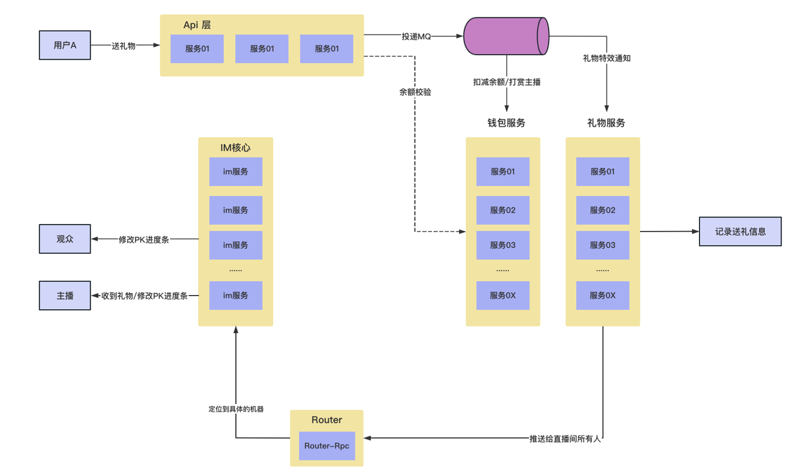

# start

[TOC]

# 1 直播PK功能的设计与分析

直播PK的流程图如下：



> 这里只不过**在原先的送礼物基础上**（只实现了钱包服务的余额扣减，**还未实现流程图中礼物服务的礼物记录**），要求实现全直播间可见，所以这里需要我们进行直播间的广播推送。这里需要**使用IM去将pk进度条的值推给观众们**。

**考虑点：**

- **推送PK进度值的是否存在乱序可能？**
  - 例如22:59:58秒的PK进度是10:9，但是22:59:59秒的PK进度是11:9，这里我们需要确保以最新的PK进度值为准。
  - 由于存在网络传输，所以消息到页面的先后顺序不好确保。
  - 因此我们可以在消息体积里面注入我们每个PK进度值所对应的`时间戳`，然后前端页面进行PK进度渲染的时候，以最新的IM消息为准。
  - 我们使用的是Kafka消息队列，我们还可以`在发送MQ处，指定单分区`，避免消息失序，减轻后面网络乱序的可能性
- **如果用户中途进入直播间，PK值如何展示？**
  - 可以按照直播间为维度，以roomId为标识将PK的进度值放在一个redis的缓存中。
- **如果我们存在廉价礼物，是否会送礼物高并发的请求场景**
  - 对于礼物参数的校验，其实可以合理使用一些`本地缓存`技术去降低RPC的损耗。


# 2 直播PK功能的实现

## 2.1 修改和优化送礼处理逻辑

> 原来我们送出礼物后，逻辑是如果余额扣减成功，则单播发送特效给收礼人；扣减失败，则单播发送失败信息给发礼人

**现在我们要封装代码中的单播发送im消息的逻辑为一个方法，并新建一个批量发送im消息的逻辑的方法**


**qiyu-live-api：**

```java
@Data
public class GiftReqVO {
    
    private int giftId;
    private Integer roomId;
    private Long senderUserId;
    private Long receiverId;
    private Integer type;
}
```

**qiyu-live-gift-provider：**

```xm
<dependency>
    <groupId>org.hah</groupId>
    <artifactId>qiyu-live-living-interface</artifactId>
    <version>1.0-SNAPSHOT</version>
</dependency>
```

```java
//gift-interfacce模块中
package org.qiyu.live.gift.constants;

public enum SendGiftTypeEnum {
    
    DEFAULT_SEND_GIFT(0, "直播间默认送礼物"),
    PK_SEND_GIFT(1, "直播间PK送礼物");

    int code;
    String desc;

    SendGiftTypeEnum(int code, String desc) {
        this.code = code;
        this.desc = desc;
    }

    public int getCode() {
        return code;
    }

    public String getDesc() {
        return desc;
    }
}

```

```java
//router-interface模块中
public enum ImMsgBizCodeEnum {
    
    LIVING_ROOM_IM_CHAT_MSG_BIZ(5555, "直播间im聊天消息"),
    LIVING_ROOM_SEND_GIFT_SUCCESS(5556, "送礼成功"),
    LIVING_ROOM_SEND_GIFT_FAIL(5557, "送礼失败"),
    LIVING_ROOM_PK_SEND_GIFT_SUCCESS(5558, "PK送礼成功"),
    LIVING_ROOM_PK_ONLINE(5559, "PK连线");
```


**修改SendGiftConsumer实现收礼处理逻辑的修改：**

```java
@Component
public class SendGiftConsumer {

    private static final Logger LOGGER = LoggerFactory.getLogger(SendGiftConsumer.class);

    @DubboReference
    private QiyuCurrencyAccountRpc qiyuCurrencyAccountRpc;
    @DubboReference
    private ImRouterRpc routerRpc;
    @DubboReference
    private ILivingRoomRpc livingRoomRpc;
    @Resource
    private RedisTemplate<String, Object> redisTemplate;
    @Resource
    private GiftProviderCacheKeyBuilder cacheKeyBuilder;

    @KafkaListener(topics = GiftProviderTopicNames.SEND_GIFT, groupId = "send-gift-consumer", containerFactory = "batchFactory")
    public void consumeSendGift(List<ConsumerRecord<?, ?>> records) {
        // 批量拉取消息进行处理
        for (ConsumerRecord<?, ?> record : records) {
            String sendGiftMqStr = (String) record.value();
            SendGiftMq sendGiftMq = JSON.parseObject(sendGiftMqStr, SendGiftMq.class);
            String mqConsumerKey = cacheKeyBuilder.buildGiftConsumeKey(sendGiftMq.getUuid());
            Boolean lockStatus = redisTemplate.opsForValue().setIfAbsent(mqConsumerKey, -1, 5L, TimeUnit.MINUTES);
            if (Boolean.FALSE.equals(lockStatus)) {
                // 代表曾经消费过，防止重复消费
                continue;
            }
            Long userId = sendGiftMq.getUserId();
            AccountTradeReqDTO accountTradeReqDTO = new AccountTradeReqDTO();
            accountTradeReqDTO.setUserId(userId);
            accountTradeReqDTO.setNum(sendGiftMq.getPrice());
            AccountTradeRespDTO tradeRespDTO = qiyuCurrencyAccountRpc.consumeForSendGift(accountTradeReqDTO);

            // 判断余额扣减情况：
            JSONObject jsonObject = new JSONObject();
            Integer sendGiftType = sendGiftMq.getType();
            if (tradeRespDTO.isSuccess()) {
                // 如果余额扣减成功
                // 0 查询在直播间的userId
                LivingRoomReqDTO livingRoomReqDTO = new LivingRoomReqDTO();
                livingRoomReqDTO.setRoomId(sendGiftMq.getRoomId());
                livingRoomReqDTO.setAppId(AppIdEnum.QIYU_LIVE_BIZ.getCode());
                List<Long> userIdList = livingRoomRpc.queryUserIdsByRoomId(livingRoomReqDTO);
                // TODO 触发礼物特效推送功能
                if (sendGiftType.equals(SendGiftTypeEnum.DEFAULT_SEND_GIFT.getCode())) {
                    // 默认送礼，发送给全直播用户礼物特效
                    jsonObject.put("url", sendGiftMq.getUrl());
                    // 利用封装方法发送单播消息，bizCode为success类型
                    this.batchSendImMsg(userIdList, ImMsgBizCodeEnum.LIVING_ROOM_SEND_GIFT_SUCCESS.getCode(), jsonObject);
                    LOGGER.info("[sendGiftConsumer] send success, msg is {}", record);
                } else if (sendGiftType.equals(SendGiftTypeEnum.PK_SEND_GIFT.getCode())) {
                    // PK送礼，要求全体可见
                    // 1 礼物特效url全直播间可见
                    jsonObject.put("url", sendGiftMq.getUrl());
                    // 2 TODO PK进度条全直播间可见
                    // 3 搜索要发送的用户
                    // 利用封装方法发送批量消息，bizCode为PK_SEND_SUCCESS
                    this.batchSendImMsg(userIdList, ImMsgBizCodeEnum.LIVING_ROOM_PK_SEND_GIFT_SUCCESS.getCode(), jsonObject);
                }
            } else {
                // 没成功，返回失败信息
                // TODO 利用IM将发送失败的消息告知用户
                jsonObject.put("msg", tradeRespDTO.getMsg());
                // 利用封装方法发送单播消息，bizCode为fail类型
                this.sendImMsgSingleton(userId, ImMsgBizCodeEnum.LIVING_ROOM_SEND_GIFT_FAIL.getCode(), jsonObject);
                LOGGER.info("[sendGiftConsumer] send fail, msg is {}", tradeRespDTO.getMsg());
            }
        }
    }

    /**
     * 单向通知送礼对象
     */
    private void sendImMsgSingleton(Long userId, Integer bizCode, JSONObject jsonObject) {
        ImMsgBody imMsgBody = new ImMsgBody();
        imMsgBody.setAppId(AppIdEnum.QIYU_LIVE_BIZ.getCode());
        imMsgBody.setBizCode(bizCode);
        imMsgBody.setUserId(userId);
        imMsgBody.setData(jsonObject.toJSONString());
        routerRpc.sendMsg(imMsgBody);
    }

    /**
     * 批量发送im消息
     */
    private void batchSendImMsg(List<Long> userIdList, Integer bizCode, JSONObject jsonObject) {
        List<ImMsgBody> imMsgBodies = userIdList.stream().map(userId -> {
            ImMsgBody imMsgBody = new ImMsgBody();
            imMsgBody.setAppId(AppIdEnum.QIYU_LIVE_BIZ.getCode());
            imMsgBody.setBizCode(bizCode);
            imMsgBody.setData(jsonObject.toJSONString());
            imMsgBody.setUserId(userId);
            return imMsgBody;
        }).collect(Collectors.toList());
        routerRpc.batchSendMsg(imMsgBodies);
    }
}
```

> 可以发现封装了两个方法 **sendImMsgSingleton() 和 batchSendImMsg()，**
>
> 并加入了PK直播间送礼的处理逻辑，可以看到我们的处理逻辑还剩 **2 TODO PK进度条全直播间可见** 还没有完成，我们下一小节进行具体实现

## 2.2 PK进度条的实现 和 PK上下线逻辑

### 1 PK进度条实现流程

> **PK进度条的实现：**
>
> 1. 使用Redis以roomId为单位存储当前直播间的 `PK进度条值`
> 2. 还在Redis中以roomId为单位存储 `当前送礼的消息有序id`，**避免发送消息乱序造成前端显示之前的消息回调的进度条值**
> 3. 将 PK进度条值 和 当前送礼的消息有序id 的获取放在`lua脚本`中进行获取或者`分布式锁`中进行获取，**保证获取两条命令的原子性**
> 4. 我们使用的是Kafka消息队列，我们还可以`在发送MQ处，指定单分区`，避免消息失序，减轻后面网络乱序的可能性


- Kafka的改动：

**qiyu-live-api：**

我们之前在API中发送送礼MQ的地方：GiftServiceImpl：做一些修改，指定单分区：

将原来send()代码中的kafkaTemplate.send()的逻辑做一下修改：

```java
CompletableFuture<SendResult<String, String>> sendResult = kafkaTemplate.send(
        GiftProviderTopicNames.SEND_GIFT, 
        giftReqVO.getRoomId().toString(), //指定key，将相同roomId的送礼消息发送到一个分区，避免PK送礼消息出现乱序
        JSON.toJSONString(sendGiftMq)
);
```


- 没使用lua脚本的实现（使用LUA脚本的在后面单独实现）：

```java
private static final long PK_MIN_NUM = 0;
private static final long PK_MAX_NUM = 1000;
```

SendGiftConsumer：

```java
// PK送礼，要求全体可见
// 1 礼物特效url全直播间可见
jsonObject.put("url", sendGiftMq.getUrl());
// 2 TODO PK进度条全直播间可见
String pkNumKey = cacheKeyBuilder.buildLivingPkKey(roomId);
String incrKey = cacheKeyBuilder.buildLivingPkSendSeq(roomId);
Long pkUserId = 0L;//TODO 虚拟数据，获取方式还未完善
Long pkObjId = 0L;//TODO 虚拟数据，获取方式还未完善
Long resultNum;
Long pkNum = 0L;
// 获取该条消息的序列号，避免消息乱序
Long sendGiftSeqNum = redisTemplate.opsForValue().increment(incrKey);
if (sendGiftMq.getReceiverId().equals(pkUserId)) {
    // 收礼人是房主userId，则进度条增加
    resultNum = redisTemplate.opsForValue().increment(pkNumKey, sendGiftMq.getPrice());
    if (PK_MAX_NUM <= resultNum) {
        jsonObject.put("winnerId", pkUserId);
        // 返回给前端的pkNum最大为MAX_NUM
        pkNum = PK_MAX_NUM;
    } else {
        pkNum = resultNum;
    }
} else if (sendGiftMq.getReceiverId().equals(pkObjId)) {
    // 收礼人是来挑战的，则进图条减少
    resultNum = redisTemplate.opsForValue().decrement(pkNumKey, sendGiftMq.getPrice());
    if (PK_MIN_NUM >= resultNum) {
        jsonObject.put("winnerId", pkObjId);
        // 返回给前端的pkNum最小为MIN_NUM
        pkNum = PK_MIN_NUM;
    } else {
        pkNum = resultNum;
    }
}
jsonObject.put("sendGiftSeqNum", sendGiftSeqNum);
jsonObject.put("pkNum", pkNum);
// 3 搜索要发送的用户
// 利用封装方法发送批量消息，bizCode为PK_SEND_SUCCESS
this.batchSendImMsg(userIdList, ImMsgBizCodeEnum.LIVING_ROOM_PK_SEND_GIFT_SUCCESS.getCode(), jsonObject);
```

### 2 PK上下线基本逻辑 和 pkUserId 和 pkObjId 的获取

> 上面步骤中，我们这两个id用的还是测试值


- **qiyu-live-api：**

```java
//living-interfacem
@Data
public class LivingPkRespDTO implements Serializable {

    @Serial
    private static final long serialVersionUID = -4135802655494838696L;
    private boolean onlineStatus;
    private String msg;
}
```

```java
public enum ApiErrorEnum implements QiyuBaseError {
    
    ...
    PK_ONLINE_BUSY(10007, "目前正有人连线，请稍后再试");
```

```java
@Data
public class OnlinePKReqVO {
    
    private Integer roomId;
}
```

```java
//LivingRoomController
@PostMapping("/onlinePK")
@RequestLimit(limit = 1, second = 3)
public WebResponseVO onlinePk(OnlinePKReqVO onlinePKReqVO) {
    ErrorAssert.isNotNull(onlinePKReqVO.getRoomId(), BizBaseErrorEnum.PARAM_ERROR);
    return WebResponseVO.success(livingRoomService.onlinePK(onlinePKReqVO));
}
```

```java
//ILivingRoomService
/**
 * 当PK直播间连上线准备PK时，调用该请求
 */
boolean onlinePK(OnlinePKReqVO onlinePKReqVO);
```

```java
//LivingRoomServiceImpl
@Override
public boolean onlinePK(OnlinePKReqVO onlinePKReqVO) {
    LivingRoomReqDTO reqDTO = new LivingRoomReqDTO();
    reqDTO.setRoomId(onlinePKReqVO.getRoomId());
    reqDTO.setAppId(AppIdEnum.QIYU_LIVE_BIZ.getCode());
    reqDTO.setPkObjId(QiyuRequestContext.getUserId());
    LivingPkRespDTO tryOnlineStatus = livingRoomRpc.onlinePK(reqDTO);
    ErrorAssert.isTure(tryOnlineStatus.isOnlineStatus(), new QiyuErrorException(-1, tryOnlineStatus.getMsg()));
    return true;
}
```

- **qiyu-live-living-provider：**

```java
public interface ILivingRoomRpc {

    ...

    /**
     * 当PK直播间连上线准备PK时，调用该请求
     */
    LivingPkRespDTO onlinePK(LivingRoomReqDTO livingRoomReqDTO);

    /**
     * 用户在pk直播间下线
     *
     * @param livingRoomReqDTO
     * @return
     */
    boolean offlinePk(LivingRoomReqDTO livingRoomReqDTO);

    /**
     * 根据roomId查询当前pk人是谁
     */
    Long queryOnlinePkUserId(Integer roomId);
}
```

```java
@DubboService
public class LivingRomRpcImpl implements ILivingRoomRpc {
    
    ...
    @Override
    public LivingPkRespDTO onlinePK(LivingRoomReqDTO livingRoomReqDTO) {
        return livingRoomService.onlinePk(livingRoomReqDTO);
    }

    @Override
    public boolean offlinePk(LivingRoomReqDTO livingRoomReqDTO) {
        return livingRoomService.offlinePk(livingRoomReqDTO);
    }

    @Override
    public Long queryOnlinePkUserId(Integer roomId) {
        return livingRoomService.queryOnlinePkUserId(roomId);
    }
}
```

```java
public interface ILivingRoomService {

    ...

    /**
     * 用户在pk直播间中，连上线请求
     */
    LivingPkRespDTO onlinePk(LivingRoomReqDTO livingRoomReqDTO);

    /**
     * 用户在pk直播间下线
     */
    boolean offlinePk(LivingRoomReqDTO livingRoomReqDTO);

    /**
     * 根据roomId查询当前pk人是谁
     *
     * @param roomId
     * @return
     */
    Long queryOnlinePkUserId(Integer roomId);
    
}
```

```java
@Service
public class LivingRoomServiceImpl implements ILivingRoomService {

    ...

    @Override
    public boolean onlinePk(LivingRoomReqDTO livingRoomReqDTO) {
        LivingPkRespDTO respDTO = new LivingPkRespDTO();
        String cacheKey = cacheKeyBuilder.buildLivingOnlinePk(livingRoomReqDTO.getRoomId());
        // 使用setIfAbsent防止被后来者覆盖
        Boolean tryOnline = redisTemplate.opsForValue().setIfAbsent(cacheKey, livingRoomReqDTO.getPkObjId(), 12L, TimeUnit.HOURS);
        respDTO.setOnlineStatus(Boolean.TRUE.equals(tryOnline));
        return respDTO;
    }

    @Override
    public boolean offlinePk(LivingRoomReqDTO livingRoomReqDTO) {
        String cacheKey = cacheKeyBuilder.buildLivingOnlinePk(livingRoomReqDTO.getRoomId());
        return Boolean.TRUE.equals(redisTemplate.delete(cacheKey));
    }

    @Override
    public Long queryOnlinePkUserId(Integer roomId) {
        String cacheKey = cacheKeyBuilder.buildLivingOnlinePk(roomId);
        return (Long) redisTemplate.opsForValue().get(cacheKey);
    }
}
```


- 上一小节PK进度条流程中完善id的获取

**qiyu-live-gift-provider：**

```java
// PK送礼，要求全体可见
// 1 礼物特效url全直播间可见
jsonObject.put("url", sendGiftMq.getUrl());
// 2 TODO PK进度条全直播间可见
String pkNumKey = cacheKeyBuilder.buildLivingPkKey(roomId);
String incrKey = cacheKeyBuilder.buildLivingPkSendSeq(roomId);
// 获取 pkUserId 和 pkObjId
Long pkObjId = livingRoomRpc.queryOnlinePkUserId(roomId);
LivingRoomRespDTO livingRoomRespDTO = livingRoomRpc.queryByRoomId(roomId);
if (pkObjId == null || livingRoomRespDTO == null || livingRoomRespDTO.getAnchorId() == null) {
    LOGGER.error("[sendGiftConsumer] 两个用户已经有不在线的，roomId is {}", roomId);
    continue;
}
Long pkUserId = livingRoomRespDTO.getAnchorId();
Long resultNum = null;
Long pkNum = 0L;
// 获取该条消息的序列号，避免消息乱序
Long sendGiftSeqNum = redisTemplate.opsForValue().increment(incrKey);
if (sendGiftMq.getReceiverId().equals(pkUserId)) {
    // 收礼人是房主userId，则进度条增加
    resultNum = redisTemplate.opsForValue().increment(pkNumKey, sendGiftMq.getPrice());
    if (PK_MAX_NUM <= resultNum) {
        jsonObject.put("winnerId", pkUserId);
        // 返回给前端的pkNum最大为MAX_NUM
        pkNum = PK_MAX_NUM;
    } else {
        pkNum = resultNum;
    }
} else if (sendGiftMq.getReceiverId().equals(pkObjId)) {
    // 收礼人是来挑战的，则进图条减少
    resultNum = redisTemplate.opsForValue().decrement(pkNumKey, sendGiftMq.getPrice());
    if (PK_MIN_NUM >= resultNum) {
        jsonObject.put("winnerId", pkObjId);
        // 返回给前端的pkNum最小为MIN_NUM
        pkNum = PK_MIN_NUM;
    } else {
        pkNum = resultNum;
    }
}
jsonObject.put("sendGiftSeqNum", sendGiftSeqNum);
jsonObject.put("pkNum", pkNum);
// 3 搜索要发送的用户
// 利用封装方法发送批量消息，bizCode为PK_SEND_SUCCESS
this.batchSendImMsg(userIdList, ImMsgBizCodeEnum.LIVING_ROOM_PK_SEND_GIFT_SUCCESS.getCode(), jsonObject);
LOGGER.info("[sendGiftConsumer] send pk msg success, msg is {}", record);
```

### 3 PK上下线逻辑完善

> 在上一小节中我们写了 PK上限，和PK下线逻辑的基本实现，但是**我们上线时要做什么呢？**以及**我们在哪里去调用我们的PK下线的操作代码呢？**
>
> 1. 上线时 通知直播间所有人，有人上线PK了
> 2. 防止主播参与PK
>
> 下线：
>
> 1. 用户手动点击下线 或 离开直播间时触发
> 2. **基于IM的心跳包**，在之前写过的心跳包下线后的处理逻辑中调用PK下线的操作代码


- 上限操作完善：

修改LivingRoomServiceImpl 的代码：（将进度条显示逻辑那里(SendGiftConsumer)的batchSend复制过来）

```java
    @Override
    public LivingPkRespDTO onlinePk(LivingRoomReqDTO livingRoomReqDTO) {
        LivingRoomRespDTO currentLivingRoom = this.queryByRoomId(livingRoomReqDTO.getRoomId());
        LivingPkRespDTO respDTO = new LivingPkRespDTO();
        respDTO.setOnlineStatus(false);
        if (currentLivingRoom.getAnchorId().equals(livingRoomReqDTO.getPkObjId())) {
            respDTO.setMsg("主播不可以连线参与PK");
            return respDTO;
        }
        String cacheKey = cacheKeyBuilder.buildLivingOnlinePk(livingRoomReqDTO.getRoomId());
        // 使用setIfAbsent防止被后来者覆盖
        Boolean tryOnline = redisTemplate.opsForValue().setIfAbsent(cacheKey, livingRoomReqDTO.getPkObjId(), 12L, TimeUnit.HOURS);
        if (Boolean.TRUE.equals(tryOnline)) {
            // 通知直播间所有人，有人上线PK了
            List<Long> userIdList = this.queryUserIdsByRoomId(livingRoomReqDTO);
            JSONObject jsonObject = new JSONObject();
            jsonObject.put("pkObjId", livingRoomReqDTO.getPkObjId());
            jsonObject.put("pkObjAvatar", "../svga/img/爱心.png");
            this.batchSendImMsg(userIdList, ImMsgBizCodeEnum.LIVING_ROOM_PK_ONLINE.getCode(), jsonObject);
            respDTO.setMsg("连线成功");
            respDTO.setOnlineStatus(true);
            return respDTO;
        }
        respDTO.setMsg("目前有人在线，请稍后再试");
        return respDTO;
    }

    /**
     * 批量发送im消息
     */
    private void batchSendImMsg(List<Long> userIdList, Integer bizCode, JSONObject jsonObject) {
        List<ImMsgBody> imMsgBodies = userIdList.stream().map(userId -> {
            ImMsgBody imMsgBody = new ImMsgBody();
            imMsgBody.setAppId(AppIdEnum.QIYU_LIVE_BIZ.getCode());
            imMsgBody.setBizCode(bizCode);
            imMsgBody.setData(jsonObject.toJSONString());
            imMsgBody.setUserId(userId);
            return imMsgBody;
        }).collect(Collectors.toList());
        routerRpc.batchSendMsg(imMsgBodies);
    }
}
```


- 下线操作完善：

**qiyu-live-living-provider：**

之前我们在LivingRoomOfflineConsumer中是有接收我们的IM服务心跳下线后发送的MQ消息的，
里面会调用LivingRoomServiceImpl 的 userOfflineHandler()方法，所以我们修改一下这个方法：

```java
@Override
public void userOfflineHandler(ImOfflineDTO imOfflineDTO) {
    Long userId = imOfflineDTO.getUserId();
    Integer appId = imOfflineDTO.getAppId();
    Integer roomId = imOfflineDTO.getRoomId();
    String cacheKey = cacheKeyBuilder.buildLivingRoomUserSet(roomId, appId);
    redisTemplate.opsForSet().remove(cacheKey, userId);

    // 新增PK直播间 下线调用
    LivingRoomReqDTO reqDTO = new LivingRoomReqDTO();
    reqDTO.setRoomId(roomId);
    reqDTO.setPkObjId(userId);
    this.offlinePk(reqDTO);
}

//并且修改offlinePk()的逻辑，如果他是pkObjId本人，才删除
@Override
public boolean offlinePk(LivingRoomReqDTO livingRoomReqDTO) {
    Integer roomId = livingRoomReqDTO.getRoomId();
    Long pkObjId = this.queryOnlinePkUserId(roomId);
    // 如果他是pkObjId本人，才删除
    if (!livingRoomReqDTO.getPkObjId().equals(pkObjId)) {
        System.out.println("删除失败");
        return false;
    }
    System.out.println("删除成功");
    String cacheKey = cacheKeyBuilder.buildLivingOnlinePk(roomId);
    //删除PK进度条值缓存
    redisTemplate.delete("qiyu-live-gift-provider:living_pk_key:" + roomId);
    //删除PK直播间pkObjId缓存
    return Boolean.TRUE.equals(redisTemplate.delete(cacheKey));
}
```

### 4 使用Lua脚本完善和优化PK进度条实现流程

> 前面2.2中我分析的：将 PK进度条值 和 当前送礼的消息有序id 的获取放在`lua脚本`中进行获取或者`分布式锁`中进行获取，**保证获取两条命令的原子性**
>
> 但是不知道为什么老师并没有这么做，只是原子性获取和初始化pkNum，我觉得要seqId和pkNum一起获取使用lua脚本才有意义，下来可以自己实现将seqId一起放在lua脚本中获取，返回字符串以“%”分割

**Lua脚本：**

在resources目录下新建getPkNumAndSeqId.lua：

```lua
--如果存在pkNum
if (redis.call('exists', KEYS[1])) == 1 then
    local currentNum = redis.call('get', KEYS[1])
    --当前pkNum在MAX到MIN之间，自增后直接返回
    if (tonumber(currentNum) <= tonumber(ARGV[2]) and tonumber(currentNum) >= tonumber(ARGV[3])) then
        return redis.call('incrby', KEYS[1], tonumber(ARGV[4]))
    --代表PK结束    
    else
        return currentNum
    end
else
    --如果不存在pkNum，则初始化pkNum
    redis.call('set', KEYS[1], tonumber(ARGV[1]))
    redis.call('EXPIRE', KEYS[1], 3600 * 12)
    --自增返回
    return redis.call('incrby', KEYS[1], tonumber(ARGV[4]))
end
```

修改SendGiftConsumer：

```java
private static final Long PK_INIT_NUM = 50L;
private static final Long PK_MAX_NUM = 100L;
private static final Long PK_MIN_NUM = 0L;
private static final DefaultRedisScript<Long> redisScript;

static {
    redisScript = new DefaultRedisScript<>();
    redisScript.setResultType(Long.class);
    redisScript.setLocation(new ClassPathResource("getPkNumAndSeqId.lua"));
}


@KafkaListener(topics = GiftProviderTopicNames.SEND_GIFT, groupId = "send-gift-consumer", containerFactory = "batchFactory")
public void consumeSendGift(List<ConsumerRecord<?, ?>> records) {
    // 批量拉取消息进行处理
    for (ConsumerRecord<?, ?> record : records) {
        ...
        // 判断余额扣减情况：
        JSONObject jsonObject = new JSONObject();
        Integer sendGiftType = sendGiftMq.getType();
        if (tradeRespDTO.isSuccess()) {
            // 如果余额扣减成功
            ...
            // TODO 触发礼物特效推送功能
            if (sendGiftType.equals(SendGiftTypeEnum.DEFAULT_SEND_GIFT.getCode())) {
                ...
            } else if (sendGiftType.equals(SendGiftTypeEnum.PK_SEND_GIFT.getCode())) {
                pkImMsgSend(sendGiftMq, jsonObject, roomId, userIdList);
                LOGGER.info("[sendGiftConsumer] send pk msg success, msg is {}", record);
            }
        } else {
            ...
        }
    }
}

/**
 * PK直播间送礼扣费成功后的流程：
 * 1 设置礼物特效url
 * 2 设置PK进度条的值
 * 3 批量推送给直播间全体用户
 * @param sendGiftMq 发送消息请求req
 * @param jsonObject 返回的ImMsgBody的data部分
 * @param roomId     直播间id
 * @param userIdList 直播间在线用户列表
 */
private void pkImMsgSend(SendGiftMq sendGiftMq, JSONObject jsonObject, Integer roomId, List<Long> userIdList) {
    // PK送礼，要求全体可见
    // 1 TODO PK进度条全直播间可见

    String isOverCacheKey = cacheKeyBuilder.buildLivingPkIsOver(roomId);
    // 1.1 判断直播PK是否已经结束
    Boolean isOver = redisTemplate.hasKey(isOverCacheKey);
    if (Boolean.TRUE.equals(isOver)) {
        return;
    }
    // 1.2 获取 pkUserId 和 pkObjId
    Long pkObjId = livingRoomRpc.queryOnlinePkUserId(roomId);
    LivingRoomRespDTO livingRoomRespDTO = livingRoomRpc.queryByRoomId(roomId);
    if (pkObjId == null || livingRoomRespDTO == null || livingRoomRespDTO.getAnchorId() == null) {
        LOGGER.error("[sendGiftConsumer] 两个用户已经有不在线的，roomId is {}", roomId);
        return;
    }
    Long pkUserId = livingRoomRespDTO.getAnchorId();
    // 1.3 获取当前进度条值 和 送礼序列号
    String pkNumKey = cacheKeyBuilder.buildLivingPkKey(roomId);
    Long pkNum = 0L;
    // 获取该条消息的序列号，避免消息乱序
    Long sendGiftSeqNum = System.currentTimeMillis();
    if (sendGiftMq.getReceiverId().equals(pkUserId)) {
        Integer moveStep = sendGiftMq.getPrice() / 10;
        // 收礼人是房主userId，则进度条增加
        pkNum = redisTemplate.execute(redisScript, Collections.singletonList(pkNumKey), PK_INIT_NUM, PK_MAX_NUM, PK_MIN_NUM, moveStep);
        if (PK_MAX_NUM <= pkNum) {
            jsonObject.put("winnerId", pkUserId);
        }
    } else if (sendGiftMq.getReceiverId().equals(pkObjId)) {
        Integer moveStep = sendGiftMq.getPrice() / 10 * -1;
        // 收礼人是来挑战的，则进图条减少
        pkNum = redisTemplate.execute(redisScript, Collections.singletonList(pkNumKey), PK_INIT_NUM, PK_MAX_NUM, PK_MIN_NUM, moveStep);
        if (PK_MIN_NUM >= pkNum) {
            jsonObject.put("winnerId", pkObjId);
        }
    }
    jsonObject.put("receiverId", sendGiftMq.getReceiverId());
    jsonObject.put("sendGiftSeqNum", sendGiftSeqNum);
    jsonObject.put("pkNum", pkNum);
    // 2 礼物特效url全直播间可见
    jsonObject.put("url", sendGiftMq.getUrl());
    // 3 搜索要发送的用户
    // 利用封装方法发送批量消息，bizCode为PK_SEND_SUCCESS
    this.batchSendImMsg(userIdList, ImMsgBizCodeEnum.LIVING_ROOM_PK_SEND_GIFT_SUCCESS.getCode(), jsonObject);
}
```


# end